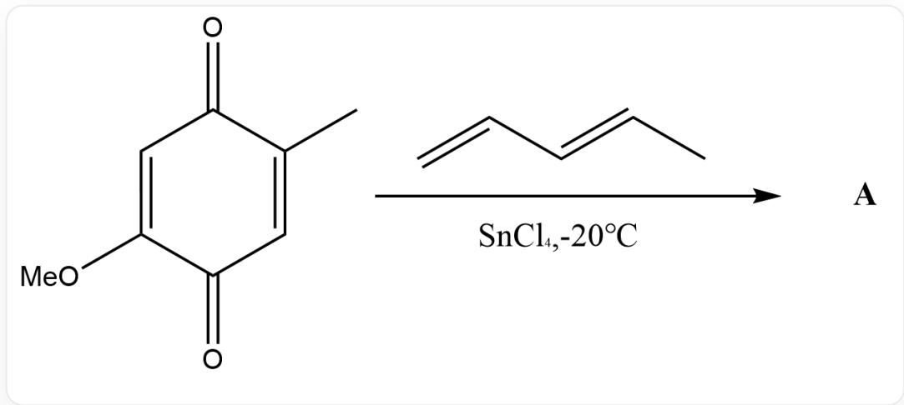
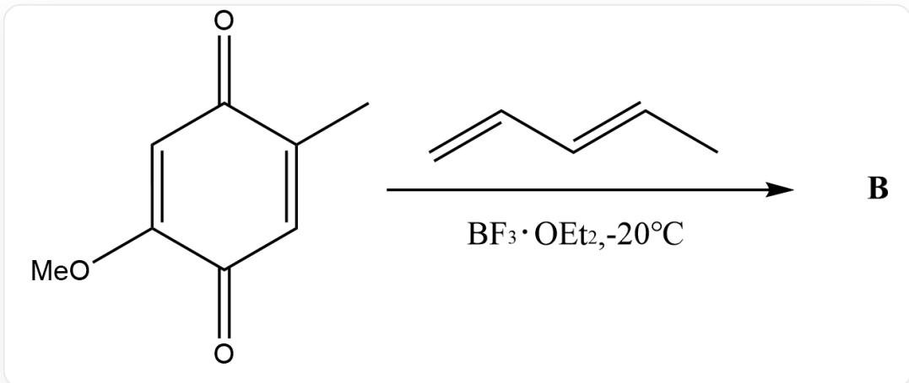
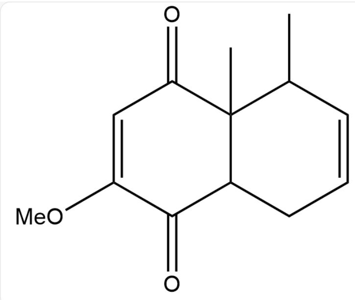
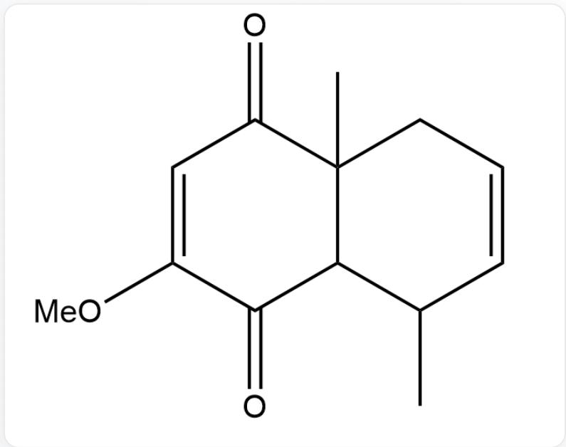
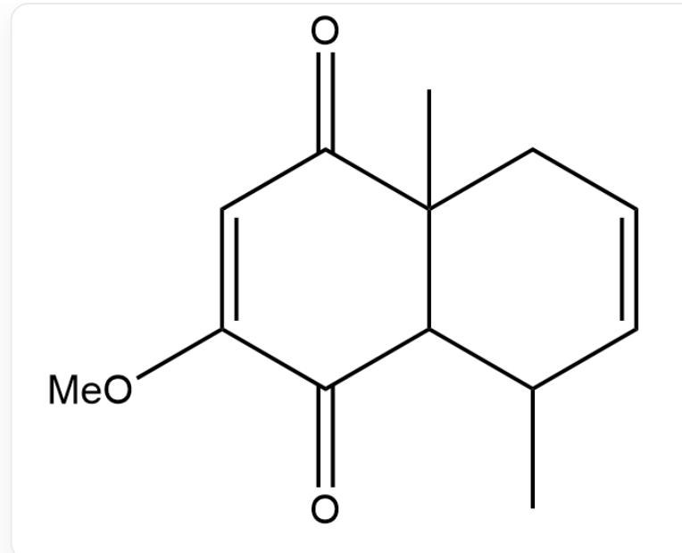
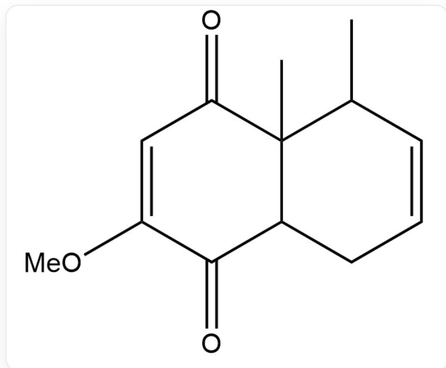

# 题目

[ \mathrm{O} = \mathrm{C}(\mathrm{C} = \mathrm{C}1\mathrm{OC})\mathrm{C}(\mathrm{C}) = \mathrm{CC}1 = \mathrm{O} > \mathrm{C} = \mathrm{C} / \mathrm{C} = \mathrm{C} / \mathrm{C}. ]

[ \mathrm{O} = \mathrm{C}(\mathrm{C} = \mathrm{C}1\mathrm{OC})\mathrm{C}(\mathrm{C}) = \mathrm{CC}1 = \mathrm{O} > \mathrm{C} = \mathrm{C} / \mathrm{C} = \mathrm{C} / \mathrm{C}. ]

请分别给出以上两个反应最有可能得到的产物A和B（不考虑立体化学）

A.

$O = C(C = C1OC)C(C(C)C = CC2)(C)C2C1 = O$  ，产物A

产物A

$\mathrm{O = C(C = C1OC)C(CC = CC2C)(C)C2C1 = O,}$  产物B

产物B

B.

$\mathrm{O = C(C = C1OC)C(C(C)C = CC2)(C)C2C1 = O,}$  产物A

产物A

$O = C(C = C1OC)C(C(C)C = CC2)(C)C2C1 = O$  ，产物B

产物B

C.

$\mathrm{O = C(C = C1OC)C(CC = CC2C)(C)C2C1 = O}$  ，产物A

产物A

$\mathrm{O = C(C = C1OC)C(CC = CC2C)(C)C2C1 = O,}$  产物B

产物B

D.

$\mathrm{O = C(C = C1OC)C(CC = CC2C)(C)C2C1 = O}$  ，产物A

产物A

$O = C(C = C1OC)C(C(C)C = CC2)(C)C2C1 = O$  ，产物B

产物B

# 答案

正确答案: D

# 详细解析

$\mathrm{SnCl}_4$  可以同时与羰基和甲氧基络合, 从而活化下面的羰基

# CHECKPOINT

1 PTS

$\mathrm{SnCl}_4$  可以同时与羰基和甲氧基络合, 从而活化下面的羰基

而  $\mathrm{BF}_3$  只能四配位, 优先与上方富电子羰基络合, 活化上方的羰基

# CHECKPOINT

1 PTS

而  $\mathrm{BF}_3$  只能四配位, 优先与上方富电子羰基络合, 活化上方的羰基

对双烯体而言，烷基给电子，因此与烷基连接一侧为正电性，另一端为负电性，与亲双烯体的相应位点反应可以得到产物A和B：

A.

  
$O = C(C = C1OC)C(CC = CC2C)(C)C2C1 = O$  ，产物A

B.

  
$O = C(C = C1OC)C(C(C)C = CC2)(C)C2C1 = O$  ，产物B

因此选项D正确。

# CHECKPOINT

1 PTS

产物A为O=C(C=C1OC)C(CC=CC2C)(C)C2C1=O

# CHECKPOINT

1 PTS

产物B为O=C(C=C1OC)C(C(C)C=CC2)(C)C2C1=O