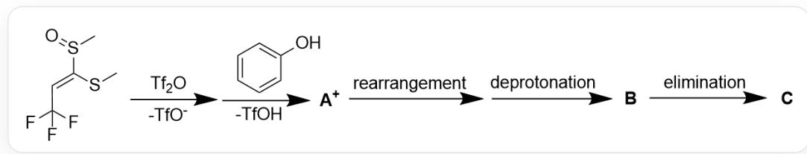
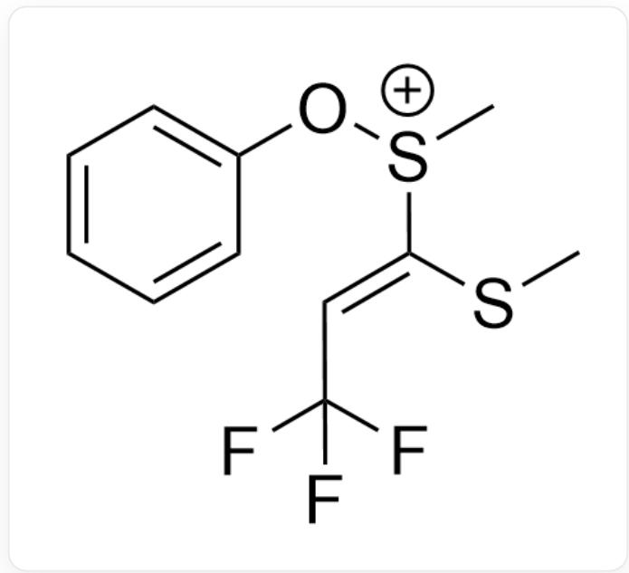
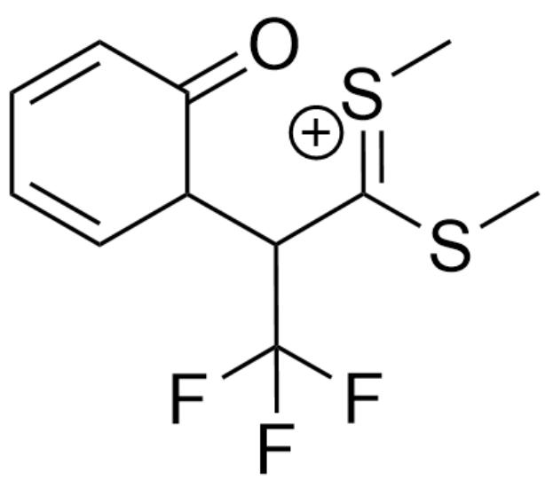
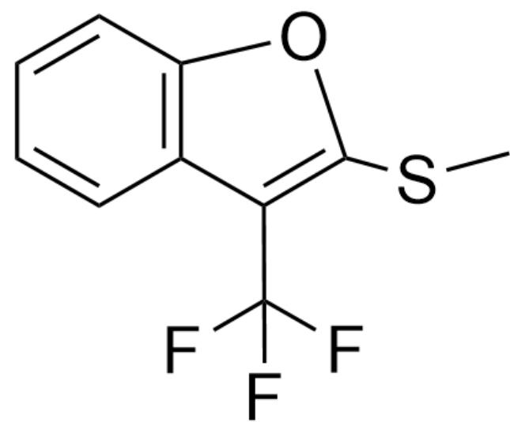

# Question

As shown in Figure 1, the reactant undergoes the following reaction mechanism to obtain intermediate  $\mathbf{A}^{+}$ , intermediate  $\mathbf{B}$ , and final product  $\mathbf{C}$ , respectively:

  
Fig. 1, the figure shows a series of consecutive reaction mechanisms. The reactant is described in SMILES as: CS(/C(SC)=C/C(F)(F)F)=O. The reactant reacts with  $\mathrm{Tf}_2\mathrm{O}$ , losing one molecule of  $\mathrm{TfO}^{-}$ , and then reacts with phenol, losing one molecule of  $\mathrm{TfOH}$ , to obtain intermediate  $\mathbf{A}^{+}$ . Intermediate  $\mathbf{A}^{+}$ undergoes rearrangement and deprotonation to obtain intermediate  $\mathbf{B}$ . Intermediate  $\mathbf{B}$  undergoes elimination to obtain final product  $\mathbf{C}$ .

Speculate on the reaction mechanism and the structures of intermediate  $\mathbf{A}^{+}$ ,  $\mathbf{B}$ , and final product  $\mathbf{C}$ .

The following statements are made:

1.  $\mathbf{A}^{+}$  contains two carbon-oxygen bonds.  
2. B contains one sulfur-oxygen bond.  
3. The product of the number of atoms within each six-membered ring or smaller in  $\mathbf{C}$ , multiplied by the number of carbon-non-carbon non-hydrogen chemical bonds (multiple bonds counted as one bond), is 210.  
4. The oxidation state of the sulfur atom decreases during the entire reaction process.

A. All other options are incorrect  
B. 1  
C. 2

D. 3  
E. 4  
F. 1,2  
G. 1,3  
H. 1,4  
1. 2,3  
J. 2,4  
K. 3,4  
L. 1,2,3  
M. 1,2,4  
N. 1,3,4  
O. 2,3,4  
P. 1,2,3,4

# Answer

Correct Answer: K

# Detailed Explanation

In the first step, triflic anhydride can activate the oxygen atom of the reactant, yielding the activated sulfinyl group. It can undergo a nucleophilic substitution reaction with phenol, where phenol attacks the sulfur atom, substituting triflate, to obtain intermediate  $\mathbf{A}^{+}$ , the structure of which is shown in Figure 2:

  
Fig. 2, the molecule in the figure is described by SMILES as: C[S+](OC1=CC=CC=C1)/C(SC)=C/C(F)(F)F

# CHECKPOINT

1 PTS

Oxygen atom is activated by triflic anhydride, phenol substitutes TfOH, yielding intermediate  $\mathbf{A}^{+}$ described by SMILES as: C[S+](OC1=CC=CC=C1)/C(SC)=C/C(F)(F)F

$\mathbf{A}^{+}$  contains only one carbon-oxygen bond, statement 1 is incorrect.

According to the question, intermediate  $\mathbf{A}^{+}$  undergoes a rearrangement reaction in the next step. Observing the molecular structure, the sulfur atom is electrophilic, but there is no good nucleophilic site within the molecule. A more likely rearrangement is that the sulfur-oxygen bond undergoes a concerted [3, 3]-sigma migration rearrangement reaction through the double bond and the benzene ring, forming a carbon-carbon bond, yielding the intermediate in Figure 3:

  
Fig. 3, the molecule in the figure is described by SMILES as: C/[S+]=C(C(C1C(C=CC=C1)=O)C(F)(F)F)\SC

# CHECKPOINT

1 PTS

Intermediate  $\mathbf{A}^{+}$  undergoes a concerted [3, 3]-sigma migration rearrangement reaction, yielding the intermediate in Figure 3 described by SMILES as: C/[S+]=C(C(C1C(C=C1)=O)C(F)(F)F)\SC

This intermediate quickly regains aromaticity to form a hydroxyl group, the hydroxyl group undergoes nucleophilic addition to the carbon-sulfur double bond and deprotonates to obtain intermediate  $\mathbf{B}$ , the structure of which is shown in Figure 4:

  
Fig. 4, the molecule in the figure is described by SMILES as: CSC1(OC(C=CC=C2)=C2C1C(F)(F)SC

# CHECKPOINT

1 PTS

The intermediate in Figure 3 quickly regains aromaticity to form a hydroxyl group, the hydroxyl group undergoes nucleophilic addition to the carbon-sulfur double bond and deprotonates to obtain intermediate  $\mathbf{B}$ , described by SMILES as: CSC1(OC(C=CC=C2)=C2C1C(F)(F)F)SC

B does not contain a sulfur-oxygen bond, statement 2 is incorrect.

Intermediate B eliminates a molecule of methanethiol, yielding the aromatic benzofuran structure C, as shown in Figure 5:

  
Fig. 5, the molecule in the figure is described by SMILES as: FC(F)(F)C1=C(OC2=C1C=CC=C2)SC

# CHECKPOINT

1 PTS

Intermediate B eliminates a molecule of methanethiol, yielding C described by SMILES as: FC(F) (F)C1=C(OC2=C1C=CC=C2)SC

In C, the number of atoms within the six-membered and five-membered rings are 6 and 5, respectively, and the number of carbon-non-carbon non-hydrogen chemical bonds (multiple bonds counted as one bond) is 7. The product of these three is 210, statement 3 is correct.

The sulfur atom of sulfoxide in the reactant forms two carbon-sulfur bonds and one oxygen-sulfur bond, and the final product breaks the oxygen-sulfur bond, leaving only two carbon-sulfur bonds. The entire reaction process is equivalent to the sulfur atom being reduced, and the oxidation state is reduced from  $+4$  to  $+2$ , statement 4 is correct.