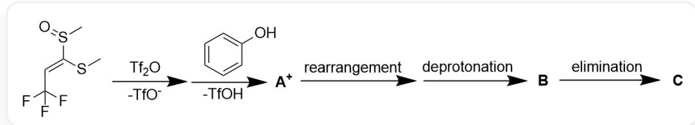
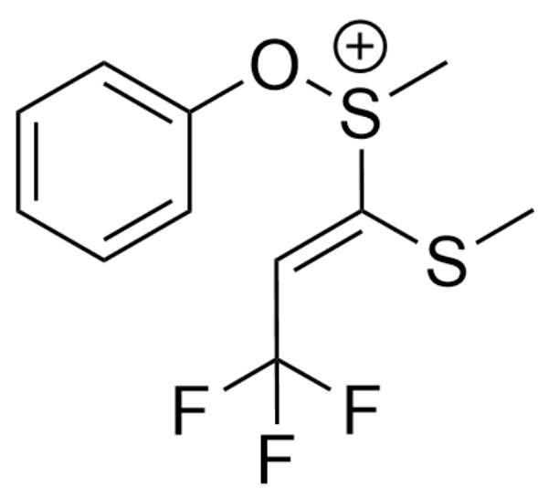
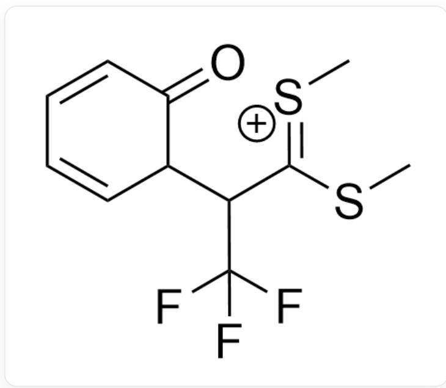
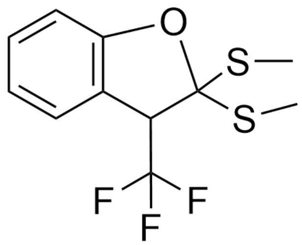

# 题目

如图1所示，反应物经历了以下反应机理，分别得到中间体  $\mathbf{A}^{+}$ ，中间体  $\mathbf{B}$  和最终产物  $\mathbf{C}$ ：

  
Fig. 1, 图中为连续的几步反应机理。反应物以SMILES描述为: CS(/C(SC)=C/C(F)(F)F)=O。反应物与  $\mathrm{Tf}_{2} \mathrm{O}$  反应, 失去一分子  $\mathrm{TfO}^{-}$ , 然后与苯酚反应, 失去一分子  $\mathrm{TfOH}$ , 得到中间体  $\mathbf{A}^{+}$  。中间体  $\mathbf{A}^{+}$  发生重排, 去质子化, 得到中间体  $\mathbf{B}$  。中间体  $\mathbf{B}$  发生消除, 得到最终产物  $\mathbf{C}$  。

推测反应机理和中间体  $\mathbf{A}^{+}$ 、 $\mathbf{B}$  和最终产物  $\mathbf{C}$  的结构。

有以下说法：

1.  $\mathbf{A}^{+}$  含有两根碳氧键  
2. B 含有一根硫氧键  
3. C中每个六元及以下环内的原子数量乘积再与碳-非碳非氢化学键数量（多重键按一根键计）乘积为210  
4. 整个反应过程中硫原子的氧化态降低了

A. 其他选项均不正确  
B. 1  
C. 2  
D. 3

E. 4  
F. 1,2  
G. 1,3  
H. 1,4  
1. 2,3  
J. 2,4  
K. 3,4  
L. 1,2,3  
M. 1,2,4  
N. 1,3,4  
O. 2,3,4  
P. 1,2,3,4

# 答案

正确答案: K

# 详细解析

第一步三氟甲磺酸酐可以活化反应物的氧原子，得到被活化的亚磺酰基。与苯酚可以发生亲核取代反应，苯酚进攻硫原子取代三氟甲磺酸根，得到中间体  $\mathbf{A}^{+}$ ，结构如图2：

  
Fig. 2, 图中分子以SMILES描述为: C[S+](OC1=CC=CC=C1)/C(SC)=C/C(F)(F)F

# CHECKPOINT

1 PTS

氧原子被活化，苯酚取代TfOH，得到中间体  $\mathbf{A}^{+}$  以SMILES描述为：C[S+] (OC1=CC=CC=C1)/C(SC)=C/C(F)(F)F

$\mathbf{A}^{+}$ 只含有一根碳氧键，说法1错误。

根据题目，中间体  $\mathbf{A}^{+}$ 下一步发生重排反应。观察分子结构，硫原子具有亲电性，但是分子内没有较好的亲核位点。更有可能的一种重排是硫氧键通过双键和苯环发生一步[3, 3]-sigma迁移重排反应，形成一根碳碳键，得到图3中间体：

  
Fig. 3, 图中分子以SMILES描述为: C/[S+]=C(C(C1C(C=CC=C1)=O)C(F)(F)F)\SC

# CHECKPOINT

1 PTS

中间体  $\mathbf{A}^{+}$  发生一步[3, 3]-sigma迁移重排反应，得到图3中间体以SMILES描述为： $\mathrm{C / [S + ] = C(C(C1C(C = CC = C1) = O)C(F)(F)F)\backslash SC}$

该中间体快速重建芳香性形成羟基，羟基亲核加成碳硫双键并去质子化得到中间体B，结构如图4：

  
Fig. 4, 图中分子以SMILES描述为: CSC1(OC(C=CC=C2)=C2C1C(F)(F)F)SC

# CHECKPOINT

1 PTS

图3中间体快速重建芳香性形成羟基，羟基亲核加成碳硫双键并去质子化得到中间体B，以SMILES描述为：CSC1(OC(C=CC=C2)=C2C1C(F)(F)F)SC

# B不含硫氧键，说法2错误

中间体B消除一分子甲硫醇，得到具有芳香性的苯并呋喃结构C，如图5：

  
Fig. 5, 图中分子以SMILES描述为: FC(F)(F)C1=C(OC2=C1C=CC=C2)SC

# CHECKPOINT

1 PTS

中间体B消除一分子甲硫醇，得到C以SMILES描述为：FC(F)(F)C1=C(OC2=C1C=CC=C2)SC

C中六元及以下环内原子数分别为6和5，碳-非碳非氢化学键数量（多重键按一根键计）为7，三者乘积为210，说法3正确。

反应物中亚砜基团的硫原子形成两根碳硫键与一根氧硫键，最终产物断开氧硫键只剩两根碳硫键，整个反应过程相当于硫原子被还原，氧化态从+4降低至+2，说法4正确。