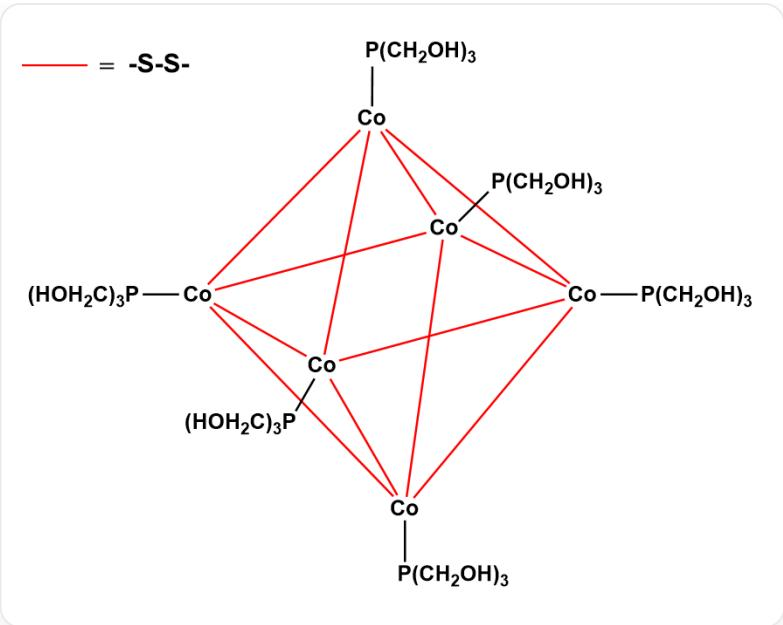

# Question

Stable water-soluble transition metal complexes for catalytic and biomedical purposes are an important research area in modern coordination chemistry. In ethanol, the reaction of  $\mathrm{CoCl}_2\cdot 6\mathrm{H}_2\mathrm{O}$  with  $\mathrm{P(CH_2OH)_3}$ ,  $\mathrm{H}_2\mathrm{S}$  yielded a complex  $\mathbf{A}\cdot yH_{2}O$  with a molecular weight of 1444.6.  $\mathbf{A}$  is a multinuclear complex with octahedral symmetry, containing only two types of ligands, and the chemical environment of the same element in the complex is completely identical except for hydrogen. It is known that  $y\in [4,8]$ . Let  $a,b$  be the sum of the coefficients on the left and right sides of the chemical equation for the synthesis of  $\mathbf{A}$  (reaction coefficients are the simplest integer ratio), then the value of  $\log_y\left(\frac{b - a}{b + a}\right)$  is (considered correct only when the error is within 0.01):

A. All other options are incorrect  
B. -1.08  
C. -0.95  
D. -0.89  
E. -0.76  
F. -0.61  
G. 0.18  
H. 0.39  
1. 0.58

J. 0.94  
K. 1.23  
L. 1.50  
M. -0.44  
N. -0.32  
O. -0.14

# Answer

Correct Answer: F

# Detailed Explanation

Considering multinuclearity, octahedral symmetry, and identical chemical environments for the same element,  $\mathrm{P(CH_2OH)_3}$  must be the terminal group, which implies that there should be 6 nuclei and  $\mathrm{S}^{2-}$  must be the bridging ligand.

# CHECKPOINT

1 PTS

$\mathbf{S}^{2 - }$  as a bridging ligand

Therefore, the number of  $\mathrm{P(CH_2OH)_3}$  may be 6, 12, etc., and the number of  $\mathrm{S}^{2-}$  may be 8, 12, etc.

After simple calculation, it is found that the molecular weight can only be less than 1444.6 when both numbers take the minimum values. Therefore, the number of  $\mathrm{P(CH_2OH)_3}$  is 6, and the number of  $\mathrm{S}^{2-}$  is 8. The core chemical formula is  $\mathrm{Co}_6\mathrm{S}_8(\mathrm{P(CH_2OH)_3})_6$ .

# CHECKPOINT

2 PTS

A is  $\mathrm{Co_6S_8(P(CH_2OH)_3)_6}$

$$
\begin{array}{l} M (\mathbf {A}) = 1 3 5 4. 5 7 g / m o l \\ y M \left(\mathrm {H} _ {2} \mathrm {O}\right) = 1 4 4 4. 6 - 1 3 5 4. 5 7 = 9 0. 0 3 g / m o l \\ \end{array}
$$

Therefore  $y = 5$

# CHECKPOINT

1 PTS

$$
y = 5
$$

The equation for the synthesis of  $\mathbf{A}$  is:

$$
6 \mathrm {C o C l} _ {2} \cdot 6 \mathrm {H} _ {2} \mathrm {O} + 6 \mathrm {P} (\mathrm {C H} _ {2} \mathrm {O H}) _ {3} + 8 \mathrm {H} _ {2} \mathrm {S} + \mathrm {O} _ {2} \rightarrow \mathrm {C o} _ {6} \mathrm {S} _ {8} (\mathrm {P} (\mathrm {C H} _ {2} \mathrm {O H}) _ {3}) _ {6} \cdot 5 \mathrm {H} _ {2} \mathrm {O} + 3 3 \mathrm {H} _ {2} \mathrm {O} + 1 2 \mathrm {H C l}
$$

Therefore  $a = 21$ ,  $b = 46$ .

# CHECKPOINT

1 PTS

$$
a = 2 1, b = 4 6
$$

$$
l o g _ {y} (\frac {b - a}{b + a}) = l o g _ {5} \frac {2 5}{6 7} \approx - 0. 6 1
$$

  
配合物结构