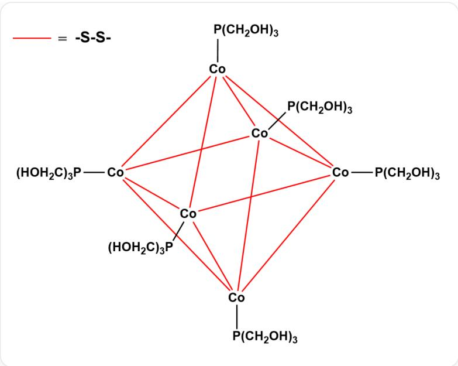

# 题目

用于催化和生物医学目的的稳定水溶性过渡金属配合物是现代配位化学的重要研究领域。在乙醇中，用  $\mathrm{CoCl}_2\cdot 6\mathrm{H}_2\mathrm{O}$  与  $\mathrm{P}(\mathrm{CH}_2\mathrm{OH})_3$  ，  $\mathrm{H}_2\mathrm{S}$  共同反应得到了分子量为1444.6的配合物  $\mathbf{A}\cdot yH_{2}O$  。A为多核配合物，具有八面体对称性，仅含两种配体，配合物中除氢元素外，同种元素的化学环境完全相同。已知  $y\in [4,8]$  。设  $a$  ，  $b$  为合成A的化学方程式（反应系数为最简整数比）左侧和右侧系数之和，则  $\log_y(\frac{b - a}{b + a})$  的值为（只有误差在0.01之内时视为正确)：

A. 其他选项均不正确  
B. -1.08  
C. -0.95  
D. -0.89  
E. -0.76  
F. -0.61  
G. 0.18  
H. 0.39  
1. 0.58  
J. 0.94  
K. 1.23

L. 1.50  
M. -0.44  
N. -0.32  
O. -0.14

# 答案

正确答案: F

# 详细解析

考虑到多核，八面体对称性，同种元素化学环境相同， $\mathrm{P}(\mathrm{CH}_2\mathrm{OH})_3$  必须作为端基，可以推出应该为6核并且  $\mathrm{S}^{2-}$  必须作桥。

# CHECKPOINT

1 PTS

$\mathrm{S}^{2-}$  为桥连配体

故  $\mathrm{P}(\mathrm{CH}_{2} \mathrm{OH})_{3}$  的个数可能为 6、12 等， $\mathrm{S}^{2-}$  的个数可能为

8、12等。  
经过简单计算发现只有当二者的数目均取最小值时，分子量才可以小于1444.6，因此  $\mathrm{P(CH_2OH)_3}$  的个数为6， $\mathrm{S}^{2-}$  的个数为  
8。核心的化学式为  $\mathrm{Co_6S_8(P(CH_2OH)_3)_6}$  。

# CHECKPOINT

2 PTS

A 为  $\mathrm{Co}_{6} \mathrm{~S}_{8} (\mathrm{P}(\mathrm{CH}_{2} \mathrm{OH})_{3})_{6}$

$$
\begin{array}{l} M (\mathbf {A}) = 1 3 5 4. 5 7 g / m o l \\ y M \left(\mathrm {H} _ {2} \mathrm {O}\right) = 1 4 4 4. 6 - 1 3 5 4. 5 7 = 9 0. 0 3 g / m o l \\ \end{array}
$$

因此  $y = 5$

# CHECKPOINT

1 PTS

$$
y = 5
$$

合成A的方程式为：

$$
6 \mathrm {C o C l} _ {2} \cdot 6 \mathrm {H} _ {2} \mathrm {O} + 6 \mathrm {P} (\mathrm {C H} _ {2} \mathrm {O H}) _ {3} + 8 \mathrm {H} _ {2} \mathrm {S} + \mathrm {O} _ {2} \rightarrow \mathrm {C o} _ {6} \mathrm {S} _ {8} (\mathrm {P} (\mathrm {C H} _ {2} \mathrm {O H}) _ {3}) _ {6} \cdot 5 \mathrm {H} _ {2} \mathrm {O} + 3 3 \mathrm {H} _ {2} \mathrm {O} + 1 2 \mathrm {H C l}
$$

因此  $a = 21$  ，  $b = 46$  。

# CHECKPOINT

1 PTS

$$
a = 2 1, b = 4 6
$$

$$
\log_ {y} \left(\frac {b - a}{b + a}\right) = \log_ {5} \frac {2 5}{6 7} \approx - 0. 6 1
$$

  
配合物结构