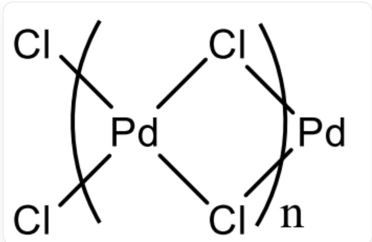
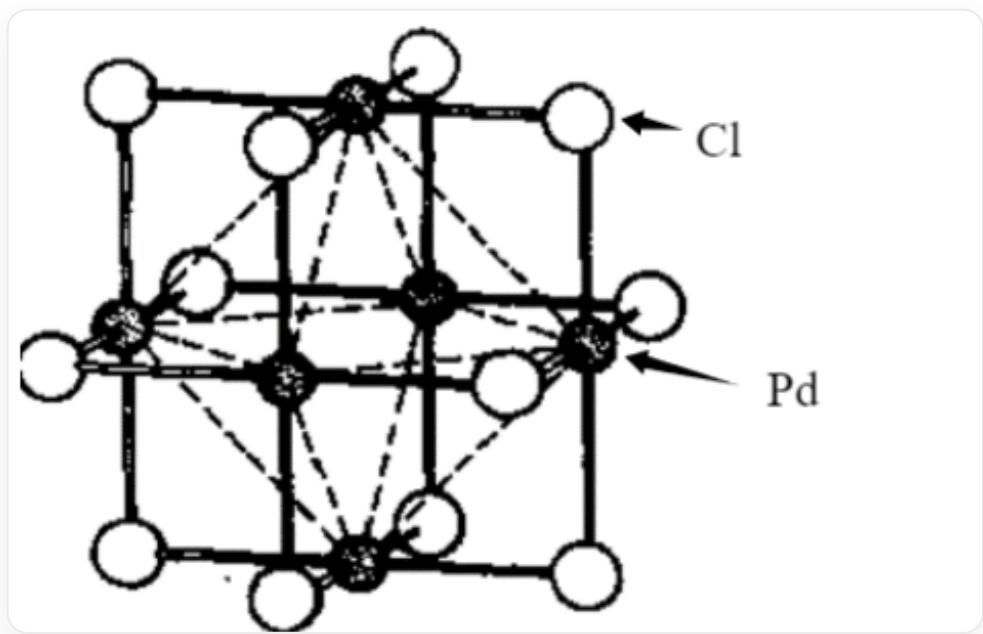
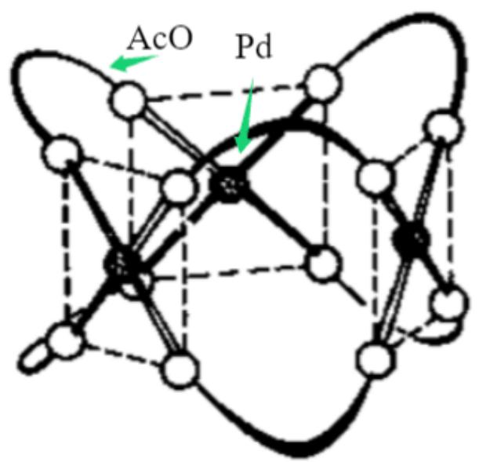
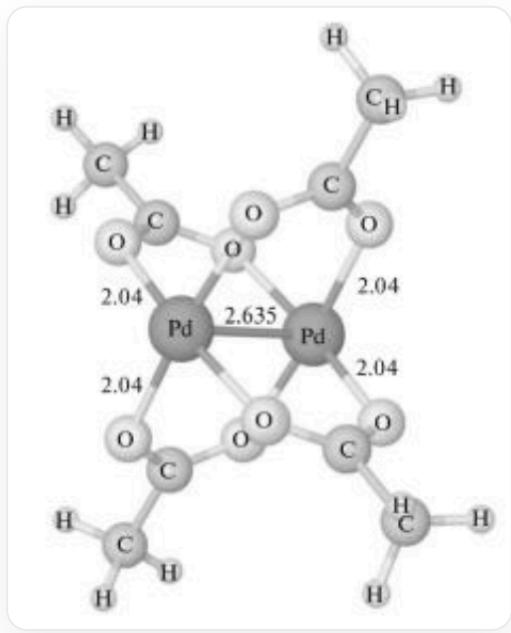

# Question

Metal A is a component in many catalysts. Element A reacts with  $\mathrm{F}_2$  and  $\mathrm{Cl}_2$  to produce B and C, respectively, with B containing  $65.12\%$  of A. Reacting B with  $\mathrm{SeF}_4$  yields D, whose crystal has a rutile structure. C has two crystalline forms,  $\mathbf{C}_1$  and  $\mathbf{C}_2$ , containing chain-like polymers and hexamer units, respectively. Adding glacial acetic acid to a sulfate solution of A produces E, which commonly exists as a trimer  $\mathbf{E}_1$ , but its dimer  $\mathbf{E}_2$  has also been found. E reacts with sodium acetate to produce a mononuclear complex F and a dinuclear complex G.

Now there are the following statements:

1, The valence of  $\mathbf{A}$  in  $\mathbf{B}$  is  $+3$ .  
2, C and D have similar chemical formulas.  
3, The coordination numbers of  $\mathbf{A}$  in  $\mathbf{C}_1$  and  $\mathbf{C}_2$  are different.  
4,  $\mathbf{C}_2$  belongs to the  $T_{d}$  point group.  
5. If hydrogen atoms are ignored, one possible structure of  $\mathbf{E}_1$  belongs to the  $D_{3h}$  point group.  
6, If hydrogen atoms are ignored,  $\mathbf{E}_2$  has the same highest-order rotation axis as  $\mathrm{Re}_2\mathrm{Cl}_8^{2-}$ .

Let the atomic number of  $\mathbf{A}$  be a, the smallest serial number of the correct statements be b, and the sum of the serial numbers of all correct statements be c, then the results obtained by performing modulo operations on a with  $b + 1$  and c, respectively, are:

A. All other options are incorrect  
B. 0, 5  
C. 0, 6

D. 0, 7  
E. 0, 8  
F. 1, 5  
G. 1, 6  
H. 1, 7  
1,8  
J. 2,5  
K. 2, 6  
L. 2, 7  
M. 2, 8  
N. 3, 5  
O. 3, 6  
P. 3, 7  
Q. 3, 8

# Answer

Correct Answer: H

# Detailed Explanation

Metal A is a component in many catalysts, presumed to be a transition metal. B and C are fluoride and chloride, respectively. Assume the chemical formula of B is  $\mathbf{A}\mathbf{F}_{\mathrm{x}}$ . According to the mass fraction, the following equation can be listed:

$$
\frac{M}{M + 19x} = 65.12\%
$$

Try to solve the equation. When  $x = 3$ ,  $M = 106.4g / mol$ , which is element Pd. Accordingly, B seems to be  $\mathrm{PdF}_3$ , but Pd generally exists in +2 and +4 valence states rather than +3 valence state.

# CHECKPOINT

# 1 PTS

Pd in B has  $+2$  and  $+4$  valences

Therefore,  $\mathbf{B}$  is  $\mathrm{Pd}_2\mathrm{F}_6$  , which can be represented as  $\mathrm{Pd}^{\mathrm{II}}[\mathrm{Pd}^{\mathrm{IV}}\mathrm{F}_6]$

After obtaining that  $\mathbf{A}$  is element Pd, it is natural to conclude that  $\mathbf{C}$  is  $\mathrm{PdCl}_2$ .  $\mathbf{D}$  crystal has a rutile structure, indicating that its atomic ratio is 1:2. Therefore,  $\mathbf{D}$  is  $\mathrm{PdF}_2$ .

Thus, 1 is incorrect, and 2 is correct.

Pd in C has a  $+2$  valence. When tetracoordinated, it tends to have a square planar configuration. It can be deduced that its chain polymer structure is:

The figure shows the chain polymer structure of  $\mathrm{PdCl}_2$ . Each Pd is coordinated by four Cl, and the coordination configuration is square planar. Two adjacent Pd share 2 Cl, and the Pd - Cl - Pd bond angle is about  $90^{\circ}$ .

Its hexamer structure is:

The figure shows the hexamer structure of  $\mathrm{PdCl}_2$ . The black ball is Pd, and the white ball is Cl. Six Pd atoms form a regular octahedron, and each edge of the regular octahedron has a Cl atom bridging.

# CHECKPOINT

2 PTS

In both polymers, Pd is tetracoordinated, and  $\mathbf{C}_2$  has  $O_h$  symmetry

Therefore, 3 and 4 are both incorrect.

Adding glacial acetic acid to the sulfate solution of  $\mathbf{A}$  produces  $\mathbf{E}$ . Then  $\mathbf{E}$  is  $\mathrm{Pd(OAc)}_2$ . Its trimer  $\mathbf{E}_1$  has a  $D_{3h}$  structure, as shown in the figure below:

The figure shows the trimer structure of  $\mathrm{Pd(OAc)}_2$ . The black ball is Pd, and the white ball is AcO. Three Pd atoms form a triangle, and AcO acts as a bidentate ligand to connect two adjacent Pd. Every two Pd are connected by two AcO, and the coordination configuration is square planar.

# CHECKPOINT

1 PTS

This structure belongs to the  $D_{3h}$  point group

The structure of its dimer  $\mathbf{E}_2$  is shown in the figure below:

The figure shows the dimer structure of  $\mathrm{Pd(OAc)}_2$ . Two Pd are bonded to each other, and a total of 4 AcO are used as bridging ligands to connect Pd. The orientations of two adjacent AcO are perpendicular to each other.

The structure of  $\mathrm{Re}_2\mathrm{Cl}_8^{2-}$  is similar to it, and the highest order of the axis is 4.

# CHECKPOINT

1 PTS

Ignoring H,  $\mathbf{E}_2$  has a four-fold axis.

Ignoring hydrogen atoms, the highest rotational axis order of  $\mathbf{E}_2$  is the same as that of  $\mathrm{Re}_2\mathrm{Cl}_8^{2-}$ .

The correct statements are 2, 5, and 6. The serial number and  $c = 2 + 5 + 6 = 13$ .

Element A is Pd, and the atomic number  $a = 46$ .

The smallest correct serial number  $b = 2$ . Calculate a%

$(\mathrm{b} + 1)$  and a%c:

$$
46 \% (2 + 1) = 46 \% 3 = 1
$$

$$
46 \% 13 = 7
$$

Therefore, choose H