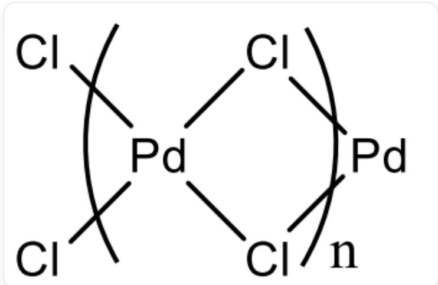
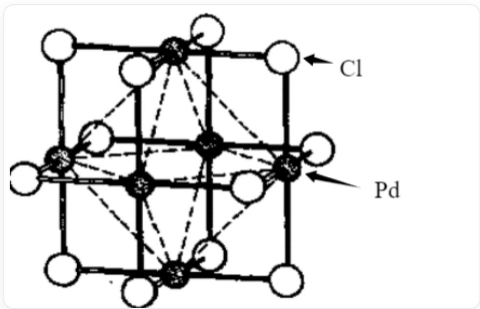
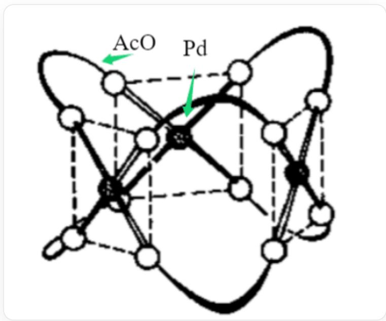
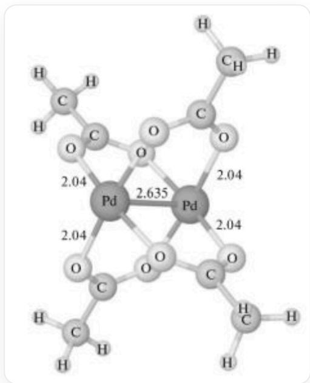

# 题目

金属A是许多催化剂中的成分。A单质与  $\mathrm{F}_2$  和  $\mathrm{Cl}_2$  反应，分别生成B和C，B中含A  $65.12\%$  。将B与  $\mathrm{SeF}_4$  反应生成D，其晶体为金红石结构。C有两种晶型  $\mathbf{C}_1$  和  $\mathbf{C}_2$  ，其中分别含有链状多聚体和六聚体单元。将冰醋酸加入A的硫酸盐溶液，产生E，E常以三聚体  $\mathbf{E}_1$  的形式存在，但已经发现其二聚体  $\mathbf{E}_2$  。E与醋酸钠反应，产生单核配合物F和双核配合物G。

现在有下列几个说法：

1，B中A的化合价为  $+3$  
2, C和D具有相似的化学式。  
3,  $\mathbf{C}_{1}$  和  $\mathbf{C}_{2}$  中  $\mathbf{A}$  的配位数不同。  
4，  $\mathbf{C}_2$  属于  $T_{d}$  点群。  
5, 若忽略氢原子, 则  $\mathbf{E}_{1}$  的一种可能结构属于  $D_{3 h}$  点群。  
6, 若忽略氢原子, 则  $\mathrm{E}_{2}$  与  $\mathrm{Re}_{2} \mathrm{Cl}_{8}^{2-}$  最高旋转轴次相同。

记 A 的原子序数为 a，正确的说法中最小的序号为 b，所有正确说法的序号之和为 c，则 a 分别对 b+1 和 c 进行取模运算所得到的结果分别是：

A. 其他选项均不正确  
B. 0, 5  
C. 0, 6  
D. 0, 7

E. 0, 8  
F. 1, 5  
G. 1, 6  
H. 1, 7  
1,8  
J. 2,5  
K. 2, 6  
L. 2, 7  
M. 2, 8  
N. 3, 5  
O. 3, 6  
P. 3, 7  
Q. 3, 8

# 答案

正确答案: H

# 详细解析

金属A是许多催化剂中的成分，推测其为某副族金属，B和C分别为氟化物和氯化物，设B的化学式为 $\mathbf{AF}_{\mathrm{x}}$  ，根据质量分数可以列出方程：

$$
\frac {M}{M + 19 x} = 65.12 \%
$$

试解方程，当  $x = 3$  时  $M = 106.4g / mol$  ，为元素Pd。据此B似乎为  $\mathrm{PdF_3}$  ，但Pd一般以  $+2$  和  $+4$  价态存在而非  $+3$  价态，

# CHECKPOINT

1 PTS

B中的Pd为  $+2$  和  $+4$  价

因此  $\mathbf{B}$  为  $\mathrm{Pd}_2\mathrm{F}_6$  ，可表示为  $\mathrm{Pd}^{\mathrm{II}}[\mathrm{Pd}^{\mathrm{IV}}\mathrm{F}_6]$  。

得到  $\mathbf{A}$  为元素Pd后，自然得出C为  $\mathrm{PdCl}_2$  。D晶体为金红石结构，表示其原子比例为1：2,因此D为 $\mathrm{PdF}_2$  ，

于是1错误，2正确。

C中Pd为+2价，四配位时倾向于平面四边形构型，可推出其链状多聚体结构为：

  
图中为PdCl $_2$ 链状多聚体结构，每个Pd周围有四个Cl进行配位，配位构型为平面四边形，相邻的两个Pd之间共用2个Cl，Pd - Cl - Pd键角约为  $90^{\circ}$ 。

其六聚体结构为：

  
图中为PdCl $_2$ 的六聚体结构，黑球为Pd，白球为Cl，六个Pd原子组成正八面体，正八面体的每一条棱上有一个Cl原子进行桥连。

# CHECKPOINT

2 PTS

两种多聚体中Pd均为四配位，且  $\mathbf{C}_2$  为  $O_h$  对称性

因此3，4均错误。

将冰醋酸加入A的硫酸盐溶液，产生E，则E为Pd(OAc)2，其三聚体  $\mathbf{E}_1$  存在一种  $D_{3h}$

结构，如下图：

  
图中为Pd(OAc)2的三聚体结构，黑球为Pd，白球为AcO，三个Pd原子组成三角形，AcO作为双齿配体连接相邻的两个Pd，每两个Pd之间由两个AcO进行连接，配位构型为平面四边形。

# CHECKPOINT

1 PTS

该结构属于  $D_{3h}$  点群

其二聚体  $\mathbf{E}_2$  结构如下图：

  
图中为Pd(OAc)2的二聚体结构，两个Pd之间相互成键，共有4个AcO作为桥连配体连接Pd，相邻的两个AcO取向互相垂直。

$\mathrm{Re}_2\mathrm{Cl}_8^{2-}$  的结构与其类似，最高轴次为4，

# CHECKPOINT

1 PTS

不考虑  $\mathbf{H}$  的情况下  $\mathbf{E}_2$  有四次轴。

忽略氢原子，则  $\mathbf{E}_2$  与  $\mathrm{Re}_2\mathrm{Cl}_8^{2-}$  最高旋转轴次相同

正确的说法是2、5、6,序号和  $c = 2 + 5 + 6 = 13$  。

元素A是Pd，原子序数  $a = 46$

最小正确序号  $b = 2$  。计算  $a\%$

$(b + 1)$  和  $\mathrm{a}\% \mathrm{c}$

$$
46 \% (2 + 1) = 46 \% 3 = 1
$$

$46\% 13 = 7$

因此选择H