# 题目

下图呈现了某一高分子  $\mathbf{P}$  的合成过程：

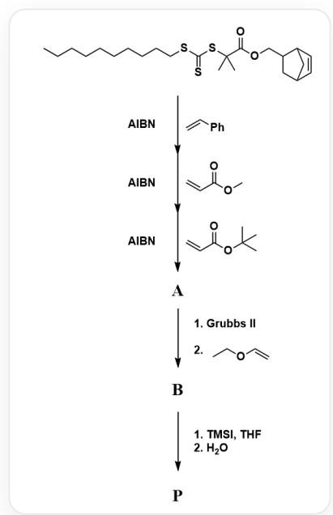

图中呈现了通过连续的5个反应合成高分子  $\mathbf{P}$  的过程，反应底物为 $\mathrm{\Delta CCCCCCCCSC}(\mathrm{SC}(\mathrm{C})$  (C(OCC1CC2C=CC1C2)=O)C)=S，5反应的条件如下：1.AIBN与  ${}^{\backprime}\mathrm{C} = \mathrm{CC}1 = \mathrm{CC} = \mathrm{CC} = \mathrm{C}1$  ；2.AIBN与 $\mathrm{\Delta COC(C = C)} = \mathrm{O}$  ；3.AIBN与  $\mathrm{\Delta CC(C)(C)OC(C = C)} = \mathrm{O}$  ，反应生成中间产物A；4.分两步反应：(1)GrubbsII(2)  $\mathrm{\Delta CCOC = C}$  ，反应生成中间产物B；5.分两步反应：(1)TMSI,THF(2)  $\mathrm{H}_2\mathrm{O}$  ，反应生成最终产物P

已知：

- 中间产物 A 的核磁共振氢谱数据:  ${}^{1}\mathrm{H}$  NMR(300 MHz,  $\mathrm{CD}_2\mathrm{Cl}_2$ , ppm):  $\delta$  0.80-0.90 (3H), 1.10-2.05 ( $\sim$ 430H), 1.25-1.60 (s, 684H), 2.74-2.79 (2H), 3.23-3.50 (2H), 3.65 (s, 84H), 6.03-6.15 (2H), 6.30-7.40 (140H).

- 数均分子量:  $M_{n, \mathbf{A}} = 15600 \mathrm{Da}, M_{n, \mathbf{B}} = 1.59 \times 10^{6} \mathrm{Da}$

请你根据合成过程，推断高分子的结构，并根据实验数据，推断重复单元的数量，选择下列选项中正确的一项。

A. 其他选项均不正确

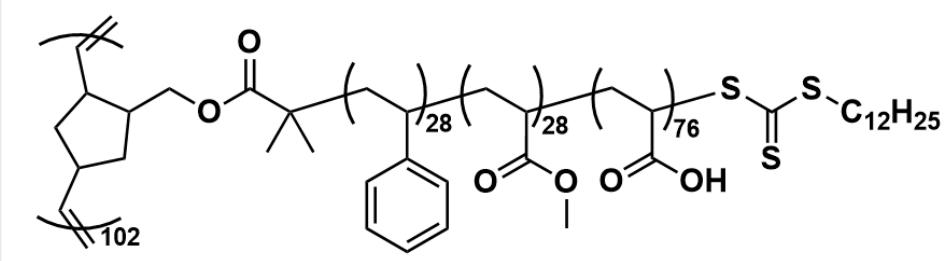  
B.

这是一个接枝聚合物，其中，主链的重复单元可以表示为  $\mathrm{[^*] = [CH]C1CC([CH] = [^*])CC1COC(=O)C(C)}$

(C)[CH2:1][CH:2](c2cccc2)[CH2:3][CH:4](C(=O)OC)[CH2:5][CH:6]

(C(=O)O)SC(=S)SCCCCCCCCCCCCC, 其聚合度为102, 主链两侧封端基团均为  $\left[^{*}\right] = C$  。主链的重复单元为一三嵌段共聚物支链, 其中  $\left[^{*}\right]$  [CH2:1][CH:2](c2cccccc2)[*] 构成支链的一个重复单元, 聚合度为28;  $\left[^{*}\right]$  [CH2:3][CH:4](C(=O)OC)[*] 构成支链的一个重复单元, 聚合度为28;  $\left[^{*}\right]$  [CH2:5][CH:6]

$(C(=O)O)[^{\star}]'$  构成支链的一个重复单元，聚合度为76。

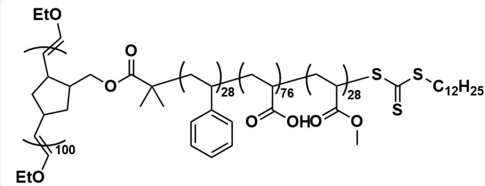  
C.  
D.

这是一个接枝聚合物，其中，主链的重复单元可以表示为 `*’=[CH]C1CC([CH]=[*])CC1COC(=O)C(C)

(C)[CH2:1][CH:2](c2cccc2)[CH2:3][CH:4](C(=O)O)[CH2:5][CH:6]

(C(=O)OC)SC(=S)SCCCCCCCCCCCCC, 其聚合度为100, 主链两侧封端基团均为  $[\star] = \text{COCC}$  。主链的重复单元为一三嵌段共聚物支链, 其中  $[\star][\text{CH2:1}][\text{CH2}](\text{c2cccc}2)[\star]$  构成支链的一个重复单元, 聚合度为28;  $[\star][\text{CH2:3}][\text{CH4}](\text{C(=O)O})[\star]$  构成支链的一个重复单元, 聚合度为76;  $[\star][\text{CH2:5}][\text{CH6}](\text{C(=O)OC})[\star]$  构成支链的一个重复单元, 聚合度为28。

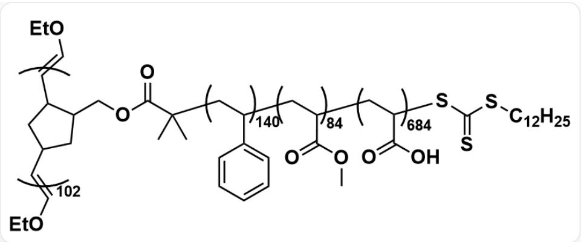

这是一个接枝聚合物，其中，主链的重复单元可以表示为  $[\ast] = [\text{CH}]\text{C1CC}([\text{CH}] = [\ast])\text{CC1COC}(\text{=O})\text{C}(\text{C})(\text{C})[\text{CH2:1}][\text{CH:2}](\text{c2cccc2})[\text{CH2:3}][\text{CH:4}](\text{C}(\text{=O})\text{OC})[\text{CH2:5}][\text{CH:6}]$

(C(=O)O)SC(=S)SCCCCCCCCCCCCC, 其聚合度为102, 主链两侧封端基团均为  $[\ast] = \text{COCC}$  。主链的重复单元为一三嵌段共聚物支链, 其中  $[\ast][\text{CH}2:1][\text{CH}:2](\text{c}2\text{cccc}2)[\ast]$  构成支链的一个重复单元, 聚合度为140;  $[\ast][\text{CH}2:3][\text{CH}:4](\text{C}(\text{=O})\text{OC})[\ast]$  构成支链的一个重复单元, 聚合度为84;  $[\ast][\text{CH}2:5]$  [CH:6](C(=O)O)[*] 构成支链的一个重复单元, 聚合度为684。

# E.

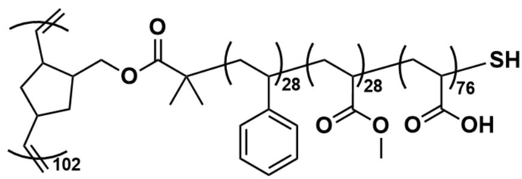

这是一个接枝聚合物，其中，主链的重复单元可以表示为`*]=[CH]C1CC([CH]=[*])CC1COC(=O)C(C)(C[CH2:1][CH:2](c2cccc2)[CH2:3][CH:4](C(=O)OC)[CH2:5][CH:6](C(=O)O)S`，其聚合度为102，主链两侧封端基团均为`*]=C`。主链的重复单元为一三嵌段共聚物支链，其中`*][CH2:1][CH:2](c2cccc2)[*']构成支链的一个重复单元，聚合度为28；`*'[CH2:3][CH:4](C(=O)OC)[*']构成支链的一个重复单元，聚合度为28；`*'[CH2:5][CH:6](C(=O)O)[*']构成支链的一个重复单元，聚合度为76。

# F.

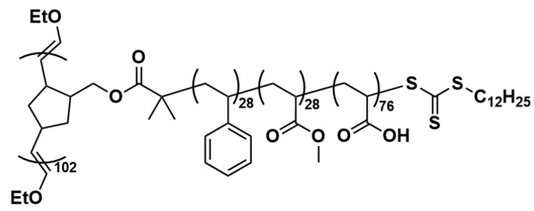

这是一个接枝聚合物，其中，主链的重复单元可以表示为 `*]=[CH]C1CC([CH]=[*])CC1COC(=O)C(C)

$$
(\mathrm {C}) [ \mathrm {C H} 2: 1 ] [ \mathrm {C H}: 2 ] (\mathrm {c} 2 \mathrm {c c c c c} 2) [ \mathrm {C H} 2: 3 ] [ \mathrm {C H}: 4 ] (\mathrm {C} (= \mathrm {O}) \mathrm {O C}) [ \mathrm {C H} 2: 5 ] [ \mathrm {C H}: 6 ]
$$

(C(=O)O)SC(=S)SCCCCCCCCCCCCC, 其聚合度为102, 主链两侧封端基团均为  $\left[^{*}\right] = \mathrm{COCC}^{\prime}$  。主链的重复单元为一三嵌段共聚物支链, 其中  $\left[^{*}\right]\left[\mathrm{CH} 2: 1\right]\left[\mathrm{CH}: 2\right]\left(\mathrm{c} 2 \mathrm{cccc} c 2\right)\left[\ast\right]^{\prime}$  构成支链的一个重复单元,

聚合度为28；`[*][CH2:3][CH:4](C(=O)OC)[*]`构成支链的一个重复单元，聚合度为28；`[*][CH2:5]

[ \text{[CH:6](C(=O)O)[*]} ] 构成支链的一个重复单元，聚合度为76。

# G.

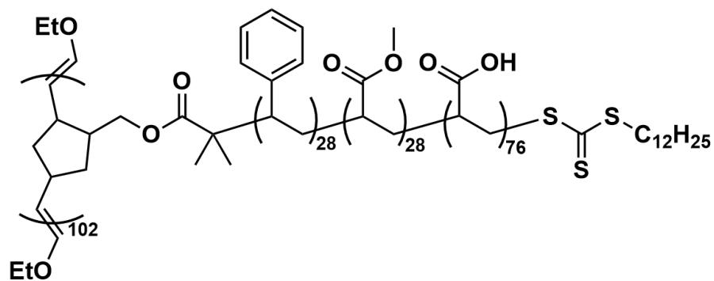

这是一个接枝聚合物，其中，主链的重复单元可以表示为 `*’=[CH]C1CC([CH]=[*])CC1COC(=O)C(C)

$$
(\mathrm {C}) [ \mathrm {C H}: 1 ] (\mathrm {c} 2 \mathrm {c c c c c c c c c c c c c c c c c c c c c c c c c c c c c c c c c c c c c c c c c c c c c c c c c c c c c c c c c c c c}
$$

[CH2:6]SC(=S)SCCCCCCCCCCCCC, 其聚合度为102, 主链两侧封端基团均为`\*=\COCC`。主链的

重复单元为一三嵌段共聚物支链，其中`[*][CH:1](c2cccc2)[CH2:2][*]构成支链的一个重复单元，聚

合度为28；`[*][CH:3](C(=O)OC)[CH2:4][*]构成支链的一个重复单元，聚合度为28；`[*][CH:5]

(C(=O)O)[CH2:6][*]构成支链的一个重复单元，聚合度为76。

# H.

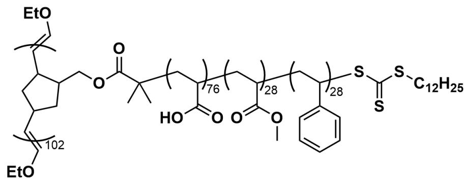

这是一个接枝聚合物，其中，主链的重复单元可以表示为 `*’=[CH]C1CC([CH]=[*])CC1COC(=O)C(C)

(C)[CH2:1][CH:2](C(=O)O)[CH2:3][CH:4](C(=O)OC)[CH2:5][CH:6]

(c2cccccc2)SC(=S)SCCCCCCCCCCCCC, 其聚合度为102, 主链两侧封端基团均为  $\mathbf{[^{*}] = COCC}$  。主链的重复单元为一三嵌段共聚物支链, 其中  $\mathbf{[^{*]}\left[\mathrm{CH}2:1\right]\left[\mathrm{CH}:2\right](\mathrm{C}(\mathbf{=O})\mathrm{O})\mathbf{[^{*]}}$  构成支链的一个重复单元, 聚合度为76;  $\mathbf{[^{*]}\left[\mathrm{CH}2:3\right]\left[\mathrm{CH}:4\right](\mathrm{C}(\mathbf{=O})\mathrm{OC})\mathbf{[^{*]}}$  构成支链的一个重复单元, 聚合度为28;  $\mathbf{[^{*]}\left[\mathrm{CH}2:5\right]\left[\mathrm{CH}:6\right](\mathrm{c}2\mathrm{cccccc}2)\mathbf{[^{*]}}$  构成支链的一个重复单元, 聚合度为28。

# 答案

正确答案: F

# 详细解析

首先，观察题目的图中起始物种为三硫代碳酸二酯 `CCCCCCCCCCCSC(SC(C) (C(OCC1CC2C=CC1C2)=O)C)=S`，这是一个典型的活性自由基聚合试剂，其在 AIBN 的作用下，可以发生可逆加成-断裂链转移聚合(RAFT 聚合)。

# CHECKPOINT

1 PTS

起始物种可以发生RAFT聚合/活性自由基聚合

AIBN 会裂解形成异丁腈自由基  $\mathrm{C}[\mathrm{C}](\mathrm{C}\# \mathrm{N})\mathrm{C}$  ，其进攻三硫代碳酸二酯中的硫代羰基，使其裂解形成：

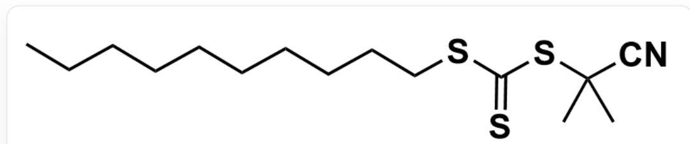

smiles为：CCCCCCCCCCSC(SC(C)(C)C#N)=S

与自由基：

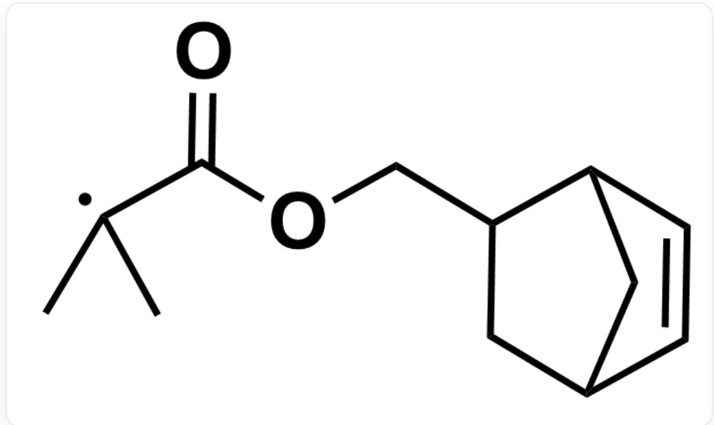  
C[C](C(OCC1CC2C=CC1C2)=O)C

其中，后者作为活性自由基聚合的链引发剂，引发单体分子的链式聚合。该RAFT聚合反应的特性为，可以在一种单体聚合后得到三硫代碳酸酯封端，该封端可以在加入AIBN与新的单体分子后继续进行活性自由基聚合，得到嵌段共聚物。

# CHECKPOINT

1 PTS

聚合反应在一种单体聚合后得到三硫代碳酸酯封端，加入AIBN后其可继续与新的单体分子后继续进行活性自由基聚合，得到嵌段共聚物

综上，起始物种与苯乙烯发生活性自由基聚合后，得到产物结构可以表示为：

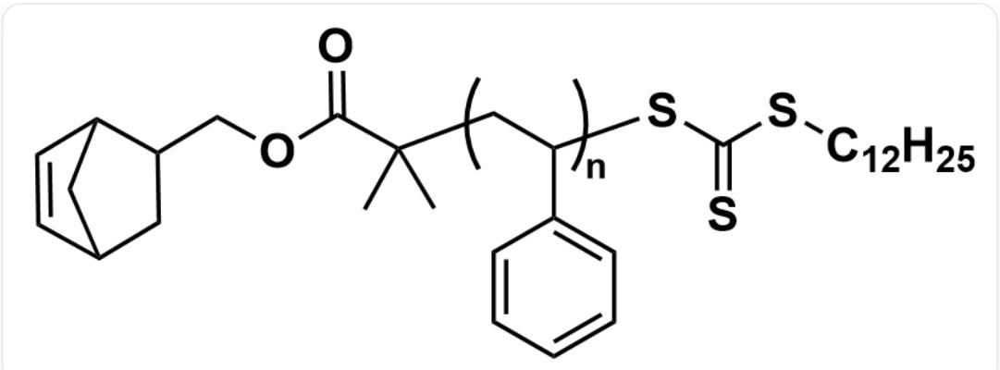

结构可以表示为`C2C(C1)C=CC2C1COC(=O)C(C)(C)[CH2:1][CH:2](c2cccc2)SC(=S)SCCCCCCCCCCC,其中`[\*][CH2:1][CH:2](c2cccc2)[\*]`构成支链的一个重复单元，聚合度为n

# CHECKPOINT

1 PTS

第一步 反应得到  $\mathrm{C3C(C1)C = CC3C1COC(=O)C(C)(C)[CH2:1][CH:2]}$

(c2cccccc2)SC(=S)SCCCCCCCCCCC, 其中  $\backslash [CH2:1][CH:2](c2cccccc2)[\backslash ]$  构成重复单元

以此类推，前三步反应均为RAFT活性自由基聚合反应，最终得到的聚合物A为嵌段共聚物，结构可以表示为：

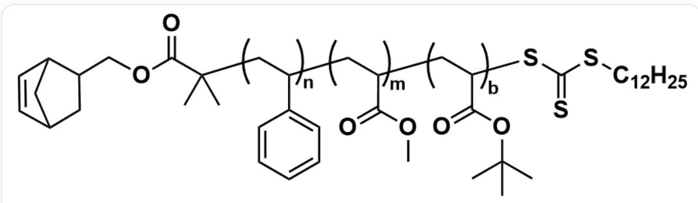

结构可以表示为：`C3C(C1)C=CC3C1COC(=O)C(C)(C)[CH2:1][CH:2](c2cccccc2)[CH2:3][CH:4](C(=O)OC)[CH2:5][CH:6](C(=O)O)SC(=S)SCCCCCCCCCCC`，其中`[*][CH2:1][CH:2](c2cccccc2)[*]`构成支链的一个重复单元，聚合度为n；`[*][CH2:3][CH:4](C(=O)OC)[*]`构成支链的一个重复单元，聚合度为m；`[*][CH2:5][CH:6](C(=O)O)[*]`构成支链的一个重复单元，聚合度为b。

# CHECKPOINT

1 PTS

A 为嵌段共聚物：`C3C(C1)C=CC3C1COC(=O)C(C)(C)[CH2:1][CH:2](c2cccc2)[CH2:3][CH:4] (C(=O)OC)[CH2:5][CH:6](C(=O)OC(C)(C)C)SC(=S)SCCCCCCCCCCC, 其中 `[][CH2:1][CH:2] (c2cccc2)[`^][CH2:3][CH:4](C(=O)OC)[`^][CH2:5][CH:6](C(=O)OC(C)(C)C)[`^]依次构成重复单元

A 到 B 的过程为一步开环易位聚合 (ROMP 聚合), 通过 Grubbs II 催化剂催化的烯烃复分解反应实现嵌段聚合物向接枝聚合物的聚合。其中, 第二步加入的乙基乙烯基醚为封端试剂, 其烯烃复分解聚合的端基为乙基烯基醚。

# CHECKPOINT

1 PTS

加入乙基乙烯基醚为封端试剂，烯烃复分解聚合的端基为乙基烯基醚

得到中间产物B的结构可以表示为：

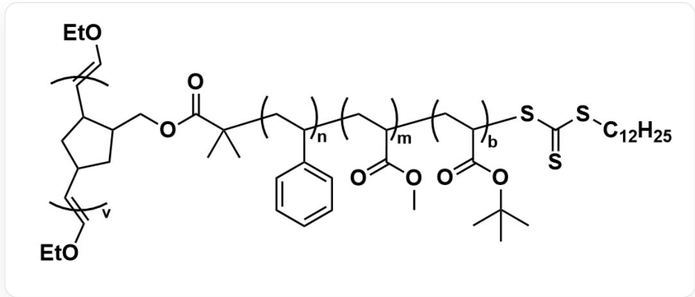

中间产物B为`[^*]=[CH]C1CC([CH]=[^*])CC1COC(=O)C(C)(C)[CH:2:1][CH:2](c2cccc2)[CH:2:3][CH:4](C(=O)OC)[CH:2:5][CH:6](C(=O)O)SC(=S)SCCCCCCCCCCC`，其聚合度为v，主链两侧封端基团均为`[^*]=COCC`。主链的重复单元为一三嵌段共聚物支链，其中`[^*][CH2:1][CH:2](c2cccc2)[*']构成支链的一个重复单元，聚合度为n；`[^*][CH2:3][CH:4](C(=O)OC)[*']构成支链的一个重复单元，聚合度为m；`[^*][CH2:5][CH:6](C(=O)O)[*']构成支链的一个重复单元，聚合度为b。

# CHECKPOINT

1 PTS

B 为  $\left[ J = \left[ C H \right] C 1 C C \left[ \left[ C H \right] = \left[ J \right]\right) C C 1 C O C (= O) C (C) (C) [ C H 2: 1 ] [ C H 2: 2 ] (c 2 c c c c c 2) [ C H 2: 3 ] [ C H 4 ] (C (= O) O C) [ C H 2: 5 ] [ C H 6 ] (C (= O) O) S C (= S) S C C C C C C C C C C ^ {\prime}$ , 主链两侧封端基团均为  $\left[ * \right] = \mathrm{COCC}^{\prime}$ , 其支链结构与 A 相同

最后一步反应为选择性水解叔丁基酯的反应，先加入TMSI将羧酸叔丁酯转化为易水解的羧酸三甲基硅酯，然后加入水得到质子化的羧酸，得到最终产物  $\mathbf{P}$  。

# CHECKPOINT

1 PTS

最后一步反应将羧酸叔丁酯水解为羧酸，得到最终产物  $\mathrm{P}$

$\mathbf{P}$  的结构示意如下：

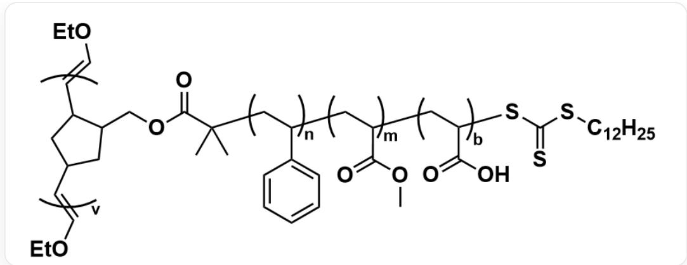  
结构为将 B 中的羧酸叔丁酯水解为羧酸后的结构，其余部分不变

根据核磁共振氢谱的信息推断A中各个片段的聚合度，将氢谱中的特征氢原子与A中的氢原子相对应，得到：

- 0.80-0.90 (3H) 对应  $-\mathrm{C}_{12}\mathrm{H}_{25}$  末端的甲基的氢

# CHECKPOINT

0.25 PTS

0.80-0.90 (3H) 对应  $-\mathrm{C}_{12}\mathrm{H}_{25}$  末端的甲基的氢

- 2.74-2.79 (2H) 对应烯丙基位的桥头碳上的氢

# CHECKPOINT

0.25 PTS

2.74-2.79 (2H) 对应烯丙基位的桥头碳上的氢

- 6.03-6.15 (2H) 对应烯基氢

# CHECKPOINT

0.25 PTS

6.03-6.15 (2H) 对应烯基氢

-3.23-3.50(2H)对应  $-\mathrm{SC}(\mathbf{\Phi} = \mathbf{S})\mathrm{S}[\mathrm{CH}_2] -$  中硫醚亚甲基的氢

# CHECKPOINT

0.25 PTS

3.23-3.50 (2H) 对应  $-\mathrm{SC} (= \mathrm{S}) \mathrm{S}[\mathrm{CH}_2] -$  中硫醚亚甲基的氢

- 6.30-7.40 (140H) 对应苯基氢, 聚合度  $n = \frac{140}{5} = 28$

# CHECKPOINT

1 PTS

6.30-7.40 (140H) 对应苯基氢，聚合度  $n = 28$

-3.65(s,84H)对应甲酯甲基氢，聚合度  $m = \frac{84}{3} = 28$

# CHECKPOINT

1 PTS

3.65 (s, 84H) 对应甲酯甲基氢，聚合度  $m = 28$

- 1.25-1.60 (s, 684H) 对应叔丁酯的甲基氢，聚合度  $b = \frac{684}{9} = 76$

# CHECKPOINT

1 PTS

1.25-1.60 (s, 684H) 对应叔丁酯的甲基氢，聚合度  $b = 76$

- 结合聚合度  $n / m / b$  ，考虑骨架中剩余的氢原子：降冰片烯酯基端基（ $\mathrm{CC}(\mathrm{C(OCC1C2CC(C1)C = C2)} = 0)$ $[\ast ])\mathrm{C}$  ，其中共有17个氢，剩余  $17 - 4 = 13$  个)，聚烯烃链  $(3\times (28 + 28 + 76) = 396$  个)，三硫代碳酸酯端基（  $25 - 5 = 20$  个）共有  $13 + 396 + 20 = 429\approx 430$  个氢，恰与1.10-2.05(  $\sim 430\mathrm{H})$  对应

# CHECKPOINT

1 PTS

1.10-2.05 (  $\sim 430\mathrm{H}$  ) 对应骨架中剩余的氢原子

根据数均分子量  $M_{n,\mathbf{A}} = 15600\mathrm{Da}$  ，  $M_{n,\mathbf{B}} = 1.59\times 10^{6}\mathrm{Da}$  ，可得聚合度  $v = \frac{1.59\times 10^6}{15600} = 101.9\approx 102$

# CHECKPOINT

1 PTS

根据数均分子量，可得聚合度  $v = 102$

结合以上所有信息，得出产物  $\mathbf{P}$  的结构为：

这是一个接枝聚合物，其中，主链的重复单元可以表示为  $\mathbf{[^{*}] = [CH]C1CC([CH] = [^{*}]})CC1COC(=O)C(C)(C)[CH2:1]$  [CH:2](c2cccc2)[CH2:3][CH:4](C(=O)OC)[CH2:5][CH:6](C(=O)O)SC(=S)SCCCCCCCCCCC\`，其聚合度为102，主链两侧封端基团均为  $\mathbf{[^{*}] = COCC}$  。主链的重复单元为一三嵌段共聚物支链，其中  $\mathbf{[^{*]}\left[\mathrm{CH}2:1\right]\left[\mathrm{CH}:2\right]$  (c2cccc2)\*构成支链的一个重复单元，聚合度为28；  $\mathbf{[^{*]}\left[\mathrm{CH}2:3\right]\left[\mathrm{CH}:4\right]\left(\mathrm{C(=O)OC}\right)\mathbf{[^{*]}}$  构成支链的一个重复单元，聚合度为28；  $\mathbf{[^{*]}\left[\mathrm{CH}2:5\right]\left[\mathrm{CH}:6\right]\left(\mathrm{C(=O)O}\right)\mathbf{[^{*]}}$  构成支链的一个重复单元，聚合度为76。

因此选择选项  $\mathbf{F}$  。