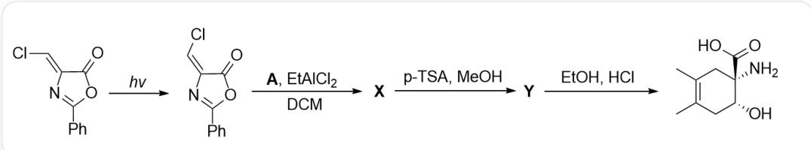
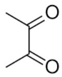
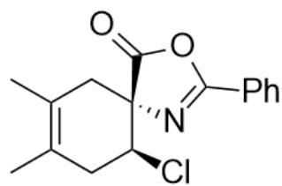
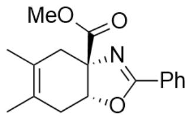

# Question

This diagram depicts a one-pot organic cascade reaction. The substrate

CI/C=C1C(OC(C2=CC=CC=C2)=N/1)=O under hv conditions transforms into

O=C1OC(C2=CC=CC=C2)=N/C1=C/Cl; then reacts with A, EtAlCl $_2$ , DCM to produce X; X under p - TSA, MeOH conditions produces Y; Y under EtOH, HCl conditions produces the final product

CC1=C(C)C[C@@H](O)[C@](N)(C(O)=O)C1.

Regarding the reaction in the above diagram, it is known that  $\mathbf{Y}$  contains 17 carbon atoms.

Which of the following statements is correct:

A. All other options are incorrect  
B. A The product after treatment with  $\mathrm{O}_{3}, \mathrm{MeOH} / \mathrm{Zn}$  contains one degree of unsaturation.  
C.  $\mathbf{X}, \mathbf{Y}$  both contain the structure of a six-membered ring and a five-membered ring.  
D. Y contains a carboxyl group  
E. All chiral carbons in  $\mathbf{X}$  are of R configuration.  
F. All chiral carbons in  $\mathbf{X}$  are of S configuration.  
G. The process from  $\mathbf{X}$  to  $\mathbf{Y}$  did not result in a change in the configuration of the chiral center.

H. The reaction can generate products even without performing the first step under  $h\nu$  conditions.  
1.  $\mathbf{Y}$  possesses a linkage relationship  $\mathrm{O} - \mathrm{CH} - \mathrm{CH} - \mathrm{C} = \mathrm{O}$

# Answer

Correct Answer: I

# Detailed Explanation

A  
  
A is C=C(C(C)=C)C; the structure of X is Cl[C@H]1CC(C)=C(C)C[C@]12N=C(C3=CC=CC=C3)OC2=O; the structure of Y is O=C(OC)[C@@]12[C@H](OC(C3=CC=CC=C3)=N2)CC(C)=C(C)C1°

  
X

  
Y

Obviously, the first step of light irradiation is the isomerization reaction of the double bond. After isomerization, the Cl atom and the carbonyl group are on the same side of the double bond.

# CHECKPOINT

1 PTS

The first step of light irradiation is the isomerization reaction of the double bond

Observing the product, it can be seen that the nitrogen and oxygen atoms in the product should originate from the five-membered ring of the substrate according to the bond relationship, and the extra six-membered ring olefin structure of the substrate, according to retrosynthetic analysis, should be a part after the D-A cycloaddition reaction of 2,3-dimethyl-1,3-butadiene. Therefore, A is C=C(C(C)=C)C. It generates O=C(C(C)=O)C under ozonolysis reaction conditions, containing two unsaturated bonds, so option B is incorrect.

# CHECKPOINT

1 PTS

The extra six-membered ring olefin structure of the substrate, according to retrosynthetic analysis, should be a part after the D-A cycloaddition reaction of 2,3-dimethyl-1,3-butadiene

# CHECKPOINT

1 PTS

A is  $\mathrm{C} = \mathrm{C}(\mathrm{C}(\mathrm{C}) = \mathrm{C})\mathrm{C}$

The substrate undergoes a D-A reaction with 2,3-dimethyl-1,3-butadiene, and the dienophile should be the  $\mathrm{C} = \mathrm{C}$  double bond. Since the Cl atom and the carbonyl group are on the same side of the double bond, according to the stereoselectivity of the D-A reaction, the Cl atom and the carbonyl group are on the same side in the product; therefore, the structure of  $\mathbf{X}$  is  $\mathrm{Cl}[\mathrm{C}@\mathrm{H}]1\mathrm{CC}(\mathrm{C}) = \mathrm{C}(\mathrm{C})\mathrm{C}[\mathrm{C}@\mathrm{]12N} = \mathrm{C}(\mathrm{C}3 = \mathrm{CC} = \mathrm{CC} = \mathrm{C}3)\mathrm{OC}2 = \mathrm{O}$ . The two chiral centers of  $\mathbf{X}$  are 1R,1S, so option E is incorrect.

# CHECKPOINT

1 PTS

Since the Cl atom and the carbonyl group are on the same side of the double bond, the Cl atom and the carbonyl group are on the same side in the D-A reaction product

# CHECKPOINT

1 PTS

The structure of  $\mathbf{X}$  is Cl[C@H]1CC(C)=C(C)C[C@]12N=C(C3=CC=CC=C3)OC2=O

Then, p-toluenesulfonic acid  $\mathfrak{p}-$  TSA and methanol are added, and a transesterification reaction occurs under acidic conditions to generate a methyl ester group and a hydroxyl anion; the hydroxyl anion is now in the trans position to the chloride ion, so an  $\mathrm{S_N2}$  reaction can occur to form an intramolecular five-membered ring; therefore, the structure of  $\mathbf{Y}$  is  $\mathrm{O = C(OC)[C@@]12[C@H](OC(C3 = CC = CC = C3) = N2)CC(C) = C(C)C1}$ . (Since the question gives 17 carbons, only a methyl ester group can be generated here.) The two chiral centers of  $\mathbf{Y}$  are 1R,1S and the configuration of the chiral center has changed, so options F and G are incorrect.  $\mathbf{Y}$  has a bond relationship of  $\mathrm{O - CH - C - C = O}$ , so option I is correct.

# CHECKPOINT

1 PTS

A transesterification reaction occurs under acidic conditions to generate a methyl ester group and a hydroxyl anion

# CHECKPOINT

1 PTS

The hydroxyl anion is now in the trans position to the chloride ion, so an  $\mathrm{S_N2}$  reaction can occur to form an intramolecular five-membered ring

# CHECKPOINT

1 PTS

The structure of  $\mathbf{Y}$  is  $O = C(OC)[C@@]12[C@H](OC(C3 = CC = CC = C3) = N2)CC(C) = C(C)C1$

# CHECKPOINT

1 PTS

The configuration of the chiral center has changed from  $\mathbf{X}$  to  $\mathbf{Y}$

According to the structure,  $\mathbf{Y}$  is a hexafused five-ring system and does not contain a carboxyl group, and  $\mathbf{X}$  is a hexaspiro five-ring system, so options C and D are incorrect.

Finally,  $\mathbf{Y}$  hydrolyzes the imine structure under strongly acidic conditions to generate the product, and its stereochemistry meets the requirements.

If the light irradiation is not started to isomerize the double bond, the chlorine atom will be on the same side of the carbonyl group after the D-A reaction, so the  $\mathrm{S_N2}$  intramolecular cyclization cannot occur and the product cannot be obtained, so option G is incorrect.

# CHECKPOINT

1 PTS

Without isomerizing the double bond, the chlorine atom will be on the same side of the carbonyl group after the D-A reaction, so the  $\mathrm{S_N2}$  intramolecular cyclization cannot occur