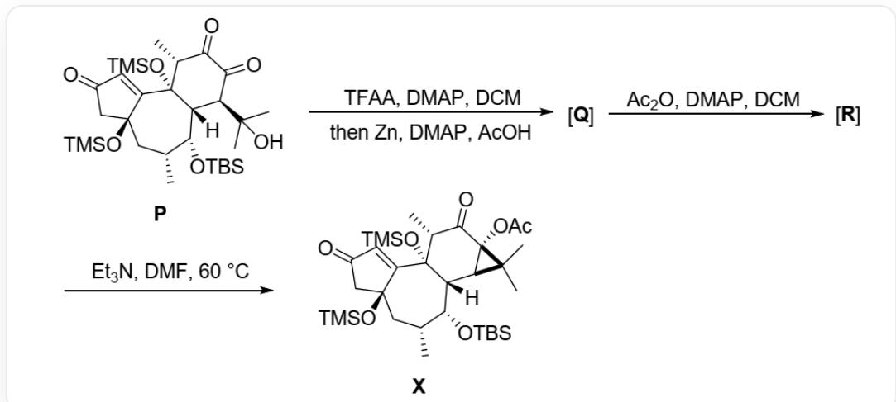
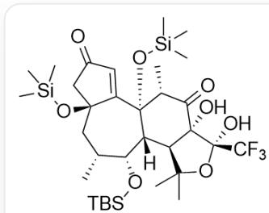
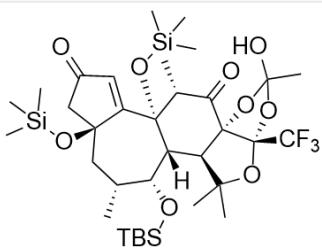
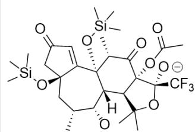
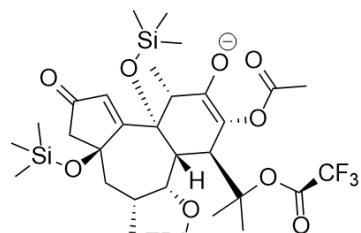

# Question

Compound  $\mathbf{P}$  first reacts with TFAA, followed by the action of  $Zn$  to generate  $\mathbf{Q}$ .  $\mathbf{Q}$  generates  $\mathbf{R}$  with a ketal structure under the action of acetic anhydride.  $\mathbf{R}$  obtains the final product  $\mathbf{X}$  with a fused hexacyclictricyclic system under the action of triethylamine. It is known that a new five-membered ring is produced in both the reaction from  $\mathbf{P}$  to  $\mathbf{Q}$  and from  $\mathbf{Q}$  to  $\mathbf{R}$ .

C[Si](C)(O[C@]1(C[C@H]2C)C([C@@]3([C@][H])([C@H](C(C)(C)O)C(C([C@H]3C)=O)=O)

[C@@H]2O[Si](C)(C)C(C)(C)C)O[Si](C)(C)C=CC(C1)=O)C first reacts with trifluoroacetic anhydride and DMAP in DCM, followed by reaction with zinc, DMAP, and acetic acid to obtain Q. Q reacts with acetic anhydride and DMAP in DCM to obtain R. R and triethylamine react in DMF at 60 degrees Celsius to

obtain X: C[Si](C)(O[C@]1(C[C@H]2C)C([C@@]3([C@][H])([C@H](C(C)4C)

[C@]4(C([C@H]3C)=O)OC(C)=O)[C@@H]2O[Si](C)(C)C(C)(C)O[Sij](C)(C)C=CC(C1)=O)C

The following statements are made:

1. The role of  $Zn$  in the step of generating  $\mathbf{Q}$  is as a reducing agent.  
2. There is a trans-vicinal diol structure in  $\mathbf{Q}$  
3. There is a carbon atom bonded to three oxygen atoms in  $\mathbf{R}$  
4. It is known that the process of generating  $\mathbf{X}$  successively undergoes two negatively charged intermediates  $\mathbf{Y1}$  and  $\mathbf{Y2}$ , then  $\mathbf{Y2}$  has 3 rings.

Select the option containing all correct statements.

A. All statements are incorrect.  
B. 1  
C. 2  
D. 3  
E. 4  
F. 1,2  
G. 1,3  
H. 1,4  
1. 2,3  
J. 2,4  
K. 3,4  
L. 1,2,3  
M. 1,2,4

N. 1,3,4  
O. 2,3,4  
P. 1,2,3,4

# Answer

Correct Answer: N

# Detailed Explanation

TFAA is a strong acylation reagent. Under DMAP catalysis, the tertiary alcohol hydroxyl group in  $\mathbf{P}$  is more nucleophilic than the oxygen of the enol ether or the enol oxygen of the 1,3-diketone, and will preferentially react with TFAA to generate a trifluoroacetate. Subsequently, zinc reduction of the vicinal diketone in acetic acid produces an enol, which attacks the trifluoroacetate to generate a five-membered ring.

# CHECKPOINT

1 PTS

$Zn$  acts as a reducing agent to reduce the vicinal diketone, statement 1 is correct.

During the nucleophilic attack, zinc ion chelation controls the oxygen of the trifluoroacetate and the enol oxygen produced by the vicinal diketone to be on the same side, resulting in  $\mathbf{Q}$ : `C[Si](C) (O[C@]1(C[C@H]2C)C([C@@]3([C@]([H])([C@H](C(C)(C)O[C@@]4(C(F)(F)F)O) [C@]4(C([C@H]3C)=O)O)[C@@H]2O[Si](C)(C)C(C)(C)C)O[Si](C)(C)C=CC(C1)=O)C`. It has a cis-vicinal diol structure.

# CHECKPOINT

1 PTS

The structure of  $\mathbf{Q}$  is  ${}^{\backprime}\mathrm{C}[\mathrm{Si}](\mathrm{C})(\mathrm{O}[\mathrm{C}@\mathrm{]}1(\mathrm{C}[\mathrm{C}@\mathrm{H}]2\mathrm{C})\mathrm{C}([\mathrm{C}@\mathrm{]3}([\mathrm{C}@\mathrm{]([H])}([\mathrm{C}@\mathrm{H}](\mathrm{C}(\mathrm{C}))$ $(\mathrm{C})\mathrm{O}[\mathrm{C}@\mathrm{]4}(\mathrm{C}(\mathrm{F})(\mathrm{F})\mathrm{F})\mathrm{O})[\mathrm{C}@\mathrm{]4}(\mathrm{C}([\mathrm{C}@\mathrm{H}]3\mathrm{C}) = \mathrm{O})\mathrm{O})[\mathrm{C}@\mathrm{]2O}[\mathrm{Si}](\mathrm{C})(\mathrm{C})(\mathrm{C})(\mathrm{C})\mathrm{O}[\mathrm{Si}](\mathrm{C})$

(C)C=CC(C1)=O)C'. It has a cis-vicinal diol structure. Statement 2 is incorrect

Under the action of acetic anhydride, the newly generated hydroxyl group of  $\mathbf{Q}$  is converted to an acetate. Due to the vicinal diol structure, the other hydroxyl group can attack the ester group, generating a five-membered ring, resulting in  $\mathbf{R}$ : `C[Si](C)(O[C@]1(C[C@H]2C)C([C@@]3([C@]([H])([C@H]4[C@]5(C([C@H]3C)=O)O[C@] (O)(C)O[C@]5(C(F)(F)F)OC(C)4C)[C@@H]2O[Si](C)(C)C(C)(C)C)O[Si](C)(C)(C)=CC(C1)=O)C` in which there is a carbon atom bonded to three oxygen atoms.

# CHECKPOINT

1 PTS

The structure of  $\mathbf{R}$  is  ${}^{\backprime}\mathrm{C}[\mathrm{Si}](\mathrm{C})(\mathrm{O}[\mathrm{C}@\mathrm{]}1(\mathrm{C}[\mathrm{C}@\mathrm{H}]2\mathrm{C})\mathrm{C}([\mathrm{C}@\mathrm{]}}3([\mathrm{C}@\mathrm{]}}([\mathrm{H}])$  ([C@H]4[C@]5(C([C@H]3C)=O)O[C@](O)(C)O[C@]5(C(F)(F)F)OC(C)4C)[C@@H]2O[Si](C)(C)C(C) (C)O[Si](C)(C)C=CC(C1)=O)C', in which there is a carbon atom bonded to three oxygen atoms. Statement 3 is correct

Under the action of base, the hydroxyl hydrogen on the orthoester is abstracted, and the orthoester decomposes to generate intermediate Y1:  $\mathrm{C}[\mathrm{Si}](\mathrm{C})(\mathrm{O}[\mathrm{C}@\mathrm{]}1(\mathrm{C}[\mathrm{C}@\mathrm{H}]2\mathrm{C})\mathrm{C}([\mathrm{C}@\mathrm{]3}([\mathrm{C}@\mathrm{]}([\mathrm{H}])([\mathrm{C}@\mathrm{H}](\mathrm{C}(\mathrm{C}))$  (C)O[C@@]4(C(F)(F)F)[O-])[C@]4(C([C@H]3C)=O)OC(C)=O)[C@@H]2O[Si](C)(C)C(C)(C)O[Si](C)

(C)C=CC(C1)=O)C'. Subsequently, the negative charge on the oxygen attacks the carbon-carbon bond, and a retro-Aldol reaction occurs, opening the five-membered ring to generate enol Y2: `C[Si](C) (O[C@]1(C[C@H]2C)C([C@@]3([C@][H])([C@H](C(C)(C)OC(C(F)(F)F)=O)C(OC(C)=O)=C([C@H]3C)[O-]) [C@@H]2O[Si](C)(C)C(C)(C)C)O[Si](C)(C)C=CC(C1)=O)C', which has 3 rings. The enolate anion attacks the carbon atom connected to the trifluoroacetate oxygen, generating a three-membered ring, and trifluoroacetate is eliminated, generating X.

# CHECKPOINT

1 PTS

The structure of \(\mathbf{Y2}\) is \(\mathrm{\backslash C[S i](C)(O[C@]1(C[C@H]2C)C([C@@]3([C@]([H])([C@H](C(C)(C)OC(C(F)\(F)=O)C(OC(C)=O)=C([C@H]3C)[O-])[C@@H]2O[S i](C)(C)C(C)(C)C)O[S i](C)(C)(C)C)=CC(C1)=O)C^, which has 3 rings. Statement 4 is correct

Statements 1, 3, and 4 are correct, choose N.

  
Q

  
R

  
TBS  
Y1

  
sY2

Q: 'C[Si](C)(O[C@]1(C[C@H]2C)C([C@@]3([C@]([H])([C@H](C(C)(C)O[C@@]4(C(F)(F)F)O

$$
\begin{array}{l} [ \mathrm {C} @ ] 4 (\mathrm {C} ([ \mathrm {C} @ H ] 3 \mathrm {C}) = \mathrm {O}) \mathrm {O}) [ \mathrm {C} @ @ H ] 2 \mathrm {O} [ \mathrm {S i} ] (\mathrm {C}) (\mathrm {C}) \mathrm {C} (\mathrm {C}) (\mathrm {C}) \mathrm {O} [ \mathrm {S i} ] (\mathrm {C}) (\mathrm {C}) \mathrm {C} = \mathrm {C C} (\mathrm {C} 1) = \mathrm {O}) \mathrm {C} ^ {\prime}; \quad \mathbf {R}: ^ {\prime} \mathrm {C} [ \mathrm {S i} ] (\mathrm {C}) \\ (\mathrm {O} [ \mathrm {C} @ ] 1 (\mathrm {C} [ \mathrm {C} @ \mathrm {H} ] 2 \mathrm {C}) \mathrm {C} ([ \mathrm {C} @ @ ] 3 ([ \mathrm {C} @ ]) ([ \mathrm {H} ]) ([ \mathrm {C} @ \mathrm {H} ] 4 [ \mathrm {C} @ ] 5 (\mathrm {C} ([ \mathrm {C} @ \mathrm {H} ] 3 \mathrm {C}) = \mathrm {O}) \mathrm {O} [ \mathrm {C} @ ]) (\mathrm {O}) (\mathrm {C}) \mathrm {O} [ \mathrm {C} @ ] 5 (\mathrm {C} (\mathrm {F}) \\ (F) F O C (C) 4 C) [ C @ @ H ] 2 0 [ S i ] (C) (C) C (C) (C) C) O [ S i ] (C) (C) C = C C (C 1) = O) C ^ {\prime} ; \quad Y 1: ^ {\prime} C [ S i ] (C) \\ (\mathrm {O} [ \mathrm {C} @ ] 1 (\mathrm {C} [ \mathrm {C} @ \mathrm {H} ] 2 \mathrm {C}) \mathrm {C} ([ \mathrm {C} @ @ ] 3 ([ \mathrm {C} @ ]) ([ \mathrm {H} ]) ([ \mathrm {C} @ \mathrm {H} ]) (\mathrm {C} (\mathrm {C}) (\mathrm {C}) \mathrm {O} [ \mathrm {C} @ @ ] 4 (\mathrm {C} (\mathrm {F}) (\mathrm {F}) \mathrm {F}) [ \mathrm {O} - ]) \\ [ C @ ] 4 (C ([ C @ H ] 3 C) = O) O C (C) = O) [ C @ @ H ] 2 0 [ S i ] (C) (C) C (C) (C) C) O [ S i ] (C) (C) C = C C (C 1) = O) C ^ {\prime} ; \quad Y 2: ^ {\prime} C [ S i ] (C) \\ (O [ C @ ] 1 (C [ C @ H ] 2 C) C ([ C @ @ ]) 3 ([ C @ ]) ([ H ]) ([ C @ H ] (C (C) (C) O C (C (F) (F) F) = O) C (O C (C) = O) = C ([ C @ H ] 3 C) [ O - ]) \\ [ \mathrm {C} @ @ H ] 2 0 [ \mathrm {S i} ] (\mathrm {C}) (\mathrm {C}) \mathrm {C} (\mathrm {C}) (\mathrm {C}) \mathrm {C}) \mathrm {O} [ \mathrm {S i} ] (\mathrm {C}) (\mathrm {C}) \mathrm {C}) = \mathrm {C C} (\mathrm {C} 1) = \mathrm {O}) \mathrm {C} ^ {\prime} \\ \end{array}
$$