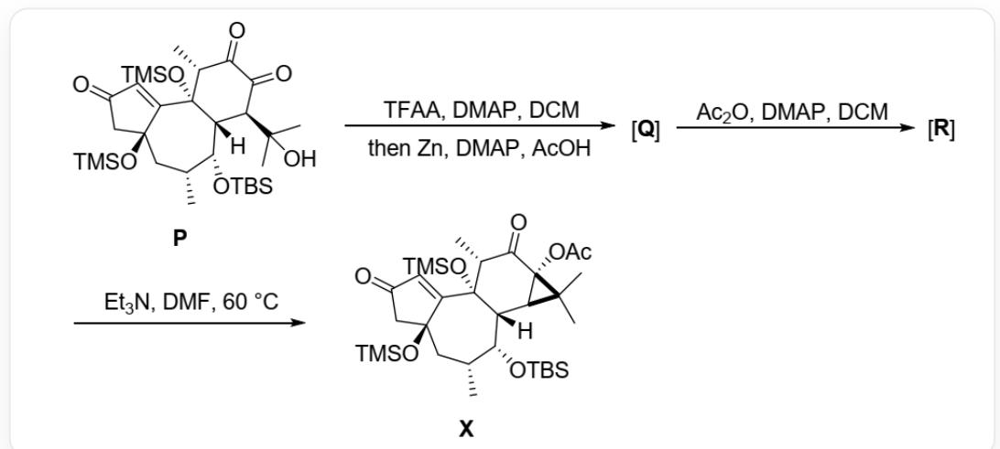
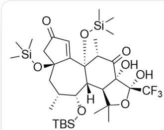
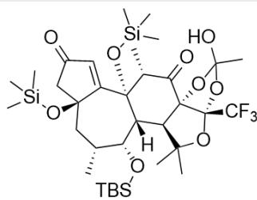
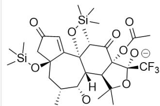
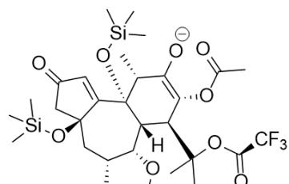

# 题目

化合物  $\mathbf{P}$  首先与TFAA反应，紧接着在  $Zn$  的作用下生成  $\mathbf{Q}$ ， $\mathbf{Q}$  在乙酸酐的作用下生成具有缩酮结构的  $\mathbf{R}$ ， $\mathbf{R}$  在三乙胺的作用下得到具有六元环并三元环环系的最终产物  $\mathbf{X}$ 。已知  $\mathbf{P}$  到  $\mathbf{Q}$ ， $\mathbf{Q}$  到  $\mathbf{R}$  均有一个新的五元环产生。

C[Si](C)(O[C@]1(C[C@H]2C)C([C@@]3([C@]([H])([C@H](C(C)(C)O)C([C@H]3C)=O)=O)[C@@H]2O[Si](C)(C)(C)(C)O[Si](C)(C)C=CC(C1)=O)C首先与三氟乙酸酐、DMAP在DCM中反应，随后与锌、DMAP和乙酸反应得到Q，Q在乙酸酐、DMAP在DCM中反应得到R，R和三乙胺在60摄氏度下

在DMF中反应得到X：C[Si](C)(O[C@]1(C[C@H]2C)C([C@@]3([C@]([H])([C@H](C(C)4C)

[C@]4(C([C@H]3C)=O)OC(C)=O)[C@@H]2O[Si](C)(C)(C)(C)O[Si](C)(C)(C)=CC(C1)=O)C

# 有以下说法：

1.生成Q一步  $Zn$  的作用是作为还原剂  
2.Q中存在反式邻二醇结构  
3.R中存在与三个氧原子成键的碳原子  
4.已知生成X的过程中先后经历了两个带负电荷的中间体Y1和Y2，则Y2中有3个环

选出含有说法全部正确的一项

A. 所有说法均不正确  
B. 1  
C. 2  
D. 3  
E. 4  
F. 1,2  
G. 1,3  
H. 1,4  
1. 2,3  
J. 2,4  
K. 3,4  
L. 1,2,3  
M. 1,2,4  
N. 1,3,4

O. 2,3,4  
P. 1,2,3,4

# 答案

正确答案: N

# 详细解析

TFAA是强酰化试剂。在DMAP催化下，P中的叔醇羟基比烯醇醚的氧或1,3-二酮的烯醇氧更具亲核性，会优先与TFAA反应，生成三氟乙酸酯。随后在乙酸中的锌还原邻二酮产生烯醇，进攻三氟甲酸酯，产生五元环。

# CHECKPOINT

1 PTS

$Zn$  的作用是作为还原剂，还原邻二酮，说法1正确

亲核进攻时，锌离子螯合控制三氟甲酸酯的氧与邻二酮产生的烯醇氧处于同侧，得到  $\mathbf{Q}$  ： $\mathrm{C}[\mathrm{Si}](\mathrm{C})$  (O[C@]1(C[C@H]2C)C([C@@]3([C@][[H])([C@H](C(C)(C)O[C@@]4(C(F)(F)F)O)

[C@]4(C([C@H]3C)=O)O)[C@@H]2O[Si](C)(C)C(C)(C)C)O[Si](C)(C)C)=CC(C1)=O)C。具有顺式邻二醇结构。

# CHECKPOINT

1 PTS

Q的结构为`C[Si](C)(O[C@]1(C[C@H]2C)C([C@@]3([C@]([H])([C@H](C(C)(C)O[C@@]4(C(F)(F)O)[C@]4(C([C@H]3C)=O)O)[C@@H]2O[Si](C)(C)C(C)(C)C)O[Si](C)(C)(C)=CC(C1)=O)C`。具有顺式邻二醇结构。说法2错误

在乙酸酐作用下Q新产生的羟基被转化为乙酸酯，由于具有邻二醇结构，另一羟基可以进攻酯基，产生五元环  $\mathrm{R}$  ：得到  $\mathrm{R}:\quad\mathrm{C}[\mathrm{Si}](\mathrm{C})(\mathrm{O}[\mathrm{C}@\mathrm{]1}(\mathrm{C}[\mathrm{C}@\mathrm{H}]2\mathrm{C})\mathrm{C}([\mathrm{C}@\mathrm{@}]3([\mathrm{C}@\mathrm{]}([\mathrm{H}])}$

$$
\begin{array}{l} ([ C @ H ] 4 [ C @ ] 5 (C ([ C @ H ] 3 C) = O) O [ C @ ] (O) (C) O [ C @ ] 5 (C (F) (F) F) O C (C) 4 C) [ C @ @ H ] 2 O [ S i ] (C) (C) C (C) \\ (\mathrm {C}) \mathrm {C}) \mathrm {O} [ \mathrm {S i} ] (\mathrm {C}) (\mathrm {C}) \mathrm {C}) = \mathrm {C C} (\mathrm {C} 1) = \mathrm {O}) \mathrm {C} ^ {\prime}, \text {其 中 存 在 与 三 个 氧 原 子 成 键 的 碳 原 子 。} \\ \end{array}
$$

# CHECKPOINT

1 PTS

R 的 结 构 为  $\mathrm{C}[\mathrm{Si}](\mathrm{C})(\mathrm{O}[\mathrm{C}@\mathrm{]}1(\mathrm{C}[\mathrm{C}@\mathrm{H}]2\mathrm{C})\mathrm{C}([\mathrm{C}@\mathrm{]3}([\mathrm{C}@\mathrm{]([H])}}$

$$
\begin{array}{l} ([ C @ H ] 4 [ C @ ] 5 (C ([ C @ H ] 3 C) = O) O [ C @ ] (O) (C) O [ C @ ] 5 (C (F) (F) F) O C (C) 4 C) [ C @ @ H ] 2 O [ S i ] (C) (C) C (C) \\ (\mathrm {C}) \mathrm {C}) \mathrm {O} [ \mathrm {S i} ] (\mathrm {C}) (\mathrm {C}) \mathrm {C}) = \mathrm {C C} (\mathrm {C} 1) = \mathrm {O}) \mathrm {C} ^ {\prime}, \text {其 中 存 在 与 三 个 氧 原 子 成 键 的 碳 原 子 。 说 法} 3 \text {正 确} \\ \end{array}
$$

在碱作用下，原酸酯上羟基氢被拔除，原酸酯分解产生中间体Y1： $\mathrm{C}[\mathrm{Si}](\mathrm{C})$

$$
(\mathrm {O} [ \mathrm {C @} ] 1 (\mathrm {C} [ \mathrm {C @ H} ] 2 \mathrm {C}) \mathrm {C} ([ \mathrm {C @ @} ] 3 ([ \mathrm {C @} ]) ([ \mathrm {H} ]) ([ \mathrm {C @ H} ]) (\mathrm {C} (\mathrm {C}) (\mathrm {C}) \mathrm {O} [ \mathrm {C @ @} ] 4 (\mathrm {C} (\mathrm {F}) (\mathrm {F}) \mathrm {F}) [ \mathrm {O -} ])
$$

[C@]4(C([C@H]3C)=O)OC(C)=O)[C@@H]2O[Si](C)(C)C(C)(C)C)O[Si](C)(C)C)=CC(C1)=O)C^, 随后氧上的负电荷进攻碳碳键，发生逆Aldol反应，打开五元环产生烯醇Y2：`C[Si](C)

$$
(\mathrm {O} [ \mathrm {C} @ ] 1 (\mathrm {C} [ \mathrm {C} @ \mathrm {H} ] 2 \mathrm {C}) \mathrm {C} ([ \mathrm {C} @ @ ] 3 ([ \mathrm {C} @ ]) ([ \mathrm {H} ]) ([ \mathrm {C} @ \mathrm {H} ]) (\mathrm {C} (\mathrm {C}) (\mathrm {C}) \mathrm {O C} (\mathrm {C} (\mathrm {F}) (\mathrm {F}) \mathrm {F}) = \mathrm {O}) \mathrm {C} (\mathrm {O C} (\mathrm {C}) = \mathrm {O}) = \mathrm {C} ([ \mathrm {C} @ \mathrm {H} ] 3 \mathrm {C}) [ \mathrm {O} - ])
$$

[C@@H]2O[Si](C)(C)C(C)(C)C)O[Si](C)(C)C)=CC(C1)=O)C\`，有3个环。烯醇负离子进攻三氟乙酸酯氧所连的碳原子，产生三元环，离去三氟乙酸根，产生X。

# CHECKPOINT

1 PTS

Y2 的结构为 `C[Si](C)(O[C@]1(C[C@H]2C)C([C@@][H])([C@H](C(C)(C)OC(C(F

$$
\begin{array}{l} (\mathrm {F}) \mathrm {F}) = \mathrm {O}) \mathrm {C} (\mathrm {O C} (\mathrm {C}) = \mathrm {O}) = \mathrm {C} ([ \mathrm {C} @ \mathrm {H} ] 3 \mathrm {C}) [ \mathrm {O} - ]) [ \mathrm {C} @ @ \mathrm {H} ] 2 \mathrm {O} [ \mathrm {S i} ] (\mathrm {C}) (\mathrm {C}) \mathrm {C} (\mathrm {C}) (\mathrm {C}) \mathrm {C}) \mathrm {O} [ \mathrm {S i} ] (\mathrm {C}) \\ (\mathrm {C}) \mathrm {C}) = \mathrm {C C} (\mathrm {C} 1) = \mathrm {O}) \mathrm {C} ^ {\prime} \text {, 有} 3 \text {个 环 。 说 法} 4 \text {正 确} \\ \end{array}
$$

说法1，3，4正确，选N。

  
Q

  
R

  
TBS  
Y1

  
S  
Y2

Q: `C[Si](C)(O[C@]1(C[C@H]2C)C([C@@]3([C@]([H])([C@H](C(C)(C)O[C@@]4(C(F)(F)F)O)

[C@]4(C([C@H]3C)=O)O)[C@@H]2O[Si](C)(C)C(C)(C)C)O[Si](C)(C)C=CC(C1)=O)C`; R: `C[Si](C)

$(\mathrm{O}[\mathrm{C}@\mathrm{]}1(\mathrm{C}[\mathrm{C}@\mathrm{H}]2\mathrm{C})\mathrm{C}([\mathrm{C}@\mathrm{]}3([\mathrm{C}@\mathrm{]}([\mathrm{H}])([\mathrm{C}@\mathrm{]4}\mathrm{C}@\mathrm{]}5(\mathrm{C}([\mathrm{C}@\mathrm{H}]3\mathrm{C}) = \mathrm{O})\mathrm{O}[\mathrm{C}@\mathrm{]}(\mathrm{O})(\mathrm{C})\mathrm{O}[\mathrm{C}@\mathrm{]}5(\mathrm{C}(\mathrm{F}))\mathrm{O}[\mathrm{C}@\mathrm{]}(\mathrm{C}(\mathrm{F}))]$

(F)F)OC(C)4C)[C@@H]2O[Si](C)(C)C(C)(C)C)O[Si](C)(C)C=CC(C1)=O)C`; Y1: `C[Si](C)

$(\mathrm{O}[\mathrm{C}@\mathrm{]}1(\mathrm{C}[\mathrm{C}@\mathrm{H}]2\mathrm{C})\mathrm{C}([\mathrm{C}@\mathrm{]})3([\mathrm{C}@\mathrm{]})([\mathrm{H}])([\mathrm{C}@\mathrm{H}](\mathrm{C}(\mathrm{C})(\mathrm{C})\mathrm{O}[\mathrm{C}@\mathrm{]4}(\mathrm{C}(\mathrm{F})(\mathrm{F})\mathrm{F})[\mathrm{O}-]$

[C@]4(C([C@H]3C)=O)OC(C)=O)[C@@H]2O[Si](C)(C)C(C)(C)O[Si](C)(C)C=CC(C1)=O)C`; Y2: `C[Si](C)

$(O[C@]1(C[C@H]2C)C([C@]3([C@][H])([C@H](C(C)(COC(F)(F)F)=O)C(OC(C)=O)=C([C@H]3C)[O-])$

[C@@H]2O[Si](C)(C)(C)(C)O[Si](C)(C)C=CC(C1)=O)C