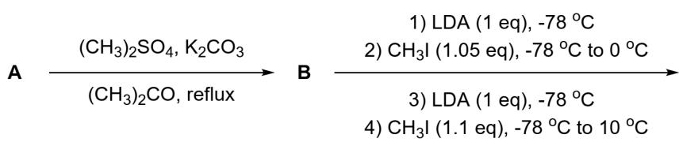
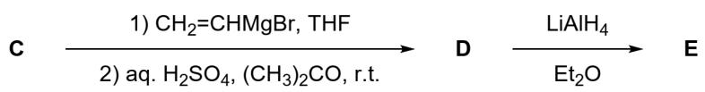
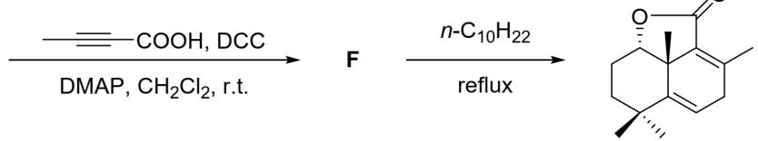
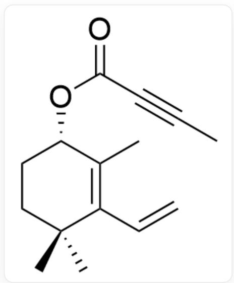
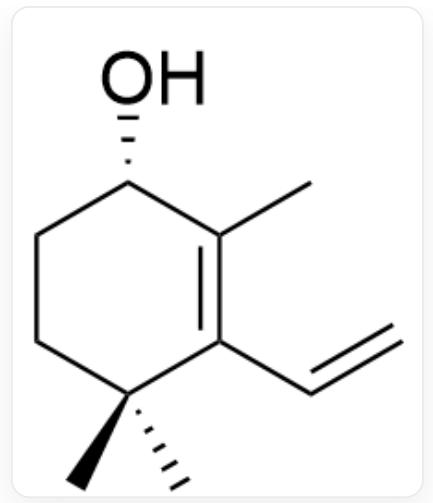
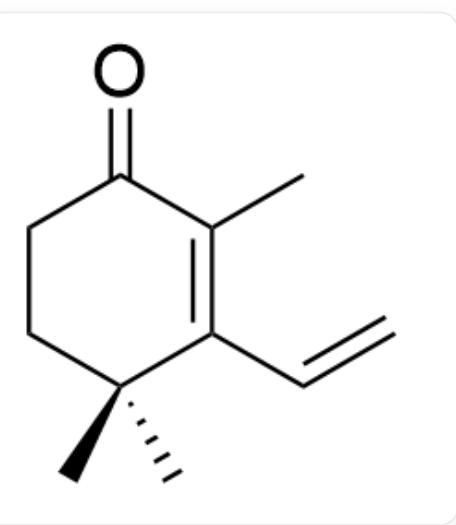
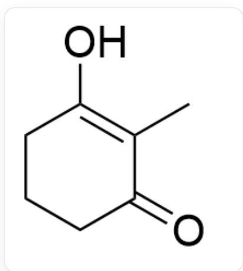
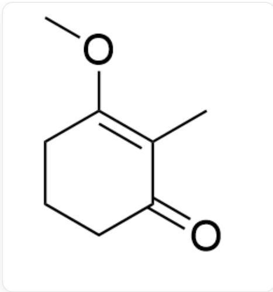
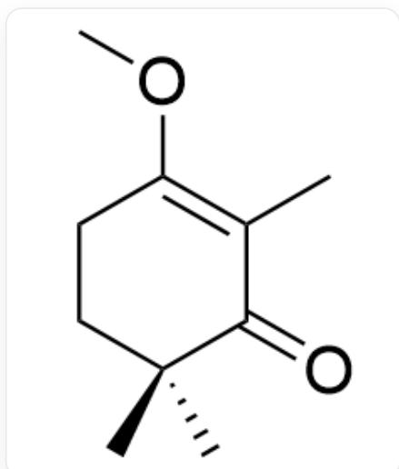

# Question

The following reaction pathway exists:

The diagram shows a multi-step synthetic pathway,  $\mathbf{A}$  generates  $\mathbf{B}$  under  $(\mathrm{CH}_3)_2\mathrm{SO}_4,\mathrm{K}_2\mathrm{CO}_3$ $(\mathrm{CH}_3)_2\mathrm{CO}$  ,reflux conditions,  $\mathbf{B}$  successively undergoes:

(1)  $LDA(1eq), -78^{\circ}C$ . (2)  $\mathrm{CH}_3\mathrm{I}(1.05eq), -78^{\circ}C$  to  $0^{\circ}C$ . (3)  $LDA(1eq), -78^{\circ}C$ . (4)  $\mathrm{CH}_3\mathrm{I}(1.1eq), -78^{\circ}C$  to  $10^{\circ}C$ .

to generate  $\mathbf{C}$ ,  $\mathbf{C}$  successively undergoes: (1)  $\mathrm{CH}_2\mathrm{CHMgBr}$ ,  $THF$ . (2)  $aq$ .  $\mathrm{H}_2\mathrm{SO}_4$ ,  $(\mathrm{CH}_3)_2\mathrm{CO}$ ,  $r$ .  $t$ . to generate  $\mathbf{D}$ ,

$\mathbf{D}$  generates  $\mathbf{E}$  under  $\mathrm{LiAlH_4}$ ,  $\mathrm{Et}_2\mathrm{O}$  conditions,  $\mathbf{E}$  generates  $\mathbf{F}$  under  $\mathrm{CH}_3\mathrm{CCCOOH}$ ,  $DCC$ ,  $DMAP$ ,  $\mathrm{CH}_2\mathrm{Cl}_2$  conditions,  $\mathbf{F}$  generates the final product under  $\mathrm{n} - \mathrm{C}_{10}\mathrm{H}_{22}$ ,  $reflux$  conditions, the final product is

$$
C C 1 = C 2 C (= O) O [ C @ H ] 3 C C [ C @ ] (C) (C) C (= C C 1) [ C @ ] 3 2 C ^ {\circ}
$$

Given that the chemical formula of  $\mathbf{A}$  is  $\mathrm{C_7H_{10}O_2}$ , if the substance exists in tautomeric forms, the most stable one is taken.

Then, which of the following statements is correct:

A. All other options are incorrect  
B. A contains two carbonyl groups.  
C. The mass fraction of oxygen in B is  $20.75\%$ .  
D. The configuration of the chiral carbon in  $\mathbf{C}$  is R and S.  
E. The mass fraction of carbon in D is  $80.44\%$ .

F. Two exocyclic double bonds exist in  $\mathbf{E}$ .  
G. There exist two cycles in  $\mathbf{F}$ .

# Answer

Correct Answer: E

# Detailed Explanation

Solving this problem through retrosynthetic analysis, we first observe that  $\mathbf{E}$  to  $\mathbf{F}$  uses an alkyne, and the final product only has double bonds and contains a six-membered ring with two double bonds. Combining with the conditions of the last step, it can be inferred that a D-A reaction occurred in the last step. Therefore,  $\mathbf{F}$  is:

  
CC#CC(O[C@H]1CCCC(C)(C(C=C)=C1C)C)=O

# CHECKPOINT

1 PTS

$\mathbf{F}$  is CC#CC(O[C@H]1CCC(C)(C(C=C)=C1C)C)=O

The reaction conditions from  $\mathbf{E}$  to  $\mathbf{F}$  are typical substitution reaction conditions. Here, it is speculated that an esterification reaction occurs with the reactant. Therefore,  $\mathbf{E}$  is:

O[C@H]1CCC(C)(C(C=C)=C1C)C

# CHECKPOINT

1 PTS

E is O[C@H]1CCC(C)(C(C=C)=C1C)C

D to E is under reduction reaction conditions, so it is speculated that this step is the reduction of the carbonyl group. Therefore, D is:

$\mathrm{O = C1CCC(C)(C(C = C) = C1C)C}$

# CHECKPOINT

1 PTS

D is  $\mathrm{O = C1CCC(C)(C(C = C) = C1C)C}$

At this point, it is more difficult to perform retrosynthesis. Therefore, we try to deduce the structure of  $\mathbf{A}$  by combining the molecular formula. Observing that multiple methyl groups and one vinyl group are added during the process from  $\mathbf{A}$  to  $\mathbf{D}$ , it is speculated that  $\mathbf{A}$  is a 1,3-diketone structure. Combining with the position of the methyl group in the molecule, it can be speculated that  $\mathbf{A}$  is:

  
CC1=C(O)CCCC1=O

# CHECKPOINT

1 PTS

A is  $\mathrm{CC1 = C(O)CCCC1 = O}$

A to B is the methylation of the hydroxyl group, so B is:

  
CC1=C(OC)CCCC1=0

# CHECKPOINT

1 PTS

B is CC1=C(OC)CCCC1=O

Two reactions adding methyl groups are performed from B to C. Combining with the structure of D, it is easy to obtain that C is:

  
CC1=C(OC)CCC(C)(C)C1=O

# CHECKPOINT

1 PTS

C is CC1=C(OC)CCC(C)(C)C1=O

After obtaining the structure, a simple calculation reveals that the mass fraction of oxygen in  $\mathbf{B}$  is  $22.83\%$ , and the mass fraction of carbon in  $\mathbf{D}$  is  $80.44\%$ . The remaining options can be judged as incorrect by direct observation.

Therefore, choose option E.