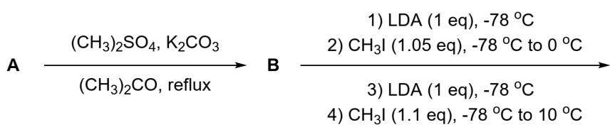
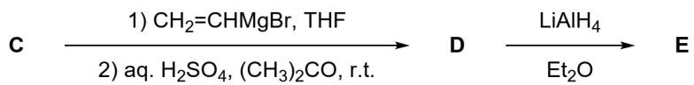
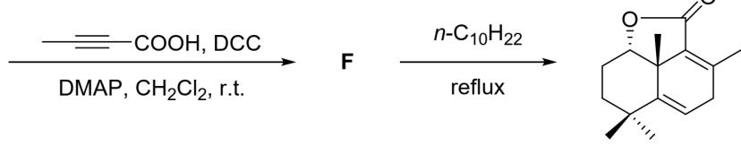
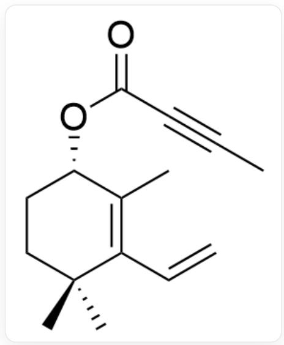
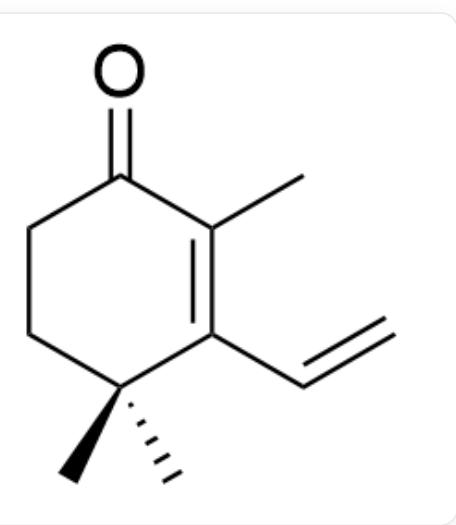
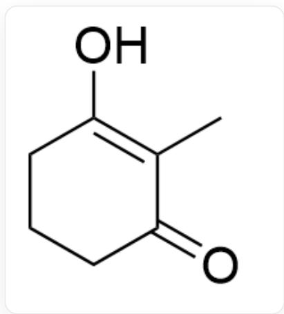
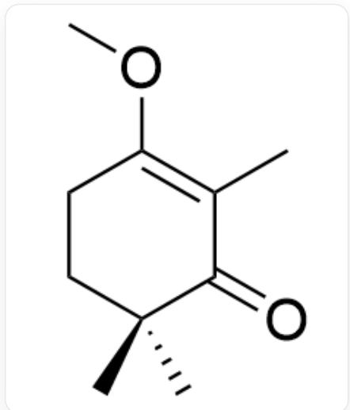

# 题目

有如下的反应路径：

图中展示了一个多步合成路径，A在  $\mathrm{(CH_3)_2SO_4}$  ，  $\mathrm{K}_2\mathrm{CO}_3$  ，  $\mathrm{(CH_3)_2CO,}$  ,reflux条件下生成B，B依次经过：(1)LDA(1eq),  $-78^{\circ}C.$  (2)CH3I(1.05eq)，  $-78^{\circ}C$  to  $0^{\circ}C$  .(3)LDA(1eq),  $-78^{\circ}C.$  (4)CH3I(1.1eq),  $-78^{\circ}C$  to  $10^{\circ}C$  生成C，C依次经过：(1)CH2CHMgBr,THF.(2)aq.H2SO4,(CH3)2CO,r.t.生成D，D在LiAlH4,Et2O条件下生成E，E在CH3CCCOOH,DCC,DMAP,CH2Cl2条件下生成F，F在n一  $\mathrm{C_{10}H_{22}}$  ,reflux条件下生成最终产物，最终产物为CC1=C2C(=O)O[C@H]3CC[C@](C)(C)C(=CC1)[C@]32C。

已知  $\mathbf{A}$  的化学式为  $\mathrm{C_7H_{10}O_2}$ , 若物质存在互变异构, 则取其中最稳定的一个。则下列选项中说法正确的是:

A. 其他选项均不正确  
B. A中含有两个羰基。  
C. B 中氧的质量分数为  $20.75\%$  。  
D. C中手性碳的构型为R和S。  
E. D中碳的质量分数为  $80.44\%$  。  
F. E中存在两个环外双键。

G. F 中存在两个环。

# 答案

正确答案: E

# 详细解析

通过逆合成分析来解决这个问题，首先观察到  $\mathbf{E}$  到  $\mathbf{F}$  中使用了一个炔烃，在最终产物中只有双键，并且有含有两个双键的六元环，结合最后一步的条件可以推断最后一步发生了D-A反应，因此得到  $\mathbf{F}$  为：

  
CC#CC(O[C@H]1CCCC(C)(C(C=C)=C1C)C)=O

# CHECKPOINT

1 PTS

$\mathbf{F}$  为CC#CC(O[C@H]1CCC(C)(C(C=C)=C1C)C)=O

E 到 F 的反应条件为典型的取代反应条件，在这里推测是与反应物发生酯化反应，因此 E 为：

O[C@H]1CCC(C)(C(C=C)=C1C)C

# CHECKPOINT

1 PTS

E为O[C@H]1CCC(C)(C(C=C)=C1C)C

D 到 E 为还原反应的条件, 因此推测该步为还原羰基, 因此 D 为:

$\mathrm{O = C1CCC(C)(C(C = C) = C1C)C}$

# CHECKPOINT

1 PTS

D 为  $O = C1CCC(C)(C(C = C) = C1C)C$

此时再进行逆推较为困难，因此尝试结合分子式推出A的结构。观察到A到D的过程中添加了多个甲基和一个乙烯基，因此推测A为1，3-二酮结构，结合分子中甲基的位置，可以推测A为：

  
CC1=C(O)CCCC1=O

# CHECKPOINT

1 PTS

A为  $\mathrm{CC1 = C(O)CCCC1 = O}$

A 到 B 为对羟基的甲基化，因此 B 为：

  
CC1=C(OC)CCCC1=0

# CHECKPOINT

1 PTS

B为CC1=CC(OC)CCCC1=O

B 到 C 进行了两步增加甲基的反应, 结合 D 的结构, 很容易得到 C 为:

  
CC1=C(OC)CCC(C)(C)C1=O

# CHECKPOINT

1 PTS

C为CC1=C(OC)CCC(C)(C)C1=O

得到结构之后，进行简单的计算发现B中氧的质量分数为  $22.83\%$  ，D中碳的质量分数为  $80.44\%$  。其余选项直接观察便可判断为错误。

因此选择E选项。