# Question

Ignoring stereochemistry, predict the main products of the reaction between singlet oxygen  ${}^{1}\mathrm{O}_{2}$  and the following two substrates:

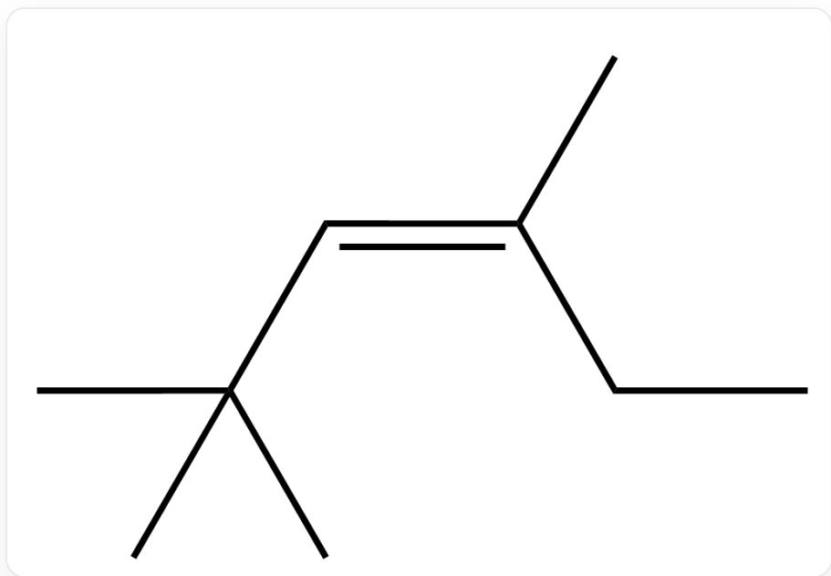  
C/C(CC) = C/C(C)(C)C, Substrate 1

# Substrate 1

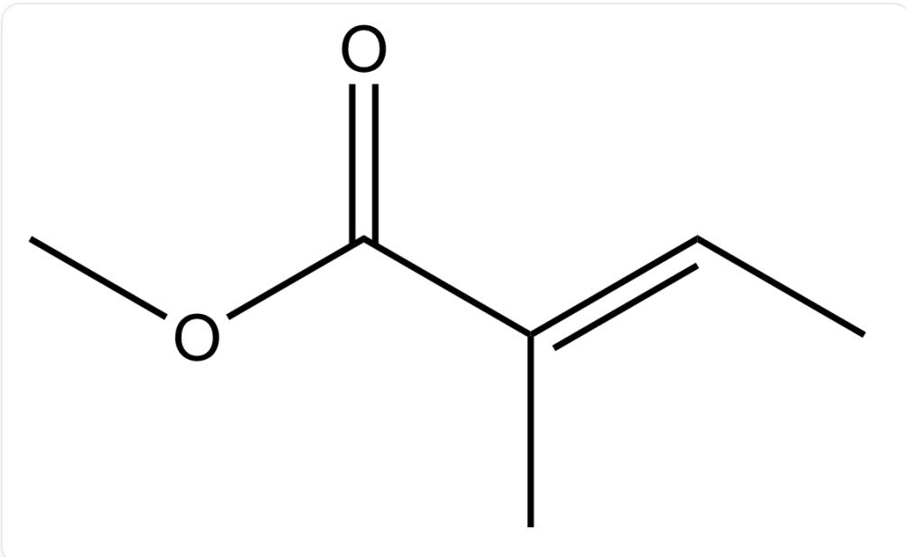  
$\mathrm{O = C / C(C) = C / C)OC,Substrate2}$

# Substrate 2

A. All other options are incorrect  
B.

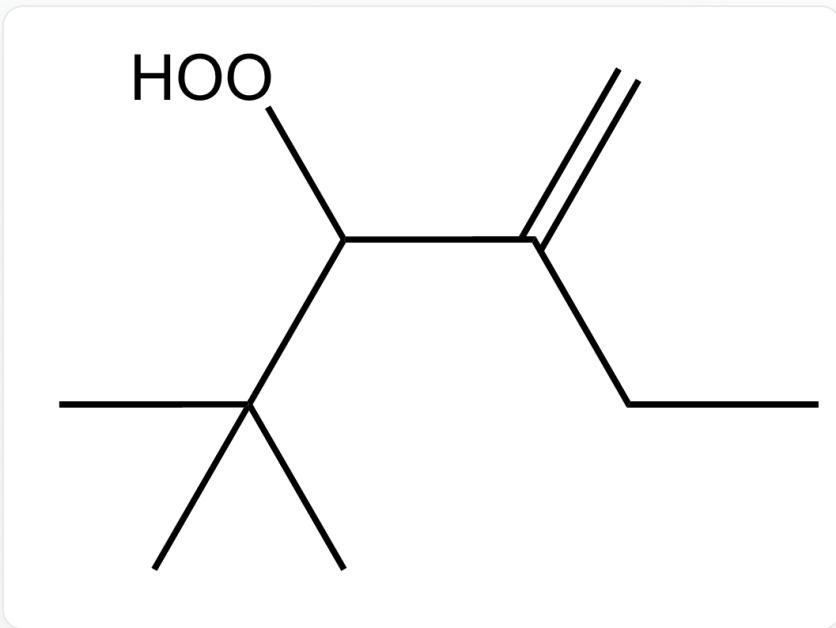  
CC(C)(C)C(OO)C(CC)=C,Product 1

Product 1

  
$\mathrm{O = C(C(C(OO)C) = C)OC,Product2}$

Product 2

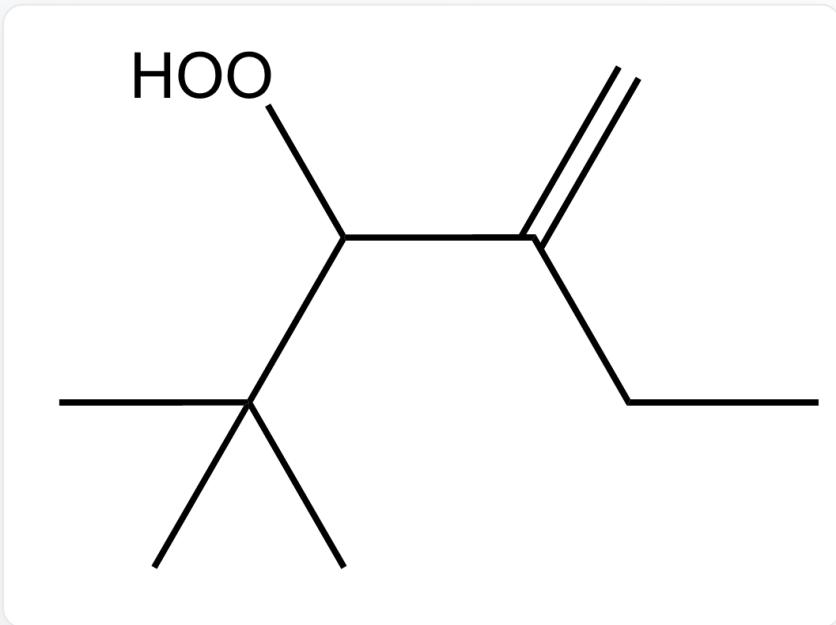  
C.  
CC(C)(C)C(OO)C(CC)=C,Product 1

Product 1

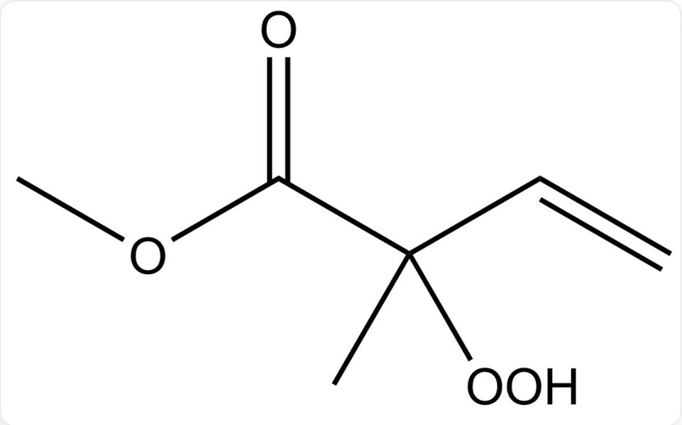  
D.

$\mathrm{O = C(C(C)(OO)C = C)OC,Product2}$

Product 2

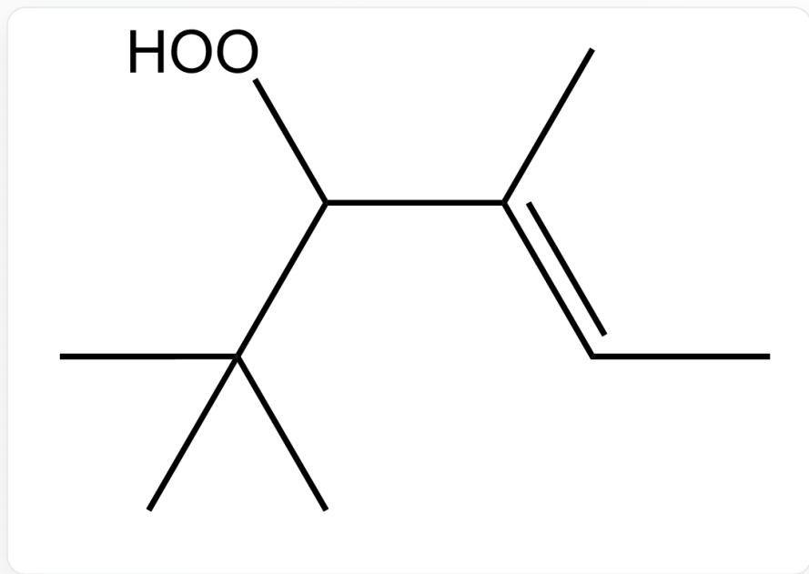

CC(C)(C)C(OO)/C(C)=C/C,Product 1

Product 1

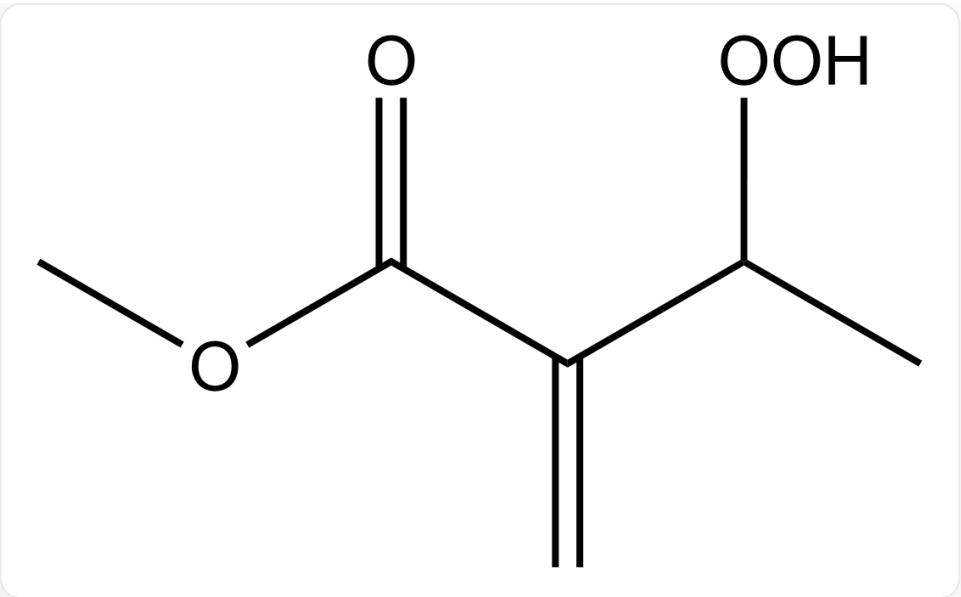  
$\mathrm{O = C(C(C(OO)C) = C)OC,Product2}$

Product 2

  
E.  
CC(C)(C)C(OO)/C(C)=C/C,Product 1

Product 1

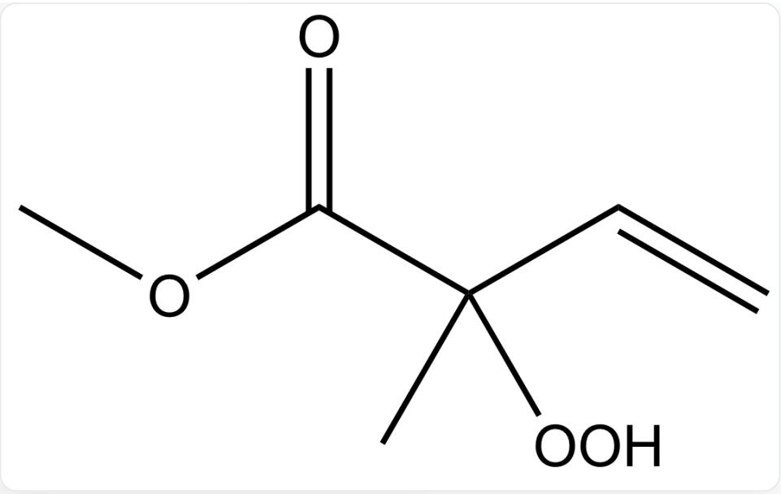  
F.

$\mathrm{O = C(C(C)(OO)C = C)OC,Product2}$

Product 2

CC(C)(C)C(OO)/C(C)=C\C,Product 1

Product 1

  
$\mathrm{O = C(C(C(OO)C) = C)OC,Product2}$

Product 2

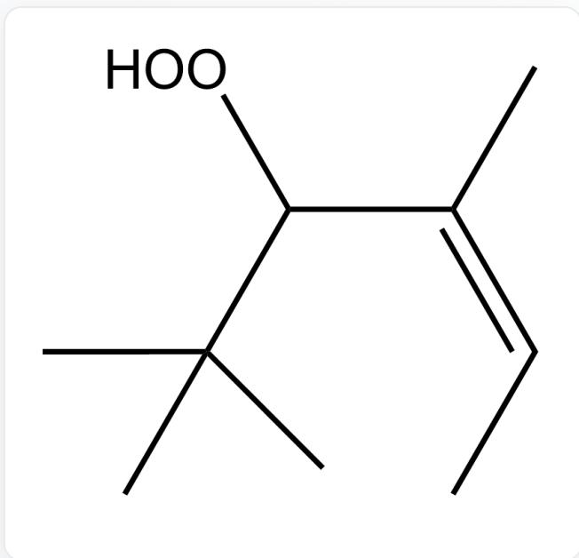  
G.  
CC(C)(C)C(OO)/C(C)=C\C,Product 1

Product 1

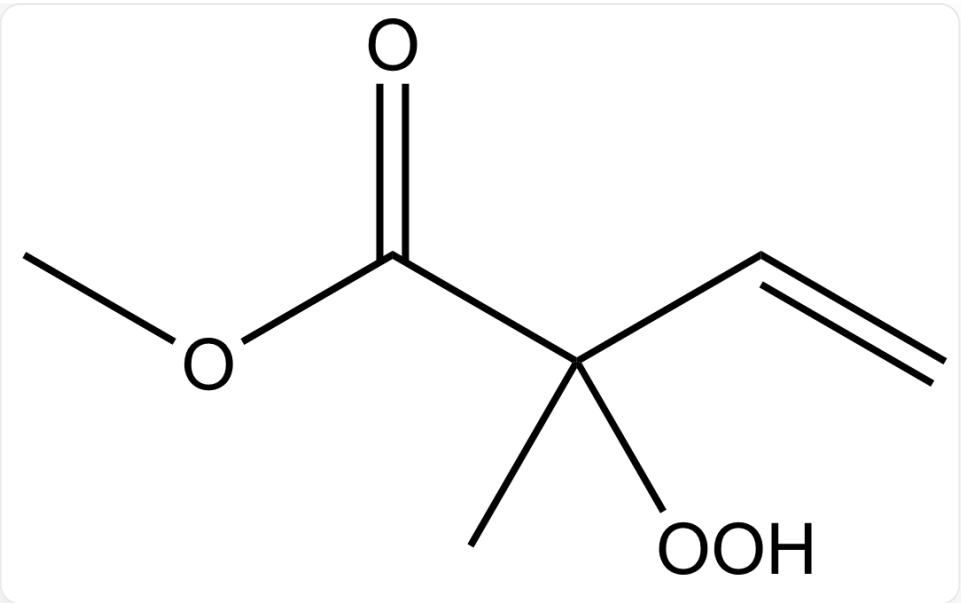

$\mathrm{O = C(C(C)(OO)C = C)OC,Product2}$

Product 2

# Answer

Correct Answer: B

# Detailed Explanation

For reaction 1, the two transition states are shown below

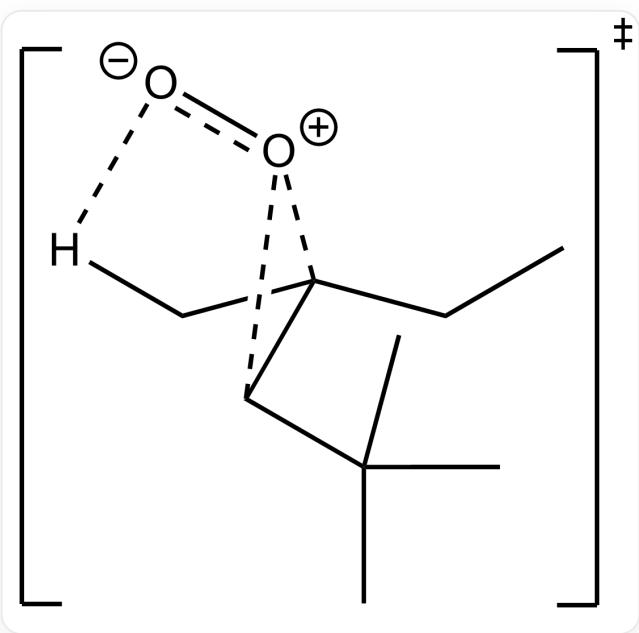

[ \mathrm{[O - ][O + ]1C(C(C)(C)C)C1(C[H])CC} ]

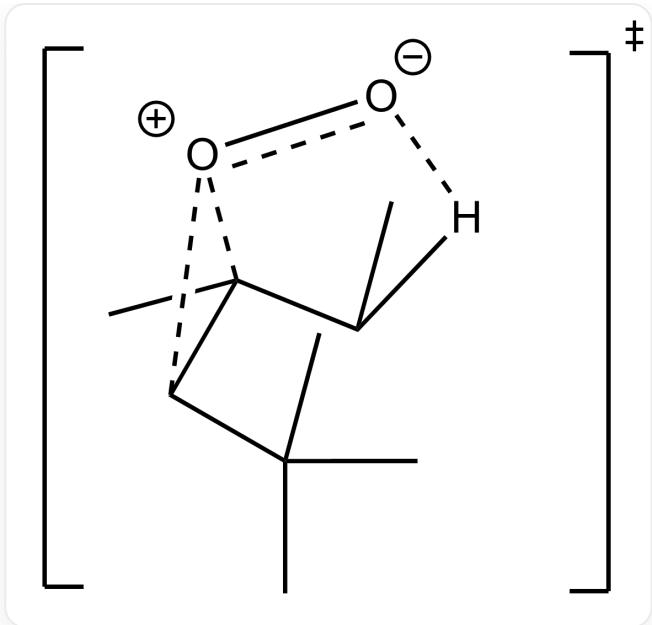  
[ \mathrm{[O - ][O + ]1C(C(C)(C)C)C1(C[H])CC} ]

In both transition states, there is only one set of  $O - H$  interactions.

# CHECKPOINT

1 PTS

In both transition states, there is only one set of  $O - H$  interactions

However, the upward-facing methyl group of the tert-butyl group will experience repulsion with the oxygen, further increasing the transition state energy.

# CHECKPOINT

1 PTS

However, the upward-facing methyl group of the tert-butyl group will experience repulsion with the oxygen

For reaction 2,

Attacking the hydrogen adjacent to the carbonyl group, the carbonyl can stabilize the transition state through conjugation, thus yielding the conjugated product.

# CHECKPOINT

1 PTS

Attacking the hydrogen adjacent to the carbonyl group, the carbonyl can stabilize the transition state through conjugation, thus yielding the conjugated product