# 题目

忽略立体化学，请分别预测单线态氧  ${}^{1}\mathrm{O}_{2}$  与以下两种底物反应的主产物

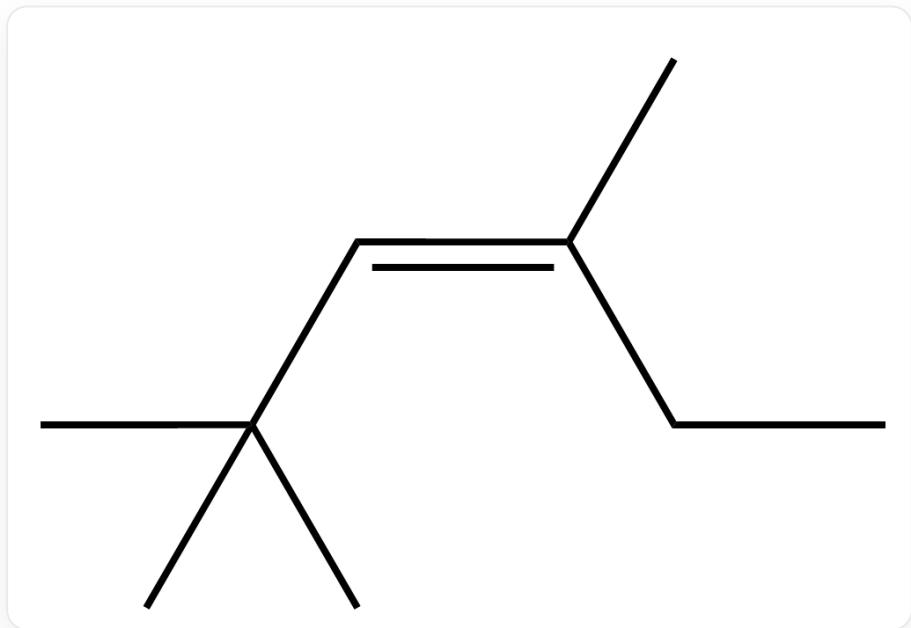  
C/C(CC)=C/C(C)(C)C,底物1

底物1

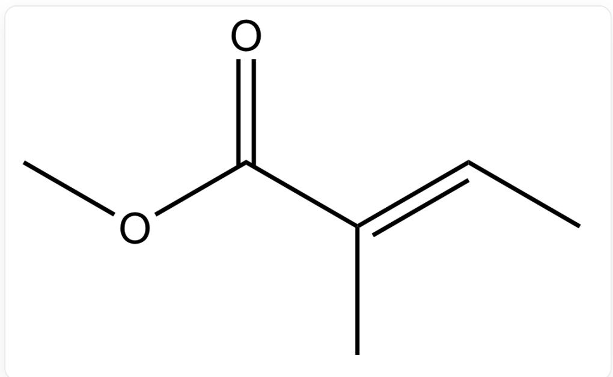  
$\mathrm{O} = \mathrm{C} / \mathrm{C}(\mathrm{C}) = \mathrm{C} / \mathrm{C})\mathrm{OC}$  ，底物2

# 底物2

A. 其他选项均不正确

B.

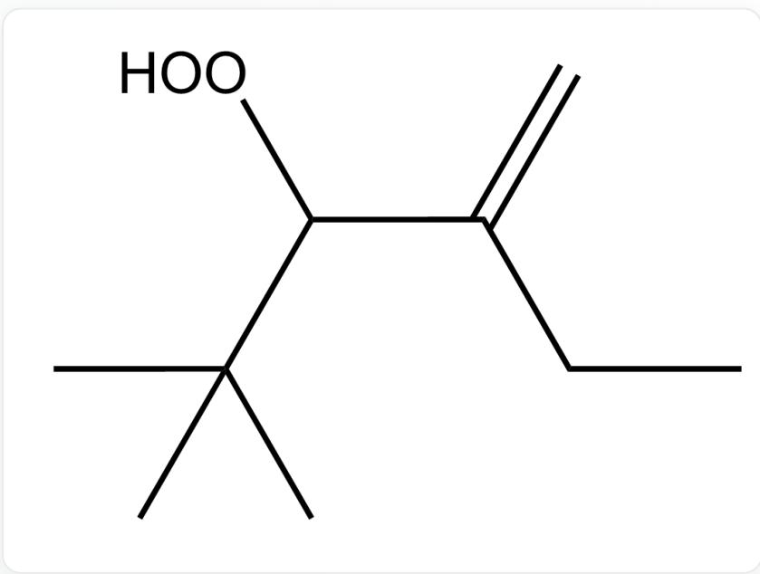  
CC(C)(C)C(OO)C(CC)=C,产物1

产物1

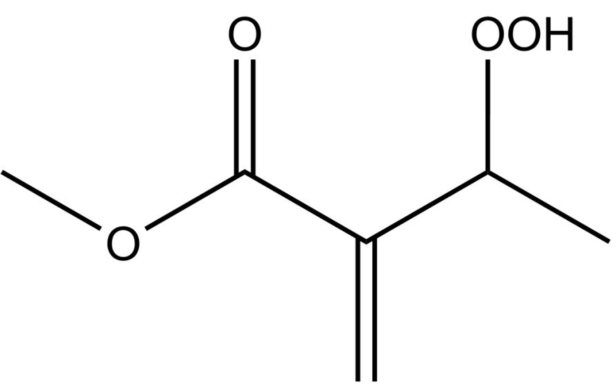  
$O = C(C(C(OO)C) = C)OC$  ，产物2

产物2

C.  
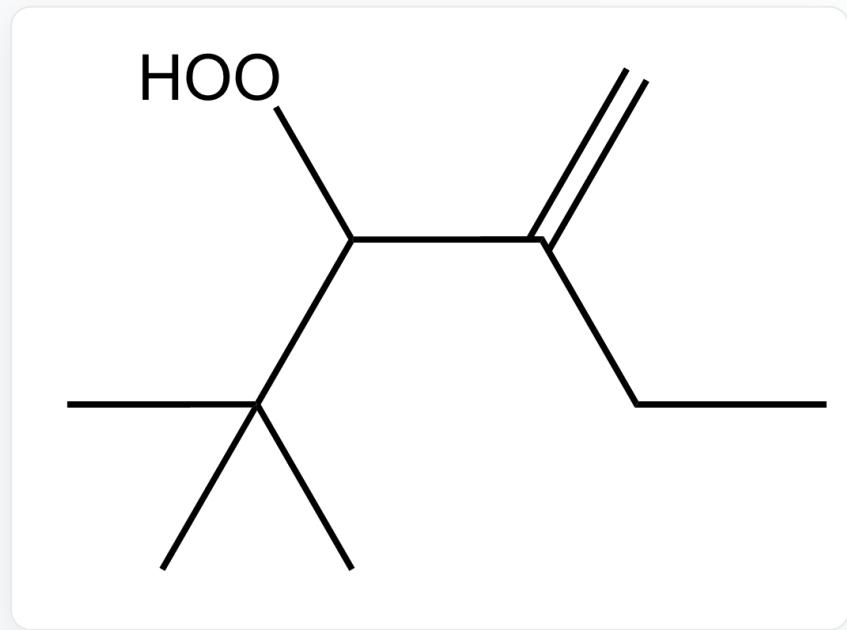  
CC(C)(C)C(OO)C(CC)=C,产物1

产物1  
产物2  
D.  
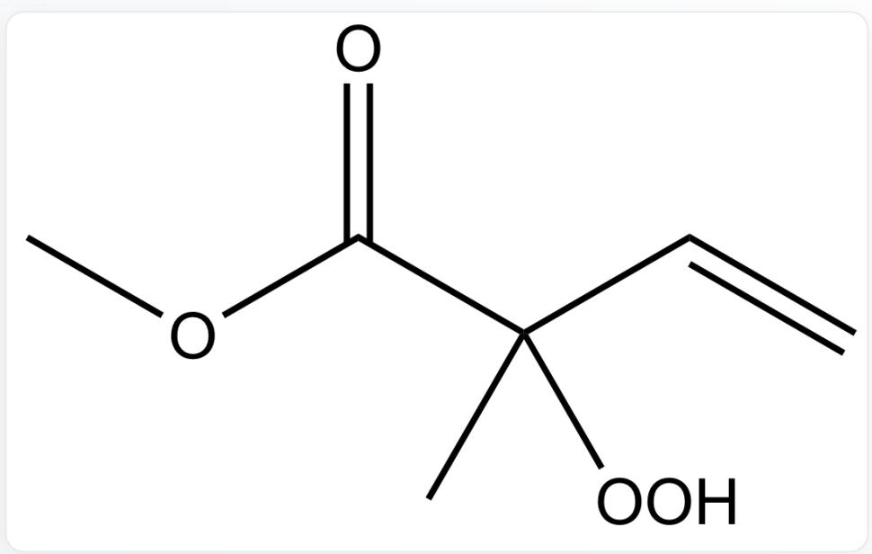  
$\mathrm{O = C(C(C)(OO)C = C)OC}$  ，产物2

CC(C)(C)C(OO)/C(C)=C/C,产物1

产物1

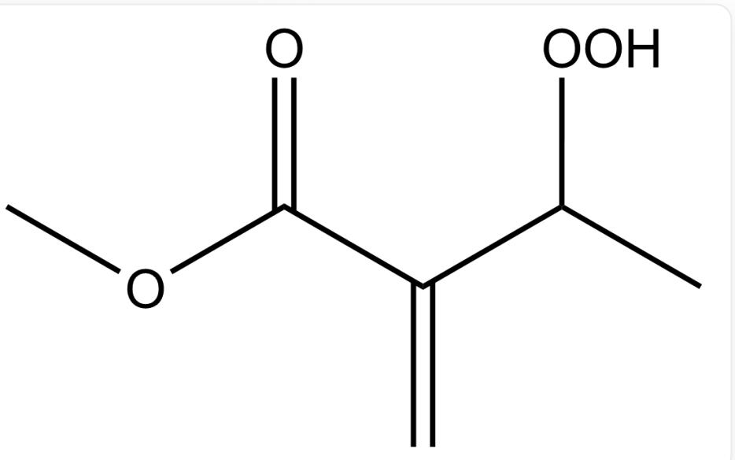

$\mathrm{O = C(C(C(OO)C) = C)OC}$  ，产物2

产物2

E.

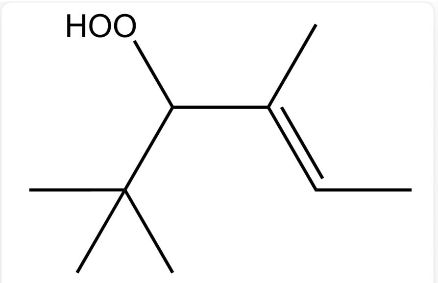

CC(C)(C)C(OO)/C(C)=C/C,产物1

产物1

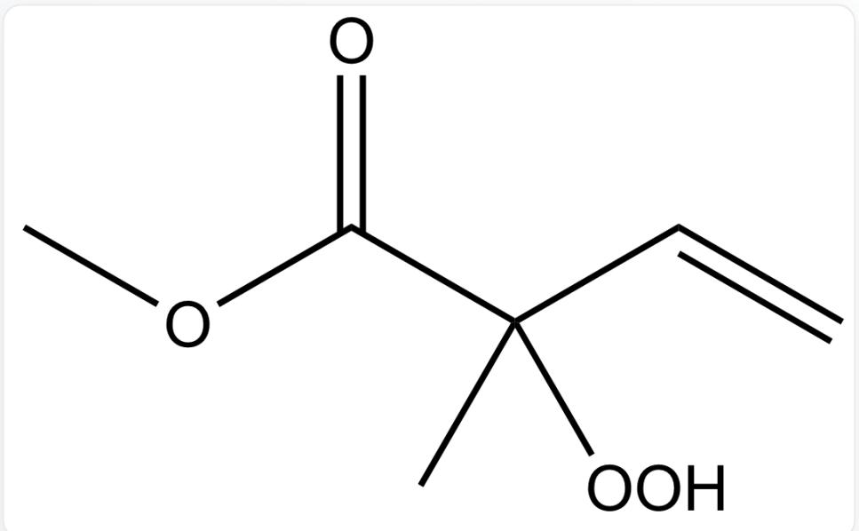

$\mathrm{O} = \mathrm{C}(\mathrm{C}(\mathrm{C})(\mathrm{OO})\mathrm{C} = \mathrm{C})\mathrm{OC}$  ，产物2

产物2

F.

  
CC(C)(C)C(OO)/C(C)=C\C,产物1

产物1

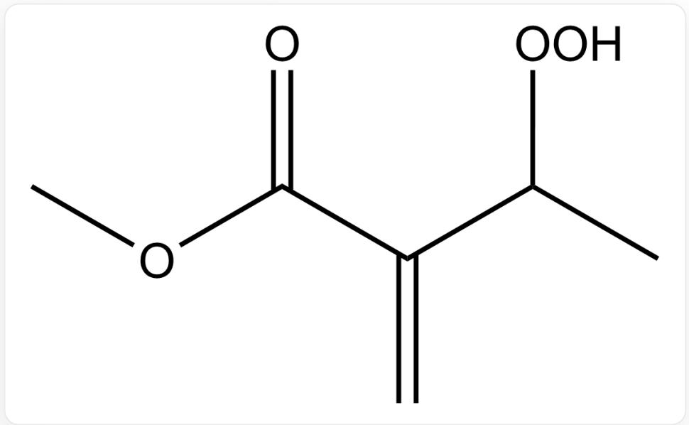  
$O = C(C(C(OO)C) = C)OC$  ，产物2

产物2

G.

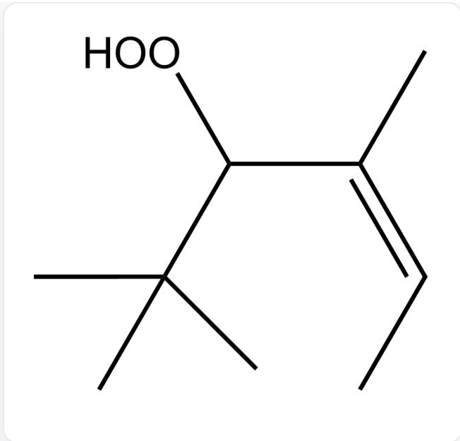  
CC(C)(C)C(OO)/C(C)=C\C,产物1

产物1

  
$\mathrm{O} = \mathrm{C}(\mathrm{C}(\mathrm{C})(\mathrm{OO})\mathrm{C} = \mathrm{C})\mathrm{OC}$  ，产物2

产物2

# 答案

正确答案: B

# 详细解析

对于反应1来说，两种过渡态如下图所示

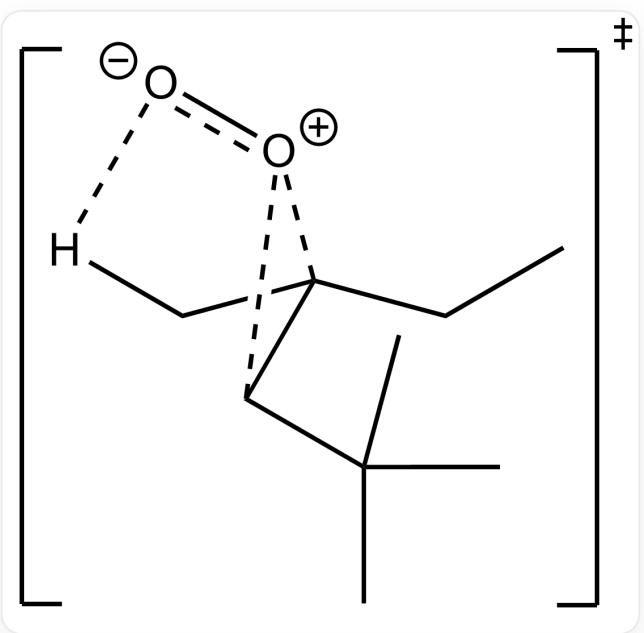

[ \mathrm{[O - ][O + ]1C(C(C)(C)C)C1(C[H])CC} ]

  
[ \mathrm{[O - ][O + ]1C(C(C)(C)C)C1(C[H])CC} ]

两种过渡态中均只存在一组  $O - H$  相互作用

# CHECKPOINT

1 PTS

两种过渡态中均只存在一组  $O - H$  相互作用

但是叔丁基朝上的甲基会与氧发生排斥，进一步提高过渡态能量

# CHECKPOINT

1 PTS

但是叔丁基朝上的甲基会与氧发生排斥

对于反应2

进攻羰基邻位的氢,羰基可通过共轭效应稳定过渡态,故得到共轭产物

# CHECKPOINT

1 PTS

进攻羰基邻位的氢,羰基可通过共轭效应稳定过渡态,故得到共轭产物