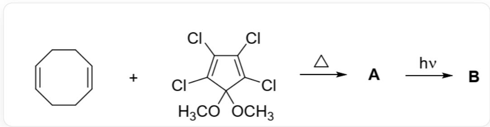
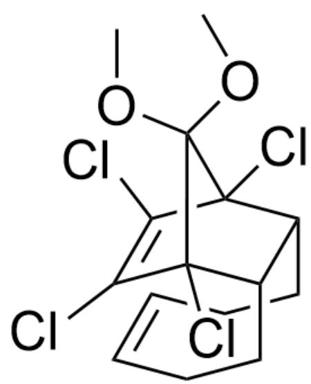
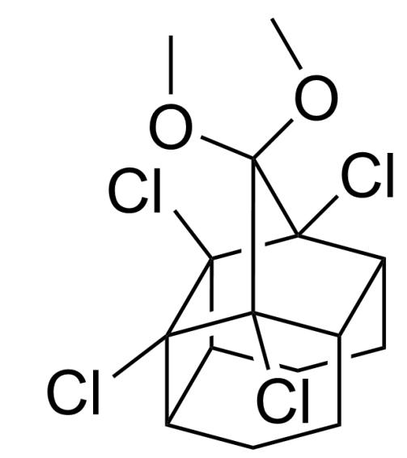

# Question

Deduce the simplified structural formulas of compounds  $\mathbf{A}$  and  $\mathbf{B}$  in the following reaction.

  
Fig. 1, the figure shows two consecutive steps of reaction. The first step is described by SMILES as: CIC1=C(Cl)C(OC)(OC)C(Cl)=C1Cl.C2=C\CC/C=C\CC/2>>[[A]], the reaction condition is heating. The second step is described by SMILES as:  $[[\mathrm{A}]] >> [[\mathrm{B}]]$ , the reaction condition is light irradiation

There are the following statements:

1. Molecule  $\mathbf{A}$  belongs to the  $C_s$  point group  
2. Molecule B belongs to the  $C_{2v}$  point group  
3. Reversing the order of the reaction conditions can also produce the same product in high yield  
4. B contains 6 rings of six members or less

The following options are all correct and have the largest number of correct statements:

A. All other options are incorrect  
B. 1  
C. 2  
D. 3

E. 4  
F. 1,2  
G. 1,3  
H. 1,4  
1. 2,3  
J. 2,4  
K. 3,4  
L. 1,2,3  
M. 1,2,4  
N. 1,3,4  
O. 2,3,4  
P. 1,2,3,4

# Answer

Correct Answer: H

# Detailed Explanation

The first step involves a symmetry-allowed  $[4 + 2]$  cycloaddition reaction under heating conditions, forming the syn-oriented product  $\mathbf{A}$ , the structure of which is shown in Figure 2.

  
Fig. 2, The molecule in the figure is described in SMILES as : COC1(OC)[C@]2(Cl)C(Cl)=C(Cl)[C@]1(Cl) [C@@H]3[C@H]2CC/C=C\CC3

CHECKPOINT

1 PTS

Structure of product A: COC1(OC)[C@]2(Cl)C(Cl)=C(Cl)[C@]1(Cl)[C@@H]3[C@H]2CC/C=C\CC3

The second step involves a symmetry-allowed  $[2 + 2]$  cycloaddition reaction under light irradiation, connecting the two double bonds within the molecule, forming product B, the structure of which is shown in Figure 3.

  
Fig. 3, The molecule in the figure is described in SMILES as : COC(C(Cl)1C2C3CCC4C5CC2) (OC)C3(Cl)C4(C15Cl)Cl

# CHECKPOINT

1 PTS

Structure of product B: COC(C(Cl)1C2C3CCC4C5CC2)(OC)C3(Cl)C4(C15Cl)Cl

Molecules A and B each contain only one mirror plane perpendicular to the two double bonds (or single bonds at the original double bond positions) and parallel to the line formed by the two oxygen atoms, and do not contain a  $C_2$  or higher-order rotation axis, belonging to the  $C_s$  point group; statement 1 is correct, and 2 is incorrect.

# CHECKPOINT

1 PTS

Molecules  $\mathbf{A}$  and  $\mathbf{B}$  each contain only one mirror plane and do not contain a  $C_2$  or higher-order rotation axis, belonging to the  $C_s$  point group

After reversing the reaction sequence, the  $[4 + 2]$  addition reaction is symmetry-forbidden and cannot occur; statement 3 is incorrect.

B contains three six-membered rings, two five-membered rings, and one four-membered ring; statement 4 is correct.

# CHECKPOINT

1 PTS

B contains 6 six-membered or smaller rings