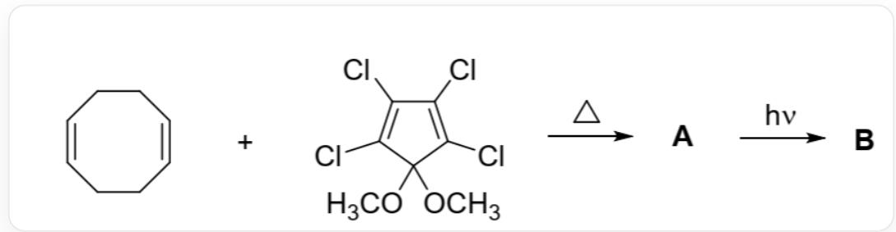
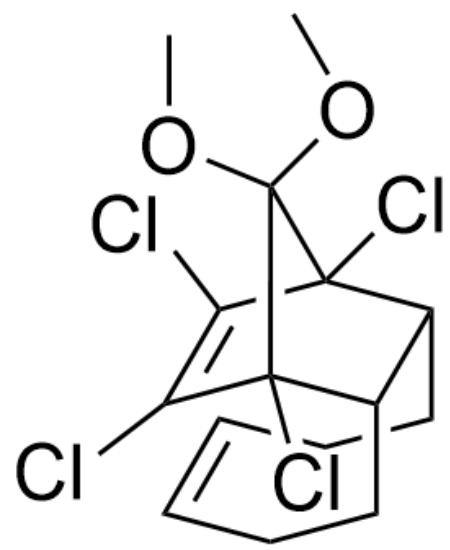
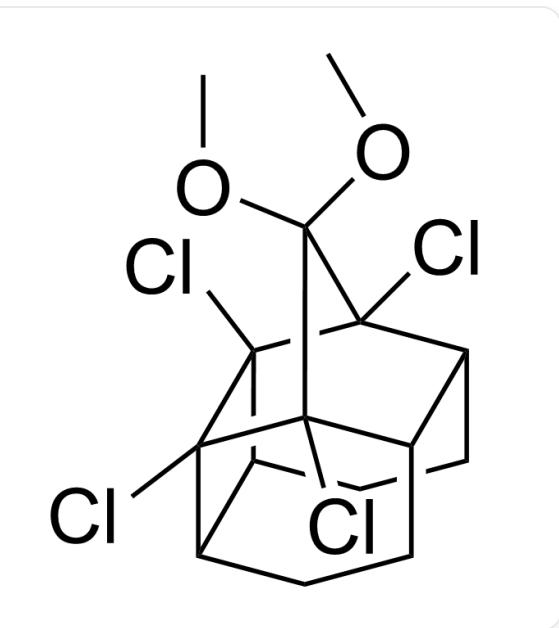

# 题目

推测以下反应中化合物 A、B 的结构简式。

Fig. 1, 图中为连续两步反应。第一步以SMILES描述为: CIC1=C(Cl)C(OC)  
  
(OC)C(Cl)=C1Cl.C2=C\CC/C=C\CC/2>>[[A]], 反应条件为加热。第二步以SMILES描述为：[[A]]>>[[B]], 反  
应条件为光照

有以下说法：

1. A分子属于  $C_s$  点群  
2. B 分子属于  $C_{2v}$  点群  
3. 调换反应条件先后顺序也可以高产率生成同样的产物  
4. B中含有6个六元及以下的环

以下选项说法全部正确且正确说法数量最多的是：

A. 其他选项均不正确  
B. 1  
C. 2  
D. 3

E. 4  
F. 1,2  
G. 1,3  
H. 1,4  
1. 2,3  
J. 2,4  
K. 3,4  
L. 1,2,3  
M. 1,2,4  
N. 1,3,4  
O. 2,3,4  
P. 1,2,3,4

# 答案

正确答案: H

# 详细解析

第一步发生加热条件下对称性符合的  $[4 + 2]$  环加成反应，形成同指向的产物 A，其结构如图2。

  
Fig. 2, 图中分子以SMILES描述为: COC1(OC)[C@]2(Cl)C(Cl)=C(Cl)[C@]1(Cl)[C@@H]3[C@H]2CC/C=C\CC3

# CHECKPOINT

# 1 PTS

产物A结构为：COC1(OC)[C@]2(Cl)C(Cl)=C(Cl)[C@]1(Cl)[C@@H]3[C@H]2CC/C=C\CC3

第二步发生光照条件下对称性符合的  $[2 + 2]$  环加成反应，连接分子内两个双键，形成产物B，其结构如图3。

  
Fig. 3, 图中分子以SMILES描述为: COC(C(Cl)1C2C3CCC4C5CC2)(OC)C3(Cl)C4(C15Cl)Cl

# CHECKPOINT

1 PTS

产物B结构为：COC(C(Cl)1C2C3CCC4C5CC2)(OC)C3(Cl)C4(C15Cl)Cl

分子A和B均只含有一个垂直于两个双键（或原双键位置的单键）、平行于两个氧原子形成的直线的镜面，不含  $C_2$  及以上旋转轴，属于  $C_s$  点群，说法1正确、2错误。

# CHECKPOINT

1 PTS

分子A和B均只含有一个镜面，不含  $C_2$  及以上旋转轴，属于  $C_s$  点群

调换反应顺序后  $[4 + 2]$  加成反应对称性禁阻，无法发生，说法3错误。

B 含有三个六元环, 两个五元环, 一个四元环, 说法4正确。

# CHECKPOINT

1 PTS

B 含有 6 个六元及以下的环