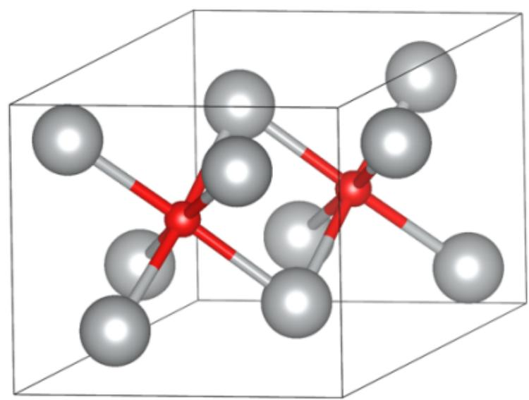

# Question

Adding sodium hydroxide to an aqueous solution of a nitrate  $\mathbf{M}(\mathrm{NO}_3)_\mathrm{x}$  of a certain metal  $\mathbf{M}$  yields a precipitate  $\mathbf{X}$ . Treating  $\mathbf{X}$  and  $\mathbf{M}(\mathrm{NO}_3)_\mathrm{x}$  with a persulfate yields a precipitate  $\mathbf{Y}$ .

Hydrothermal synthesis of  $\mathbf{Y}$  with M element under high pressure yields crystal  $\mathbf{Z}$ .

It is known that  $\mathbf{X}$ ,  $\mathbf{Y}$ , and  $\mathbf{Z}$  are all oxides of the metal  $\mathbf{M}$ , and the mass fraction of oxygen element in substance  $\mathbf{X}$  is  $6.9\%$ ,  $\mathbf{Y}$  is  $12.9\%$ , and  $\mathbf{Z}$  is  $4.7\%$ .

The crystal of  $\mathbf{Z}$  can be approximately regarded as the stacking of different atomic layers in the manner of . . . .AcB  $\square$  AcB  $\square$  . . . . . Where A and B are close-packed layers of M atoms, c is an octahedral interstitial layer filled with some O atoms, and  $\square$  is an empty octahedral interstitial layer.

The coordinates of all O atoms in the unit cell are:

$$
\left(\frac {2}{3}, \frac {1}{3}, \frac {1}{2}\right)
$$

$$
\left(\frac {1}{3}, \frac {2}{3}, \frac {1}{2}\right)
$$

And  $\frac{2}{3}$  of the  $\mathbf{M}$  atoms in the unit cell are located on the unit cell face

Which of the following statements are correct:

1. The occupancy rate of O atoms in the c layer is 1  
2. The occupancy rate of O atoms in the c layer is  $\frac{2}{3}$  
3.The occupancy rate of O atoms in the c layer is  $\frac{1}{3}$  
4. The x, y coordinates of one of the M atoms are  $\left(\frac{2}{3}, \frac{2}{3}\right)$  
5. The x, y coordinates of one of the M atoms are  $\left(\frac{1}{2}, \frac{1}{2}\right)$  
6. The x, y coordinates of one of the M atoms are  $(\frac{1}{3}, \frac{2}{3})$

A. 1,4  
B. 1,5  
C. 1,6  
D. 2,4  
E. 2,5  
F. 2,6  
G. 3,4  
H. 3,5  
1. 3,6  
J. All of the above options are incorrect or the answer is incomplete.

# Answer

Correct Answer: D

# Detailed Explanation

X obtained by precipitating and drying with sodium hydroxide is one of the most common oxides of metal M, which can be expressed as Double subscripts: use braces to clarify, and its mass fraction of oxygen element  $\omega_{\mathrm{O}} = \frac{q \times 16}{p M + q \times 16} = 6.9\%$ .

Assume the chemical formula of  $\mathbf{X}$  to be MO,  $\mathrm{M}_2\mathrm{O}_3$ ,  $\mathrm{MO}_2$ , etc., and substitute them into the equation. Finally, it is found that when it is  $\mathrm{M}_2\mathrm{O}$ , the molar mass of M is 107.9, which is consistent with Ag. Therefore, the metal M is Ag, and  $\mathbf{X}$  is  $\mathrm{Ag}_2\mathrm{O}$ . Substituting the mass fraction, it can be further deduced that Y is AgO, and Z is  $\mathrm{Ag}_3\mathrm{O}$ .

Substitute into the question conditions for verification, which is consistent with the chemical properties of  $\mathrm{Ag}$ .

# CHECKPOINT

3 PTS

X is  $\mathrm{Ag}_2\mathrm{O}$ , Y is  $\mathrm{AgO}$ , Z is  $\mathrm{Ag}_3\mathrm{O}$

There are 2 oxygen atoms in the unit cell, so according to the chemical formula, there are 6 silver atoms, of which layers A and B have three silver atoms respectively. According to the ratio of octahedral voids to the number of atoms in the closest packing being 1:1, 6 silver atoms have a total of 6 octahedral voids. Since the oxygen atom interstitial layer and the void layer are spaced apart, there are 3 octahedral voids in layer c, which are filled with 2 oxygen atoms, so the filling rate is  $\frac{2}{3}$ .

# CHECKPOINT

2 PTS

The filling rate of O atoms in layer  $\mathbf{c}$  is  $\frac{2}{3}$ , option 2 is correct, options 1 and 3 are incorrect

According to  $\frac{2}{3}$  of the M atoms in the unit cell are located on the surface of the unit cell, there are 2 atoms on the surface of the unit cell and 1 atom inside the unit cell in each silver atom close-packed layer. According to the symmetry of the octahedron and the  $C_3$  axis in the z direction through the oxygen atom, it can be deduced that the x and y coordinates of the silver atoms in layer A are  $(\frac{1}{3},0)$ ,  $(0,\frac{1}{3})$ ,  $(\frac{2}{3},\frac{2}{3})$ , and the x and y coordinates of the silver atoms in layer B are  $(\frac{2}{3},0)$ ,  $(0,\frac{2}{3})$ ,  $(\frac{2}{3},\frac{2}{3})$  (layers A and B are interchangeable). The crystal diagram is as follows

Z的晶胞参考图：A层银原子的x·y坐标为  $\left(\frac{1}{3},0\right)\cdot \left(0,\frac{1}{3}\right)\cdot \left(\frac{2}{3},\frac{2}{3}\right);$  c层氧原子的坐标为  $\left(\frac{2}{3},\frac{1}{3},\frac{1}{2}\right)$ $(\frac{1}{3},\frac{2}{3},\frac{1}{2})$  ；B层银原子的x·y坐标为  $\left(\frac{2}{3},0\right)\cdot \left(0,\frac{2}{3}\right)\cdot \left(\frac{2}{3},\frac{2}{3}\right)$

# CHECKPOINT

3 PTS

The possible x and y coordinates of silver atoms are  $(\frac{1}{3},0)$ ,  $(0,\frac{1}{3})$ ,  $(\frac{2}{3},\frac{2}{3})$ ,  $(\frac{2}{3},0)$ ,  $(0,\frac{2}{3})$ ,  $(\frac{2}{3},\frac{2}{3})$ , so option 4 is correct, options 5 and 6 are incorrect

In summary, the answer is D

# CHECKPOINT

1 PTS

The answer is D