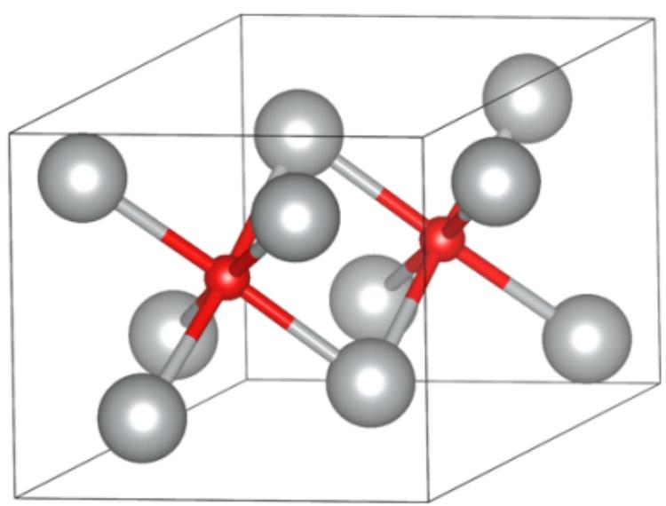

# 题目

将氢氧化钠加入某金属  $\mathbf{M}$  的硝酸盐  $\mathrm{M}(\mathrm{NO}_3)_\mathrm{x}$  的水溶液中可得到沉淀  $\mathbf{X}$  。若将  $\mathbf{X}$  和  $\mathrm{M}(\mathrm{NO}_3)_\mathrm{x}$  用过二硫酸盐处理则可得到沉淀  $\mathbf{Y}$  。

将  $\mathbf{Y}$  在高压下与M单质水热合成则可得到结晶Z。

已知  $\mathbf{X} 、 \mathbf{Y} 、 \mathbf{Z}$  皆为金属  $\mathbf{M}$  的氧化物，且物质  $\mathbf{X}$  的氧元素质量分数为  $6.9\%$  ， $\mathbf{Y}$  为  $12.9\%$  ， $\mathbf{Z}$  为  $4.7\%$

Z 的晶体可以近似看作不同原子层按照……AcB □ AcB □……的方式堆积。其中 A、B 为 M 原子的密堆积层，c 为填充有部分 O 原子的八面体空隙层，□为空的八面体空隙层。

晶胞中所有O原子的坐标为：

$\left(\frac{2}{3}, \frac{1}{3}, \frac{1}{2}\right)$

$\left(\frac{1}{3}, \frac{2}{3}, \frac{1}{2}\right)$

且晶胞内  $\frac{2}{3}$  的  $\mathbf{M}$  原子位于晶胞面上

下列说法正确的有：

1.0 原子在 c 层中的填隙率为 1  
2.0 原子在 c 层中的填隙率为  $\frac{2}{3}$  
3.0 原子在 c 层中的填隙率为  $\frac{1}{3}$  
4.其中一个  $\mathbf{M}$  原子的x、y坐标为  $(\frac{2}{3},\frac{2}{3})$  
5.其中一个  $\mathbf{M}$  原子的x、y坐标为  $(\frac{1}{2},\frac{1}{2})$  
6.其中一个  $\mathbf{M}$  原子的x、y坐标为  $(\frac{1}{3},\frac{2}{3})$

A. 1,4  
B. 1,5  
C. 1,6  
D. 2,4  
E. 2,5  
F. 2,6  
G. 3,4  
H. 3,5  
1. 3,6  
J. 以上选项均不正确或答案不完全

# 答案

正确答案: D

# 详细解析

由氢氧化钠沉淀并干燥得到的X是金属M的一种最常见氧化物，可表示为Double subscripts:usebracestoclarify，其氧元素质量分数  $\omega_{\mathrm{O}} = \frac{q\times 16}{pM + q\times 16} = 6.9\%$

依次假设  $\mathbf{X}$  的化学式为  $\mathrm{MO}$  、  $\mathrm{M}_2\mathrm{O}_3$  、  $\mathrm{MO}_2$  等，代入方程最终解得当为  $\mathrm{M}_2\mathrm{O}$  时， $\mathbf{M}$  的摩尔质量为107.9，与  $\mathrm{Ag}$  符合，因此金属  $\mathbf{M}$  是  $\mathrm{Ag}$ ， $\mathbf{X}$  是  $\mathrm{Ag}_2\mathrm{O}$  。代入质量分数可进一步推出  $\mathbf{Y}$  是  $\mathrm{AgO}$ ， $\mathbf{Z}$  是  $\mathrm{Ag}_3\mathrm{O}$ 。

代入题目条件检验，符合  $\mathrm{Ag}$  的化学性质。

# CHECKPOINT

3 PTS

X是  $\mathrm{Ag}_2\mathrm{O}$  ,Y是  $\mathrm{AgO}$  ,Z是  $\mathrm{Ag}_3\mathrm{O}$

晶胞内有2个氧原子，则根据化学式有6个银原子，其中A、B层分别有三个银原子。根据最密堆积中八面体空隙与原子数之比为1:1，则6个银原子共有6个八面体空隙。由于氧原子填隙层与空隙层相互间隔，因此在c层中有3个八面体空隙，填充了2个氧原子，因此填隙率为  $\frac{2}{3}$  。

# CHECKPOINT

2 PTS

O原子在c层中的填隙率为  $\frac{2}{3}$ , 选项2正确, 选项1、3错误

根据晶胞内  $\frac{2}{3}$  的 M 原子位于晶胞面上，则每个银原子密置层中有 2 个原子位于晶胞面上，1 个位于晶胞内部。根据八面体的对称性，以及通过氧原子的 z 方向的 C 轴，则可推出 A 层银原子的 x、y 坐标为  $(\frac{1}{3}, 0)$ 、 $(0, \frac{1}{3})$ 、 $(\frac{2}{3}, \frac{2}{3})$ ，B 层银原子的 x、y 坐标为  $(\frac{2}{3}, 0)$ 、 $(0, \frac{2}{3})$ 、 $(\frac{2}{3}, \frac{2}{3})$ （A、B 层可互换）。晶体图如下

  
Z的晶胞参考图：A层银原子的x、y坐标为  $(\frac{1}{3},0)$  、  $(0,\frac{1}{3})$  、  $(\frac{2}{3},\frac{2}{3})$  ；c层氧原子的坐标为  $(\frac{2}{3},\frac{1}{3},\frac{1}{2})$  、  $(\frac{1}{3},\frac{2}{3},\frac{1}{2})$  ；B层银原子的x、y坐标为  $(\frac{2}{3},0)$  、  $(0,\frac{2}{3})$  、  $(\frac{2}{3},\frac{2}{3})$

# CHECKPOINT

3 PTS

银原子可能的x、y坐标为  $(\frac{1}{3},0)$  、  $(0,\frac{1}{3})$  、  $(\frac{2}{3},\frac{2}{3})$  、  $(\frac{2}{3},0)$  、  $(0,\frac{2}{3})$  、  $(\frac{2}{3},\frac{2}{3})$  ，因此选项4正确，选项5、6错误

综上，答案为D

# CHECKPOINT

1 PTS

答案为D