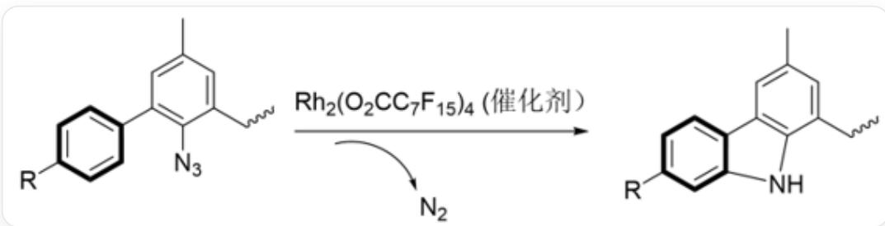

# Question

The linear free energy relationship is an empirical relationship in physical organic chemistry used to describe the variation of reaction rate constants or equilibrium constants with changes in substituent structure. The classical linear free energy relationship model is described by the Hammett equation:  $\lg (k_{\mathrm{R}} / k_{\mathrm{H}}) = \rho \sigma$

Here,  $k_{\mathrm{R}} / k_{\mathrm{H}}$  represents the ratio of the reaction rate constants for compounds with substituent R and without any substituent.

Researchers established the  $\sigma^{+}$  scale for different substituents R by studying the  $\mathrm{S_N1}$  reactions of para-substituted benzyldimethylchloromethanes. They further investigated the mechanism of reaction 1 catalyzed by  $\mathrm{Rh_2(II)}$  complexes using the  $\sigma^{+}$  scale. The  $\sigma^{+}$  values for different substituents R and their relative reaction rates in a specific reaction are shown in the table below. Which of the following statements are correct?

  
CCC1=CC(C)=CC(C2=CC=C([R])C=C2)=C1N loses a molecule of nitrogen gas under the catalysis of Rh catalyst to yield CCC1=CC(C)=CC2=C1NC3=CC([R])=CC=C23

<table><tr><td>R</td><td>OCH3</td><td>CH3</td><td>F</td><td>H</td><td>Cl</td><td>CF3</td></tr><tr><td>σ+</td><td>-0.78</td><td>-0.31</td><td>-0.07</td><td>0</td><td>0.11</td><td>0.61</td></tr><tr><td>kR/kH</td><td>85/15</td><td>70/30</td><td>58/42</td><td>1</td><td>47/53</td><td>27/73</td></tr></table>

A.  $\rho = -0.87$ , the reaction is an electrophilic aromatic reaction

B.  $\rho = +0.87$ , this reaction is an electrophilic aromatic substitution reaction.  
C.  $\rho = 0.87$ , this reaction is not an aromatic electrophilic reaction  
D.  $\rho = -2.0$ , this reaction is an electrophilic aromatic reaction  
E.  $\rho = -2.0$ , this reaction is not an aromatic electrophilic reaction  
F. The determination of rate constant ratios for different substituents in this reaction can only be achieved by accurately measuring the rates of substrate consumption with different substituents and then taking the ratio.  
G. None of the above statements are correct  
H. At least two of the above statements are correct  
I. Electron-donating substituents slow down the reaction.

# Answer

Correct Answer: G

# Detailed Explanation

Fitting  $\lg \left(k_{\mathrm{R}} / k_{\mathrm{H}}\right)$  against  $\sigma^{+}$  yields  $\rho = -0.87$

# CHECKPOINT

2 PTS

$$
\rho = - 0. 8 7
$$

Electron-donating substituents accelerate the reaction, but  $\rho = -0.87$  is smaller than  $-1$ , thus this reaction cannot be an aromatic electrophilic substitution. If it were an aromatic electrophilic substitution, the rate enhancement by electron-donating groups would be greater than that in benzylic reactions.

# CHECKPOINT

1 PTS

$\rho = -0.87$  is smaller than  $-1$ , thus this reaction cannot be an aromatic electrophilic substitution

Note that the phenyl group in this reaction can be substituted on both sides. Therefore, connecting two different substituents to each side of the benzene ring conveniently provides the rate ratio between the two substituents, which is far more reliable than directly measuring substrate consumption rates. F is incorrect.

# CHECKPOINT

1 PTS

The phenyl group can be substituted on both sides, thus connecting two different substituents to each side of the benzene ring conveniently provides the rate ratio between the two substituents