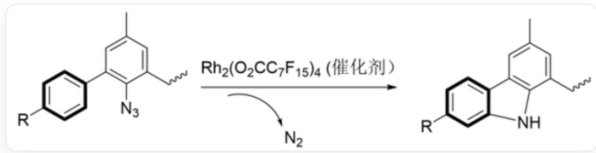

# 题目

线性自由能关系是物理有机化学中用来描述反应速率常数或平衡常数随取代基结构变化的经验关系。经典的线性自由能关系模型由哈米特方程描述：  $\lg (k_{\mathrm{R}} / k_{\mathrm{H}}) = \rho \sigma$

其中  $k_{\mathrm{R}} / k_{\mathrm{H}}$  表示含取代基R和不含取代基的化合物反应速率常数之比。

研究人员通过不同对位取代的苯基二甲基氯代甲烷的  $\mathrm{S_N1}$  反应，建立了不同取代基R的  $\sigma^{+}$  标度；并利用  $\sigma^{+}$  标度对  $\mathrm{Rh_2(II)}$  配合物催化的反应1的机理进行研究，不同取代基R的  $\sigma^{+}$  标度和在某反应中的相对反应速率如下表所示。下面的说法中哪些是正确的？

  
$\mathrm{CC} \mathrm{C} 1 = \mathrm{CC} (\mathrm{C}) = \mathrm{CC} (\mathrm{C} 2 = \mathrm{CC} = \mathrm{C} ([ \mathrm{R} ]) \mathrm{C} = \mathrm{C} 2) = \mathrm{C} 1 \mathrm{~N}$  在Rh催化剂的催化下失去一分子氮气，得到 CCC1=CC(C)=CC2=C1NC3=CC([R])=CC=C23

<table><tr><td>R</td><td>OCH3</td><td>CH3</td><td>F</td><td>H</td><td>Cl</td><td>CF3</td></tr><tr><td>σ+</td><td>-0.78</td><td>-0.31</td><td>-0.07</td><td>0</td><td>0.11</td><td>0.61</td></tr><tr><td>kR/kH</td><td>85/15</td><td>70/30</td><td>58/42</td><td>1</td><td>47/53</td><td>27/73</td></tr></table>

A.  $\rho = -0.87$ , 该反应是芳香亲电反应  
B.  $\rho = +0.87$ , 该反应是芳香亲电反应  
C.  $\rho = 0.87$ , 该反应不是芳香亲电反应

D.  $\rho = -2.0$ , 该反应是芳香亲电反应  
E.  $\rho = -2.0$ , 该反应不是芳香亲电反应  
F. 该反应的不同取代基的速率常数比值的测定只能通过准确测定不同取代基下底物消耗的速率做比来得到  
G. 以上说法均不正确  
H. 以上说法至少有两项是正确的

1. 富电子的取代基会让反应变慢

# 答案

正确答案: G

# 详细解析

用  $\lg (k_{\mathrm{R}} / k_{\mathrm{H}})$  对  $\sigma^{+}$  进行拟合，得到  $\rho = -0.87$

# CHECKPOINT

2 PTS

$$
\rho = - 0. 8 7
$$

富电子的取代基会让反应变快，但是  $\rho = -0.87$

比-1小，因此该反应不可能是芳香亲电取代反应。因为如果该反应是芳香亲电取代反应，给电子基团对反应速率的加快会比卞位反应更大。

# CHECKPOINT

1 PTS

$\rho = -0.87$  比  $-1$  小，因此该反应不可能是芳香亲电取代反应

注意到，该反应的苯基两侧均可以连接取代基，因此在两侧连接两种取代基不同的苯环即可方便地得到两种取代基的速率之比，比直接测底物消耗速率要可靠很多。F错误。

# CHECKPOINT

1 PTS

反应的苯基两侧均可以连接取代基，因此在两侧连接两种取代基不同的苯环即可方便地得到两种取代基的速率之比