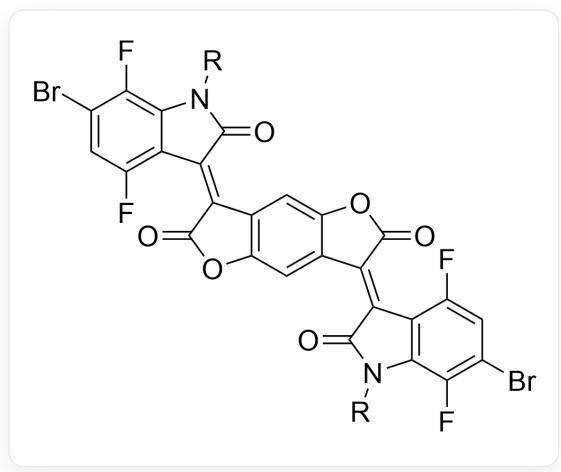
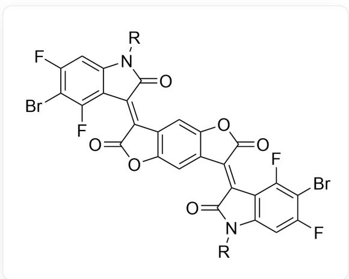
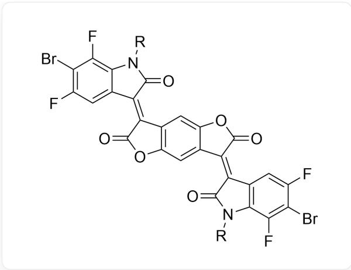
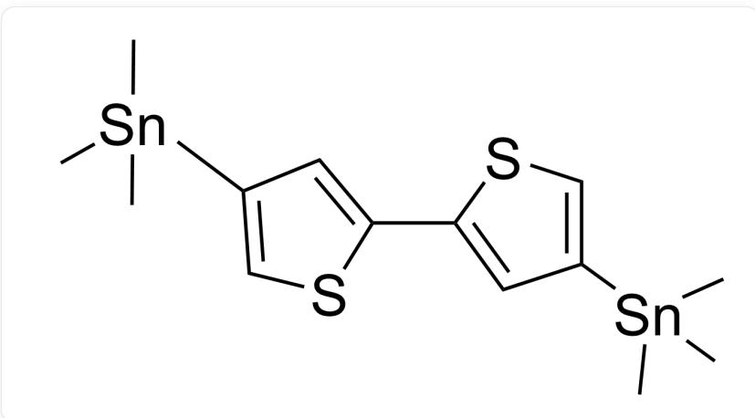
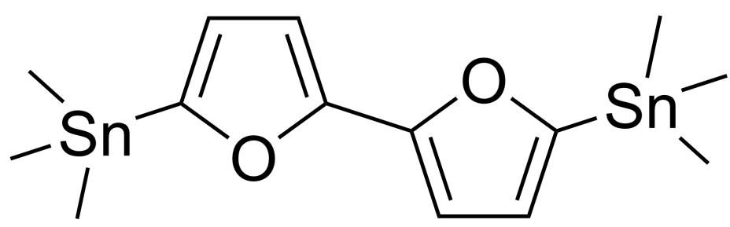
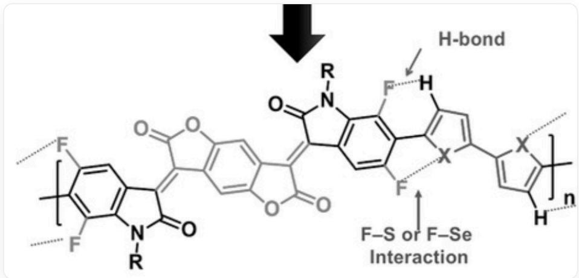

# Question

The block copolymer  $\mathbf{X}$  is synthesized through the polymerization of two monomers, A and B, via the following reaction:

$$
\mathbf {A} + \mathbf {B} \xrightarrow [ t o l u e n e, 9 0 ^ {\circ} \mathrm {C} ]{P d (P P h _ {3}) _ {2} C l _ {2}} \mathbf {X}
$$

X exhibits strong intermolecular  $\pi-\pi$  stacking interactions due to non-covalent interactions between the blocks, which lock the molecular conformation and promote coplanarity of the entire conjugated system. Below are several monomer options, each containing two monomers. Please select the monomer pair most likely to achieve conformational locking:

# Monomer 1

  
BrC1=CC(F)=C2C(N([R])C(/C2=C3C4=C(OC\3=O)C=C5C(OC(/C5=C6C7=C(N([R])C\6=O)C(F)=C(Br)C=C7F)=O)=C4)=O)=C1F

# Monomer 2

  
FC1=C(Br)C(F)=C2C(N([R])C(/C2=C3C4=C(OC\3=O)C=C5C(OC(/C5=C6C7=C(N([R])C\6=O)C=C(F)C(Br)=C7F)=O)=C4)=O)=C1

# Monomer 3

  
BrC1=C(F)C=C2C(N([R])C(/C2=C3C4=C(OC\3=O)C=C5C(OC(/C5=C6C7=C(N([R]))C\6=O)C(F)=C(Br)C(F)=C7)=O)=C4)=O=C1F

# Monomer 4

  
FC1=C(Br)C=C2C(N([R])C/(C2=C3C4=C(OC\3=O)C=C5C(OC/(C5=C6C7=C(N([R])C\6=O)C(F)=C(F)C(Br)=C7)=O)=C4)=O)=C1F

# Monomer 5

  
C[Sn](C)(C)C1=CSC(C2=CC([Sn](C)(C)C)=CS2)=C1

# Monomer 6

  
C[Sn](C)(C1=CC=C(S1)C2=CC=C([Sn](C)(C)C)S2)C

Monomer 7

  
C[Sn](C)(C1=COC(C2=CC([Sn](C)(C)C)=CO2)=C1)C

Monomer 8

  
C[Sn](C)(C1=CC=C(O1)C2=CC=C([Sn](C)(C)O2)C

A. Monomer 1 + Monomer 5  
B. Monomer 1 + Monomer 6

C. Monomer 1 + Monomer 7  
D. Monomer 1 + Monomer 8  
E. Monomer 2 + Monomer 5  
F. Monomer 2 + monomer 6  
G. Monomer 2 + Monomer 7  
H. Monomer 2 + Monomer 8  
Monomer 3 + Monomer 5  
J. Monomer 3 + Monomer 6  
K. Monomer 3 + Monomer 7  
L. Monomer 3 + Monomer 8  
M. Monomer 4 + Monomer 5  
N. Monomer 4 + Monomer 6  
O. Monomer 4 + Monomer 7  
P. Monomer 4 + Monomer 8

# Answer

Correct Answer: J

# Detailed Explanation

  
FC1=CC/(C(C(N2[R])=O)=C3C4=CC5=C(/C(C(O5)=O)=C6C7=C(N([R])C/6=O)C(F)=C(C(F)=C7)C=C4OC/3=O)=C2C(F)=C1C8=CC=C(C9=CC(C)=C[S,Se]  
[S,Se]8 The image shows the block copolymer formed by monomer 3 and monomer 6, with arrows indicating the hydrogen bonds formed between the F atoms in monomer 3 and the H atoms in monomer 6, as well as the interactions between the F atoms in monomer 3 and the S atoms in monomer 6.

The two monomers in the question form a block polymer through the Stille coupling reaction.

# CHECKPOINT

1 PTS

The two monomers form a block polymer through the Stille coupling reaction.

The intramolecular interactions that achieve molecular conformational locking in this question include H-F hydrogen bonds and S-F non-covalent interactions.

# CHECKPOINT

1 PTS

The intramolecular interactions that achieve molecular conformational locking include H-F hydrogen bonds and S-F non-covalent interactions.

Since the electron cloud of sulfur is more diffuse and its electronegativity is lower than that of oxygen, the S-F interaction in the molecule is stronger than the O-F interaction. Therefore, using thiophene-containing monomers results in stronger intramolecular interactions.

# CHECKPOINT

1 PTS

The S-F interaction is stronger than the O-F interaction, so thiophene-containing monomers are used.

By analyzing the coupled molecular structure, it can be observed that only when both F atoms are in the ortho position to Br and the  $SnMe_3-$  group is at the 2-position of the thiophene can both H-F hydrogen bonds and S-F non-covalent interactions be simultaneously generated.

# CHECKPOINT

2 PTS

Both F atoms must be in the ortho position to Br, and the  $S n M e_{3}-$  group must be at the 2-position of the thiophene.

At this point, the remaining candidate combinations are monomer 2 + monomer 6 and monomer 3 + monomer 6.

Finally, considering the repulsion between the F atom and the carbonyl group in monomer 2, the optimal combination for maintaining the planar molecular conformation is monomer 3 + monomer 6.

# CHECKPOINT

1 PTS

The optimal combination for maintaining the planar molecular conformation is monomer 3 + monomer 6.