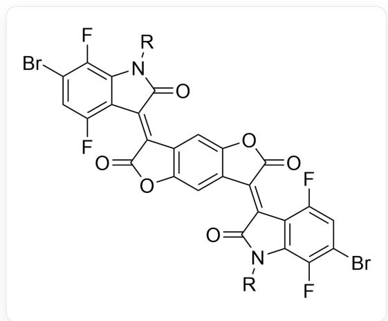
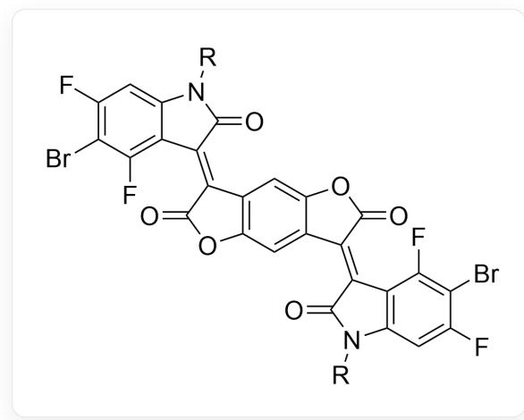
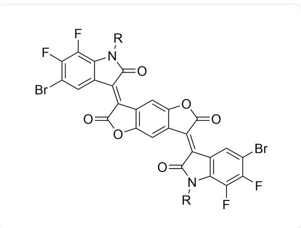
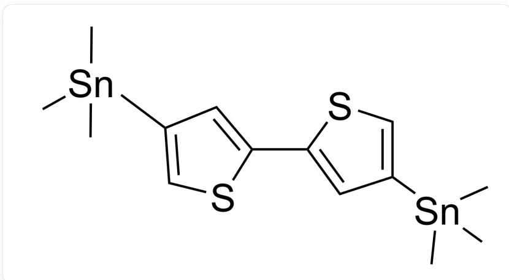
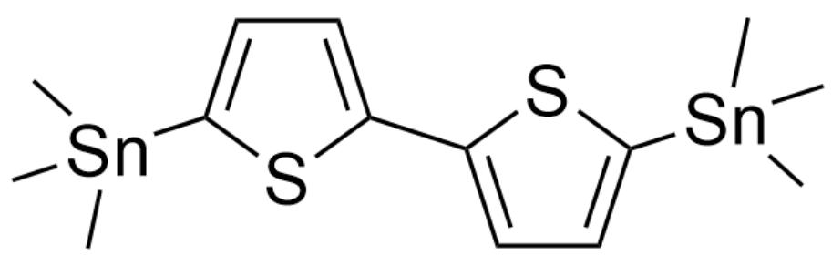
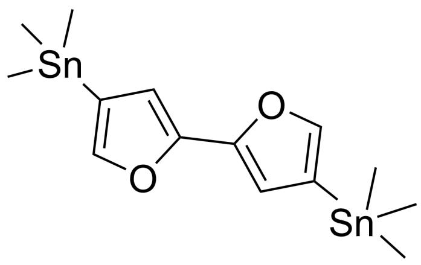
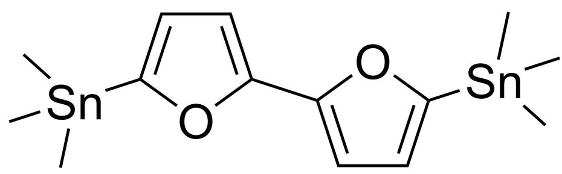
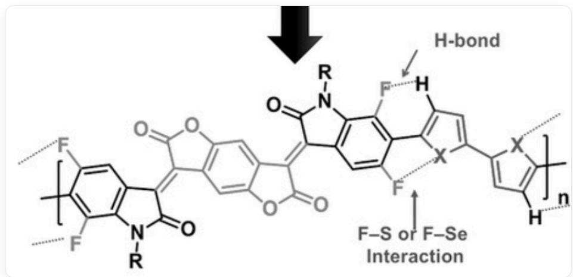

# 题目

嵌段共聚物X由两种单体A和B通过下列反应聚合而成：

$$
\mathbf {A} + \mathbf {B} \xrightarrow [ t o l u e n e, 9 0 ^ {\circ} \mathrm {C} ]{P d (P P h _ {3}) _ {2} C l _ {2}} \mathbf {X}
$$

X的分子间具有强的π-π堆积作用，这是由于嵌段之间的非共价相互作用使得分子的构象锁定，整个共轭体系趋向共平面。下列给出了若干种单体，每个选项包含其中两个单体，请选择最可能实现构象锁定的单体组合：

单体1

  
BrC1=CC(F)=C2C(N([R])C(/C2=C3C4=C(OC\3=O)C=C5C(OC(/C5=C6C7=C(N([R])C\6=O)C(F)=C(Br)C=C7F)=O)=C4)=O)=C1F

单体2

  
FC1=C(Br)C(F)=C2C(N([R])C(/C2=C3C4=C(OC\3=O)C=C5C(OC(/C5=C6C7=C(N([R])C\6=O)C=C(F)C(Br)=C7F)=O)=C4)=O=C1

单体3

  
BrC1=C(F)C=C2C(N([R])C(/C2=C3C4=C(OC\3=O)C=C5C(OC(/C5=C6C7=C(N([R])C\6=O)C(F)=C(Br)C(F)=C7)=O)=C4)=O)=C1F

单体4

  
FC1=C(Br)C=C2C(N([R])C(/C2=C3C4=C(OC\3=O)C=C5C(OC(/C5=C6C7=C(N([R])C\6=O)C(F)=C(F)C(Br)=C7)=O)=C4)=O)=C1F

单体5

  
C[Sn](C)(C)C1=CSC(C2=CC([Sn](C)(C)C)=CS2)=C1

单体6

  
C[Sn](C)(C1=CC=C(S1)C2=CC=C([Sn](C)(C)C)S2)C

单体7

  
C[Sn](C)(C1=COC(C2=CC([Sn](C)(C)C)=CO2)=C1)C

单体8

  
C[Sn](C)(C1=CC=C(O1)C2=CC=C([Sn](C)(C)O2)C

A. 单体1+单体5  
B. 单体1+单体6

C. 单体1+单体7  
D. 单体 1 + 单体 8  
E. 单体2+单体5  
F. 单体2+单体6  
G. 单体2+单体7  
H. 单体2+单体8  
1. 单体3+单体5  
J. 单体3+单体6  
K. 单体3+单体7  
L. 单体3+单体8  
M. 单体4+单体5  
N. 单体4+单体6  
O. 单体4+单体7  
P. 单体4+单体8

# 答案

正确答案: J

# 详细解析

  
FC1=CC(/C(C(N2[R])=O)=C3C4=CC5=C(/C(C(O5)=O)=C6C7=C(N([R])C/6=O)C(F)=C(C(F)=C7)C=C4OC/3=O)=C2C(F)=C1C8=CC=C(C9=CC(C)=C[S,Se]9[S,Se]8，图中展示了单体3和单体6形成的嵌段共聚物，用箭头标识了单体3中的F原子与单体6中的H原子形成的氢键、单体3中的F原子与单体6中的S原子的相互作用。

题目中的两种单体通过Stille偶联反应形成嵌段聚合物。

# CHECKPOINT

1 PTS

两种单体通过Stille偶联反应形成嵌段聚合物。

本题目中实现分子构象锁定的分子内相互作用包括H-F氢键和S-F非共价相互作用。

# CHECKPOINT

1 PTS

本题目中实现分子构象锁定的分子内相互作用包括H-F氢键和S-F非共价相互作用。

由于硫的电子云比氧更弥散且电负性更小，因此分子中的S-F作用比O-F作用更强，故使用包含噻吩的单体能得到更强的分子内相互作用。

# CHECKPOINT

1 PTS

S-F作用比O-F作用更强，故使用包含噻吩的单体

通过分析偶联后的分子结构，可以看出只有两个F原子都处于Br的邻位，且  $SnMe_3-$  处于噻吩的2号位时才能同时产生H-F氢键和S-F非共价相互作用。

# CHECKPOINT

2 PTS

两个F原子必须都处于Br的邻位，且  $SnMe_{3}-$  处于噻吩的2号位

这时，备选项只剩单体2+单体6、单体3+单体6。

最后，考虑单体2中F原子与羰基的相互排斥，得到保持分子平面构象的最佳组合是单体3+单体6。

# CHECKPOINT

1 PTS

保持分子平面构象的最佳组合是单体3+单体6。