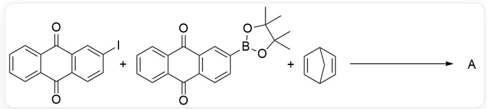
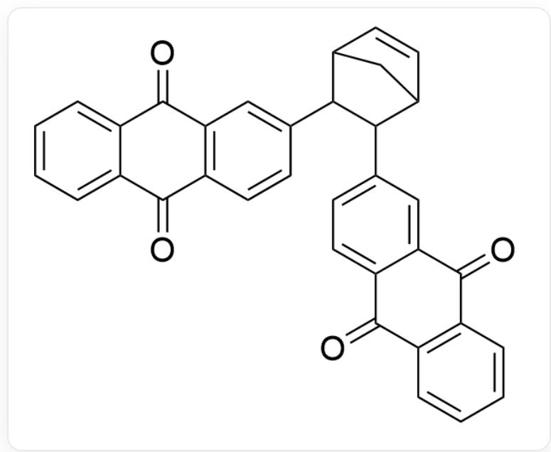

# 题目

在Suzuki反应条件下由以下结构的反应物制备了化合物A

$$
\begin{array}{l} O = C 1 C 2 = C (C = C C (I) = C 2) C (C 3 = C C = C C = C 3 1) = O. O = C 4 C 5 = C (C = C C (B 6 O C (C) (C) C (C) \\ (\mathrm {C}) \mathrm {O} 6) = \mathrm {C} 5) \mathrm {C} (\mathrm {C} 7 = \mathrm {C C} = \mathrm {C C} = \mathrm {C} 7 4) = \mathrm {O}. \mathrm {C} 8 9 \mathrm {C} = \mathrm {C C} (\mathrm {C} 9) \mathrm {C} = \mathrm {C} 8 > > [ ^ {*} ] \\ \end{array}
$$

A 可以作为单体, 聚合形成用于制造电池的聚合物。聚合过程中单体中有一根碳碳键被完全切断。

关于  $\mathbf{A}$  和以  $\mathbf{A}$  为单体聚合所得的聚合物, 有以下一些结论, 选择对应所有错误结论的选项。

结论1：该聚合物直接作为阴极材料制作电池时，不需要充电即可使用。  
结论2：1 mol单体聚合形成的该聚合物每次进行可逆且完全的充电或放电过程都需要转移4 mol电子。  
结论3：题述聚合反应可以由A在Ziegler-Natta催化剂催化。  
结论4：若将单体中的连接芳环单元的结构片段换成环己烯结构片段，将更容易发生聚合反应。  
结论5：如果用于水溶液电解质电池，该聚合物相比于聚(2-乙烯基)蒽醌，更不容易在溶胀过程中从电极上脱落。  
结论6：若只看该聚合物的主链，不饱和度为0。  
结论7：该聚合物由A发生烯烃复分解反应聚合得到。  
结论8：该聚合物为线型高分子。

A. 下列选项均不符合题意  
B. 结论1、结论4  
C. 结论2、结论3、结论4  
D. 结论1、结论3、结论6  
E. 结论2、结论4、结论5  
F. 结论2、结论5、结论6  
G. 结论3、结论4、结论6

# 答案

正确答案: G

# 详细解析

根据Suzuki反应条件可以推断A的结构为

[ \mathrm{O} = \mathrm{C}(\mathrm{C}(\mathrm{C} = \mathrm{CC} = \mathrm{C}1) = \mathrm{C}1\mathrm{C}2 = \mathrm{O})\mathrm{C}(\mathrm{C}2 = \mathrm{C}3) = \mathrm{CC} = \mathrm{C}3\mathrm{C}(\mathrm{C}4\mathrm{C} = \mathrm{CC}5\mathrm{C}4)\mathrm{C}5\mathrm{C}6 = \mathrm{CC}7 = \mathrm{C}(\mathrm{C} = \mathrm{C}6)\mathrm{C}(\mathrm{C}8 = \mathrm{CC} = \mathrm{CC} = \mathrm{C}8\mathrm{C}7 = \mathrm{O}) = \mathrm{O} ]

如果不引入其他单体，A的结构中可能用于发生聚合反应的结构片段仅有降冰片烯片段。降冰片烯结构具有较大的环张力，可以通过烯烃复分解反应发生开环聚合，因此可以推断A的聚合反应是打开降冰片烯结构的开环聚合反应。

CHECKPOINT

2 PTS

A 的聚合反应是打开降冰片烯结构的开环聚合反应

结论1：阴极发生还原反应，而蒽醌片段本身具有氧化性，可以得电子发生还原反应，因此该聚合物直接作为阴极材料制作电池时，不需要充电即可使用。结论1正确。

# CHECKPOINT

1 PTS

蒽醌片段本身具有氧化性，可以得电子发生还原反应，因此该聚合物直接作为阴极材料制作电池时，不需要充电即可使用

结论2：每个单体分子中可逆氧化还原的位点为蒽醌片段，每个蒽醌片段被可逆还原需要2个电子，每个单体包含2个蒽醌片段，因此每个单体需要4个电子还原，故1mol单体生成的聚合物充电或放电需要转移4mol的电子。结论2正确。

# CHECKPOINT

1 PTS

每个单体包含2个蒽醌片段，因此每个单体需要4个电子还原

结论3：Ziegler-Natta催化剂用于催化烯烃的配位聚合，聚合过程中碳碳双键只发生π键的断裂而不发生σ键的断裂，不满足题目“一根碳碳键完全断裂”的要求。结论3错误。

# CHECKPOINT

1 PTS

Ziegler-Natta催化剂用于催化烯烃的配位聚合，聚合过程中碳碳双键只发生π键的断裂而不发生σ键的断裂

结论4：驱动A发生开环聚合的动力是开环过程中降冰片烯结构环张力的释放。若将降冰片烯片段换成环己烯片段，则环张力大大减小，不利于发生开环聚合。结论4错误。

# CHECKPOINT

1 PTS

将降冰片烯片段换成环己烯片段，则环张力大大减小，不利于发生开环聚合

结论5：在溶胀过程中，蒽醌负离子基团具有很强的亲水性，容易导致电极材料的脱落，而聚降冰片烯长链相比于聚乙烯长链憎水性更强，因此使电极材料得以稳定。结论5正确。

# CHECKPOINT

1 PTS

聚降冰片烯长链相比于聚乙烯长链憎水性更强

结论6：聚合物的主链含有不饱和的双键。结论6错误。

# CHECKPOINT

1 PTS

聚合物的主链含有不饱和的双键。

结论7：A的聚合反应是打开降冰片烯结构的开环聚合反应。结论7正确。

结论8：A的聚合反应是打开降冰片烯结构的开环聚合反应，不会产生任何侧链，因此是线形高分子。结论8正确。