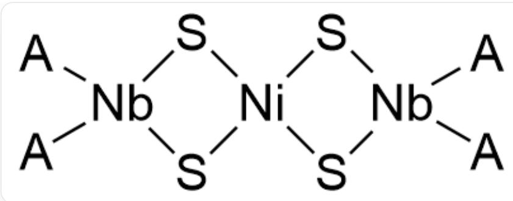

# Question

The compounds or complex ions B, C, D all contain metal A, and their mass fractions in B, C, D are  $26.30\%$ ,  $31.60\%$ ,  $26.80\%$  respectively. All three have high symmetry. B is sensitive to oxygen and can be obtained by reacting chloride E of A with F in diethyl ether or benzene under a nitrogen atmosphere. F is a sodium salt of an acidic organic compound G, which is aromatic and contains approximately  $9.15\%$  hydrogen. C is obtained by replacing two adjacent ligands in B with chlorine, and C can also be obtained by reacting E and F in dimethoxyethane. Another method for preparing C is to react the thallium salt of G with E, followed by reduction with  $\mathrm{SnCl}_2$ . D is a bimetallic derivative cationic complex. It is known that C can react with sodium thiolate to generate H, and H can then react with  $\mathrm{NiCl}_2$  to obtain D, which contains approximately  $8.465\%$  nickel.

Which of the following options regarding the unknown species  $\mathbf{A} - \mathbf{H}$  is correct:

A. All other options are incorrect.  
B. The valence electrons of element A possess paired electrons.  
C. The central element of  $\mathbf{B}$  satisfies the EAN rule.  
D. The structure of  $\mathbf{C}$  possesses a threefold rotational axis.  
E. D contains a ligand with two chemical environments.  
F. G's chemical formula contains three elements

# Answer

Correct Answer: A

# Detailed Explanation

The entry point for this question is  $\mathbf{G}$ , which has acidity, the negative ion has aromaticity, and has approximately  $9.15\%$  hydrogen.

Consider common acidic compounds containing benzene rings:

The mass fraction of hydrogen in benzoic acid is  $6 / (12 \times 6 + 16 \times 2 + 6) = 5.5\%$ , consider reducing the number of heavy atoms;

The mass fraction of hydrogen in phenol is  $6 / (12 \times 6 + 16 + 6) = 6.4\%$ , the number of heavy atoms also needs to be reduced; therefore,  $\mathbf{G}$  most likely does not contain oxygen.

# CHECKPOINT

0.5 PTS

G most likely does not contain oxygen

Common acidic compounds containing benzene rings are difficult to match, consider five-membered ring aromatic compounds:

The cyclopentadienyl anion has aromaticity, and the mass fraction of hydrogen in cyclopentadiene is  $6 / (12 \times 5 + 6) = 9.1\%$ , which matches.

Other pyrrole/pyran species can also be searched for, but the mass fractions do not match. Therefore,  $\mathbf{G}$  is cyclopentadiene  $\mathrm{C}_5\mathrm{H}_6$ , and  $\mathbf{F}$  is sodium cyclopentadienide  $\mathrm{C}_5\mathrm{H}_5\mathrm{Na}$ .  $\mathrm{C}_5\mathrm{H}_6$  has only two elements, so option  $\mathrm{F}$  is incorrect.

# CHECKPOINT

2 PTS

G is cyclopentadiene  $\mathrm{C}_5\mathrm{H}_6$

# CHECKPOINT

2 PTS

F is sodium cyclopentadienide  $\mathrm{C}_5\mathrm{H}_5\mathrm{Na}$

$\mathbf{B}$  is obtained from the reaction of the chloride of element  $\mathbf{A}$  with sodium cyclopentadienide, which can be basically judged as a ligand substitution reaction; the chemical formula of  $\mathbf{B}$  can be written as  $\mathbf{A}(\mathrm{C}_5\mathrm{H}_5)_n$ ; determine the value of  $n$  based on the mass fraction:

# CHECKPOINT

1 PTS

The generation of  $\mathbf{B}$  is a ligand substitution reaction, and the chemical formula can be written as  $\mathbf{A}(\mathrm{C}_5\mathrm{H}_5)_n$

If  $n$  is 1, the relative atomic mass of  $\mathbf{A}$  is  $65 / (1 - 0.2630) - 65 = 23$ , which may be  $\mathrm{Na}$ , but since  $\mathbf{F}$  is  $\mathrm{NaC}_5\mathrm{H}_5$ , this possibility is excluded.

# CHECKPOINT

1 PTS

$\mathbf{F}$  is  $\mathrm{NaC}_5\mathrm{H}_5$  , excluding the possibility that A is Na

If  $n$  is 2, the relative atomic mass of  $\mathbf{A}$  is  $130 / (1 - 0.2630) - 130 = 46.4$ , which is not a reasonable divalent metal.

If  $n$  is 3, the relative atomic mass of  $\mathbf{A}$  is  $195 / (1 - 0.2630) - 195 = 69.6$ , which is Ga.

If  $n$  is 4, the relative atomic mass of  $\mathbf{A}$  is  $260 / (1 - 0.2630) - 260 = 92.8$ , which is  $\mathrm{Nb}$ .

If  $n$  is 5 or more, there is no reasonable metal.

Therefore, it can be deduced that the metal  $\mathbf{A}$  may be Ga or Nb, and the corresponding  $\mathbf{B}$  may be  $\mathrm{Ga}(\mathrm{C}_5\mathrm{H}_5)_3$  and  $\mathrm{Nb}(\mathrm{C}_5\mathrm{H}_5)_4$ .

# CHECKPOINT

2 PTS

Metal A may be Ga or Nb

Then focus on  $\mathbf{C}$ ,  $\mathbf{C}$  is  $\mathbf{B}$  in which two adjacent ligands are substituted by chlorine, then for these two metals, the chemical formulas of  $\mathbf{C}$  are  $\mathrm{GaCl}_2(\mathrm{C}_5\mathrm{H}_5)$  and  $\mathrm{NbCl}_2(\mathrm{C}_5\mathrm{H}_5)_2$  respectively, calculate the mass fraction of the metal respectively:

If  $\mathbf{A}$  is Ga, calculate  $69.7 / (65 + 35.5 \times 2 + 69.7) = 33.9\%$ , which is inconsistent with the given  $31.6\%$ .

If  $\mathbf{A}$  is  $\mathrm{Nb}$ , calculate  $92.9 / (65 \times 2 + 35.5 \times 2 + 92.9) = 31.6\%$ , which is consistent with the given condition.

Therefore, it is finally determined that the metal  $\mathbf{A}$  is Nb; then  $\mathbf{B}$  is  $\mathrm{Nb}(\mathrm{C}_5\mathrm{H}_5)_4$ , and  $\mathbf{C}$  is  $\mathrm{NbCl}_2(\mathrm{C}_5\mathrm{H}_5)_2$ .  $\mathbf{E}$  is  $\mathrm{NbCl}_4$ .

# CHECKPOINT

2 PTS

Determine that the metal  $\mathbf{A}$  is Nb through the mass fraction of  $\mathbf{C}$

# CHECKPOINT

0.5 PTS

B is  $\mathrm{Nb}(\mathrm{C}_5\mathrm{H}_5)_4$

# CHECKPOINT

0.5 PTS

C is  $\mathrm{NbCl}_2(\mathrm{C}_5\mathrm{H}_5)_2$

The ground state valence electron configuration of  $\mathrm{Nb}$  is  $4\mathrm{d}^{4}5\mathrm{s}^{1}$ , there are no paired electrons, so option B is incorrect; in  $\mathrm{Nb(C_5H_5)_4}$ ,  $\mathrm{Nb}$  is +4 valent, there is a single electron, and the EAN rule cannot be achieved no matter how the four cyclopentadienyl groups are coordinated, so option C is incorrect;  $\mathbf{C}$  is  $\mathrm{NbCl}_2(\mathrm{C}_5\mathrm{H}_5)_2$ , the structure is similar to dichloromethane, and there is no threefold axis, so option D is incorrect.

# CHECKPOINT

0.5 PTS

The ground state valence electron configuration of Nb is  $4\mathrm{d}^{4}5\mathrm{s}^{1}$ , there are no paired electrons

# CHECKPOINT

0.5 PTS

$\mathrm{Nb}(\mathrm{C}_5\mathrm{H}_5)_4$  cannot reach the EAN rule

# CHECKPOINT

0.5 PTS

The structure of  $\mathrm{NbCl}_2(\mathrm{C}_5\mathrm{H}_5)_2$  is similar to dichloromethane, and there is no threefold axis

$\mathrm{NbCl}_2(\mathrm{C}_5\mathrm{H}_5)_2$  can react with sodium thiomethoxide to generate  $\mathbf{H}$ , obviously a ligand substitution reaction occurs, the thiomethoxide anion substitutes the chloride ion, and the generated  $\mathbf{H}$  is  $\mathrm{Nb(CH_3S)_2(C_5H_5)_2}$ .

# CHECKPOINT

1 PTS

The thiomethoxide anion substitutes the chloride ion, and the generated  $\mathbf{H}$  is  $\mathrm{Nb(CH_3S)_2(C_5H_5)_2}$

$\mathrm{Nb(CH_3S)_2(C_5H_5)_2}$  reacts with  $\mathrm{NiCl}_2$  to obtain the bimetallic derivative cationic complex  $\mathbf{D}$ , it can also be guessed that it is a ligand substitution reaction, and the product should not contain chlorine;

# CHECKPOINT

1 PTS

The reaction to generate  $\mathbf{D}$  can also be guessed as a ligand substitution reaction, and the product should not contain chlorine

The content of nickel in  $\mathbf{D}$  is about  $8.465\%$ , assuming it contains one nickel atom, the remaining relative molecular mass is exactly two molecules of  $\mathrm{Nb(CH_3S)_2(C_5H_5)_2}$ , so it can be calculated that the chemical formula of  $\mathbf{D}$  is  $[\mathrm{NiNb}_2(\mathrm{CH}_3\mathrm{S})_4(\mathrm{C}_5\mathrm{H}_5)_4]^{2+}$ .

# CHECKPOINT

2 PTS

It can be calculated that the chemical formula of  $\mathbf{D}$  is  $\left[\mathrm{NiNb}_2\left(\mathrm{CH}_3\mathrm{S}\right)_4\left(\mathrm{C}_5\mathrm{H}_5\right)_4\right]^{2+}$

In the structure of this cationic complex, the cyclopentadienyl group is coordinated with Nb, and according to symmetry, there is only one chemical environment; Ni is obviously tetracoordinate, coordinated with four thiomethoxide groups, the thiomethoxide group is a bridging ligand coordinated with Ni and Nb, and there is also only one chemical environment, so option E is incorrect.

# CHECKPOINT

1 PTS

The cyclopentadienyl group is coordinated with Nb, and according to symmetry, there is only one chemical environment

# CHECKPOINT

1 PTS

The thiomethoxide group is a bridging ligand coordinated with Ni and Nb, and there is also only one chemical environment

The structure of the cationic complex is as follows:

D结构为：[A][Nb]1(S[Ni]2(S1)S[Nb]([A])(S2)[A])[A]；其中A代表环戊二烯基[cH-]1cccc1。

# CHECKPOINT

1 PTS

D structure is: [A][Nb]1(S[Ni]2(S1)S[Nb]([A])(S2)[A])[A]; where A represents the cyclopentadienyl group [cH-]1cccc1

In summary, option A is correct.