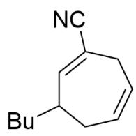
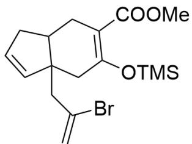
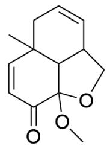
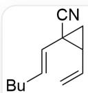
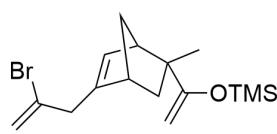
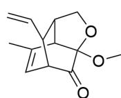
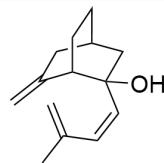
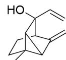

# Question

  
A

  
C

  
D

  
E

This figure illustrates 5 organic structural formulas. A is N#CC1=CC(CCCC)CC=CC1; B is

C=C(Br)CC12C=CCC1CC(C(OC)=O)=C(O[Si](C)(C)C)C2; C is CC1(C=C2)CC=CC3C1C(OC3)(OC)C2=O;

D is  $O = C(CC(C = C)C1)CC2CC1 = CCC2$  .E is CC12CCC=C(CCC3)C1C2C3=O.

The structures in the above figure are all generated through Cope rearrangement or O-Cope rearrangement; regarding the precursor structural formulas before they undergo rearrangement, the following statements are made:

1. The rearrangement precursor corresponding to  $\mathbf{A}$  contains a six-membered ring.  
2. The rearrangement precursor corresponding to  $\mathbf{B}$  does not contain a five-membered ring.  
3. The rearrangement precursor corresponding to  $\mathbf{C}$  contains only two six-membered rings and one five-membered ring.  
4. The rearrangement precursors corresponding to  $\mathbf{D}$ ,  $\mathbf{E}$  both contain a hydroxyl group.  
5. The rearrangement precursor corresponding to  $\mathbf{E}$  contains a three-membered ring.

6. The rearrangement precursor corresponding to  $\mathbf{D}$  reacts with  $\mathrm{O}_3, \mathrm{Zn} / \mathrm{MeOH}$  to obtain a new structure containing two carbonyl groups.

Among the following options, the one that contains the largest number of correct statement numbers is:

A. All other options are incorrect  
B. 1, 3  
C. 1,4  
D. 2, 5  
E. 3,5  
F. 4, 5  
G. 5, 6  
H. 2, 6  
1,3,4  
J. 1, 4, 5  
K. 1, 2, 6  
L. 2, 4, 5

M. 2, 4, 6  
N. 3, 5, 6  
O. 4, 5, 6  
P. 1, 3, 4, 5  
Q. 1, 4, 5, 6  
R. 1, 2, 3, 4  
S. 1, 3, 5, 6  
T. 3, 4, 5, 6  
U. 1, 2, 4, 5, 6  
V. 2,3,4,5,6  
W. 1, 2, 3, 4, 5, 6  
X. 1,3，4，6  
Y. 1, 2, 4, 5

# Answer

Correct Answer: O

# Detailed Explanation

The general formula for the Cope rearrangement is:

1,5-dienes undergo a  $[3,3]\sigma$  sigmatropic rearrangement under thermal conditions to yield a new 1,5-diene.

# CHECKPOINT

1 PTS

Cope rearrangement is a  $[3,3]\sigma$  sigmoidotropic rearrangement that 1,5-dienes undergo under thermal conditions to yield a new 1,5-diene.

This reaction forms the C1 - C6 bond, breaks the C3 - C4 bond, and simultaneously migrates the double bond from the 1,5-position to the 3,4-position.

# CHECKPOINT

1 PTS

Formation of C1 - C6 bond, breaking of C3 - C4 bond

The characteristic of the O-Cope rearrangement compared to the Cope rearrangement is that the substrate contains a hydroxyl group at the 1 or 4 position, and after undergoing a  $[3,3]\sigma$  sigmoidotropic rearrangement, it will produce an enol structure at the 1 or 4 position, thereby converting to a carbonyl group at the 1 or 4 position.

# CHECKPOINT

1 PTS

O-Cope rearrangement produces an enol structure at the 1 or 4 position, thereby converting to a carbonyl group at the 1 or 4 position

Therefore, the steps for retro-analyzing the Cope rearrangement and O-Cope rearrangement are:

1. Convert the carbonyl group to an enol structure;  
2. Find the 1,5-diene structure and number it;  
3. Break the C1 - C6 bond, form the C3 - C4 bond, and migrate the double bond.

Therefore, according to the above steps, the precursors corresponding to  $\mathbf{A} - \mathbf{E}$  can be deduced as shown in the following figure:

  
A1

  
B1

  
C1

  
D1

  
E1

A1 is C=CC1C(C1)(C#N)/C=C/CCCC; B1 is C[C@]1(C(O[Si](C)(C)C)=C)[C@H](C2)C=C(CC(Br)=C)

[C@H]2C1; C1 is C=CC1C2C(C(C)=CC1C3=O)C3(OC)OC2; D1 is C=C1C[C@@H]2C[C@@]

(/C=C\C(C)=C)(O)[C@H]1CC2; E1 is CC1(C2C1C3(C=C)O)CCC3C2=C。

The precursor A1 corresponding to  $\mathbf{A}$  is  $C = C C 1 C (C 1) (C \# N) / C = C / C C C C$

# CHECKPOINT

2 PTS

The precursor A1 corresponding to  $\mathbf{A}$  is  $C = C C 1 C (C 1) (C \# N) / C = C / C C C C$

The precursor B1 corresponding to B is C[C@]1(C(O[Si](C)(C)C=C)[C@H](C2)C=C(CC(Br)=C)[C@H]2C1.

# CHECKPOINT

2 PTS

The precursor B1 corresponding to B is C[C@]1(C(O[Si](C)(C)C)=C)[C@H](C2)C=C(CC(Br)=C) [C@H]2C1.

The precursor C1 corresponding to C is C=CC1C2C(C(C)=CC1C3=O)C3(OC)OC2.

# CHECKPOINT

2 PTS

The precursor C1 corresponding to  $\mathbf{C}$  is  $C = CC1C2C(C(C) = CC1C3 = O)C3(OC)OC2$

The precursor D1 corresponding to  $\mathbf{D}$  is  $C = C1C[C@@H]2C[C@@](/C = C\backslash C(C) = C)(O)[C@H]1CC2.$

# CHECKPOINT

2 PTS

The precursor D1 corresponding to  $\mathbf{D}$  is  $C = C1C[C@@H]2C[C@@](/C = C\backslash C(C) = C)(O)[C@H]1CC2$

The precursor E1 corresponding to  $\mathbf{E}$  is CC1(C2C1C3(C=C)O)CCC3C2=C.

# CHECKPOINT

2 PTS

The precursor E1 corresponding to  $\mathbf{E}$  is CC1(C2C1C3(C=C)O)CCC3C2=C.

D1 is cleaved by ozonolysis of the double bond, and because it contains a terminal olefin, it will only produce two carbonyl groups.

According to the structural formula, only statements 4, 5, and 6 are correct.

# CHECKPOINT

1 PTS

Statements 4, 5, and 6 are correct