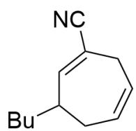
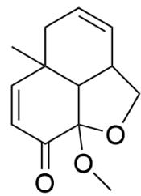
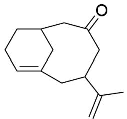
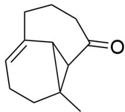
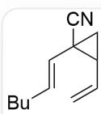
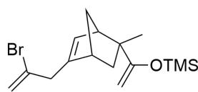
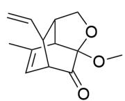
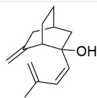
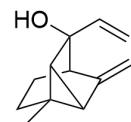

# 题目

  
A

  
C

  
D

  
E

本图体现了5个有机结构式。A为N#CC1=CC(CCCC)CC=CC1；B为

$$
C = C (B r) C C 1 2 C = C C C 1 C C (C (O C) = O) = C (O [ S i ] (C) (C) C) C 2; \quad C \text {为} C C 1 (C = C 2) C C = C C 3 C 1 C (O C 3)
$$

$$
\left(\mathrm {O C}\right) \mathrm {C} 2 = \mathrm {O}; \quad \mathbf {D} \text {为} \mathrm {O} = \mathrm {C} (\mathrm {C C} (\mathrm {C} (\mathrm {C}) = \mathrm {C}) \mathrm {C} 1) \mathrm {C C} 2 \mathrm {C C} 1 = \mathrm {C C C} 2; \quad \mathbf {E} \text {为} \mathrm {C C} 1 2 \mathrm {C C C} = \mathrm {C} (\mathrm {C C C} 3) \mathrm {C} 1 \mathrm {C} 2 \mathrm {C} 3 = \mathrm {O 。}
$$

上图的结构都是通过Cope重排或O-Cope重排生成的；关于它们发生重排之前的前体结构式，有下列说法：

1. A 对应的重排前体含有六元环。  
2. B 对应的重排前体不含有五元环。  
3. C对应的重排前体只含有两个六元环和一个五元环。  
4. D, E对应的重排前体均含有羟基。  
5. E对应的重排前体含有三元环。  
6. D 对应的重排前体与  $\mathrm{O}_{3}, \mathrm{Zn} / \mathrm{MeOH}$  反应, 得到的新结构含有两个羰基。

下列选项中，包含的说法序号全都正确且最多的一项是：

A. 其他选项均不正确  
B. 1, 3  
C. 1, 4  
D. 2, 5  
E. 3, 5  
F. 4, 5  
G. 5, 6  
H. 2, 6  
1,3,4  
J. 1,4,5  
K. 1, 2, 6  
L. 2,4,5  
M. 2,4,6  
N. 3,5,6

O. 4,5,6  
P. 1, 3, 4, 5  
Q. 1, 4, 5, 6  
R. 1, 2, 3, 4  
S. 1, 3, 5, 6  
T. 3, 4, 5, 6  
U. 1, 2, 4, 5, 6  
V. 2, 3, 4, 5, 6  
W. 1, 2, 3, 4, 5, 6  
X. 1,3，4,6  
Y. 1, 2, 4, 5

# 答案

正确答案: O

# 详细解析

Cope重排的通式为：

1,5-二烯类化合物在受热条件下发生[3，3]  $\sigma$  迁移得到一个新的1,5-二烯。

# CHECKPOINT

1 PTS

Cope重排为1,5-二烯类化合物在受热条件下发生[3，3]  $\sigma$  迁移得到一个新的1,5-二烯。

该反应会生成C1-C6键，断裂C3-C4键，同时双键从1,5位迁移到3，4位。

# CHECKPOINT

1 PTS

生成C1-C6键，断裂C3-C4键

O-Cope重排相比于Cope重排的特点是底物在1或4号位含有醇羟基，在发生[3，3]  $\sigma$  迁移后会产生1或4号位的烯醇结构，从而转化为1或4号位的羰基。

# CHECKPOINT

1 PTS

O-Cope重排会产生1或4号位的烯醇结构，从而转化为1或4号位的羰基

从而逆向分析Cope重排和O-Cope重排的步骤为：

1.将羰基变为烯醇结构；  
2.寻找1,5-二烯结构并进行编号；  
3.断裂C1-C6键，生成C3-C4键，迁移双键。

从而根据上述步骤可以推得  $\mathbf{A} - \mathbf{E}$  对应的前体如下图所示：

  
A1

  
B1

  
C1

  
D1

  
E1

A1为C=CC1C(C1)(C#N)/C=C/CCCC; B1为C[C@]1(C(O[Si](C)(C)C)=C)[C@H](C2)C=C(CC(Br)=C)

[C@H]2C1; C1为C=CC1C2C(C(C)=CC1C3=O)C3(OC)OC2; D1为C=C1C[C@@H]2C[C@@](/C=C\C(C)=C)

(O)[C@H]1CC2; E1为CC1(C2C1C3(C=C)O)CCC3C2=C。

A对应的前体A1为C=CC1C(C1)(C#N)/C=C/CCCC。

# CHECKPOINT

2 PTS

A对应的前体A1为C=CC1C(C1)(C#N)/C=C/CCCC。

B对应的前体B1为C[C@]1(C(O[Si](C)(C)C)=C)[C@H](C2)C=C(CC(Br)=C)[C@H]2C1。

# CHECKPOINT

2 PTS

B对应的前体B1为C[C@]1(C(O[Si](C)(C)C)=C)[C@H](C2)C=C(CC(Br)=C)[C@H]2C1。

C对应的前体C1为  $\mathrm{C = CC1C2C(C(C) = CC1C3 = O)C3(OC)OC2}$

# CHECKPOINT

2 PTS

C对应的前体C1为  $\mathrm{C = CC1C2C(C(C) = CC1C3 = O)C3(OC)OC2}$

D对应的前体D1为C=C1C[C@@H]2C[C@@](/C=C\C(C)=C)(O)[C@H]1CC2。

# CHECKPOINT

2 PTS

D对应的前体D1为C=C1C[C@@H]2C[C@@](/C=C\C(C)=C)(O)[C@H]1CC2。

E对应的前体E1为CC1(C2C1C3(C=C)O)CCC3C2=C。

# CHECKPOINT

2 PTS

E对应的前体E1为CC1(C2C1C3(C=C)O)CCC3C2=C。

D1被臭氧化断裂双键，由于含有末端烯烃，只会产生两个羰基。

根据结构式可知，只有说法4，5，6正确。

# CHECKPOINT

1 PTS

说法4，5，6正确