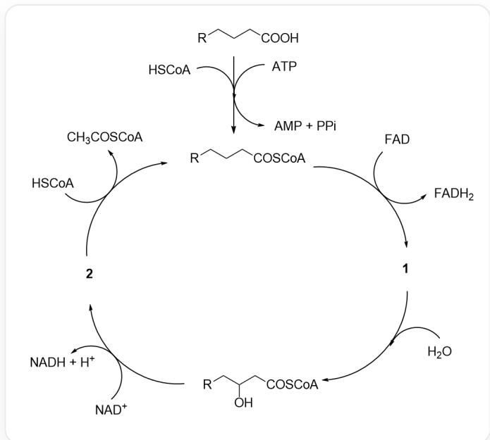

# Question

People have discovered the chemical process of metabolizing fatty acids in organisms, which is called  $\beta$ -oxidation. After one cycle, the number of carbons in the R group decreases, and the fatty acid is partially degraded.  $PPI$  is pyrophosphate, which is quickly hydrolyzed into two molecules of phosphate. This process can be represented by the following catalytic cycle diagram:

First, [R]CCCC(O)=O (where R refers to a longer chain alkyl group) reacts with coenzyme A (HSCoA) under the action of ATP to generate [R]CCCC(SCCNC(CCNC(C(O)C(COP(OP(OCC(C(OP([O-])

$([\mathrm{O - }]) = \mathrm{O})\mathrm{C}1\mathrm{O})\mathrm{OC}1\mathrm{N}(\mathrm{C} = \mathrm{N}2)\mathrm{C}3 = \mathrm{C}2\mathrm{C}(\mathrm{N}) = \mathrm{NC} = \mathrm{N}3)([\mathrm{O - }]) = \mathrm{O})([\mathrm{O - }]) = \mathrm{O})(\mathrm{C})\mathrm{C}) = \mathrm{O}) = \mathrm{O})$  (fatty acyl  $CoA$ ), while ATP is broken down into  $AMP$  and pyrophosphate; fatty acid  $CoA$  produces 1 and  $FADH_{2}$  under the action of  $FAD$ , then 1 reacts with water to generate

[R]CC(O)CC(SCCNC(CCNC(C(O)C(COP(OP(OCC(C(OP([O-])

$([\mathrm{O - }]) = \mathrm{O})\mathrm{C}1\mathrm{O})\mathrm{OC}1\mathrm{N}(\mathrm{C} = \mathrm{N}2)\mathrm{C}3 = \mathrm{C}2\mathrm{C}(\mathrm{N}) = \mathrm{NC} = \mathrm{N}3)([\mathrm{O - }]) = \mathrm{O})([\mathrm{O - }]) = \mathrm{O})(\mathrm{C})\mathrm{C}) = \mathrm{O}) = \mathrm{O}) = \mathrm{O}$  , which then reacts with  $NAD^{+}$  to generate 2 and  $NADH$  and hydrogen ions, and 2 then reacts with one molecule of coenzyme A to generate acetyl CoA and partially degraded fatty acid CoA, entering the next cycle.

Select the correct option from the following:

A. All other options are incorrect

B. Undecanoic acid and stearic acid produce the same product species when directly degraded in the cycle.  
C. CCCCCCCC(C)(C)CC(O)=O can be directly metabolized through the above pathway.  
D. For 1 produced by saturated fatty acids, there are no carbon-carbon double bonds conjugated with the carbonyl group.  
E. If 2 is produced by stearic acid in the first cycle, then its chemical formula under physiological conditions is  $\mathrm{C_{39}H_{64}N_7O_{18}P_3S^{4-}}$  
F. 1 mol of  $\mathrm{FADH}_2$  and NADH are re-oxidized during biological oxidation to release energy, generating 1.5 mol and 2.5 mol of ATP, respectively.  $\mathrm{CH}_3\mathrm{COSCoA}$  is oxidized to  $\mathrm{CO}_2$  in the tricarboxylic acid cycle, simultaneously generating 10 mol of ATP. Given that the molar heat of combustion of palmitic acid is  $9800\mathrm{kJ}\cdot \mathrm{mol}^{-1}$  and the energy storage of each high-energy phosphate bond is  $30.5\mathrm{kJ}\cdot \mathrm{mol}^{-1}$ , the energy storage efficiency of the organism during the complete oxidation of palmitic acid is  $33.6\%$  
G. Fatty acyl-CoA reacts with protein lysine residues to form fatty acylation modifications, which always require enzyme participation.

# Answer

Correct Answer: E

# Detailed Explanation

The oxidation cycle is analyzed. First, fatty acids react with coenzyme A to generate fatty acyl  $CoA$ . Under the action of  $FAD$ , 1 is produced, losing a molecule of hydrogen. 1 can react with water to generate [R]CC(O)CC(SCCNC(CCNC(C(O)C(COP(OP(OCC(C(OP([O-])

$([\mathrm{O - }]) = \mathrm{O})\mathrm{C}1\mathrm{O})\mathrm{OC}1\mathrm{N}(\mathrm{C} = \mathrm{N}2)\mathrm{C}3 = \mathrm{C}2\mathrm{C}(\mathrm{N}) = \mathrm{NC} = \mathrm{N}3)([\mathrm{O - }]) = \mathrm{O})([\mathrm{O - }]) = \mathrm{O})(\mathrm{C})\mathrm{C}) = \mathrm{O}) = \mathrm{O}) = \mathrm{O}$  It is not difficult to deduce that an  $\alpha$  ,  $\beta$  -unsaturated carbonyl compound is produced. Then the structure of 1 is [R]C/C=C/C(SCCNC(CCNC(C(O)C(COP(OP(OCC(C(OP([O-])

$([\mathrm{O - }]) = \mathrm{O})\mathrm{C1O})\mathrm{OC1N}(\mathrm{C} = \mathrm{N2})\mathrm{C3} = \mathrm{C2C}(\mathrm{N}) = \mathrm{NC} = \mathrm{N3})([\mathrm{O - }]) = \mathrm{O})([\mathrm{O - }]) = \mathrm{O})(\mathrm{C})\mathrm{C}) = \mathrm{O}) = \mathrm{O}) = \mathrm{O}$  , which has a carboncarbon double bond conjugated with the carbonyl group.

# CHECKPOINT

1 PTS

The structure of 1 is [R]C/C=C/C(SCCNC(CCNC(C(O)C(COP(OP(OCC(C(OP([O-]) ([O-])=O)C1O)OC1N(C=N2)C3=C2C(N)=NC=N3)([O-])=O)([O-])=O)(C)C)=O)=O, which has a carbon-carbon double bond conjugated with the carbonyl group. Option D is incorrect.

[R]CC(O)CC(SCCNC(CCNC(C(O)C(COP(OP(OCC(C(OP([O-])

$([\mathrm{O - }]) = \mathrm{O})\mathrm{C1O})\mathrm{OC1N}(\mathrm{C} = \mathrm{N2})\mathrm{C3} = \mathrm{C2C}(\mathrm{N}) = \mathrm{NC} = \mathrm{N3})([\mathrm{O - }]) = \mathrm{O})([\mathrm{O - }]) = \mathrm{O})(\mathrm{C})\mathrm{C}) = \mathrm{O}) = \mathrm{O}) = \mathrm{O}$  reacts with  $\mathrm{NAD^{+}}$  to produce 2 and NADH and hydrogen ions. 2 then reacts with a molecule of coenzyme A to generate acetyl CoA and partially degraded fatty acid CoA. 2 is produced by a one-step oxidation, and it is easy to deduce that its structure is [R]CC(CC(SCCNC(CCNC(C(O)C(COP(OP(OCC(C(OP([O-])

$([\mathrm{O - }]) = \mathrm{O})\mathrm{C}1\mathrm{O})\mathrm{OC}1\mathrm{N}(\mathrm{C} = \mathrm{N}2)\mathrm{C}3 = \mathrm{C}2\mathrm{C}(\mathrm{N}) = \mathrm{NC} = \mathrm{N}3)([\mathrm{O - }]) = \mathrm{O})([\mathrm{O - }]) = \mathrm{O})(\mathrm{C})\mathrm{C}) = \mathrm{O}) = \mathrm{O}) = \mathrm{O}) = \mathrm{O}$

# CHECKPOINT

1 PTS

The structure of 2 is [R]CC(CC(SCCNC(CCNC(C(O)C(COP(OP(OCC(C(OP([O-])

$$
([ O - ]) = O) C 1 O) O C 1 N (C = N 2) C 3 = C 2 C (N) = N C = N 3) ([ O - ]) = O) ([ O - ]) = O) (C) C = O) = O) = O
$$

The chemical formula of stearic acid is  $\mathrm{C_{18}H_{36}O_2}$ . Under physiological conditions, all phosphates of coenzyme A are ionized, and the chemical formula is  $\mathrm{C_{21}H_{32}N_7O_{16}P_3S^{4-}}$ . Then the chemical formula of 2 produced by stearic acid in the first cycle is  $\mathrm{C_{39}H_{64}N_7O_{18}P_3S^{4-}}$ .

# CHECKPOINT

1 PTS

The chemical formula of 2 produced by stearic acid in the first cycle is  $\mathrm{C_{39}H_{64}N_7O_{18}P_3S^{4 - }}$ . Option E is correct.

Stearic acid has 18 carbons. Each  $\beta$ -degradation reduces two carbons, producing  $\mathrm{FADH}_2$ ,  $\mathrm{NAHD}$ , and acetyl CoA. In the last step of degradation, stearic acid will be completely degraded to acetyl CoA. Undecanoic acid has 11 carbons. In the penultimate cycle, three carbons will remain, and it cannot be completely degraded to acetyl CoA (propionyl CoA will actually be produced, which is converted to succinyl CoA and then enters the citric acid cycle for degradation), and the types of degradation products produced are different.

# CHECKPOINT

1 PTS

Stearic acid is degraded to acetyl CoA. Undecanoic acid is degraded to propionyl CoA, and the degradation products are different. Option B is incorrect.

$\beta$ -oxidation requires hydrogen at the  $\beta$ -position of the fatty acid. CCCCCCCCCCC(C)(C)CC(O)=O cannot undergo  $\beta$ -oxidation.

# CHECKPOINT

1 PTS

CCCCCCCCCC(C)(C)CC(O)=O cannot undergo  $\beta$ -oxidation. Option C is incorrect.

Fatty acyl CoA has a highly active thioester structure, which can modify lysine residues without enzymatic catalysis in some scenarios.

# CHECKPOINT

1 PTS

Fatty acyl CoA has a highly active thioester structure, which can modify lysine residues without enzymatic catalysis in some scenarios. Option G is incorrect.

Palmitic acid is a saturated fatty acid with 16 carbons. Complete degradation will produce 8 acetyl CoA, 7  $\mathrm{FADH}_2$ , and 7 NADH, which can generate a total of  $7 \times (10 + 1.5 + 2.5) + 1.5 + 2.5 = 108$  ATP. The reaction of palmitic acid with coenzyme A requires a molecule of ATP to be degraded into AMP. AMP will react with another molecule of ATP to generate ADP, and pyrophosphate will quickly hydrolyze, consuming two high-energy phosphate bonds. The actual yield is 106 ATP, so the energy storage efficiency is:  $106 \times 30.5 / 9800 = 33.0\%$

# CHECKPOINT

1 PTS

Complete degradation of palmitic acid produces 108 ATP, and the reaction of palmitic acid with coenzyme A consumes two high-energy phosphate bonds, and the actual yield is 106 ATP, so the energy storage efficiency is  $33.0\%$ . Option F is incorrect.

Therefore, choose option E.