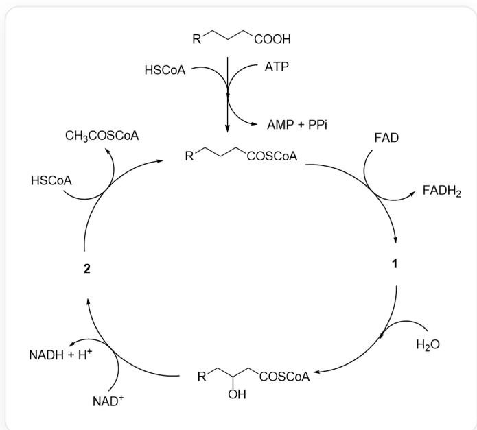

# 题目

人们发现了生物体内代谢脂肪酸的化学过程，这一过程被称为  $\beta$ -氧化反应。经过一次循环后，R基的碳数减少，脂肪酸被部分降解。 $PPI$  是焦磷酸，很快水解为两分子磷酸。该过程可由下面的催化循环图表示：

首先  $[\mathrm{R}]\mathrm{CCCC}(\mathrm{O}) = \mathrm{O}$  （其中  $\mathrm{R}$  指代更长链的烷基）在ATP作用下与辅酶A（HSCoA）反应生成

[R]CCCC(SCCNC(CCNC(C(O)C(COP(OP(OCC(C(OP([O-])

([O-])=O)C1O)OC1N(C=N2)C3=C2C(N)=NC=N3)([O-])=O)([O-])=O)(C)C)=O)=O（脂肪酰CoA），同时

ATP被分解为AMP和焦磷酸；脂肪酸CoA在FAD作用下产生1和  $F A D H_{2}$ , 随后1与水反应生成

[R]CC(O)CC(SCCNC(CCNC(C(O)C(COP(OP(OCC(C(OP([O-])

$([\mathrm{O - }]) = \mathrm{O})\mathrm{C}10)\mathrm{OC}1\mathrm{N}(\mathrm{C} = \mathrm{N}2)\mathrm{C}3 = \mathrm{C}2\mathrm{C}(\mathrm{N}) = \mathrm{NC} = \mathrm{N}3)([\mathrm{O - }]) = \mathrm{O})([\mathrm{O - }]) = \mathrm{O})(\mathrm{C}) = \mathrm{O}) = \mathrm{O}) = \mathrm{O}$  ，进而与  $N A D^{+}$  反应

生成2和NADH与氢离子，2再与一分子辅酶A反应生成乙酰CoA和部分降解的脂肪酸CoA，进入下一

步循环。

选出以下选项中正确的一项：

A. 其他选项均不正确  
B. 十一烷酸和硬脂酸在循环中降解直接产生的产物物种相同

C. CCCCCCCCCCC(C)(C)CC(O)=O可直接通过上面的途径被代谢  
D. 对于饱和脂肪酸产生的 1 , 其中不存在与羰基共轭的碳碳双键  
E. 假如 2 是由硬脂酸在第一次循环中产生的, 则其在生理条件下的化学式为  $\mathrm{C}_{39} \mathrm{H}_{64} \mathrm{~N}_{7} \mathrm{O}_{18} \mathrm{P}_{3} \mathrm{~S}^{4-}$  
F.  $1 \mathrm{~mol}$  的  $\mathrm{FADH}_{2}$  和 NADH 在生物氧化过程中重新被氧化放出能量, 分别生成  $1.5 \mathrm{~mol}$  和  $2.5 \mathrm{~mol}$  的 ATP。  $\mathrm{CH}_{3} \mathrm{COSCoA}$  在三羧酸循环中被氧化为  $\mathrm{CO}_{2}$ , 同时生成  $10 \mathrm{~mol}$  的 ATP, 已知软脂酸的摩尔燃烧热为  $9800 \mathrm{kJ} \cdot \mathrm{mol}^{-1}$ , 每根高能磷酸键的储能为  $30.5 \mathrm{~kJ} \cdot \mathrm{mol}^{-1}$ , 则软脂酸完全氧化过程中生命体的储能效率为  $33.6 \%$  
G. 脂肪酰CoA与蛋白赖氨酸残基反应形成脂肪酰化修饰一定需要酶的参与

# 答案

正确答案: E

# 详细解析

对氧化循环进行分析，首先脂肪酸与辅酶A反应生成脂肪酰CoA，在  $FAD$  作用下产生1，失去一分子氢气，1可与水反应生成[R]CC(O)CC(SCCNC(CCNC(C(O)C(COP(OP(OCC(C(OP([O-])([O-])=O)C1O)OC1N(C=N2)C3=C2C(N)=NC=N3)([O-])=O)([O-])=O)(C)C)=O)=O，不难推断出产生了α,β-不饱和羰基化合物，则1的结构为  $[\mathrm{R}]\mathrm{C} / \mathrm{C} = \mathrm{C} / \mathrm{C}(\mathrm{SCCN}\mathrm{CCNC}\mathrm{(C(O)}\mathrm{C}(\mathrm{COP}(\mathrm{OP}(\mathrm{OCC}\mathrm{(C(OP([O-])})([O-])=O)\mathrm{C1O})OC1N(C=N2)C3=C2C(N)=NC=N3)([O-])=O)([O-])=O)(C)C)=O)=O$  ，其中存在与羰基共轭的碳碳双键。

# CHECKPOINT

1 PTS

1 的结构为 \([R]C/C = C/C(SCCNC(CCNC(C(O)C(COP(OP(OCC(C(OP([O-])\((O-])=O)C1O)OC1N(C=N2)C3=C2C(N)=NC=N3)([O-])=O)([O-])=O)(C)C)=O)=O\)，其中存在与羰基共轭的碳碳双键，选项D错误

[R]CC(O)CC(SCCNC(CCNC(C(O)C(COP(OP(OCC(C(OP([O-])

$([\mathrm{O - }]) = \mathrm{O})\mathrm{C}1\mathrm{O})\mathrm{OC}1\mathrm{N}(\mathrm{C} = \mathrm{N}2)\mathrm{C}3 = \mathrm{C}2\mathrm{C}(\mathrm{N}) = \mathrm{NC} = \mathrm{N}3)([\mathrm{O - }]) = \mathrm{O})([\mathrm{O - }]) = \mathrm{O})(\mathrm{C})\mathrm{C}) = \mathrm{O}) = \mathrm{O}) = \mathrm{O}$  与  $\mathrm{NAD^{+}}$  反应生成2和NADH与氢离子，2再与一分子辅酶A反应生成乙酰CoA和部分降解的脂肪酸CoA，2经一步氧化产生，很容易推测得其结构为[R]CC(CC(SCCNC(CCNC(C(O)C(COP(OP(OCC(C(OP([O-]))[O-])=O)C1O)OC1N(C=N2)C3=C2C(N)=NC=N3)([O-])=O)([O-])=O)(C)C)=O)=O=O。

# CHECKPOINT

1 PTS

2 的 结 构 为 [R]CC(CC(SCCNC(CCNC(C(O)C(COP(OP(OCC(C(OP([O-])

$$
([ O - ]) = O) C 1 O) O C 1 N (C = N 2) C 3 = C 2 C (N) = N C = N 3) ([ O - ]) = O) ([ O - ]) = O) (C) C = O) = O) = O
$$

硬脂酸化学式为  $\mathrm{C_{18}H_{36}O_2}$ , 辅酶A在生理条件下所有磷酸均电离, 化学式为  $\mathrm{C_{21}H_{32}N_7O_{16}P_3S^{4-}}$ , 则由硬脂酸在第一次循环中产生的 2 化学式为  $\mathrm{C_{39}H_{64}N_7O_{18}P_3S^{4-}}$

# CHECKPOINT

1 PTS

硬脂酸在第一次循环中产生的2化学式为  $\mathrm{C_{39}H_{64}N_7O_{18}P_3S^{4-}}$  ，选项E正确

硬脂酸有18个碳，每次β降解会减少两个碳，产生FADH $_2$ 、NAHD和乙酰CoA，在最后一步降解中硬脂酸会被完全降解为乙酰CoA。十一烷酸有11个碳，在倒数第二个循环会剩余三个碳，最终无法被完全降解为乙酰CoA（实际会产生丙酰CoA，转化为琥珀酰CoA后进入柠檬酸循环被降解），产生的降解产物种类不同。

# CHECKPOINT

1 PTS

硬脂酸降解为乙酰CoA。十一烷酸降解为丙酰CoA，降解产物不同，选项B错误

$\beta$  氧化需要脂肪酸  $\beta$  位有氢，CCCCCCCCCC(C)(C)CC(O)=O无法进行  $\beta$  氧化。

# CHECKPOINT

1 PTS

CCCCCCCCCC(C)(C)CC(O)=O无法进行β氧化，选项C错误

脂肪酰CoA具有高活性的硫酯结构，在一些情景下无需酶促即可对赖氨酸残基进行修饰。

# CHECKPOINT

1 PTS

脂肪酰CoA具有高活性的硫酯结构，在一些情景下无需酶促即可对赖氨酸残基进行修饰，选项G错误

软脂酸是具有16个碳的饱和脂肪酸，完全降解会产生8个乙酰CoA、7个FADH $_2$ 和7个NADH，共可产生 $7 \times (10 + 1.5 + 2.5) + 1.5 + 2.5 = 108$ 个ATP，而软脂酸与辅酶A反应需要一分子ATP降解为AMP，AMP会与另一分子ATP反应生成ADP，焦磷酸很快水解，消耗两根高能磷酸键，实际生成106个ATP，则储能效率为： $106 \times 30.5 / 9800 = 33.0\%$

# CHECKPOINT

1 PTS

软脂酸完全降解产生108个ATP，而软脂酸与辅酶A反应消耗两根高能磷酸键，实际生成106个ATP，则储能效率为  $33.0\%$  ，选项F错误

故选选项E