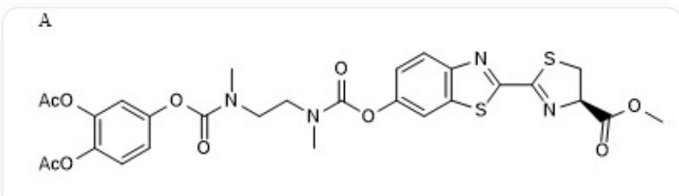
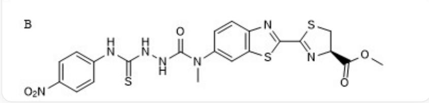
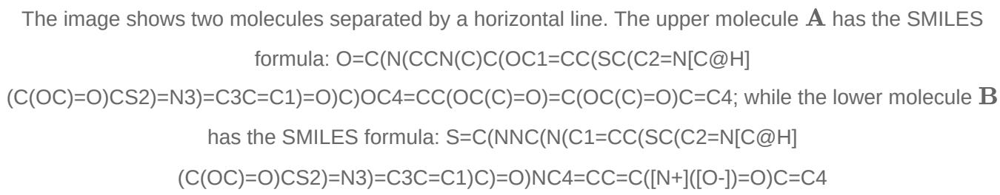
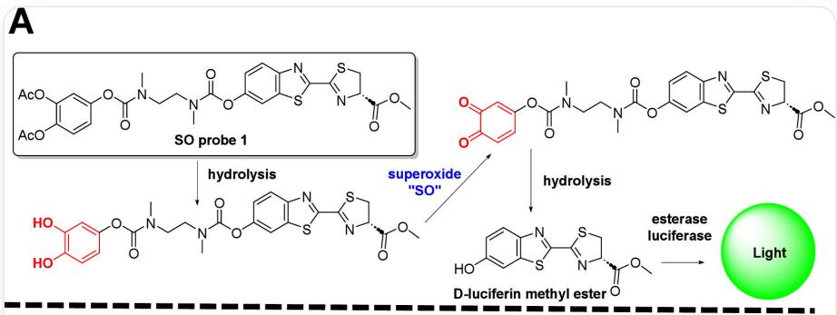
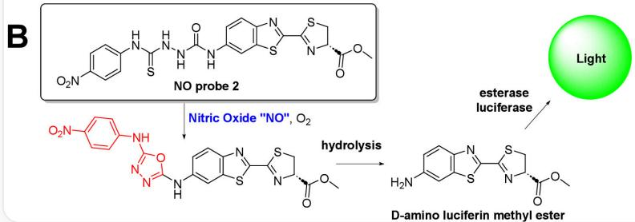
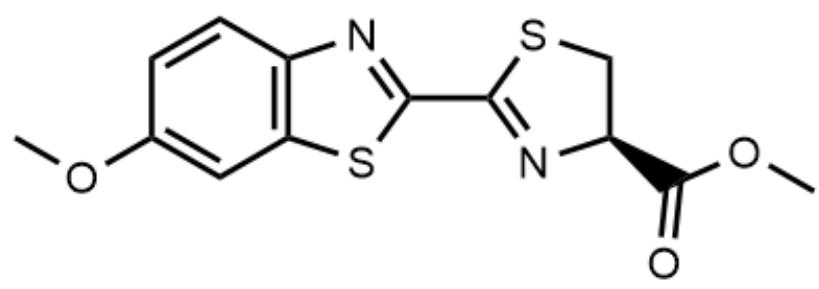
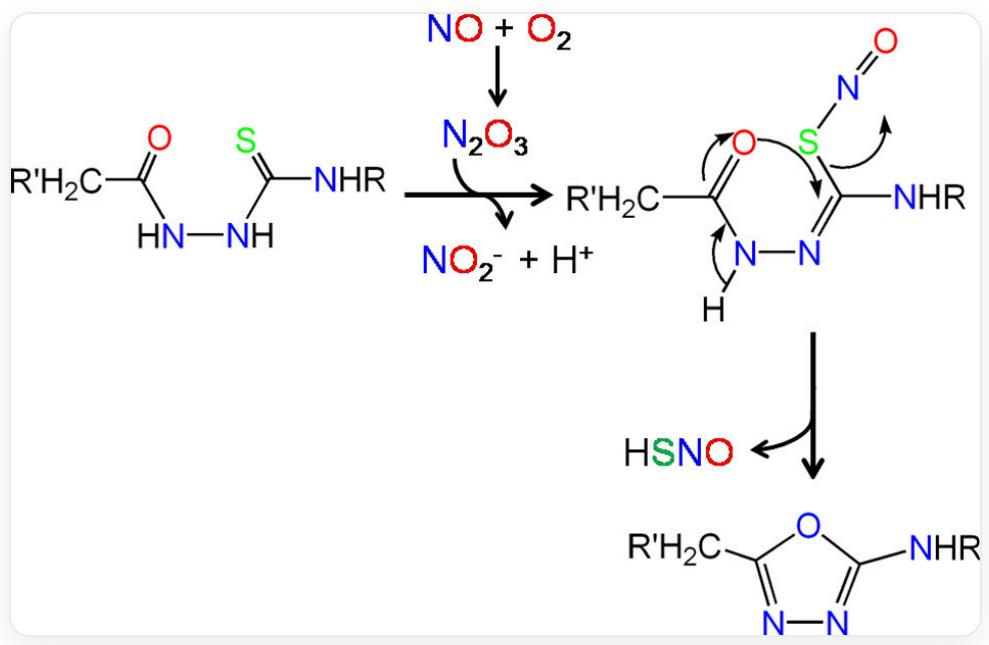

# Question

The regulation of reactive oxygen species such as superoxide and nitric oxide is crucial in biology, affecting metabolism and signaling pathways. Researchers have developed two bioluminescent probes, A and B, which specifically react with superoxide and nitrogen oxides, respectively.

By analyzing the structures of the two compounds, determine which of the following options best aligns with the question's intent.

A. Both molecules A and B can immediately react with superoxide or nitrogen oxides upon entering the cell due to their meticulously optimized structural properties.  
B. Due to the structural properties of molecules A and B, neither can react immediately with superoxide or nitrogen oxides after entering the cell.  
C. After interacting with superoxide, molecule A forms a quinone and establishes a large and stable conjugated system with other groups, thereby directly generating a visible fluorescence signal.

D. The B molecule interacts with nitrogen oxides due to its thiourea-based reactive group, which captures nitric oxide by leveraging the coordination between metal ions (e.g.,  $\mathrm{Hg}^{2+}$ ) and nitric oxide, owing to its ability to bind heavy metal ions.  
E. Whether it is A or B, no biological enzymes are required for fluorescence presentation.  
F. A requires the involvement of biological enzymes before exhibiting fluorescence, while B does not require any biological enzyme participation before fluorescing.  
G. Before  $\mathbf{B}$  exhibits fluorescence, the involvement of biological enzymes is required, whereas  $\mathbf{A}$  does not require any biological enzyme participation before exhibiting fluorescence.  
H. All of the above options are correct.  
1. None of the above options is correct

# Answer

Correct Answer: I

# Detailed Explanation

The researchers developed two bioluminescent probes (A and B) for the selective detection of superoxide and nitric oxide in living organisms. The "bioluminescent probes" used mimic the luminescent mechanism of fireflies in living organisms, where the luminescence process requires the participation of luciferase.

The mechanism of fluorescence generation for probes A and B proposed in the article. From top to bottom and

left to right, the corresponding SMILES are: O=C(N(CCN(C)C(OC1=CC(SC(C2=N[C@H]

$$
(C (O C) = O) C S 2) = N 3) = C 3 C = C 1) = O) C) O C 4 = C C (O C (C) = O) = C (O C (C) = O) C = C 4
$$

$$
O C 1 = C (O) C = C C (O C (N (C C N (C) C (O C 2 = C C (S C (C 3 = N [ C @ H ] (C (O C = O) C S 3) = N 4) = C 4 C = C 2) = O) C) = O) = C 1
$$

$$
O = C 1 C (C = C C (O C (N (C C N (C) C (O C 2 = C C (S C (C 3 = N [ C @ H ] (C (O C) = O) C S 3) = N 4) = C 4 C = C 2) = O) C) = O) = C 1) = O
$$

$$
O C 1 = C C (S C (C 2 = N [ C @ H ] (C (O C) = O) C S 2) = N 3) = C 3 C = C 1 S = C (N N C (N (C 1 = C C (S C (C 2 = N [ C @ H ]
$$

$$
(C (O C) = O) C S 2) = N 3) = C 3 C = C 1) C) = O) N C 4 = C C = C ([ N + ] ([ O - ]) = O) C = C 4 O = C (O C) [ C @ H ]
$$

$$
(C S 1) N = C 1 C 2 = N C 3 = C (S 2) C = C (N C 4 = N N = C (N C 5 = C C = C ([ N + ]) ([ O - ]) = O) C = C 5) O 4) C = C 3
$$

$$
N C 1 = C C (S C (C 2 = N [ C @ H ] (C (O C) = O) C S 2) = N 3) = C 3 C = C 1
$$

# CHECKPOINT

0.5 PTS

Fluorescence generation utilizes the luciferin system

Analysis of the structures reveals that both probe molecules share a common core skeleton with the SMILES formula `O=C(OC)[C@H](CS1)N=C1C2=NC(C=C3)=C(S2)C=C3OC`. This is a derivative of D-luciferin methyl ester, where D-luciferin is the substrate in the firefly luminescence system. It undergoes oxidation catalyzed by ATP and luciferase to produce fluorescence.

SMILES of the luciferin methyl ester group: O=C(OC)[C@H](CS1)N=C1C2=NC(C=C3)=C(S2)C=C3OC

# CHECKPOINT

0.5 PTS

Both probes possess the luciferin skeleton

For  $\mathbf{A}$ , the reaction process proposed in the article is as follows:

Step 1: Deprotection. The acetyl group is typically hydrolyzed by esterases in living organisms, generating the corresponding phenolic hydroxyl group. This is an enzymatic reaction.

# CHECKPOINT

0.5 PTS

Probe A first requires hydrolysis by esterase

Step 2: Reaction with superoxide. After esterase hydrolysis, a catechol structure is formed. This structure is first oxidized to a semiquinone and then further oxidized to an ortho-quinone. Although it forms a certain conjugated structure with the adjacent system, this does not emit fluorescence.

# CHECKPOINT

0.5 PTS

Probe A undergoes an ortho-quinone intermediate

Step 3: Hydrolysis. The ortho-quinone is an electron-deficient system and is rapidly hydrolyzed, followed by the rapid hydrolysis of the phenolic ester on the right side of the D-luciferin methyl ester derivative, leaving behind the D-luciferin methyl ester portion.

Step 4: Hydrolysis by esterase. D-luciferin methyl ester cannot be directly utilized by luciferase; it must first be hydrolyzed by esterase to produce D-luciferin, which can then be oxidized by luciferase to emit fluorescence.

# CHECKPOINT

0.5 PTS

Probe A must undergo esterase hydrolysis before generating fluorescence

For  $\mathbf{B}$ , the reaction process proposed in the article is as follows:

Probe B has a nitrobenzene-modified thiourea-based reactive group at its terminus. Studies indicate that this group can react with nitric oxide in the air to form an oxadiazole intermediate, which is then hydrolyzed to form D-

aminoluciferin methyl ester. Refer to https://pubs.acs.org/doi/10.1021/acs.inorgchem.6b02787 and https://pubs.acs.org/doi/10.1021/acssensors.8b00776

The specific thiourea structure and its reaction mechanism with NO in air, as well as the kinetic studies, do indeed confirm this. ref:https://pubs.acs.org/doi/10.1021/acs.inorgchem.6b02787

# CHECKPOINT

1.0 PTS

Probe B can react directly with NO

D-aminoluciferin methyl ester also requires hydrolysis by esterase before it can be utilized by luciferase. In other words, both A and B require enzymatic processing to generate fluorescence.

# CHECKPOINT

0.5 PTS

Probe B must undergo esterase hydrolysis before generating fluorescence

Thus, we find that none of the options are correct, so we select option I.