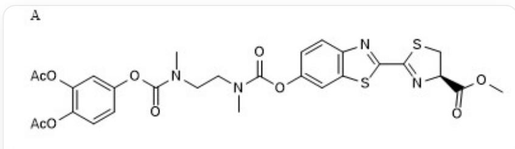
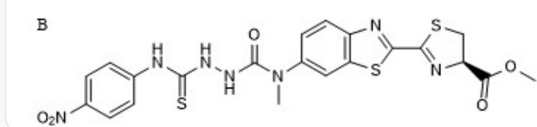
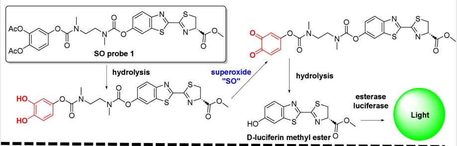
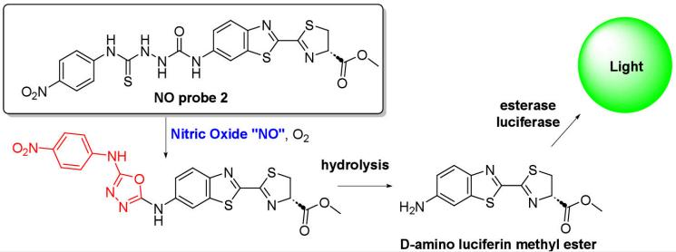
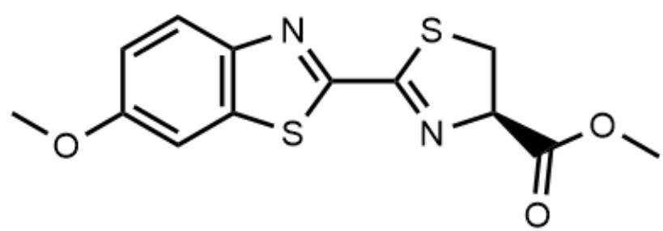
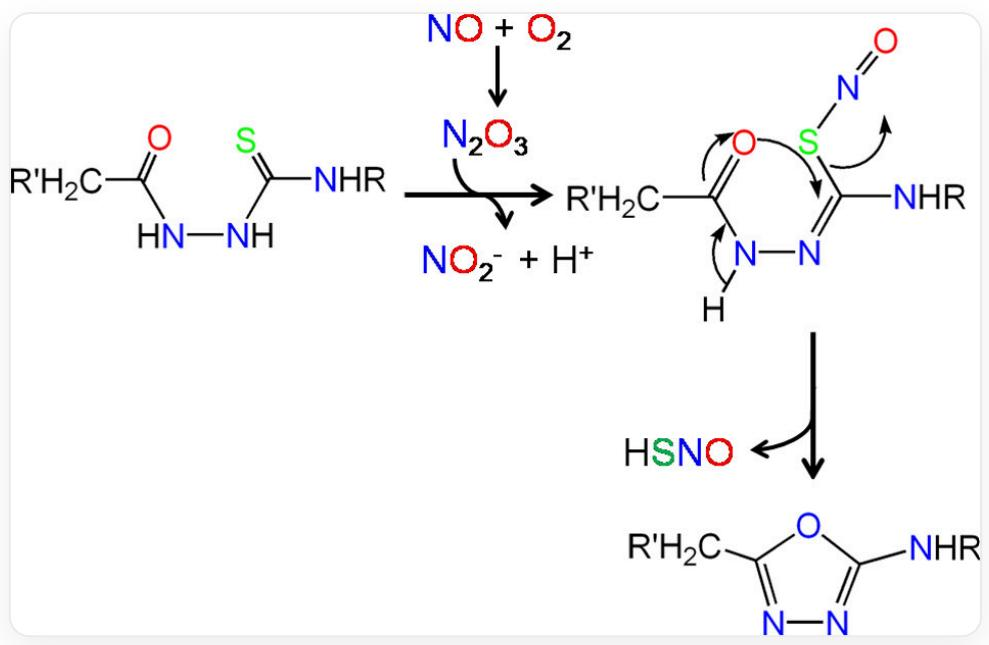

# 题目

超氧化物和一氧化氮等活性氧的调节在生物学中至关重要，影响新陈代谢和信号通路。研究者们开发了两种生物荧光探针A、B，分别和超氧化物及一氧化氮发生特异的反应。

  
图中上下两个分子被一条横线分开，上方的A分子对应的SMILES式为：

$$
O = C (N (C C N (C) C (O C 1 = C C (S C (C 2 = N [ C @ H ]
$$

$$
(\mathrm {C} (\mathrm {O C}) = \mathrm {O}) \mathrm {C S 2}) = \mathrm {N 3}) = \mathrm {C 3 C} = \mathrm {C 1}) = \mathrm {O}) \mathrm {C}) \mathrm {O C 4} = \mathrm {C C} (\mathrm {O C} (\mathrm {C}) = \mathrm {O}) = \mathrm {C} (\mathrm {O C} (\mathrm {C}) = \mathrm {O}) \mathrm {C} = \mathrm {C 4}; \text {而 下 方 的 B 分 子 对 应 的}
$$

$$
S M I L E S 式 为: S = C (N N C (N (C 1 = C C (S C (C 2 = N [ C @ H ]
$$

$$
(C (O C) = O) C S 2) = N 3) = C 3 C = C 1) C) = O) N C 4 = C C = C ([ N + ] ([ O - ]) = O) C = C 4
$$

通过对两种物质结构的分析，判断下面选项哪一个是最贴合题意的。

A. A, B 两种分子均可以因其精心优良的结构性质，在进入细胞之后立刻和超氧化物或一氧化氮进行反应。  
B. 因  $\mathrm{A}, \mathrm{~B}$  两种分子的结构性质, 在进入细胞之后均不可以立刻和超氧化物或一氧化氮进行反应。  
C. A 分子和超氧化物作用后形成醌, 和其他集团形成庞大而稳定的共轭体系, 因此直接产生可见的荧光信号。

D. B 分子和一氧化氮作用后是由于其具有基于硫代氨脲的反应基团, 因其能够结合重金属离子如  $\mathrm{Hg}^{2+}$  等的性质, 利用金属离子和一氧化氮的配位作用捕捉一氧化氮。  
E. 不论是  $\mathbf{A}$  还是  $\mathbf{B}$ , 呈现荧光之前中均不需要任何生物酶参与。  
F. A 呈现荧光之前中需要生物酶参与, B 呈现荧光之前不需要任何生物酶参与。  
G. B 呈现荧光之前中需要生物酶参与, A 呈现荧光之前不需要任何生物酶参与。  
H. 其他的选项均正确。

I. 其他的选项均不正确

# 答案

# 正确答案: I

# 详细解析

研究者们开发了两种生物荧光探针（A和B），用于选择性检测生物体内的超氧化物和一氧化氮。使用的“生物荧光探针”是类似于生物体内萤火虫的发光机制，发光过程需要萤光素酶的参与。

  
A

  
B

文章提出的A、B两种探针产生荧光的机理，从上到下，从左到右对应的SMILES分别是：

$$
O = C (N (C C N (C) C (O C 1 = C C (S C (C 2 = N [ C @ H ]
$$

$$
(C (O C) = O) C S 2) = N 3) = C 3 C = C 1) = O) C) O C 4 = C C (O C (C) = O) = C (O C (C) = O) C = C 4
$$

$$
O C 1 = C (O) C = C C (O C (N (C C N (C) C (O C 2 = C C (S C (C 3 = N [ C @ H ] (C (O C) = O) C S 3) = N 4) = C 4 C = C 2) = O) C) = O) = C 1
$$

$$
O = C 1 C (C = C C (O C (N (C C N (C) C (O C 2 = C C (S C (C 3 = N [ C @ H ] (C (O C) = O) C S 3) = N 4) = C 4 C = C 2) = O) C) = O) = C 1) = O
$$

$$
O C 1 = C C (S C (C 2 = N [ C @ H ] (C (O C) = O) C S 2) = N 3) = C 3 C = C 1 S = C (N N C (N (C 1 = C C (S C (C 2 = N [ C @ H ]
$$

$$
(C (O C) = O) C S 2) = N 3) = C 3 C = C 1) C) = O) N C 4 = C C = C ([ N + ] ([ O - ]) = O) C = C 4 O = C (O C) [ C @ H ]
$$

$$
(C S 1) N = C 1 C 2 = N C 3 = C (S 2) C = C (N C 4 = N N = C (N C 5 = C C = C ([ N + ]) ([ O - ]) = O) C = C 5) O 4) C = C 3
$$

$$
N C 1 = C C (S C (C 2 = N [ C @ H ] (C (O C) = O) C S 2) = N 3) = C 3 C = C 1
$$

# CHECKPOINT

0.5 PTS

产生荧光利用了荧光素系统

分析结构可以发现，两种探针分子都含有一个共同的核心骨架，其SMILES式为`O=C(OC)[C@H](CS1)N=C1C2=NC(C=C3)=C(S2)C=C3OC`。这是一个D-萤光素甲酯的衍生物。其中D-萤光素是萤火虫发光体系中的底物，它在ATP和萤光素酶的催化下氧化产生荧光。

  
荧光素甲酯基团的SMILES: O=C(OC)[C@H](CS1)N=C1C2=NC(C=C3)=C(S2)C=C3OC

# CHECKPOINT

0.5 PTS

两种探针都拥有荧光素骨架

对于  $\mathbf{A}$  来说，文章提出的反应过程如下：

第一步：去保护。乙酰基通常会被生物体内的酯酶水解，生成相应的酚羟基。这是一个酶促反应。

# CHECKPOINT

0.5 PTS

探针A首先需要被水解酶水解

第二步：与超氧化物反应。酯酶水解后，生成邻苯二酚结构。这样的结构先被氧化为半醌，再被氧化为邻苯醌。虽然和旁边的体系形成了一定的共轭结构，但是这并不能发出荧光。

这一步的选择性可能是由于邻苯酚-半醌体系较强的还原性产生的，并且分子中其他位点的氧化可能实际上并不会影响最终的结果。

# CHECKPOINT

0.5 PTS

探针A经过邻苯醌的中间体

第三步：水解。邻苯醌是一个缺电子的体系，它被迅速的水解，接下来被迅速水解的还有右侧荧光素甲酯衍生物的酚酯，留下来荧光素甲酯部分。

第四步：酯酶的水解。荧光素甲酯不能直接被荧光素酶利用，而是必须被酯酶水解产生荧光素，然后才能被荧光素酶氧化后发出荧光。

# CHECKPOINT

0.5 PTS

探针A在产生荧光之前必须经过酯酶水解

对于  $\mathbf{B}$  来说，文章提出的反应过程如下：

探针B的末端有一个硝基苯修饰的，基于硫代氨脲的反应基团。

17年的研究给出了具体的反应机理，18年的研究使用的类似的底物，可以参考：https://pubs.acs.org/doi/10.1021/acs.inorgchem.6b02787和https://pubs.acs.org/doi/10.1021/acssensors.8b00776

  
特异的硫代氨脲结构和空气中NO反应的机理，动力学研究确实如此，ref:https://pubs.acs.org/doi/10.1021/acs.inorgchem.6b02787

指出这一部分可以和空气中的一氧化氮反应，形成一个噁二唑的中间体，然后被水解形成D-氨代荧光素甲酯。

# CHECKPOINT

1.0 PTS

探针B可以直接和NO反应

D-氨代荧光素甲酯也需要被酯酶水解之后才能被荧光素酶利用。也就是说，A，B都需要酶的处理之后才能产生荧光。

# CHECKPOINT

0.5 PTS

探针B在产生荧光之前必须经过酯酶水解

于是我们发现选项均不正确，因此选择选项I。