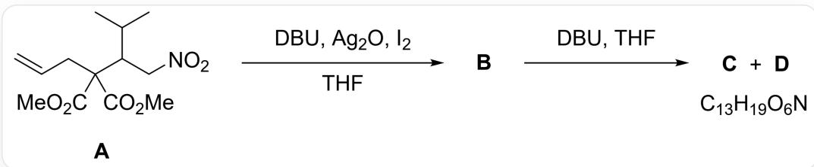
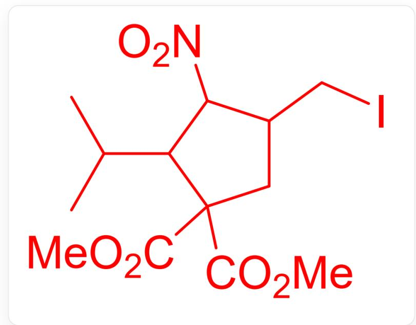
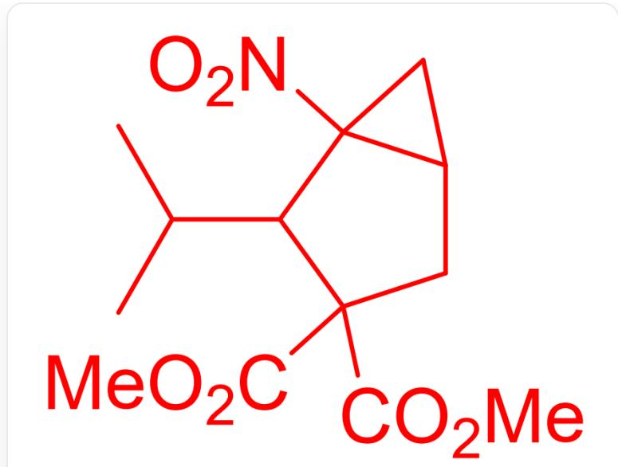
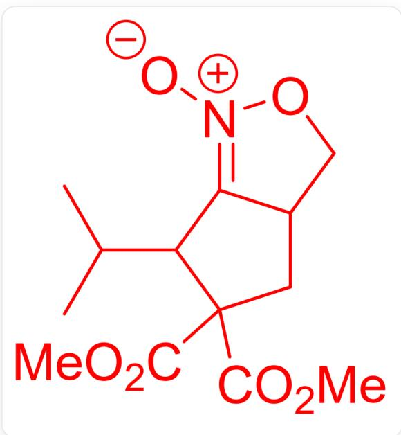
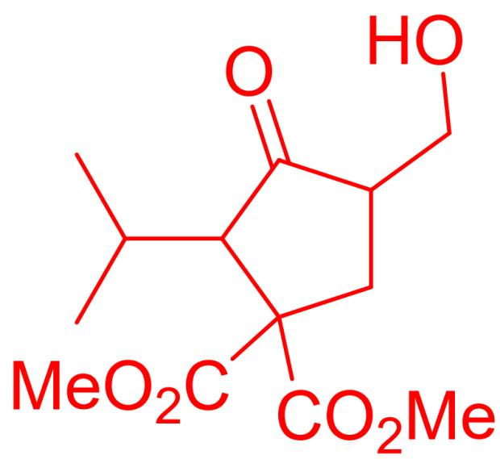

# Question

An organic reaction where the substrate is C=CCC(C(OC)=O)(C(OC)=O)C(C(C)C)C[N+]([O-])=O, denoted as A. A reacts under the conditions of DBU,  $Ag_{2}O$ ,  $I_{2}$ , and THF to generate B. B then reacts under the conditions of DBU and THF to produce C and D, both with the molecular formula  $C_{13}H_{19}O_{6}N$ .

It is known that B contains a five-membered ring, and C and D share the same molecular formula,  $C_{13}H_{19}O_6N$ , with no carbon-carbon double bonds. However, D can react in a methanol-water solution of HCl to yield a nitrogen-free compound E. Which of the following statements about the structures of B, C, D, and E (excluding stereochemistry) is correct?

A. The degree of unsaturation of B and A is different.  
B. The degree of unsaturation of C is the same as that of B.  
C. D has a structure of existence and ring  
D. D contains a keto-oxime structure  
E. The molecular formula of E is  $C_{13}H_{18}O_6$  
F. None of the above options are correct

# Answer

Correct Answer: C

# Detailed Explanation

B=

  
ICC1CC(C(OC)=O)(C(OC)=O)C(C1[N+]([O-])=O)C(C)C

C=

CC(C)C1C2(CC2CC1(C(=O)OC)C(=O)OC)[N+](=O)[O-]

D=

CC(C)C1C2=[N+]([O-])OCC2CC1(C(=O)OC)C(=O)OC

E=

CC(C)C1C(=O)C(CC1(C(=O)OC)C(=O)OC)CO

Under alkaline conditions, the  $\alpha$ -position of the nitro group in A generates a carbanion, which attacks the carbon-carbon double bond activated by  $I_{2}$ , leading to intramolecular cyclization to form B.

# CHECKPOINT

0.5 PTS

Intramolecular cyclization to form B

Under alkaline conditions, the  $\alpha$ -position of the nitro group in B generates a carbanion, which attacks the intramolecular carbon-iodine bond, resulting in intramolecular formation of a three-membered ring to yield C or D. Alternatively, the negatively charged oxygen in the nitro group attacks the carbon-iodine bond, leading to intramolecular formation of a five-membered ring to yield C or D. The product of the former reaction cannot yield a nitrogen-free compound in a methanol-water solution of HCl, so C is obtained. The product of the latter reaction, due to the presence of an electrophilic carbon-nitrogen double bond, can yield a nitrogen-free compound in a methanol-water solution of HCl, resulting in D.

# CHECKPOINT

1 PTS

Intramolecular formation of a three-membered ring to yield C

# CHECKPOINT

1 PTS

Intramolecular formation of a five-membered ring to yield D

The hydrolysis process of D converts the carbon-nitrogen double bond into a carbon-oxygen double bond, followed by the elimination of nitrous acid to generate E, with the molecular formula  $C_{13}H_{20}O_6$ , making option E incorrect.

# CHECKPOINT

1 PTS

The molecular formula of E is  $C_{13}H_{20}O_6$

The process from A to B involves the loss of one  $\pi$  bond but the formation of a ring, leaving the degree of unsaturation unchanged. The process from B to C involves the formation of a ring, increasing the degree of unsaturation by 1. Options A and B are incorrect.

# CHECKPOINT

0.5 PTS

A and B have the same degree of unsaturation

# CHECKPOINT

0.5 PTS

C has one more degree of unsaturation than B

D features a fused five-five structure without an oxime moiety, making option C correct and option D incorrect.