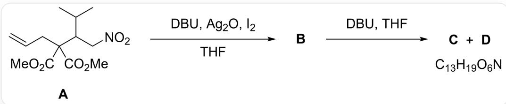
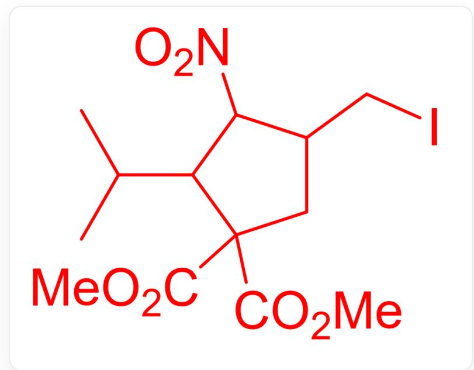
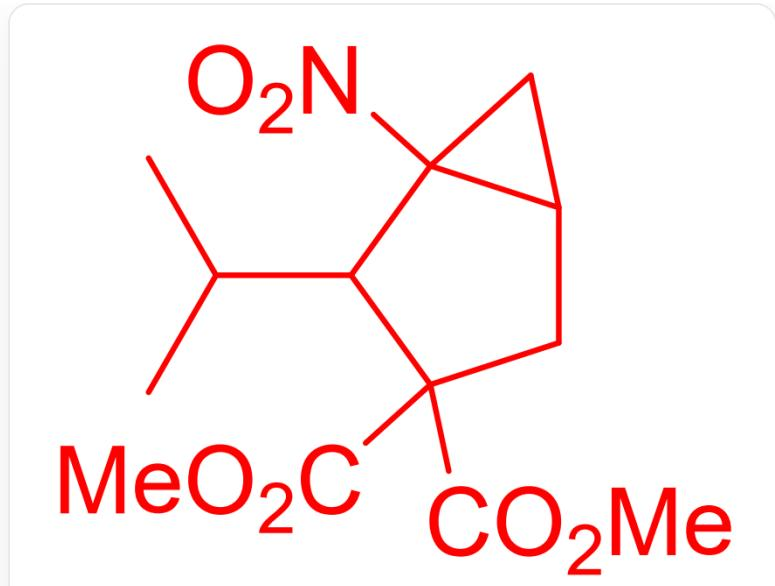
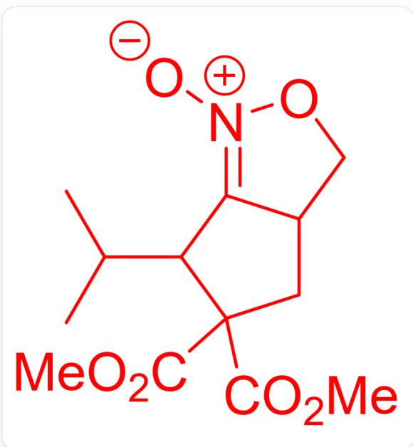

# 题目

一个有机反应，底物是C=CCC(C(OC)=O)(C(OC)=O)C(C(C)C)[N+]([O-])=O，记为A。A在DBU,Ag2O,I2和THF的条件下生成B。B在DBU和THF的条件下生成C和D，而C和D的分子式都是  $C_{13}H_{19}O_6N$  。

已知B含有五元环，C和D的分子式相同，均为  $C_{13}H_{19}O_{6}N$  且均不含碳碳双键，但D可在HCI的甲醇水溶液中反应得到不含氮的化合物E。关于B、C、D、E的结构(不要求立体化学)说法正确的选项是什么？

A. B和A的不饱和度不同  
B. C的不饱和度和B相同  
C. D存在并环结构  
D. D存在酮肟结构  
E. E的分子式是  $C_{13}H_{18}O_{6}$  
F. 以上选项均不对

# 答案

正确答案: C

# 详细解析

B=

  
ICC1CC(C(OC)=O)(C(OC)=O)C(C1[N+]([O-])=O)C(C)C

C=

CC(C)C1C2(CC2CC1(C(=O)OC)C(=O)OC)[N+](=O)[O-]

D=

CC(C)C1C2=[N+]([O-])OCC2CC1(C(=O)OC)C(=O)OC

E=

CC(C)C1C(=O)C(CC1(C(=O)OC)C(=O)OC)CO

A在碱性条件下硝基的  $\alpha$  位生成碳负离子, 碳负离子进攻被  $I_{2}$  活化的碳碳双键, 分子内成环形成  $\mathrm{B}$  。

# CHECKPOINT

0.5 PTS

分子内成环形成B

B在碱性条件下硝基的  $\alpha$  位生成碳负离子，进攻分子内的碳碘键，分子内成三元环形成C或D；另一种反应方式是硝基中带负电的氧进攻碳碘键，分子内成五元环形成C或D。前一种反应产物无法在HCI的甲醇水溶液中反应得到不含氮的化合物，所以得到的是C；后一种反应产物因为有亲电的碳氮双键，可以在HCI的甲醇水溶液中反应得到不含氮的化合物，得到的是D。

# CHECKPOINT

1 PTS

分子内成三元环形成C

# CHECKPOINT

1 PTS

分子内成五元环形成D

D的水解过程将碳氮双键变为碳氧双键，再脱去亚硝酸分子，生成E，其分子式为  $C_{13}H_{20}O_{6}$ ，E选项错误。

# CHECKPOINT

1 PTS

E的分子式为  $C_{13}H_{20}O_{6}$

A到B的过程减少了一个  $\pi$  键，但成了一个环，不饱和度不变，B到C的过程成了一个环，不饱和度提升1。  
A,B选项错误。

# CHECKPOINT

0.5 PTS

A和B的不饱和度相同

# CHECKPOINT

0.5 PTS

C比B的不饱和度多1

D存在五并五结构，没有酮肟结构，C选项正确，D选项错误。