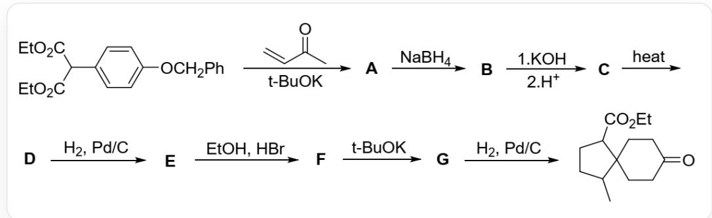
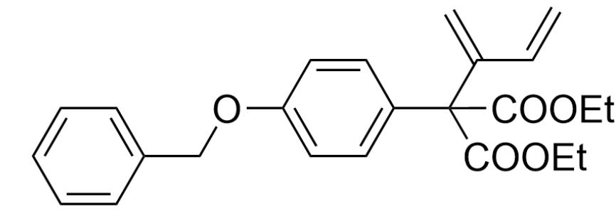
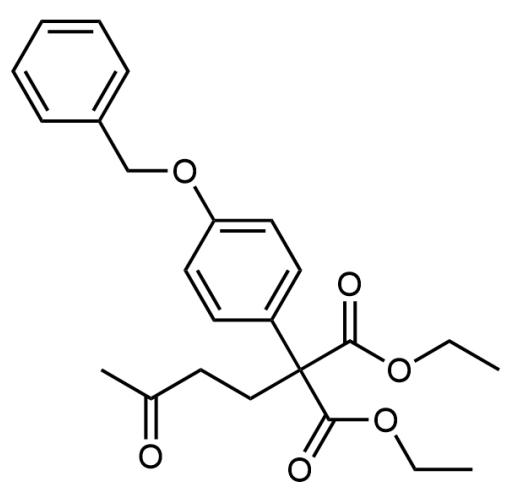
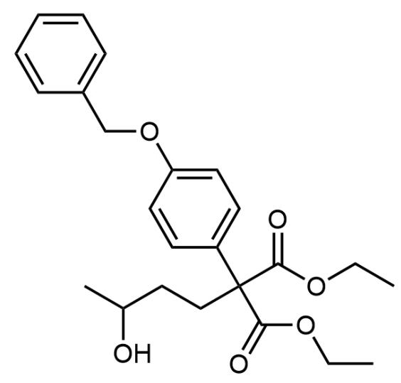
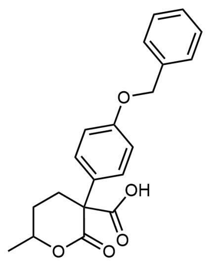
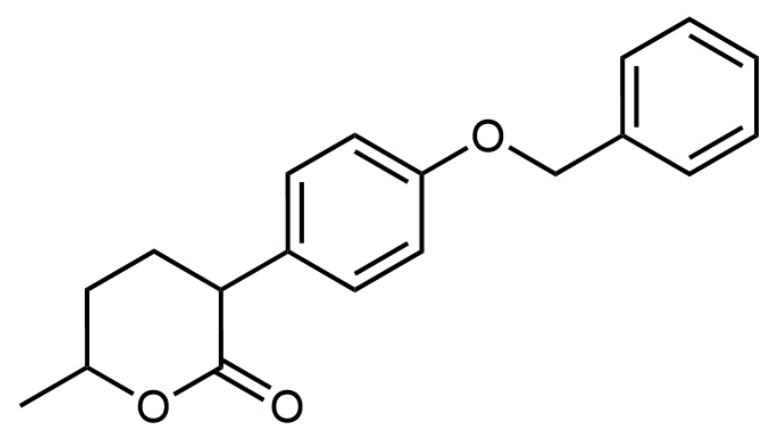
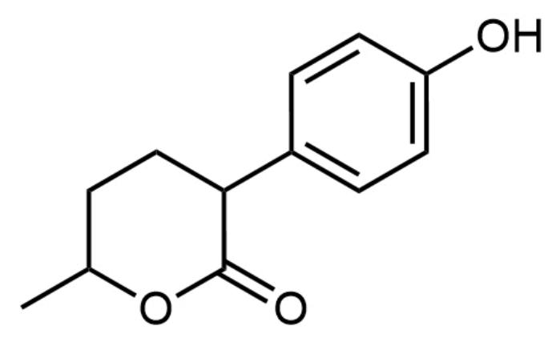
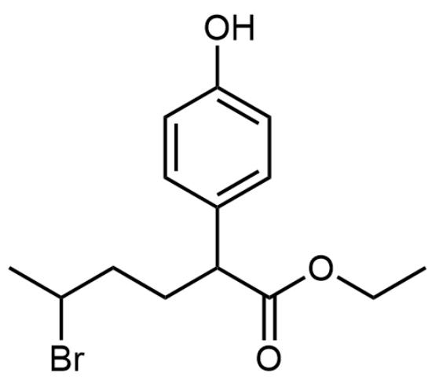
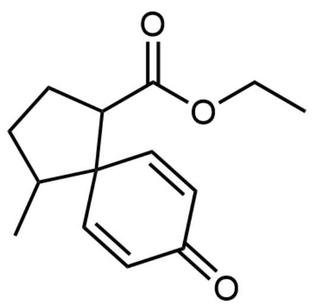

# 题目

螺环化合物的构建常采用对位取代的富电子苯环作为底物,通过一系列反应破坏苯环芳香性完成对螺环体系的构建。如下图所示反应,使用对位取代的苄氧基苯作为底物,通过一系列反应完成对螺-[5.6]环系的构建:

该图片描述了一个有机合成路线。其合成路线可描述为：

CCOC(C(C(OCC) = O)C1 = CC = C(OCC2 = CC = CC = C2) C = C1) = O > CC(C)(O[K]) C. C = CC(C) = O > [A], [A] > NaBH4 > [B], [B] > 1. KOH, 2.H+ > [C], [C] > heat > [D], [D] > H2, Pd/C > [E], [E] > EtOH, HBr > [F], [F] > CC(C) (O[K]) C > [G], [G] > H2, Pd/C > CCOC (= O) C1CCC(C) C21CCC (= O) CC2。其中，[1] > "2" > [3] 表示该步反应为底物1在条件2的作用下生成产物3。上述合成路线中A-G均为未知物种，B-C的反应，先加入氢氧化钾，后加入氢离子。

已知A和B除了苯环外不含其他的环，下列说法中正确的是：

A. A的结构式为

$$
C = C (C = C) C (C (O C C) = O) (C (O C C) = O) C 1 = C C = C (O C C 2 = C C = C C = C 2) C = C 1
$$

B. B中含有两种化学环境的羟基  
C. C中含有1个手性碳原子  
D. D的化学式为  $\mathrm{C}_{19} \mathrm{H}_{21} \mathrm{O}_{2}$  
E. E的结构含有三个环  
F. F在酸性条件下水解后的产物可与苯胺反应, 生成含三个六元环的产物  
G. 生成  $\mathrm{G}$  的反应为芳香亲核取代反应

# 答案

正确答案: F

# 详细解析

底物为  $\beta$ -二羰基化合物，碱性条件下极易形成  $\alpha$  位的烯醇负离子，与  $\alpha, \beta$ -不饱和酮发生Michael加成，得到A，结构为CC(CC(C(OCC)=O)(C(OCC)=O)C1=CC=C(OCC2=CC=CC=C2)C=C1)=O，不生成选项A的理由是因为根据软硬酸碱理论，电荷离域大的烯醇负离子会更倾向于亲核  $\alpha, \beta$ -不饱和酮的更软的碳位点，故选项A错误。

  
A

CHECKPOINT

1 PTS

A结构为CC(CCC(C(OCC)=O)(C(OCC)=O)C1=CC=C(OCC2=CC=CC=C2)C=C1)=O

# CHECKPOINT

1 PTS

电荷离域大的烯醇负离子会更倾向于亲核  $\alpha, \beta$ -不饱和酮的更软的碳位点

之后硼氢化钠用于还原酮羰基为醇羟基，酯基不会被还原，B结构式为CC(O)CCC(C(OCC)=O)  $(\mathrm{C}(\mathrm{OCC}) = 0)\mathrm{C}1 = \mathrm{CC} = \mathrm{C}(\mathrm{OCC}2 = \mathrm{CC} = \mathrm{CC} = \mathrm{C}2)\mathrm{C} = \mathrm{C}1$  ，只存在一种羟基，选项B错误。

  
B

# CHECKPOINT

0.5 PTS

硼氢化钠用于还原酮羰基为醇羟基，酯基不会被还原

# CHECKPOINT

1 PTS

B结构式为CC(O)CCC(C(OCC)=O)(C(OCC)=O)C1=CC=C(OCC2=CC=CC=C2)C=C1，只存在一种羟基，选项B错误。

生成C的反应首先加入强碱氢氧化钾，两个酯基都会水解为羧酸；之后酸化，可以发现分子内的醇羟基可以与羧基发生分子内的酯化反应形成稳定的六元环，故C的结构为O=C(O)C1(CCC(C)OC1=O)C2=CC=C(OCC3=CC=CC=C3)C=C2，含有两个手性碳原子，选项C错误。

  
C

# CHECKPOINT

1 PTS

分子内的醇羟基可以与羧基发生分子内酯化形成六元环

# CHECKPOINT

1 PTS

C的结构为O=C(O)C1(CCC(C)OC1=O)C2=CC=C(OCC3=CC=CC=C3)C=C2，含有两个手性碳原子，选项C错误。

加热条件下，四级碳上的羧基不稳定，加热容易脱羧得到D，结构式为 $\mathrm{O = C1OC(C)CCC1C2 = CC = C(OCC3 = CC = CC = C3)C = C2}$ ，化学式为  $\mathrm{C_{19}H_{20}O_3}$ ，选项D错误。

  
D

# CHECKPOINT

1 PTS

四级碳上的羧基不稳定，加热容易脱羧

# CHECKPOINT

1 PTS

D为O=C1OC(C)CCC1C2=CC=C(OCC3=CC=CC=C3)C=C2，化学式为  $\mathrm{C_{19}H_{20}O_3}$ ，选项D错误。

加入氢气和钯/碳催化剂是脱去苄基的常见反应，E的结构式为OC1=CC=C(C2CCC(C)OC2=O)C=C1，含两个环，选项E错误。

  
E

# CHECKPOINT

1 PTS

E的结构式为OC1=CC=C(C2CCC(C)OC2=O)C=C1，含两个环，选项E错误。

E含有六元环内酯结构，在溴化氢条件下容易水解，由于乙醇的存在，发生类似于酯交换的反应，六元环开环，原来的醇羟基会被溴离子取代，从而F结构式为OC1=CC=C(C(C(OCC)=O)CCC(Br)C)C=C1。

  
F

# CHECKPOINT

1 PTS

E含有六元环内酯结构，在溴化氢条件下容易水解，六元环开环

# CHECKPOINT

1 PTS

F结构式为OC1=CC=C(C(C(OCC)=O)CCC(Br)C)C=C1

该结构与苯胺反应，氮原子可以同时亲核溴和酯基，重新形成六元环结构产物 $\mathrm{OC1 = CC = C(C2CCC(N(C3 = CC = CC = C3)C2 = O)C)C = C1}$ ，含三个六元环，选项F正确。

# CHECKPOINT

1 PTS

F与苯胺反应产物OC1=CC=C(C2CCC(N(C3=CC=CC=C3)C2=O)C)C=C1，含三个六元环，选项F正确。

题目最后一步为氢气还原，故螺环结构在G中就已经存在，可以看出为酚羟基的对位对溴进行亲核取代，该反应为芳香亲电反应，选项G错误。G的结构式为CCOC(C1CCC(C12C=CC(C=C2)=O)C)=O。

  
G

# CHECKPOINT

0.5 PTS

螺环结构在G中就已经存在

# CHECKPOINT

1 PTS

酚羟基的对位对溴进行亲核取代，该反应为芳香亲电反应，选项G错误

综上，选项F正确。