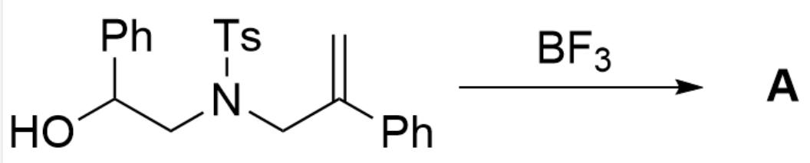
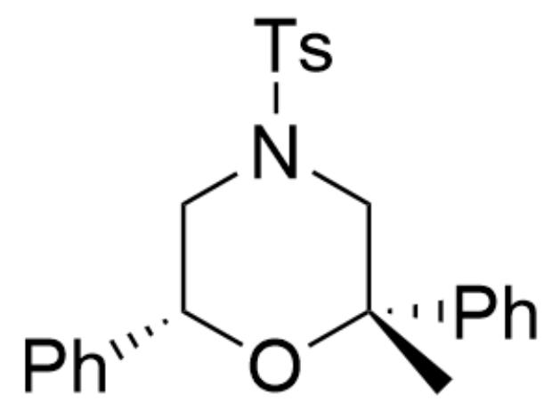
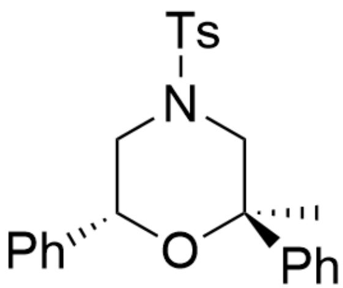
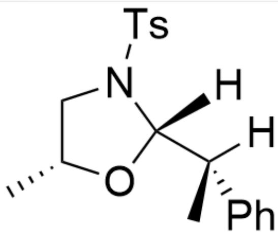
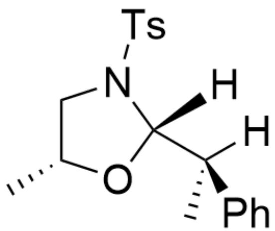
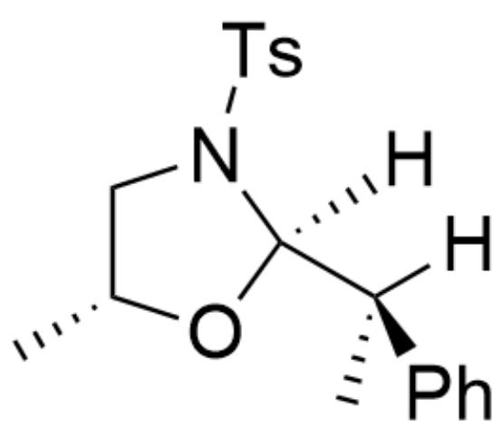
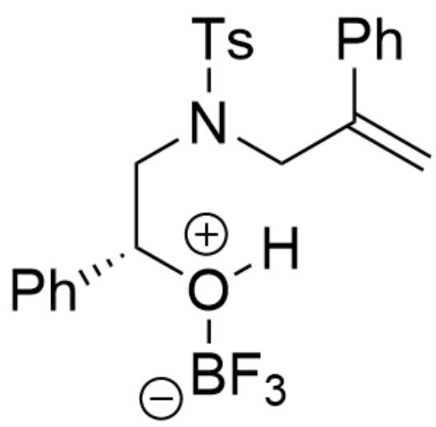
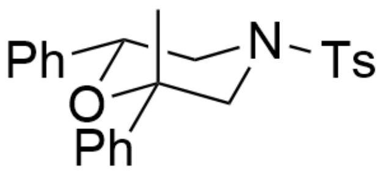

# Question

  
OC(C1=CC=CC=C1)CN(S(C2=CC=C(C)C=C2)(=O)=O)CC(C3=CC=CC=C3)=C>FB(F)F>[A],A is the reaction product

Given that  $\mathbf{A}$  contains four rings. Without considering enantiomers, write the structural formula of  $\mathbf{A}$ .

A. All other options are incorrect  
B.

  
C[C@@]1(C2=CC=CC=C2)O[C@H](C3=CC=CC=C3)CN(S(C4=CC=C(C)C=C4)(=O)=O)C1

C.

  
D.

C[C@]1(C2=CC=CC=C2)O[C@H](C3=CC=CC=C3)CN(S(C4=CC=C(C)C=C4)(=O)=O)C1

  
E.

C[C@@H]1CN(S(C2=CC=C(C)C=C2)(=O)=O)[C@]([H])([C@@](C)(C3=CC=CC=C3)[H])O1

  
F.

clipboard_image_1753890900523

  
G.

C[C@@H]1CN(S(C2=CC=C(C)C=C2)(=O)=O)[C@]([H])([C@](C)(C3=CC=CC=C3)[H])O1

C[C@@H]1CN(S(C2=CC=C(C)C=C2)(=O)=O)[C@@]([H])([C@](C)(C3=CC=CC=C3)[H])O1

# Answer

Correct Answer: B

# Detailed Explanation

From the hint that  $\mathbf{A}$  has four rings, it can be seen that an extra ring was formed in the reaction

# CHECKPOINT

1 PTS

From the hint that  $\mathbf{A}$  has four rings, it can be seen that an extra ring was formed in the reaction

$\mathrm{BF}_3$  is a Lewis acid, which first coordinates with the hydroxyl group to enhance the acidity of hydrogen

# CHECKPOINT

1 PTS

$\mathrm{BF}_3$  is a Lewis acid, which first coordinates with the hydroxyl group to enhance the acidity of hydrogen

C=C(C1=CC=CC=C1)CN(S(C2=CC=C(C)C=C2)(=O)=O)C[C@@H](C3=CC=CC=C3)[O+]([B-](F)(F)F)[H]

# CHECKPOINT

1 PTS

Intermediate 1: C=C(C1=CC=CC=C1)CN(S(C2=CC=C(C)C=C2)(=O)=O)C[C@@H

Then the double bond is protonated to form a stable carbocation

# CHECKPOINT

1 PTS

Then the double bond is protonated to form a stable carbocation

C[C+](C1=CC=CC=C1)CN(S(C2=CC=C(C)C=C2)(=O)=O)C[C@@H](C3=CC=CC=C3)O[B-](F)(F)F

# CHECKPOINT

1 PTS

Intermediate

2:

$\mathrm{C}[\mathrm{C} + ](\mathrm{C}1 = \mathrm{CC} = \mathrm{CC} = \mathrm{C}1)\mathrm{CN}(\mathrm{S}(\mathrm{C}2 = \mathrm{CC} = \mathrm{C}(\mathrm{C})\mathrm{C} = \mathrm{C}2)(= \mathrm{O}) = \mathrm{O})\mathrm{C}[\mathrm{C}@\mathbf{\alpha}\mathbf{H}]$

$$
(\mathrm {C} 3 = \mathrm {C C} = \mathrm {C C} = \mathrm {C} 3) \mathrm {O} [ \mathrm {B} - ] (\mathrm {F}) (\mathrm {F}) \mathrm {F}
$$

Since the intramolecular six-membered ring formation is relatively rapid and the carbocation is relatively stable, rearrangement is not considered

# CHECKPOINT

1 PTS

Since the intramolecular six-membered ring formation is relatively rapid and the carbocation is relatively stable, rearrangement is not considered

The total repulsion of the system is minimal when the benzene ring is in the equatorial position, so it tends to form the following conformation, in which both the phenyl group and the p-toluenesulfonyl group are in the equatorial

position, and the methyl group is in the axial position

C[C@@]1(C2=CC=CC=C2)O[C@H](C3=CC=CC=C3)CN(S(C4=CC=C(C)C=C4)(=O)=O)C1

# CHECKPOINT

1 PTS

The total repulsion of the system is minimal when the benzene ring is in the equatorial position

# CHECKPOINT

1 PTS

Final product: C[C@@]1(C2=CC=CC=C2)O[C@H](C3=CC=CC=C3)CN(S(C4=CC=C(C)C=C4)

$(= 0) = 0)\mathrm{C}1$