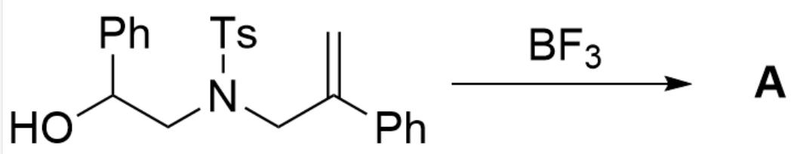
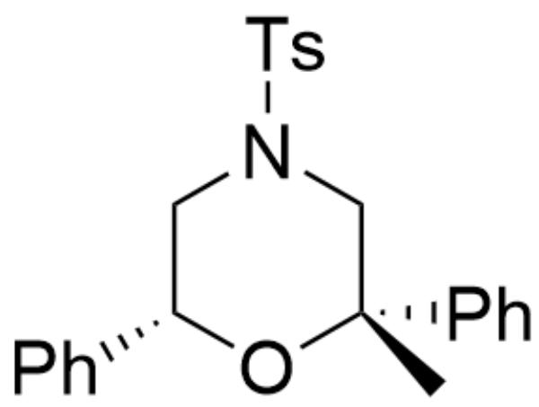
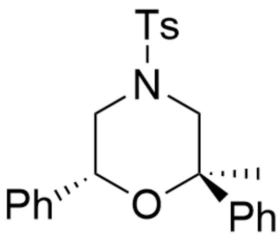
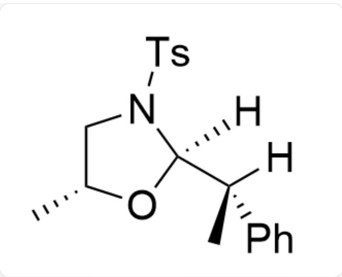
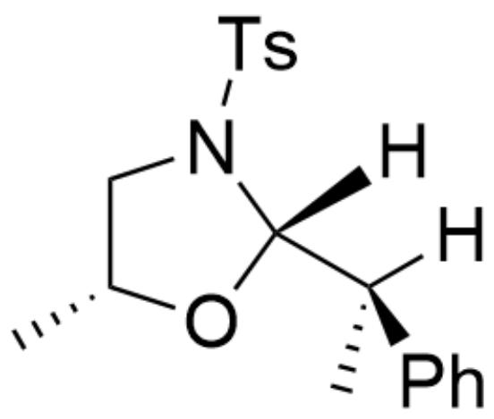
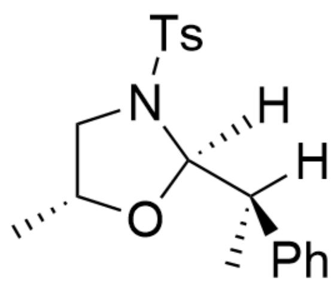
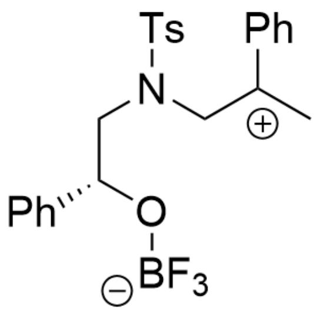
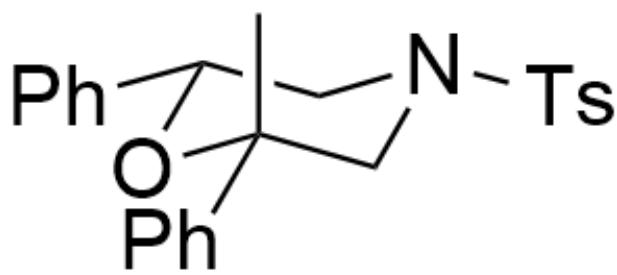

# 题目

  
OC(C1=CC=CC=C1)CN(S(C2=CC=C(C)C=C2)(=O)=O)CC(C3=CC=CC=C3)=C>FB(F)F>[A],A是反应产物

已知  $\mathbf{A}$  中有四个环。不考虑对映异构的情况下，试写出  $\mathbf{A}$  的结构式。

A. 其他选项均不正确  
B.

  
C[C@@]1(C2=CC=CC=C2)O[C@H](C3=CC=CC=C3)CN(S(C4=CC=C(C)C=C4)(=O)=O)C1

C.

  
D.

C[C@]1(C2=CC=CC=C2)O[C@H](C3=CC=CC=C3)CN(S(C4=CC=C(C)C=C4)(=O)=O)C1

  
E.

C[C@@H]1CN(S(C2=CC=C(C)C=C2)(=O)=O)[C@]([H])([C@@](C)(C3=CC=CC=C3)[H])O1

  
F.

clipboard_image_1753890900523

  
G.

C[C@@H]1CN(S(C2=CC=C(C)C=C2)(=O)=O)[C@]([H])([C@](C)(C3=CC=CC=C3)[H])O1

C[C@@H]1CN(S(C2=CC=C(C)C=C2)(=O)=O)[C@@]([H])([C@](C)(C3=CC=CC=C3)[H])O1

# 答案

正确答案: B

# 详细解析

由  $\mathbf{A}$  中有四个环的提示可知该反应额外成了一个环

# CHECKPOINT

1 PTS

由A中有四个环的提示可知该反应额外成了一个环

$\mathrm{BF}_3$  是路易斯酸，首先与羟基配位，增强氢的酸性

# CHECKPOINT

1 PTS

$\mathrm{BF}_3$  是路易斯酸，首先与羟基配位，增强氢的酸性

C=C(C1=CC=CC=C1)CN(S(C2=CC=C(C)C=C2)(=O)=O)C[C@@H](C3=CC=CC=C3)[O+]([B-](F)(F)F)[H]

# CHECKPOINT

1 PTS

中间体1：C=C(C1=CC=CC=C1)CN(S(C2=CC=C(C)C=C2)(=O)=O)C[C@@H

接着双键质子化形成稳定的碳正离子

# CHECKPOINT

1 PTS

接着双键质子化形成稳定的碳正离子

C[C+](C1=CC=CC=C1)CN(S(C2=CC=C(C)C=C2)(=O)=O)C[C@@H](C3=CC=CC=C3)O[B-](F)(F)F

# CHECKPOINT

1 PTS

中间体2：C[C+](C1=CC=CC=C1)CN(S(C2=CC=C(C)C=C2)(=O)=O)C[C@@H](C3=CC=CC=C3)O[B-] (F)(F)F

由于该分子内六元环成环较为迅速，且该碳正离子比较稳定，因此不考虑发生重排

# CHECKPOINT

1 PTS

由于该分子内六元环成环较为迅速，且该碳正离子比较稳定，因此不考虑发生重排

苯环在平伏键时体系总的排斥最小，因此倾向于形成以下构象，其中苯基与对甲苯磺酰基均位于平伏键，甲基处于直立键

C[C@@]1(C2=CC=CC=C2)O[C@H](C3=CC=CC=C3)CN(S(C4=CC=C(C)C=C4)(=O)=O)C1

# CHECKPOINT

1 PTS

苯环在平伏键时体系总的排斥最小

# CHECKPOINT

1 PTS

最终产物：C[C@@]1(C2=CC=CC=C2)O[C@H](C3=CC=CC=C3)CN(S(C4=CC=C(C)C=C4)(=O)=O)C1