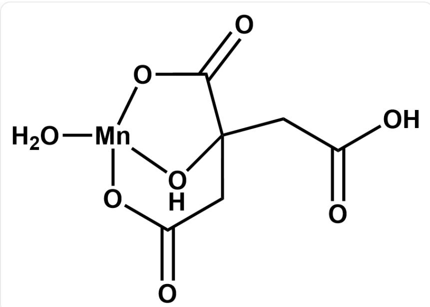

# Question

Extracting metal elements from lithium battery cathode materials is one of the important ways to obtain elemental manganese. A more traditional method for obtaining elemental manganese is to dissolve  $\mathrm{LiMn_2O_4}$  solid with a sulfuric acid solution of hydrogen peroxide, where manganese is reduced to  $\mathrm{Mn(II)}$  in the process (Reaction 1), and then elemental manganese can be obtained by electrochemical means. This traditional method requires the use of high concentrations of inorganic acids, and the conditions are relatively harsh. Therefore, another method for extracting manganese is to treat  $\mathrm{LiMn_2O_4}$  solid with an aqueous solution of citric acid (3-carboxy-3-hydroxypentanedioic acid) at Missing open brace for superscript. As time changes, the reaction system changes from an initial black turbid liquid to a colorless transparent solution (Reaction 2), and then to a white turbid liquid after a period of time (Reaction 3), and a white solid  $\mathbf{X}$  is obtained after filtration.

XRD shows that  $\mathbf{X}$  is a mononuclear complex of Mn, and the mass fraction of the Mn element in  $\mathbf{X}$  is  $20.89\%$ . It is known that Mn in  $\mathbf{X}$  is tetracoordinate and contains a five-membered ring.

$\mathrm{LiMn_2O_4}$  can also be used as a raw material to prepare manganese dioxide with specific crystal forms. Mixing  $\mathrm{LiMn_2O_4}$  solid with  $0.5\mathrm{mol / L}$ $\mathrm{H}_2\mathrm{SO}_4$  and magnetically stirring at room temperature for  $3\mathrm{h}$  can obtain  $\lambda$  crystal form  $\mathrm{MnO_2}$  (Reaction 4).

The following statements are made:

1. In the ionic equation of Reaction 1, the sum of the coefficients on the reactant side and the product side are both odd numbers.  
2. The coefficient of  $\mathrm{CO}_{2}$  in the ionic equation of Reaction 2 is an even number. (If there is no  $\mathrm{CO}_{2}$ , this statement is considered correct)  
3. The coefficient of  $\mathrm{H}_2\mathrm{O}$  in the ionic equation of Reaction 4 is an odd number. (If there is no  $\mathrm{H}_2\mathrm{O}$ , this statement is considered correct)  
4. There is a seven-membered ring in the structure of  $\mathbf{X}$ .

Select the sum of the numbers of the correct statements.

A. All other options are incorrect  
B. 1  
C. 2  
D. 3  
E. 4  
F 5  
G. 6  
H. 7  
1. 8  
J. 9  
K. 10

# Answer

Correct Answer: H

# Detailed Explanation

The molecular weight of  $\mathbf{X}$  is  $54.94 \div 20.89\% = 263.0$ , and after removing manganese, 208.1 remains. Assuming it contains 1 molecule of citric acid, and citric acid has reducing properties, it can be reasonably inferred that Mn is divalent. Therefore, we first assume that citric acid is a hydrogen citrate ion. After subtracting the hydrogen citrate ion, the remaining molecular weight is  $208.1 - 190.1 = 18.0$ , which is likely 1 molecule of water. Therefore, it can be known that  $\mathbf{X}$  is  $\mathrm{Mn}(\mathrm{C}_6\mathrm{H}_6\mathrm{O}_7)\mathrm{H}_2\mathrm{O}$ .

# CHECKPOINT

1 PTS

X is  $\mathrm{Mn}(\mathrm{C}_6\mathrm{H}_6\mathrm{O}_7)\mathrm{H}_2\mathrm{O}$

In  $\mathbf{X}$ , two carboxyl groups of citric acid are deprotonated. Since there is a five-membered ring in the structure, it can be seen that the hydroxyl group and the carboxylate radical at the same position of the hydroxyl group are coordinated. Since it is tetracoordinate, the carboxylate radical at the end of the chain is also coordinated, forming the following structure. It can be seen that there are five-, six-, and seven-membered rings in the structure, so statement 4 is correct.

  
$\mathrm{O = C(CC1(CC(O) = O)[OH]2} \mathrm{O[Mn]2([OH2])OC1 = O}$

# CHECKPOINT

1 PTS

There is a seven-membered ring in the structure of  $\mathbf{X}$

# Reaction 1:

$$
2 \mathrm {L i M n} _ {2} \mathrm {O} _ {4} + 3 \mathrm {H} _ {2} \mathrm {O} _ {2} + 1 0 \mathrm {H} ^ {+} = 4 \mathrm {M n} ^ {2 +} + 2 \mathrm {L i} ^ {+} + 8 \mathrm {H} _ {2} \mathrm {O} + 3 \mathrm {O} _ {2}
$$

Note that the ratio of the coefficients of  $\mathrm{LiMn_2O_4}$  and  $\mathrm{H}_2\mathrm{O}_2$  must be  $2:3$ . Other balanced equations are the coupling of this reaction and the decomposition of hydrogen peroxide. It is easy to know that statement 1 is correct.

# CHECKPOINT

1 PTS

$$
2 \mathrm {L i M n} _ {2} \mathrm {O} _ {4} + 3 \mathrm {H} _ {2} \mathrm {O} _ {2} + 1 0 \mathrm {H} ^ {+} = 4 \mathrm {M n} ^ {2 +} + 2 \mathrm {L i} ^ {+} + 8 \mathrm {H} _ {2} \mathrm {O} + 3 \mathrm {O} _ {2}
$$

# Reaction 2:

$$
6 \mathrm {L i M n} _ {2} \mathrm {O} _ {4} + 3 0 \mathrm {H} ^ {+} + \mathrm {C} _ {6} \mathrm {H} _ {8} \mathrm {O} _ {7} = 6 \mathrm {L i} ^ {+} + 1 2 \mathrm {M n} ^ {2 +} + 1 9 \mathrm {H} _ {2} \mathrm {O} + 6 \mathrm {C O} _ {2}
$$

It is easy to know that statement 2 is correct.

# CHECKPOINT

1 PTS

$$
6 \mathrm {L i M n} _ {2} \mathrm {O} _ {4} + 3 0 \mathrm {H} ^ {+} + \mathrm {C} _ {6} \mathrm {H} _ {8} \mathrm {O} _ {7} = 6 \mathrm {L i} ^ {+} + 1 2 \mathrm {M n} ^ {2 +} + 1 9 \mathrm {H} _ {2} \mathrm {O} + 6 \mathrm {C O} _ {2}
$$

Reaction 3:

$$
\mathrm {M n} ^ {2 +} + \mathrm {H} _ {2} \mathrm {O} + \mathrm {C} _ {6} \mathrm {H} _ {6} \mathrm {O} _ {7} ^ {2 -} = \mathrm {M n} (\mathrm {C} _ {6} \mathrm {H} _ {6} \mathrm {O} _ {7}) \mathrm {H} _ {2} \mathrm {O}
$$

Reaction 4:

$$
2 \mathrm {L i M n} _ {2} \mathrm {O} _ {4} + 4 \mathrm {H} ^ {+} = \mathrm {M n} ^ {2 +} + 3 \mathrm {M n O} _ {2} + 2 \mathrm {L i} ^ {+} + 2 \mathrm {H} _ {2} \mathrm {O}
$$

It is easy to know that statement 3 is wrong.

# CHECKPOINT

1 PTS

$$
2 \mathrm {L i M n} _ {2} \mathrm {O} _ {4} + 4 \mathrm {H} ^ {+} = \mathrm {M n} ^ {2 +} + 3 \mathrm {M n O} _ {2} + 2 \mathrm {L i} ^ {+} + 2 \mathrm {H} _ {2} \mathrm {O}
$$

In summary, the correct statements are 1, 2, and 4, and the sum is 7.