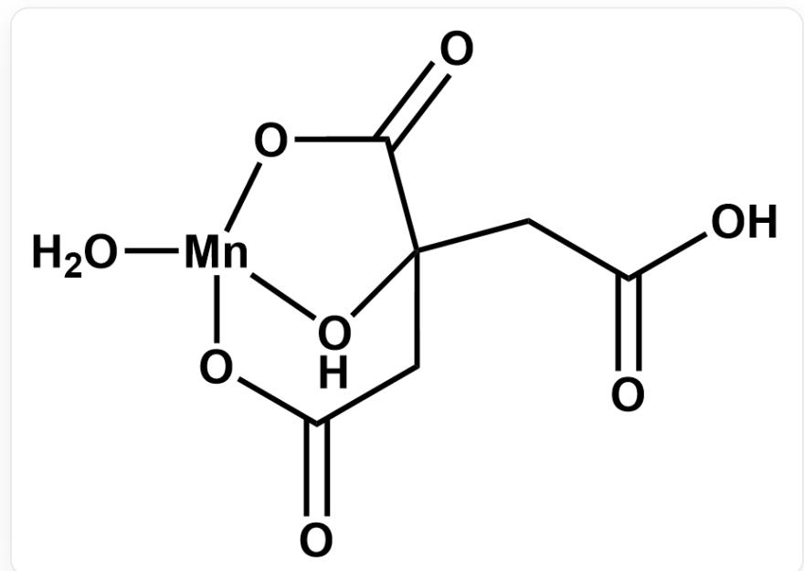

# 题目

从锂电池阴极材料中提取金属元素是获取锰单质的重要途径之一。比较传统的获得锰单质的方法是将  $\mathrm{LiMn_2O_4}$  固体用过氧化氢的硫酸溶液溶解，锰在该过程中被还原为  $\mathrm{Mn(II)}$  （反应1)，之后通过电化学的手段即可获得锰单质。这种传统的方法需要使用高浓度的无机酸，条件相对来说比较剧烈。因此，另一种提取锰元素的方法是在 Missing open brace for superscript 下用柠檬酸(3-羧基-3-羟基戊二酸)水溶液处理  $\mathrm{LiMn_2O_4}$  固体，随着时间的变化，反应体系从一开始的黑色浑浊液转化为无色透明溶液（反应2)，一段时间后又变为白色浑浊液（反应3)，过滤后得到白色固体  $\mathbf{X}$  。

XRD表明  $\mathbf{X}$  为Mn的单核配合物，且  $\mathbf{X}$  中Mn元素的质量分数为  $20.89\%$  。已知  $\mathbf{X}$  中Mn为四配位，含有一个五元环。

以  $\mathrm{LiMn_2O_4}$  为原料还可以制备特定晶型的二氧化锰。将  $\mathrm{LiMn_2O_4}$  固体与  $0.5\mathrm{mol / LH_2SO_4}$  混合，室温下磁搅拌  $3\mathrm{h}$  即可得到  $\lambda$  晶型的  $\mathrm{MnO_2}$  （反应4）。

有如下说法：

1.反应1离子方程式中反应物侧、产物侧分别的系数和均为奇数。  
2. 反应2离子方程式中  $\mathrm{CO}_{2}$  的系数为偶数。（若无  $\mathrm{CO}_{2}$ ，该说法视为正确）  
3. 反应4离子方程式中  $\mathrm{H}_2\mathrm{O}$  的系数为奇数。（若无  $\mathrm{H}_2\mathrm{O}$ ，该说法视为正确）  
4. X 的结构中存在七元环。

选出正确说法的编号之和。

A. 其他选项均不正确  
B. 1  
C. 2

D. 3  
E. 4  
F. 5  
G. 6  
H. 7  
1. 8  
J. 9  
K. 10

# 答案

正确答案: H

# 详细解析

X的分子量为  $54.94 \div 20.89\% = 263.0$  ，除去锰还剩208.1。假设含有1分子柠檬酸，柠檬酸有还原性，可以合理推测Mn为二价，故首先假设柠檬酸为柠檬酸氢根，扣除柠檬酸氢根后分子量剩余 $208.1 - 190.1 = 18.0$  ，很可能是1分子水。故可知X为  $\mathrm{Mn(C_6H_6O_7)H_2O}$  。

# CHECKPOINT

1 PTS

X为  $\mathrm{Mn(C_6H_6O_7)H_2O}$

X 中柠檬酸的两个羧基被去质子，由于结构存在五元环，可知羟基和羟基同位的羧酸根进行配位。由于为四配位，链末端的羧酸根也进行配位，形成如下结构。可以看出结构中有五、六、七元环，说法4正确。

$\mathrm{O = C(CC1(CC(O) = O)[OH]2O[Mn]2([OH2])OC1 = O}$

# CHECKPOINT

1 PTS

X的结构中存在七元环

反应1:

$$
2 \mathrm {L i M n} _ {2} \mathrm {O} _ {4} + 3 \mathrm {H} _ {2} \mathrm {O} _ {2} + 1 0 \mathrm {H} ^ {+} = 4 \mathrm {M n} ^ {2 +} + 2 \mathrm {L i} ^ {+} + 8 \mathrm {H} _ {2} \mathrm {O} + 3 \mathrm {O} _ {2}
$$

注意  $\mathrm{LiMn_2O_4}$  和  $\mathrm{H}_2\mathrm{O}_2$  的系数之比必为  $2:3$  ，其他能配平的方程式都是此反应和过氧化氢分解的耦合。易知说法1正确。

# CHECKPOINT

1 PTS

$$
2 \mathrm {L i M n} _ {2} \mathrm {O} _ {4} + 3 \mathrm {H} _ {2} \mathrm {O} _ {2} + 1 0 \mathrm {H} ^ {+} = 4 \mathrm {M n} ^ {2 +} + 2 \mathrm {L i} ^ {+} + 8 \mathrm {H} _ {2} \mathrm {O} + 3 \mathrm {O} _ {2}
$$

反应2:

$$
6 \mathrm {L i M n} _ {2} \mathrm {O} _ {4} + 3 0 \mathrm {H} ^ {+} + \mathrm {C} _ {6} \mathrm {H} _ {8} \mathrm {O} _ {7} = 6 \mathrm {L i} ^ {+} + 1 2 \mathrm {M n} ^ {2 +} + 1 9 \mathrm {H} _ {2} \mathrm {O} + 6 \mathrm {C O} _ {2}
$$

易知说法2正确。

# CHECKPOINT

1 PTS

$$
6 \mathrm {L i M n} _ {2} \mathrm {O} _ {4} + 3 0 \mathrm {H} ^ {+} + \mathrm {C} _ {6} \mathrm {H} _ {8} \mathrm {O} _ {7} = 6 \mathrm {L i} ^ {+} + 1 2 \mathrm {M n} ^ {2 +} + 1 9 \mathrm {H} _ {2} \mathrm {O} + 6 \mathrm {C O} _ {2}
$$

反应3:

$$
\mathrm {M n} ^ {2 +} + \mathrm {H} _ {2} \mathrm {O} + \mathrm {C} _ {6} \mathrm {H} _ {6} \mathrm {O} _ {7} ^ {2 -} = \mathrm {M n} (\mathrm {C} _ {6} \mathrm {H} _ {6} \mathrm {O} _ {7}) \mathrm {H} _ {2} \mathrm {O}
$$

反应4:

$$
2 \mathrm {L i M n} _ {2} \mathrm {O} _ {4} + 4 \mathrm {H} ^ {+} = \mathrm {M n} ^ {2 +} + 3 \mathrm {M n O} _ {2} + 2 \mathrm {L i} ^ {+} + 2 \mathrm {H} _ {2} \mathrm {O}
$$

易知说法3错误。

# CHECKPOINT

# 1 PTS

$$
2 \mathrm {L i M n} _ {2} \mathrm {O} _ {4} + 4 \mathrm {H} ^ {+} = \mathrm {M n} ^ {2 +} + 3 \mathrm {M n O} _ {2} + 2 \mathrm {L i} ^ {+} + 2 \mathrm {H} _ {2} \mathrm {O}
$$

综上，正确的说法为1,2,4，和为7。