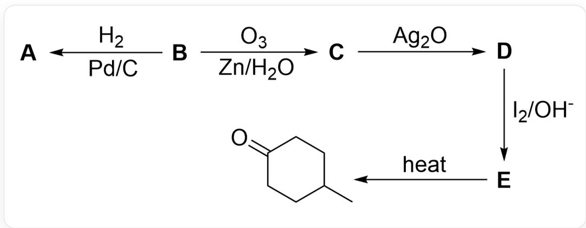
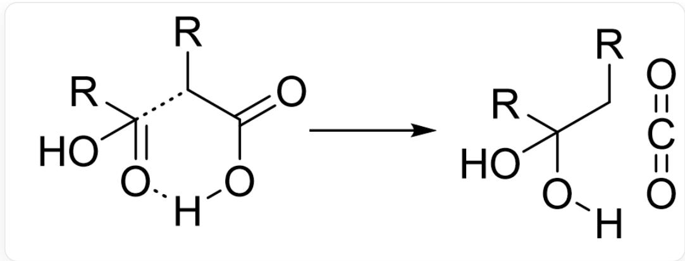
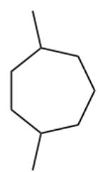
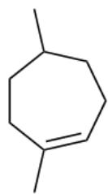
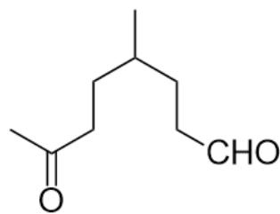
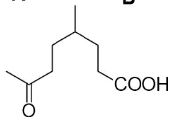
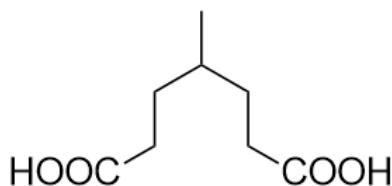

# Question

This image describes several steps of organic synthesis. The substrate is  $\mathbf{B}$  with an unknown structure, which reacts with  $H_{2}, Pd / C$  to produce  $\mathbf{A}$ .  $\mathbf{B}$  reacts with  $O_{3}, Zn / H_{2}O$  to produce  $\mathbf{C}$ .  $\mathbf{C}$  reacts with  $Ag_{2}O$  to produce  $\mathbf{D}$ .  $\mathbf{D}$  reacts with  $I_{2}, OH^{-}$ to produce  $\mathbf{E}$ .  $\mathbf{E}$  under heating conditions yields the final product CC1CCC(CC1)=O.

Regarding the organic reaction in the above image, it is known that:

1. The molecular formula of  $\mathbf{A}$  is  $\mathrm{C_9H_{18}}$ .  
2. The molecular formula of  $\mathbf{C}$  is  $\mathrm{C_9H_{16}O_2}$ .  
3. The molecular formula of  $\mathbf{E}$  is  $\mathrm{C_8H_{14}O_4}$ .

Which of the following descriptions about  $\mathbf{A}$  is correct:

A. All other options are incorrect  
B. A must be chiral  
C. A contains a six-membered ring  
D. A containing a five-membered ring

E. A containing a four-membered ring  
F. A Contains a triple bond  
G. A contains the bonding relationship  $\mathrm{H}_{3} \mathrm{C}-\mathrm{C}-\mathrm{C}-\mathrm{CH}_{3}$  
H. A contains an ethyl group.  
1. A does not contain tertiary carbons  
J. A containing isopropyl  
K. A Containing terminal alkene

# Answer

Correct Answer: A

# Detailed Explanation

This question examines the ability of retrosynthetic analysis.

The final product is 4-methylcyclohexanone, which is generated by heating, and the molecular formula of  $\mathbf{E}$  is  $\mathrm{C_8H_{14}O_4}$ , indicating the loss of one molecule of  $\mathrm{CO}_{2}$  and two molecules of  $\mathrm{H}_2\mathrm{O}$ . Therefore, the first reaction should be decarboxylation, and  $\mathbf{E}$  contains a carboxyl group;

# CHECKPOINT

1 PTS

Heating loses one molecule of  $\mathrm{CO}_{2}$  and two molecules of  $\mathrm{H}_{2} \mathrm{O}$

# CHECKPOINT

1 PTS

$\mathbf{E}$  contains a carboxyl group

The loss of water produces a ketone carbonyl group, and the final product does not have a carbon-carbon double bond. The six-membered ring is entirely composed of carbon atoms, indicating that the loss of one molecule of water is only the dehydration of a hydrated ketal;

# CHECKPOINT

1 PTS

The loss of one molecule of water is only the dehydration of a hydrated ketal

The degree of unsaturation of  $\mathbf{E}$  is calculated to be 2, and it contains a carboxyl group. Therefore,  $\mathbf{E}$  either has a ring or a double bond; if  $\mathbf{E}$  has a ring, then there is no double bond, and the two oxygen atoms other than the carboxyl group can only exist in the form of alcohols; but if there are alcohols, the final product cannot be without a carbon-carbon double bond, so  $\mathbf{E}$  must not have a ring, and there must be another carbonyl group besides the carboxyl group;

# CHECKPOINT

1 PTS

E must not have a ring, and there must be another carbonyl group besides the carboxyl group

Combined with the fact that  $\mathbf{E}$  loses one molecule of water in addition to the dehydration of a hydrated ketal, and the molecular formula of  $\mathbf{E}$  contains four oxygen atoms, consider that  $\mathbf{E}$  contains two carboxyl groups;

E must not have a ring, but the final product is a six-membered ring, so the newly formed carbon-carbon single bond on the ring can only be formed through a decarboxylation reaction; then at this time, we can think of the six-membered ring transition state decarboxylation process, as shown in the figure below:

This figure is a schematic diagram of the six-membered ring transition state decarboxylation; the left side is the state before decarboxylation, where two terminal carboxyl groups form a six-membered ring through the C=O1 of one carboxyl group and the C1-C2-O2-H2 of the other carboxyl group. C1 represents the  $\alpha$  position of the carboxyl group, and C2 represents the carbon atom of the carboxyl group itself; a dashed line is drawn between C and C1, and a dashed line is drawn between H2 and O1. This transition state undergoes a reaction to generate the product on the right side of the figure, where C and C1 are connected, the single bond between C1 and C2 becomes a double bond, O2-H2 breaks, and H2 forms a bond with O1 of the other carboxyl group, forming an O=C=O structure and [H]OC(C[R])(O)[R]. In the figure, R represents other groups connected to the carboxyl group.

# CHECKPOINT

1 PTS

The newly formed carbon-carbon single bond on the ring can only be formed through a decarboxylation reaction

# CHECKPOINT

1 PTS

The decarboxylation reaction goes through a six-membered ring transition state, eventually yielding a hydrated ketal

This process removes one molecule of water and one molecule of carbon dioxide, generating a six-membered ring and eventually yielding a hydrated ketal, which is consistent with the previous deduction, so  $\mathbf{E}$  contains two

terminal carboxyl groups. According to the position of the methyl group in the six-membered ring, the structure of  $\mathbf{E}$  is deduced to be  $\mathrm{CC(CCC(O) = O)CCC(O) = O}$ .

# CHECKPOINT

1 PTS

$\mathbf{E}$  contains two terminal carboxyl groups

# CHECKPOINT

1 PTS

The structure of  $\mathbf{E}$  is CC(CCC(O)=O)CCC(O)=O

$\mathbf{E}$  is generated by the oxidation of  $\mathbf{D}$  with iodine element under basic conditions, and the molecular formula of  $\mathbf{C}$  has 1 more carbon atom than  $\mathbf{E}$ , which is easily thought of as the oxidation process of methyl ketone. Methyl ketone undergoes a haloform reaction to generate carboxylic acid. One carboxylic acid in the structure of  $\mathbf{E}$  is produced by the oxidation of methyl ketone, so the structure of  $\mathbf{D}$  is  $\mathrm{CC(CCC(C) = O)CCC(O) = O}$ .

# CHECKPOINT

1 PTS

One carboxylic acid in the structure of  $\mathbf{E}$  is produced by the oxidation of methyl ketone via iodoform reaction

# CHECKPOINT

1 PTS

The structure of  $\mathbf{D}$  is CC(CCC(C)=O)CCC(O)=O

At this time, the information may not be able to deduce, look back and observe other reactions: the reaction of  $\mathbf{B}$  generating  $\mathbf{C}$  is ozonolysis, which cleaves the double bond to generate two carbonyl groups; therefore,  $\mathbf{B}$  contains an alkene.

The reaction from  $\mathbf{B}$  to  $\mathbf{A}$  is a hydrogenation reaction,  $\mathbf{B}$  contains an alkene, so the chemical formula of  $\mathbf{B}$  can be deduced to be  $\mathrm{C_9H_{16}}$ ; thus, the degree of unsaturation of  $\mathbf{B}$  is 2, and there is an alkene, indicating that  $\mathbf{B}$  contains a ring; the chemical formula of  $\mathbf{B}$  generating  $\mathbf{C}$  only has two more oxygen atoms, so it is judged that  $\mathbf{B}$  has an alkene on the ring, and ozonolysis generates two carbonyl groups.

# CHECKPOINT

1 PTS

B has an alkene on the ring, and ozonolysis generates two carbonyl groups

The condition for  $\mathbf{C}$  to generate  $\mathbf{D}$  is silver oxide, which is a typical reaction of aldehyde being oxidized to carboxylic acid; therefore, the structure of  $\mathbf{C}$  is  $\mathrm{CC(CCC(C) = O)CCC = O}$ .

# CHECKPOINT

1 PTS

C generating D aldehyde is oxidized to carboxylic acid

# CHECKPOINT

1 PTS

The structure of C is CC(CCC(C) = O) CCC = O

According to the ozonolysis reaction, the structure of  $\mathbf{B}$  can be deduced to be CC1CCC=C(C)CC1.

# CHECKPOINT

1 PTS

The structure of  $\mathbf{B}$  is CC1CCC=C(C)CC1

The reaction from  $\mathbf{B}$  to  $\mathbf{A}$  is a hydrogenation reaction, and the structure of  $\mathbf{A}$  is CC1CCCC(C)CC1.

# CHECKPOINT

1 PTS

The structure of  $\mathbf{A}$  is CC1CCCC(C)CC1

According to the structure of  $\mathbf{A}$ , options B-I are all incorrect.

In summary, option A is correct.

  
C

  
A  
B  
D

  
E

This figure shows the structures of the unknown substances  $\mathbf{A} - \mathbf{E}$  involved in this question. The structure of  $\mathbf{A}$  is CC1CCCC(C)CC1; the structure of  $\mathbf{B}$  is CC1CCC=C(C)CC1; the structure of  $\mathbf{C}$  is CC(CCC(C)=O)CCC=O; the structure of  $\mathbf{D}$  is CC(CCC(C)=O)CCC(O)=O; the structure of  $\mathbf{E}$  is CC(CCC(O)=O)CCC(O)=O.