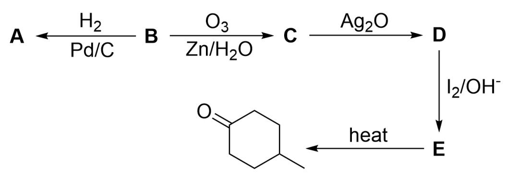
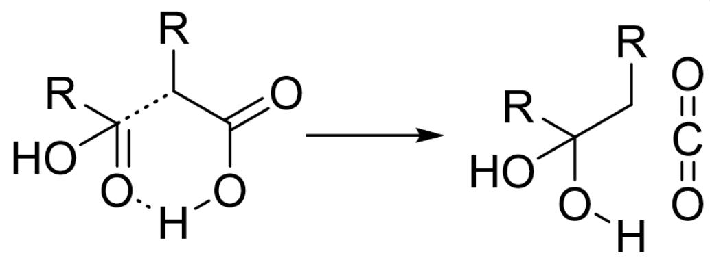
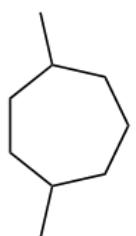
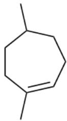
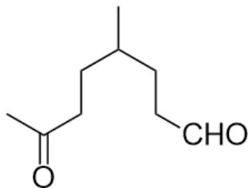
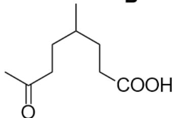
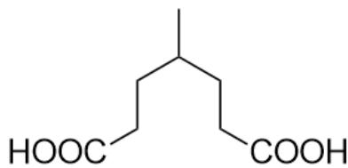

# 题目

本图描述了几步有机合成过程。底物为未知结构的B，与  $H_{2}, Pd / C$  反应生成A，B与  $O_{3}, Zn / H_{2}O$  反应生成C，C与  $Ag_{2}O$  反应生成D，D与  $I_{2}, OH^{-}$ 反应生成E，E加热条件得到最终产物CC1CCC(CC1)=O。

关于上图的有机反应，已知：

1. A 的分子式为  $\mathrm{C}_{9} \mathrm{H}_{18}$  。  
2. C 的分子式为  $\mathrm{C}_{9} \mathrm{H}_{16} \mathrm{O}_{2}$  。  
3.  $\mathbf{E}$  的分子式为  $\mathrm{C}_{8} \mathrm{H}_{14} \mathrm{O}_{4}$  。

下列关于  $\mathbf{A}$  的描述正确的是：

A. 其他选项均不正确  
B. A一定具有手性  
C. A 含有六元环  
D. A 含有五元环

E. A 含有四元环  
F. A 含有三键  
G. A 中存在键联关系  $\mathrm{H}_{3} \mathrm{C}-\mathrm{C}-\mathrm{C}-\mathrm{C}-\mathrm{CH}_{3}$  
H. A 含有一个乙基  
1. A 不含有三级碳  
J. A 含有异丙基  
K. A 含有末端烯烃

# 答案

正确答案: A

# 详细解析

本题考查逆合成推断能力。

最终产物为4-甲基环己酮，经过加热生成且E分子式为  $\mathrm{C_8H_{14}O_4}$  ，说明失去了一分子  $\mathrm{CO}_{2}$  和两分子  $\mathrm{H}_2\mathrm{O}$  。则该步反应首先应为脱羧反应，E中存在羧基；

# CHECKPOINT

1 PTS

加热失去了一分子  $\mathrm{CO}_{2}$  和两分子  $\mathrm{H}_{2} \mathrm{O}$

# CHECKPOINT

1 PTS

E中存在羧基

失去水后产生酮羰基，且最终产物没有碳碳双键，六元环全都为碳原子构成，说明有一分子水的失去只是水合缩酮脱水；

# CHECKPOINT

1 PTS

有一分子水的失去只是水合缩酮脱水

计算  $\mathbf{E}$  不饱和度为2且存在羧基，因此  $\mathbf{E}$  要么存在环要么存在双键；如果  $\mathbf{E}$  存在环，则不存在双键，除羧基外的两个氧原子只能以醇的形式存在；但存在醇最终产物不可能没有碳碳双键，因此  $\mathbf{E}$  一定不存在环，则一定存在除羧基外的另一个羰基；

# CHECKPOINT

1 PTS

E一定不存在环，则一定存在除羧基外的另一个羰基

结合E除水合缩酮脱水之外还有一分子水的失去，且E分子式中含有四个氧原子，考虑E中含有两个羧基；

E一定不存在环但最终产物为六元环，故新生成的环上的碳碳单键只能通过脱羧反应形成；则此时可以想到六元环过渡态脱羧过程，如下图所示：

本图为六元环过渡态脱羧示意图；左边为脱羧前的状态，两个末端羧基通过一个羧基的C=O1和另一个羧基的C1-C2-O2-H2构成六元环，C1代表羧基的α位，C2代表羧基的本身的碳原子；C与C1之间画有虚线，H2与O1之间画有虚线。该过渡态发生反应生成图中右边的产物，C与C1连接，C1与C2的单键变为双键，O2-H2断开，H2与另一个羧基的O1成键，形成O=C=O结构和[H]OC(C[R])(O)[R]。图中R代表连接羧基的其他基团。

# CHECKPOINT

1 PTS

新生成的环上的碳碳单键只能通过脱羧反应形成

# CHECKPOINT

1 PTS

脱羧反应经历六元环过渡态，最终得到水合缩酮

该过程脱去一分子水和一分子二氧化碳，生成了六元环且最终得到水合缩酮，跟之前的推断符合，所以E中含有两个末端羧基。根据六元环甲基位置，推出E结构为CC(CCC(O)=O)CCC(O)=O。

# CHECKPOINT

1 PTS

E中含有两个末端羧基

# CHECKPOINT

1 PTS

E结构为CC(CCC(O)=O)CCC(O)=O

E通过碱性条件碘单质氧化D生成，且C的分子式比E多1个碳原子，很容易想到为甲基酮的氧化过程，甲基酮发生卤仿反应生成羧酸。E结构有一个羧酸是甲基酮氧化产生的，因此D结构为CC(CCC(C)=O)CCC(O)=O。

# CHECKPOINT

1 PTS

E结构有一个羧酸是甲基酮发生碘仿反应氧化产生的

# CHECKPOINT

1 PTS

D 结构为CC(CC(C)=O)CCC(O)=O

此时的信息可能无法推断，回头观察其他反应：B生成C的反应为臭氧化反应，断裂双键生成两个羰基；因此B含有烯烃。

B 到 A 为加氢反应，B 含有烯烃，可倒推 B 的化学式为  $\mathrm{C}_{9} \mathrm{H}_{16}$ ；从而 B 的不饱和度为 2，存在烯烃，说明 B 含有环；B 生成 C 化学式只多了两个氧原子，因此判断 B 存在环上的烯烃，臭氧化后生成两个羰基。

# CHECKPOINT

1 PTS

B存在环上的烯烃，臭氧化后生成两个羰基

C生成D的条件为氧化银，是典型的醛基被氧化为羧酸的反应；因此C的结构为CC(CCC(C)=O)CCC=O。

# CHECKPOINT

1 PTS

C生成D醛基被氧化为羧酸

# CHECKPOINT

1 PTS

C的结构为CC(CC(C)=O)CCC=O

根据臭氧化反应，可倒退B的结构为CC1CCC=CC(C)CC1。

# CHECKPOINT

1 PTS

B 的结构为CC1CCC=C(C)CC1

B 到 A 为加氢反应，A 的结构为CC1CCCC(C)CC1。

# CHECKPOINT

1 PTS

A的结构为CC1CCCC(C)CC1

根据A的结构可知，选项B-I均不正确。

综上，选项A正确。

  
C

  
A  
B  
D

  
E

本图为本题涉及的未知物质结构A - E。A的结构为CC1CCCC(C)CC1；B的结构为CC1CCC=C(C)CC1；C的结构为CC(CCC(C)=O)CCC=O；D结构为CC(CCC(C)=O)CCC(O)=O；E结构为CC(CCC(O)=O)CCC(O)=O。