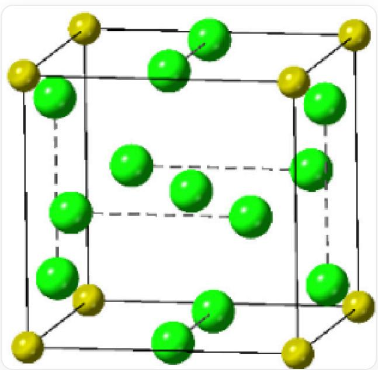
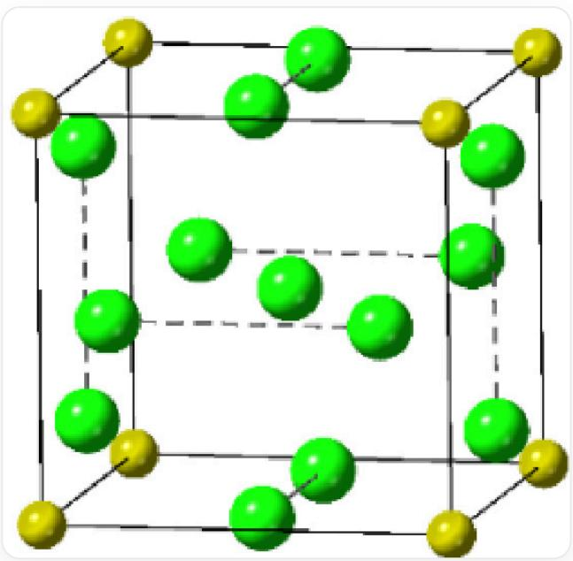

# Question

The structure of sodium chloride is one of the most classic crystal structures. Under extremely high pressure, sodium chloride can combine with several molecules of chlorine to form  $\mathrm{NaCl_x}$ . The figure shows a schematic diagram of the  $\mathrm{NaCl_7}$  primitive cubic crystal cell, where the coordinates of two Cl atoms are (0.5, 0, 0.1671), (0.5, 0, 0.8329).

This figure is the crystal structure diagram of  $\mathrm{NaCl}_7$ , where the yellow spheres are sodium atoms and the green spheres are chlorine ions. The edges of the cube are black solid lines, the yellow spheres are distributed at the vertices of the cube, there is one green sphere at the body center and two on each face, and the two green spheres on the face are connected by dashed lines, where the coordinates of two Cl atoms are (0.5, 0, 0.1671), (0.5, 0, 0.8329)

Where the bond length of  $\mathrm{Cl}_2$  in the crystal is  $m\backslash \mathrm{AA}$

Another  $\mathrm{NaCl}_n$  (substance A) with a similar crystal structure to the above, where the coordination number of Na is the same as that of  $\mathrm{NaCl}_7$  in Na, and there is only one type of coordination number for Cl.

The following statements are correct:

A. The coordination numbers of the body-centered Cl atom and the vertex Na atom are 6 and 6, respectively.  
B. Body-centered Cl atom and vertex Na atom have coordination numbers of 8 and 8, respectively.  
C. The crystal density of  $\mathrm{NaCl}_7$  is  $\frac{16.8}{m^3} g/cm^3$  
D. NaCl7's crystal density is  $\frac{133}{m^3} g/cm^3$  
E. The chemical formula of substance A is  $\mathrm{NaCl}_5$  
F. The chemical formula of  $\mathbf{A}$  is  $\mathrm{NaCl}_6$  
G. The density of substance A is less than  $\mathrm{NaCl}_7$ .  
H.  $\mathrm{NaCl}_7$  can be described as the substance  $\mathrm{NaCl} \cdot 3\mathrm{Cl}_2$ , then the substance  $\mathbf{A}$  can be described as  $\mathrm{NaCl} \cdot \mathrm{Cl}_2$  
1.  $\mathrm{NaCl}_7$  can be described as the substance  $\mathrm{NaCl} \cdot 3\mathrm{Cl}_2$ , then the substance  $\mathbf{A}$  can be described as  $\mathrm{NaCl} \cdot 2\mathrm{Cl}_2$  
J. All of the above options are incorrect.

# Answer

Correct Answer: C

# Detailed Explanation

This figure shows the crystal structure of  $\mathrm{NaCl}_7$ , where the yellow spheres are sodium atoms and the green spheres are chlorine ions. The edges of the cube are black solid lines, the yellow spheres are distributed at the vertices of the cube, and there is one green sphere at the body center and two on each face. The two green spheres on each face are connected by dashed lines, where the coordinates of two Cl atoms are (0.5, 0, 0.1671) and (0.5, 0, 0.8329)

As can be seen from the figure, the atoms closest to the sodium atom and the body-centered chlorine atom are both chlorine atoms belonging to chlorine gas. For the sodium atom at the vertex  $(0,0,0)$ , the closest one is a chlorine atom slightly above the edge center  $(0,0.5,0.1671)$ . There are 12 faces in total, with one on each face, so the coordination number of the sodium atom is 12;

# CHECKPOINT

1 PTS

The coordination number of the sodium atom is 12

For the body-centered chlorine atom, there are 2 atoms belonging to chlorine gas closest to each face, with a total of 6 faces, so the coordination number of the body-centered chlorine atom is 12.

# CHECKPOINT

1 PTS

The coordination number of the body-centered chlorine atom is 12

The bond length of  $\mathrm{Cl}_2$  in the crystal is  $m\backslash \mathrm{AA}$ . It should be noted that the two atoms constituting the chlorine gas are not the two atoms connected by dashed lines (the distance between them is  $0.8329 - 0.1671 = 0.6658$ ), but rather the two chlorine atoms separated by an edge (the distance between them is  $0.1671 - (-0.1671) = 0.3342$ ). Obviously, these two chlorine atoms are closer.

# CHECKPOINT

1 PTS

Two chlorine atoms separated by an edge form chlorine gas

Calculate the crystal density of  $\mathrm{NaCl}_7$ :

$$
0. 1 6 7 1 a = m / 2
$$

$$
a = m / 0. 3 2 4 2 \backslash \mathrm {A A}
$$

$$
D = \frac {Z M _ {r}}{N _ {A} V} = \frac {(2 2 . 9 9 + 3 5 . 4 5 \times 7) g / m o l}{6 . 0 2 2 \times 1 0 ^ {2 3} m o l ^ {- 1} \times (m / 0 . 3 2 4 2 \backslash \mathrm {A A}) ^ {3}} = \frac {1 6 . 8}{m ^ {3}} g / c m ^ {3}
$$

# CHECKPOINT

1 PTS

Crystal density of  $\mathrm{NaCl}_7$  is

$$
D = \frac {1 6 . 8}{m ^ {3}} g / c m ^ {3}
$$

Another  $\mathrm{NaCl}_n$  (substance A) with a similar crystal structure to the above, where the coordination number of Na is the same as that of Na in  $\mathrm{NaCl}_7$ , and the coordination number of Cl is only one type. The fact that the coordination number of Cl is only one type indicates that there is only one type of chlorine atom environment. In  $\mathrm{NaCl}_7$ , there are chlorine atoms in chlorine gas and body-centered chlorine atoms. After replacing the body-centered chlorine atom with a sodium atom, the coordination number of the sodium atom remains at 12 (6 faces, with two chlorine atoms on each face), and the atoms adjacent to each chlorine atom are the other atom that makes up chlorine gas, with a coordination number of 1. The resulting substance  $A$  has  $\mathrm{Na} = 8 \times 1/8 + 1 = 2$  and  $\mathrm{Cl} = 12 \times 1/2 = 6$  per unit cell, so the chemical formula of  $A$  is  $\mathrm{Na}_2\mathrm{Cl}_6$ , which simplifies to  $\mathrm{NaCl}_3$

# CHECKPOINT

1 PTS

The structure of substance A can be regarded as replacing the body-centered chlorine atom of  $\mathrm{NaCl}_7$  with a sodium atom

# CHECKPOINT

1 PTS

The chemical formula of  $\mathbf{A}$  is  $\mathrm{NaCl}_3$

Because the body-centered chlorine atom is replaced with a smaller sodium atom, the unit cell volume becomes smaller, and the density of  $\mathbf{A}$  should be greater than that of  $\mathrm{NaCl}_7$

# CHECKPOINT

1 PTS

The unit cell volume becomes smaller, and the density of  $\mathbf{A}$  should be greater than that of  $\mathrm{NaCl}_7$

$\mathrm{NaCl}_7$  can be described as  $\mathrm{NaCl} \cdot 3\mathrm{Cl}_2$ , because there are indeed three chlorine gases in the unit cell, and the rest is  $\mathrm{NaCl}$ , but substance  $A(\mathrm{NaCl}_3)$  cannot be described by  $\mathrm{NaCl} \cdot \mathrm{nCl}_2$ , because all chlorine atoms in the unit cell have the same chemical environment, and there is only one type of  $\mathrm{Cl}-\mathrm{Cl}$  bond length

# CHECKPOINT

1 PTS

Substance  $\mathbf{A}(\mathrm{NaCl}_3)$  cannot be described by  $\mathrm{NaCl}\cdot \mathrm{nCl}_2$ , because all chlorine atoms in the unit cell have the same chemical environment

Therefore, option C is correct.