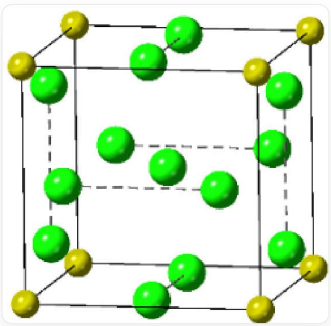
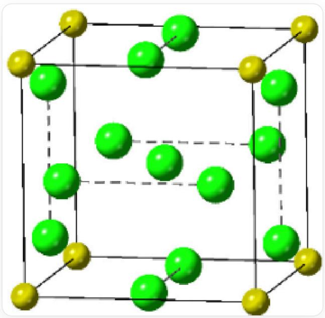

# 题目

氯化钠的结构是最经典的晶体结构之一。在极高的压强下，氯化钠可以和数分子氯气化合生成  $\mathrm{NaCl}_{\mathrm{x}}$  。图为  $\mathrm{NaCl}_7$  正当立方晶系晶胞示意图，其中两个Cl原子的坐标为(0.5,0,0.1671)、(0.5,0,0.8329)。

该图为  $\mathrm{NaCl}_7$  的晶体结构图，其中黄色的球为钠原子，绿色的球为氯离子。正方体的棱为黑色实线，黄色球分布在正方体的顶点，绿色的球在体心有一个、每个面上有两个，面上的两个绿色的球由虚线连接，其中两个Cl原子的坐标为(0.5, 0, 0.1671)、(0.5, 0, 0.8329)

其中  $\mathrm{Cl}_2$  在晶体中的键长为  $m\backslash \mathrm{AA}$  。

另一种与上述晶体结构相似的  $\mathrm{NaCl}_n$  （物质A），其中Na的配位数与  $\mathrm{NaCl}_7$  中的Na相同，且Cl的配位数只有一种。

以下说法正确的是：

A. 体心  $\mathrm{Cl}$  原子和顶点  $\mathrm{Na}$  原子的配位数分别为6和6  
B. 体心  $\mathrm{Cl}$  原子和顶点  $\mathrm{Na}$  原子的配位数分别为8和8

C.  $\mathrm{NaCl}_{7}$  的晶体密度为  $\frac{16.8}{m^{3}} g / c m^{3}$  
D.  $\mathrm{NaCl}_{7}$  的晶体密度为  $\frac{133}{m^{3}} g / c m^{3}$  
E. 物质  $\mathrm{A}$  的化学式为  $\mathrm{NaCl}_{5}$  
F. 物质  $\mathrm{A}$  的化学式为  $\mathrm{NaCl}_{6}$  
G. 物质  $\mathrm{A}$  的密度比  $\mathrm{NaCl}_{7}$  小  
H.  $\mathrm{NaCl}_{7}$  可以描述为物质  $\mathrm{NaCl} \cdot 3 \mathrm{Cl}_{2}$ , 那么物质  $\mathbf{A}$  可以描述为  $\mathrm{NaCl} \cdot \mathrm{Cl}_{2}$  
1.  $\mathrm{NaCl}_7$  可以描述为物质  $\mathrm{NaCl} \cdot 3\mathrm{Cl}_2$  ，那么物质  $\mathbf{A}$  可以描述为  $\mathrm{NaCl} \cdot 2\mathrm{Cl}_2$  
J. 以上选项均不正确

# 答案

正确答案: C

# 详细解析

该图为  $\mathrm{NaCl}_{7}$  的晶体结构图, 其中黄色的球为钠原子, 绿色的球为氯离子。正方体的棱为黑色实线, 黄色球分布在正方体的顶点, 绿色的球在体心有一个、每个面上有两个, 面上的两个绿色的球由虚线连接, 其中两个  $\mathrm{Cl}^{-}$ 原子的坐标为  $(0.5, 0, 0.1671)$  、  $(0.5, 0, 0.8329)$

从图中可以看出，距离钠原子和体心氯原子最近的原子都为属于氯气的氯原子。对于顶点处的钠原子  $(0,0,0)$  来说，距离最近的是处于棱心略靠上的一个氯原子  $(0,0.5,0.1671)$ ，一共有12个面，每面上有一个，因此钠原子的配位数为12；

CHECKPOINT

1 PTS

钠原子的配位数为12

对于体心氯原子来说，每个面上都有2个属于氯气的原子离得最近，一共6个面，体心氯原子的配位数为12。

# CHECKPOINT

1 PTS

体心氯原子的配位数为12

$\mathrm{Cl}_2$  在晶体中的键长为  $m \backslash \mathrm{AA}$ ，需要注意的是构成氯气的两个原子不是虚线相连的两个原子（两者之间的距离为  $0.8329 - 0.1671 = 0.6658$ ），而应该是隔着一条棱的两个氯原子（两者之间的距离为  $0.1671 - (-0.1671) = 0.3342$ ），显然这两个氯原子离得更近。

# CHECKPOINT

1 PTS

隔着一条棱的两个氯原子组成氯气

计算  $\mathrm{NaCl}_7$  的晶体密度：

$$
0. 1 6 7 1 a = m / 2
$$

$$
a = m / 0. 3 2 4 2 \backslash \mathrm {A A}
$$

$$
D = \frac {Z M _ {r}}{N _ {A} V} = \frac {(2 2 . 9 9 + 3 5 . 4 5 \times 7) g / m o l}{6 . 0 2 2 \times 1 0 ^ {2 3} m o l ^ {- 1} \times (m / 0 . 3 2 4 2 \backslash \mathrm {A A}) ^ {3}} = \frac {1 6 . 8}{m ^ {3}} g / c m ^ {3}
$$

# CHECKPOINT

1 PTS

$\mathrm{NaCl}_7$  的晶体密度

$$
D = \frac {1 6 . 8}{m ^ {3}} g / c m ^ {3}
$$

另一种与上述晶体结构相似的  $\mathrm{NaCl}_n$  （物质A），其中Na的配位数与  $\mathrm{NaCl}_7$  中的Na相同，且Cl的配位数只有一种。Cl的配位数只有一种说明只有一种环境的氯原子，在  $\mathrm{NaCl}_7$  中有氯气的氯原子和体心氯原子，将体心氯原子替换为钠原子后，仍旧保持了钠原子配位数12（6个面，每个面两个氯原子)，而每个氯原子相邻的原子都是组成氯气的另一个原子，配位数为1。得到的物质  $A$  每个晶胞中  $\mathrm{Na} = 8\times 1 / 8 + 1 = 2$  ，  $\mathrm{Cl} = 12\times 1 / 2 = 6$  ，因此  $A$  的化学式为  $\mathrm{Na_2Cl_6}$  ，化简后为  $\mathrm{NaCl}_3$

# CHECKPOINT

1 PTS

物质 A 的结构可视为  $\mathrm{NaCl}_{7}$  将体心氯原子替换为钠原子

# CHECKPOINT

1 PTS

A 的化学式为  $\mathrm{NaCl}_3$

因为将体心氯原子换成半径更小的钠原子, 因此晶胞体积变小, A 的密度应该比  $\mathrm{NaCl}_{7}$  大

# CHECKPOINT

1 PTS

晶胞体积变小,  $\mathrm{A}$  的密度应该比  $\mathrm{NaCl}_{7}$  大

$\mathrm{NaCl}_7$  可以描述为  $\mathrm{NaCl} \cdot 3\mathrm{Cl}_2$ ，因为晶胞中确实有三个氯气，剩下的为  $\mathrm{NaCl}$ ，但是物质  $A(\mathrm{NaCl}_3)$  不能用  $\mathrm{NaCl} \cdot \mathrm{nCl}_2$  描述，因为晶胞中所有氯原子的化学环境相同，仅存在一种  $\mathrm{Cl}-\mathrm{Cl}$  键长

# CHECKPOINT

1 PTS

物质  $\mathrm{A}\left(\mathrm{NaCl}_{3}\right)$  不能用  $\mathrm{NaCl} \cdot \mathrm{nCl}_{2}$  描述, 因为晶胞中所有氯原子的化学环境相同

因此选项C正确。