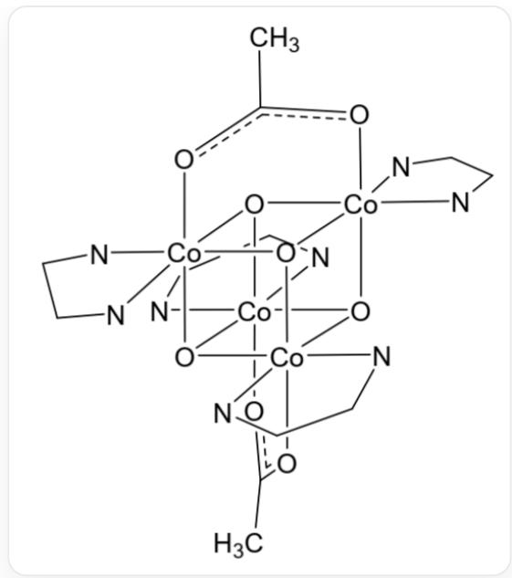

# 题目

将乙酸钠的水溶液和硝酸钴的甲醇溶液混合，加入吡啶，用过氧化氢氧化，可得到抗磁性的电中性分子化合物A。A中钴元素的质量分数为  $27.66\%$  ，四个钴原子和四个氧原子形成类似立方烷的结构核心，乙酸根全部为桥连配体，且整个分子的对称性与丙二烯相同。

A 与高氯酸锂在乙腈中经阳极氧化得到  $\mathbf{A}^{+}$ 的高氯酸盐 B。B 在碱性溶液中分解放出氧气，其中  $\mathbf{A}^{+}$ 被还原为 A。

对于上述过程的反应机理，有如下信息：

1. 不含  ${ }^{18} \mathrm{O}$  的化合物  $\mathbf{B}$  与只含  ${ }^{18} \mathrm{O}$  的水和碱反应, 生成的氧气全部为  ${ }^{18} \mathrm{O}_{2}$ , 且还原得到的  $\mathrm{A}$  不含  ${ }^{18} \mathrm{O}$ ;  
2. 反应过程中原有的配体均没有完全解离；当  $\mathrm{OH}^{-}$  远过量时，反应速率与  $\mathbf{A}^{+}$  的浓度成正比； $\mathbf{A}^{+}$  过量时，反应速率也与  $\mathrm{OH}^{-}$  的浓度成正比；  
3. B 分解放出氧气的反应仅在碱性溶液中进行，在中性溶液中不发生；  
4. 阳离子  $\mathbf{X}$  (如下图)与  $\mathbf{A}^{+}$ 结构相似, 钴元素的氧化态相同, 且  $\mathbf{X}$  所带正电荷更多, 理应是比  $\mathbf{A}^{+}$ 更强的氧化剂, 然而与碱性水溶液反应只能检测到配体  $2-2^{\prime}-$  联吡啶被氧化成  $\mathrm{CO}_{2}$ , 没有任何  $\mathrm{O}_{2}$  生成。

这是X的结构图，smiles为Cc1o[Co]234([N]5=CC=CC=C5C6=[N]4C=CC=C6)O7[Co]89(o1)

$$
([N]\% 10 = CC = CC = C\% 10C\% 11 = [N]9C = CC = C\% 11)O2[Co]\% 12\% 13([N]\% 14 = C\% 15C = CC = C\% 14)
$$

([N]%16=CC=CC=C%16%15)O8[Co]7%17(oc(C)o%13)([N]%18=CC=CC=C%18C%19=

[N]%17C=CC=C%19)O3%12。图中，N-N为2,2'-联吡啶。

B 在碱性溶液中分解的机理可以表述如下, 其中  $\mathrm{M}, \mathrm{~N}, \mathrm{P}$  为关键中间体。

$$
\mathbf {A} ^ {+} \rightarrow \mathbf {M} \rightarrow \mathbf {N} \rightarrow \mathbf {P} \rightarrow \mathbf {A} + \mathrm {O} _ {2}
$$

已知  $\mathbf{M}$  与  $\mathbf{N}$  均为电中性,  $\mathbf{P}$  带两个负电荷,  $\mathbf{M} \rightarrow \mathbf{N}$  为反应的决速步,  $\mathbf{A}^{+} \rightarrow \mathbf{M}$  与  $\mathbf{M} \rightarrow \mathbf{N}$  过程中发生了亲核试剂对底物的进攻,  $\mathbf{P}$  中含有过氧链结构。

下列说法中错误的是

A. A中Co均为6配位  
B. A 中Co均为+3价  
C.  $\mathbf{B} \rightarrow \mathbf{A}$  的离子方程式中, 配平后反应物的系数和大于产物的系数和

D.  $\mathbf{B} \rightarrow \mathbf{A}$  是一个二级反应  
E. 产物  $\mathrm{O}_{2}$  中的  $\mathrm{O}$  均来自于反应物  $\mathrm{OH}^{-}$  
F. X 无法反应生成  $\mathrm{O}_{2}$  是由于  $2 - 2^{\prime} -$  联吡啶作为螯合配体配位能力过强  
G. M中Co的平均氧化态为 +3.5 价  
H.  $\mathrm{N}$  中  $\mathrm{Co}$  的平均氧化态为  $+3.5$  价  
I.  $\mathrm{P}$  中  $\mathrm{Co}$  的平均氧化态为  $+3$  价  
J. 以上说法均正确

# 答案

正确答案: G

# 详细解析

根据题干提示"四个钴原子和四个氧原子形成类似立方烷的结构核心", 不妨猜测  $\mathbf{A}$  中含有4个钴原子。因此,  $\mathbf{A}$  的相对分子量为  $\frac{4 \times 58.93}{0.2766} = 852.21 \mathrm{~g} / \mathrm{mol}$  。根据制备方法,  $\mathbf{A}$  中的配体为乙酸根和吡啶(记作py)。设乙酸根数目为  $x$ , 吡啶数目为  $y$ , 解不定方程  $4 \times (58.93 + 16) + 59.04 x + 79.1 y = 852.21$ , 其中,  $x$  和  $y$  为整数。可以发现,  $x = 4, y = 4$  是一组较合理的解。因此  $\mathbf{A}$  的结构为  $\mathrm{Co}_{4} \mathrm{O}_{4} (\mathrm{CH}_{3} \mathrm{COO})_{4} (\mathrm{py})_{4}$  。

# CHECKPOINT

1 PTS

A 的结构为  $\mathrm{Co}_{4} \mathrm{O}_{4}(\mathrm{CH}_{3} \mathrm{COO})_{4}(\mathrm{py})_{4}$

结合题干中给出的对称性信息，四个钴原子和四个氧原子形成类似立方烷结构，乙酸根作为双齿配体桥连2个Co，1个py与一个Co配合。Co为6配位，+3价，A、B均正确。

# CHECKPOINT

1 PTS

四个钴原子和四个氧原子形成类似立方烷结构，乙酸根作为双齿配体桥连2个Co，1个py与一个Co配合。因此Co为6配位，+3价

根据题干信息， $\mathbf{B} \rightarrow \mathbf{A}$  的离子方程式为： $4\mathbf{A}^{+} + 4\mathrm{OH}^{-} = 4\mathbf{A} + 2\mathrm{H}_{2}\mathrm{O} + \mathrm{O}_{2}$  反应物系数和8大于产物系数和7，C正确。

# CHECKPOINT

1 PTS

$4\mathbf{A}^{+} + 4\mathrm{OH}^{-} = 4\mathbf{A} + 2\mathrm{H}_{2}\mathrm{O} + \mathrm{O}_{2}$  ，反应物系数和大于产物系数和

对于该过程反应机理的信息进行分析：根据信息1，可以判断生成  $\mathrm{O}_2$  中的O均来自于反应物  $\mathrm{OH}^{-}$ ；

# CHECKPOINT

1 PTS

生成  $\mathrm{O}_{2}$  中的  $\mathrm{O}$  均来自于反应物  $\mathrm{OH}^{-}$

根据信息2，该反应的速率方程可以描述为  $r = k[\mathbf{A}^{+}][\mathrm{OH}^{-}]$  ，即二级反应。也因此，反应的决速步只能是一分子  $\mathbf{A}^{+}$  和一分子  $\mathrm{OH}^{-}$  发生反应；

# CHECKPOINT

1 PTS

反应的决速步只能是一分子  $\mathbf{A}^{+}$  和一分子  $\mathrm{OH}^{-}$  发生反应

根据信息3，该过程必须和  $\mathrm{OH}^{-}$  反应而不能和  $\mathrm{H}_{2} \mathrm{O}$  反应；

根据信息4，比较A和X，可以发现虽然二者中Co均为6配位，A中一个Co和3个O、2个桥接乙酸根和1个吡啶相连，而X中一个Co和3个O、1个桥接乙酸根和1个非桥连双齿配体相连。因此，桥连的乙酸根在反应过程中起到了重要的作用。2,2'-联吡啶由于螯合作用配位过强，反应性较低。

# CHECKPOINT

1 PTS

桥连的乙酸根在反应中起到关键作用，2,2'-联吡啶由于螯合作用配位过强从而不利于反应

根据题干中的提示，“ $\mathbf{A}^{+} \rightarrow \mathbf{M}$  与  $\mathbf{M} \rightarrow \mathbf{N}$  过程中发生了亲核试剂对底物的进攻”，可以判断出，这两个过程均为  $\mathrm{OH}^{-}$  对于 Co 的进攻，然后发生两个桥连的乙酸根的解配位。

# CHECKPOINT

1 PTS

$\mathbf{A}^{+}\rightarrow \mathbf{M}$  与  $\mathbf{M}\to \mathbf{N}$  均为  $\mathrm{OH^{-}}$  对Co的亲核进攻，使两个双齿配体乙酸根变为单齿

因此，M可以表示为  $\mathrm{Co_4O_4(CH_3COO)_4(py)_4(OH)}$  ，Co平均价态  $+3.25$  。N可以表示为 $\mathrm{Co_4O_4(CH_3COO)_4(py)_4(OH)_2}$  ，Co平均价态  $+3.5$  。G错误，H正确。

# CHECKPOINT

1 PTS

M中Co平均价态  $+3.25$  。N中Co平均价态  $+3.5$  。

随后，结合“P带两个负电荷”和“P中含有过氧链结构”，可以判断N→P的过程脱去两个H，即一个Co上的两个OH形成一个过氧键。由于P带两个负电，可以表述为  $\mathrm{Co_4O_4(CH_3COO)_4(py)_4(O_2)^{2-}}$  ，Co平均价态  $+3$  。

# CHECKPOINT

1 PTS

P 可以表述为  $\mathrm{Co_4O_4(CH_3COO)_4(Py)_4(O_2)^{2 - }}$  ，Co平均价态  $+3$  。