# Question

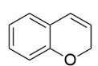  
1

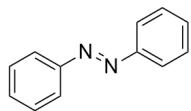  
2

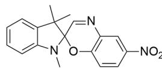  
3

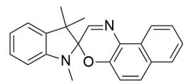  
4

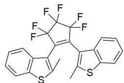  
5

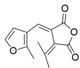  
6

  
7

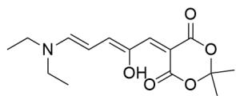  
8

The image contains 8 organic structural formulas, numbered **1-8** respectively. **1** is

C12=CC=CC=C1C=CCO2; **2** is C1(/N=N/C2=CC=CC=C2)=CC=CC=C1; **3** is

CC1(C)C2(OC(C=CC([N]+]([O-]=O)=C3)=C3N=C2)N(C)C4=CC=CC=C41; **4** is

(F)C(C2=C(C)SC3=C2C=CC=C3)=C1C4=C(C)SC5=C4C=CC=C5; **6** is

$$
\begin{array}{l} C C 1 (C) C 2 (O C (C = C C 3 = C 4 C = C C = C 3) = C 4 N = C 2) N (C) C 5 = C C = C C = C 5 1; \quad \text {F F} \\ O = C (C / C 1 = C (C) / C) = C / C 2 = C (C) O C = C 2) O C 1 = O; ^ {\star \star} 7 ^ {\star \star} i s O C 1 = C C = C C = C 1 / C = N / C 2 = C C = C C = C 2; ^ {\star \star} 8 ^ {\star \star} i s \\ O C / / C = C (C (O C (C) (C) O 1) = O) \backslash C 1 = O) = C \backslash C = C \backslash N (C C) C C. \\ \end{array}
$$

The above image displays 8 photochromic compounds, which are characterized by changes in molecular structure upon exposure to light, leading to alterations in their absorption spectra.

These compounds exhibit three classifications of photochromic mechanisms, and each compound belongs to only one photochromic mechanism type. It is known that type A is the most common mechanism among these compounds after classification. Classify the photochromic mechanisms of these compounds and identify which of the following options is correct.

A. The molecular structure of compound 1 exhibits aromaticity upon exposure to light.  
B. The photoisomerization mechanism type of compound 2 belongs to category A.  
C. Compound 3 exhibits a molecular structure without formal charges upon exposure to light.

D. The molecular structure of compound 6 exhibits aromaticity upon exposure to light.  
E. The class of photochromic mechanism to which compound 7 belongs contains a total of two compounds.  
F. The molecular structure of compound 8 after exposure to light only contains a six-membered ring.  
G. Type A consists of 5 compounds in total.  
H. None of the above options is correct.

# Answer

Correct Answer: H

# Detailed Explanation

Photochemical reaction mechanisms can generally be divided into cis-trans isomerization type, ring-opening/closing type, and tautomerization type.

# CHECKPOINT

1 PTS

光致变色机理一般可分为顺反异构类型，开关环类型和互变异构类型。

Analyzing each compound individually:

1. Upon exposure to light, the substrate undergoes a  $[3,3]\sigma$  sigmoidotropic rearrangement to generate a conjugated structure that exhibits color,  $O = C1C = CC = C / C1 = C / C = C$ , with the pyran ring opening. The photochromic mechanism is of the ring-opening/closing type. In this structure, the benzene ring is disrupted and lacks aromaticity; therefore, option A is incorrect.

# CHECKPOINT

1 PTS

1的见光结构为O=C1C=CC=C/C1=C/C=C，为开关环类型

# CHECKPOINT

1 PTS

1的见光结构苯环被破坏不具有芳香性

2. The substrate is trans-azobenzene. Upon irradiation, it undergoes cis-trans isomerization to yield cis-azobenzene, which exhibits color, C1(/N=N\C2=CC=CC=C2)=CC=CC=C1. The photochromic mechanism is of the cis-trans isomerization type.

# CHECKPOINT

1 PTS

反式偶氮苯光照下发生顺反异构得到顺式偶氮苯C1(/N=N\C2=CC=CC=C2)=CC=CC=C1显色

# CHECKPOINT

1 PTS

反式偶氮苯光致发光机理类型为顺反异构类型

3/4. These two are the same type of photochromic molecule. Upon exposure to light, these compounds can generate an imine cation, causing the spiro ring to open, resulting in a large conjugated system that exhibits color. Subsequently, the generated hydroxide anion can also perform nucleophilic attack on the imine cation, restoring the original form. Therefore, the light-induced structures of 3 and 4 are CC1(C)C(/C=C/C2=CC([N+]) ([O-]) = O) = CC = C2[O-]) = [N+] (C) C3 = CC = CC = C31, CC1(C)C(/C=C/C2=C(C=CC=C3)C3=CC=C2[O-]) = [N+] (C)C4 = CC = CC = C41, respectively. The photochromic mechanisms of these two compounds are both of the ring-opening/closing type. According to the structure, option C is incorrect.

# CHECKPOINT

1 PTS

3, 4见光可生成亚胺正离子使得螺环开环

# CHECKPOINT

1 PTS

3，4 见光结构分别为  $\mathrm{CC1(C)C(/C = C / C2 = CC([N + ]([O - ]) = O) = CC = C2[O - ]) = [N + ]}$

$$
(\mathrm {C}) \mathrm {C} 3 = \mathrm {C C} = \mathrm {C C} = \mathrm {C} 3 1, \mathrm {C C} 1 (\mathrm {C}) \mathrm {C} / / \mathrm {C} = \mathrm {C} / \mathrm {C} 2 = \mathrm {C} (\mathrm {C} = \mathrm {C C} = \mathrm {C} 3) \mathrm {C} 3 = \mathrm {C C} = \mathrm {C} 2 [ \mathrm {O} - ]) = [ \mathrm {N} + ] (\mathrm {C}) \mathrm {C} 4 = \mathrm {C C} = \mathrm {C C} = \mathrm {C} 4 1
$$

# CHECKPOINT

1 PTS

3, 4为开关环类型

5/6. These two substrates are also the same type of photochromic molecule. Their substrates both have a six-membered ring electrocyclization structure. Upon exposure to light, they undergo an electrocyclization reaction to form a ring, forming a conjugated system that emits light. The light-induced structures are FC1(F)C(F)(F)C(F)

$$
(\mathrm {F}) \mathrm {C} 2 = \mathrm {C} 3 \mathrm {C} (\mathrm {C} (\mathrm {C} 4 = \mathrm {C} 2 1) (\mathrm {C}) \mathrm {S C} 5 = \mathrm {C} 4 \mathrm {C} = \mathrm {C} \mathrm {C} = \mathrm {C} 5) (\mathrm {C}) \mathrm {S C} 6 = \mathrm {C} 3 \mathrm {C} = \mathrm {C} \mathrm {C} = \mathrm {C} 6, \quad \mathrm {O} = \mathrm {C} (\mathrm {C} 1 = \mathrm {C} 2 \mathrm {C} (\mathrm {C} 3 (\mathrm {C}) \mathrm {C} (\mathrm {C} = \mathrm {C O} 3) = \mathrm {C} 1)
$$

(C)C)OC2=O, respectively; both are also of the ring-opening/closing type.

# CHECKPOINT

1 PTS

5, 6底物均具有六元环电环化结构, 光照下发生电环化反应

# CHECKPOINT

1 PTS

5，6 见光结构分别为FC1(F)C(F)(F)C(F)(F)C2=C3C(C(C4=C21)(C)SC5=C4C=CC=C5)

(C)SC6=C3C=CC=C6, O=C(C1=C2C(C3(C)C(C=CO3)=C1)(C)C)OC2=O

# CHECKPOINT

1 PTS

5, 6为开关环类型

In the light-induced structure of 6, the furan ring is disrupted and lacks aromaticity; therefore, option D is incorrect.

7. This is a well-known Schiff base type compound. Its phenolic hydroxyl group can tautomerize to a keto carbonyl group, thereby changing the conjugated structure and causing a change in the absorption wavelength. The light-induced structure is  $\mathrm{O = C1C = CC = C / C1 = C / NC2 = CC = CC = C2}$ , and the photochromic type is tautomerization.

# CHECKPOINT

1 PTS

7酚羟基可互变异构为酮羰基从而改变共轭结构

# CHECKPOINT

1 PTS

7发光结构为O=C1C=CC=C/C1=C/NC2=CC=CC=C2，为互变异构型

8. This is a DASA-type compound. The nitrogen atom of the tertiary amine is nucleophilic and can intramolecularly attack the keto carbonyl group of the enol tautomer, forming a five-membered ring and disrupting the conjugated

structure, thereby changing the color. Therefore, the structure of the photochromic is CC(O1) (C)OC([O-])=C(C2C(C=CC2[N+] (CC)([H])CC)=O)C1=O, which is also of the ring-opening/closing type. From the structure, option F is incorrect.

# CHECKPOINT

1 PTS

8中三级胺的氮原子可以分子内进攻烯醇互变异构的酮羰基形成五元环破坏共轭结构

# CHECKPOINT

1 PTS

8光致变色的结构CC(O1)(C)OC([O-])=C(C2C(C=CC2[N+] (CC)([H]) CC)=O) C1 = O，为开关环类型

In summary, the ring-opening/closing type compounds are the most numerous, with 6. Therefore, type A is the ring-opening/closing type, and option G is incorrect.

# CHECKPOINT

1 PTS

类型A即为开关环类型，有6个化合物

The photochromic mechanism type of compound 7 is tautomerization, and only 7 itself belongs to this type, so option E is incorrect. (If azobenzene is also classified into this category, the requirement of 3 types of mechanisms in the question will not be met.)

The mechanism type of compound 2 is cis-trans isomerization, which does not belong to type A, the ring-opening/closing type, so option B is incorrect.

In summary, options A-G are all incorrect, and option H is correct.

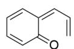  
1

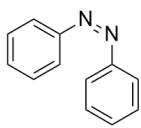  
2

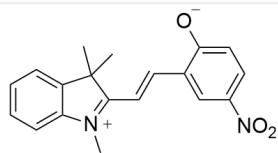  
3

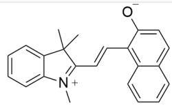  
4

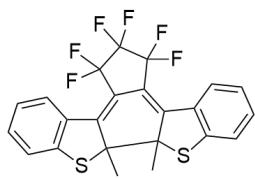  
5

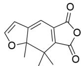  
6

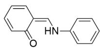  
7

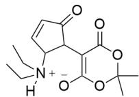  
8

本图展示了从**1-8**化合物的见光后的结构，SMILES分别为O=C1C=CC=C/C1=C/C=C,

$$
C 1 / N = N \backslash C 2 = C C = C C = C 2) = C C = C C = C 1, \quad C C 1 (C) C / C = C / C 2 = C C ([ N + ]) ([ O - ]) = O) = C C = C 2 [ O - ]) = [ N + ]
$$

$$
\begin{array}{l} (C) C 3 = C C = C C = C 3 1, C C 1 (C) C (/ C = C / C 2 = C (C = C C = C 3) C 3 = C C = C 2 [ O - ]) = [ N + ] (C) C 4 = C C = C C = C 4 1, F C 1 (F) C (F) \\ (F) C (F) (F) C 2 = C 3 C (C (C 4 = C 2 1) (C) S C 5 = C 4 C = C C = C 5) (C) S C 6 = C 3 C = C C = C 6, \\ O = C (C 1 = C 2 C (C 3 (C) C (C = C O 3) = C 1) (C) C) O C 2 = O, O = C 1 C = C C = C / C 1 = C / N C 2 = C C = C C = C 2, \quad C C (O 1) \\ (\mathrm {C}) \mathrm {O C} ([ \mathrm {O} - ]) = \mathrm {C} (\mathrm {C 2 C} (\mathrm {C} = \mathrm {C C 2} [ \mathrm {N} + ] (\mathrm {C C}) ([ \mathrm {H} ]) \mathrm {C C}) = \mathrm {O}) \mathrm {C 1} = \mathrm {O} ^ {\circ} \\ \end{array}
$$