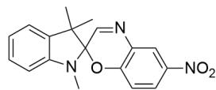
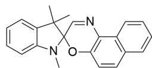
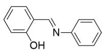
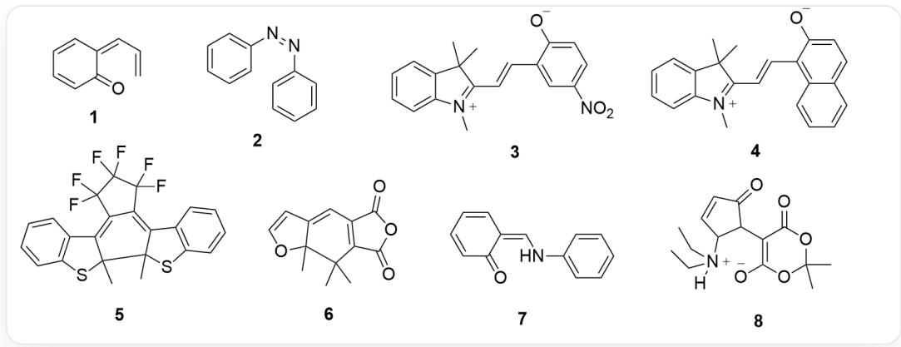

# 题目

  
1

  
2

  
3

  
4

  
5

  
6

  
7

  
8

该图片包含8种有机结构式，分别编号**1-8**。**1**为C12=CC=CC=C1C=CC02；**2**为

$$
C 1 / N = N / C 2 = C C = C C = C 2) = C C = C C = C 1, \quad * * 3 * * \text {为} C C 1 (C) C 2 (O C (C = C C ([ N + ]
$$

$$
([ O - ]) = O) = C 3) = C 3 N = C 2) N (C) C 4 = C C = C C = C 4 1; \quad * * 4 ^ {* *} \text {为}
$$

$$
\begin{array}{l} C C 1 (C) C 2 (O C (C = C C 3 = C 4 C = C C = C 3) = C 4 N = C 2) N (C) C 5 = C C = C C = C 5 1; \quad \text {**} 5 ^ {\text {**}} \text {为} F C 1 (F) C (F) (F) C (F) \\ (F) C (C 2 = C (C) S C 3 = C 2 C = C C = C 3) = C 1 C 4 = C (C) S C 5 = C 4 C = C C = C 5; \quad * * 6 ^ {\prime \prime} \text {为} \\ O = C (C / C 1 = C (C) / C) = C / C 2 = C (C) O C = C 2) O C 1 = O; \quad * * 7 ^ {* *} \text {为} O C 1 = C C = C C = C 1 / C = N / C 2 = C C = C C = C 2; \quad * * 8 ^ {* *} \\ \text {为} O C (/ C = C (C (O C (C) (C) O 1) = O) \backslash C 1 = O) = C \backslash C = C \backslash N (C C) C C _ {\circ} \\ \end{array}
$$

上图展示了8种可以发生光致变色的化合物在未见光时的结构，这种化合物的特点是见光后分子结构会发生变化，从而导致吸收光谱的变化。

这些化合物的光致变色机理共有3种分类，且每一种化合物只有一种光致变色机理类型，已知类型A为这些化合物按照光致变色机理分类之后所含的化合物最多的一种类型。

请归类这些化合物的光致变色机理，并指出下列选项中哪一项是正确的。

A. 化合物1见光后的分子结构具有芳香性。  
B. 化合物2的光致异构机理类型属于A类型。  
C. 化合物3见光后的分子结构不带形式电荷。

D. 化合物6见光后的分子结构具有芳香性。  
E. 化合物7的光致发光机理类型包含7在内的两种化合物。  
F. 化合物8见光后的分子结构只具有六元环。  
G. 类型A共有5种化合物。  
H. 以上选项均不正确。

# 答案

正确答案: H

# 详细解析

光致变色机理一般可分为顺反异构类型，开关环类型和互变异构类型。

# CHECKPOINT

1 PTS

光致变色机理一般可分为顺反异构类型，开关环类型和互变异构类型。

逐个对化合物进行分析：

1.底物见光可发生[3,3]σ迁移重排生成共轭结构显色O=C1C=CC=C/C1=C/C=C，吡喃环开环，光致发光机理为开关环类型。该结构中苯环被破坏不具有芳香性，选项A错误。

# CHECKPOINT

1 PTS

1的见光结构为  $O = C1C = CC = C / C1 = C / C = C$  ，为开关环类型

# CHECKPOINT

1 PTS

1的见光结构苯环被破坏不具有芳香性

2.底物为反式偶氮苯，光照下发生顺反异构得到顺式偶氮苯显色，C1(/N=N\C2=CC=CC=C2)=CC=CC=C1，光致发光机理为顺反异构类型。

# CHECKPOINT

1 PTS

反式偶氮苯光照下发生顺反异构得到顺式偶氮苯C1/(N=N\C2=CC=CC=C2)=CC=CC=C1显色

# CHECKPOINT

1 PTS

反式偶氮苯光致发光机理类型为顺反异构类型

3/4. 这两种为同类型的光致变色分子, 该类化合物见光可生成亚胺正离子使得螺环开环产生大共轭体系显色, 之后产生的羟基负离子还可对亚胺正离子进行亲核从而恢复原本的形式; 因此3, 4的发光结构分别为  $\mathrm{CC1}(\mathrm{C}) \mathrm{C}(/ \mathrm{C} = \mathrm{C} / \mathrm{C} 2 = \mathrm{CC}([ \mathrm{N} + ] ([ \mathrm{O} - ]) = \mathrm{O}) = \mathrm{CC} = \mathrm{C} 2 [ \mathrm{O} - ]) = [\mathrm{N} + ]$

(C)C3=CC=CC=C31, CC1(C)C(/C=C/C2=C(C=CC=C3)C3=CC=C2[O-])=[N+](C)C4=CC=CC=C41。这两种化合物光致发光机理均为开关环类型。根据结构可知选项C错误。

# CHECKPOINT

1 PTS

3, 4见光可生成亚胺正离子使得螺环开环

# CHECKPOINT

1 PTS

3，4 见光结构分别为 CC1(C)C(/C=C/C2=CC([N+]([O-]=O)=CC=C2[O-]=[N+]

$$
(\mathrm {C}) \mathrm {C} 3 = \mathrm {C C} = \mathrm {C C} = \mathrm {C} 3 1, \mathrm {C C} 1 (\mathrm {C}) \mathrm {C} / / \mathrm {C} = \mathrm {C} / \mathrm {C} 2 = \mathrm {C} (\mathrm {C} = \mathrm {C C} = \mathrm {C} 3) \mathrm {C} 3 = \mathrm {C C} = \mathrm {C} 2 [ \mathrm {O} - ]) = [ \mathrm {N} + ] (\mathrm {C}) \mathrm {C} 4 = \mathrm {C C} = \mathrm {C C} = \mathrm {C} 4 1
$$

# CHECKPOINT

1 PTS

3, 4为开关环类型

5/6. 这两种底物也是同类型的光致变色分子, 其底物均具有六元环电环化结构, 光照下发生电环化反应成环形成共轭体系发光, 发光结构分别为  $\mathrm{FC1}(\mathrm{F}) \mathrm{C}(\mathrm{F})(\mathrm{F}) \mathrm{C}(\mathrm{F})(\mathrm{F}) \mathrm{C}2 = \mathrm{C3C}(\mathrm{C}(\mathrm{C}4 = \mathrm{C}21)(\mathrm{C}) \mathrm{SC}5 = \mathrm{C}4 \mathrm{C} = \mathrm{CC} = \mathrm{C}5)$  (C)  $\mathrm{SC} 6 = \mathrm{C} 3 \mathrm{C} = \mathrm{CC} = \mathrm{C} 6$ ,  $\mathrm{O} = \mathrm{C} (\mathrm{C} 1 = \mathrm{C} 2 \mathrm{C} (\mathrm{C} 3 (\mathrm{C}) \mathrm{C} (\mathrm{C} = \mathrm{CO} 3) = \mathrm{C} 1) (\mathrm{C}) \mathrm{C}) \mathrm{OC} 2 = \mathrm{O}$ ; 同样均为开关环类型。

# CHECKPOINT

1 PTS

5, 6底物均具有六元环电环化结构, 光照下发生电环化反应

# CHECKPOINT

1 PTS

5，6 见光结构分别为FC1(F)C(F)(F)C(F)(F)C2=C3C(C(C4=C21)(C)SC5=C4C=CC=C5)

$$
(\mathrm {C}) \mathrm {S C} 6 = \mathrm {C} 3 \mathrm {C} = \mathrm {C} \mathrm {C} = \mathrm {C} 6, \quad \mathrm {O} = \mathrm {C} (\mathrm {C} 1 = \mathrm {C} 2 \mathrm {C} (\mathrm {C} 3 (\mathrm {C}) \mathrm {C} (\mathrm {C} = \mathrm {C O} 3) = \mathrm {C} 1) (\mathrm {C}) \mathrm {C}) \mathrm {O C} 2 = \mathrm {O}
$$

# CHECKPOINT

1 PTS

# 5, 6为开关环类型

6的见光结构中呋喃环被破坏，不具有芳香性，选项D错误。

7. 这是著名的Schiff碱类型化合物，其酚羟基可互变异构为酮羰基从而改变共轭结构，发生吸收波长的变化；发光结构为O=C1C=CC=C/C1=C/NC2=CC=CC=C2，光致变色类型为互变异构类型。

# CHECKPOINT

1 PTS

7酚羟基可互变异构为酮羰基从而改变共轭结构

# CHECKPOINT

1 PTS

7发光结构为O=C1C=CC=C/C1=C/NC2=CC=CC=C2，为互变异构型

8. 这是DASA类化合物，三级胺的氮原子具有亲核性，可以分子内进攻烯醇互变异构的酮羰基形成五元环破坏共轭结构从而改变颜色，故光致变色的结构为CC(O1)(C)OC([O-])=C(C2C(C=CC2[N+] (CC)[H])CC)=O)C1=O，同样为开关环类型。从结构可知选项F错误。

# CHECKPOINT

1 PTS

8中三级胺的氮原子可以分子内进攻烯醇互变异构的酮羰基形成五元环破坏共轭结构

# CHECKPOINT

1 PTS

8光致变色的结构CC(O1)(C)OC([O-])=C(C2C(C=CC2[N+] (CC)([H]) CC)=O) C1 = O，为开关环类型

综上，开关环类型的化合物最多，有6个；从而类型A即为开关环类型，选项G错误。

# CHECKPOINT

1 PTS

类型A即为开关环类型，有6个化合物

化合物7的光致发光机理类型为互变异构类型，只有7自身，选项E错误。（若将偶氮苯也归于此类，则达不到3类机理的题设要求）

化合物2的机理类型为顺反异构型，不属于A开关环类型，选项B错误。

综上，选项A-G均错误，选项H正确。



本图展示了从**1-8**化合物的见光后的结构，SMILES分别为O=C1C=CC=C/C1=C/C=C，

```javascript
C1(/N=N\C2=CC=CC=C2)=CC=CC=C1，CC1(C)C(/C=C/C2=CC([N+]([O-])=O)=CC=C2[O-])=[N+]  
(C)C3=CC=CC=C31,CC1(C)C(/C=C/C2=C(C=CC=C3)C3=CC=C2[O-])=[N+(C)C4=CC=CC=C41，FC1(F)C(F)  
(F)C(F)(F)C2=C3C(C(C4=C21)(C)SC5=C4C=CC=C5)(C)SC6=C3C=CC=C6，  
 $O = C(C1 = C2C(C3(C)C(C = C03) = C1)(C)C)OC2 = O$  ，  $O = C1C = CC = C / C1 = C / NC2 = CC = CC = C2$  ，CC(O1)  
(C)OC([O-])=C(C2C(C=CC2[N+](CC)([H])CC)=O)C1=O。
```