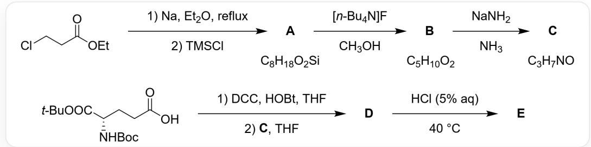
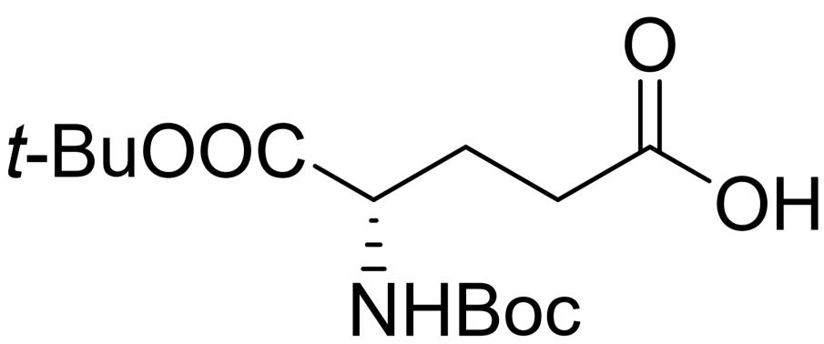
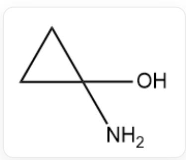
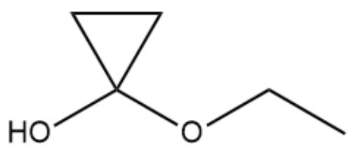
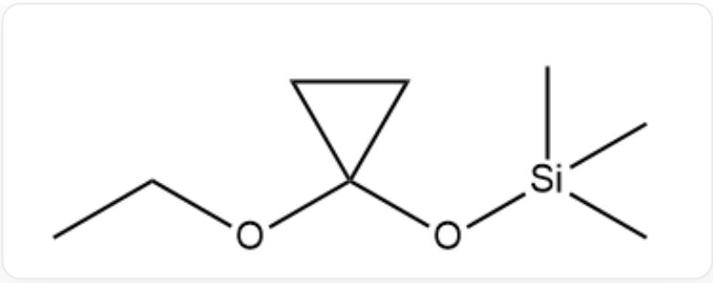
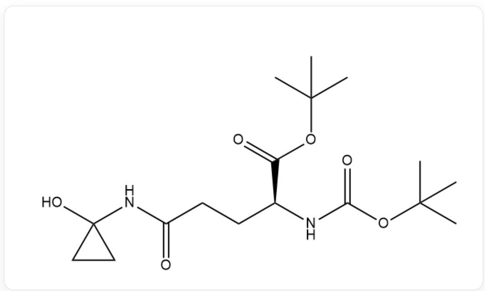
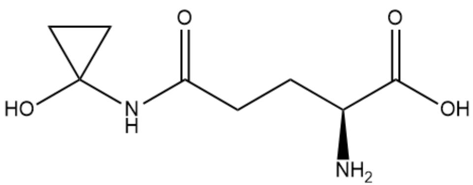

# Question

Compound  $\mathbf{E}$  can be synthesized from ethyl 3-chloropropionate as a starting material:

Image describes a partially missing organic synthesis route: CICCC(=O)OCC>[Na].CCOCC>[X], this step is carried out under "reflux" conditions, the reagent is sodium metal, and the solvent is diethyl ether; [X]>C[Si]

(C)(C)Cl> [A], the reagent in this step is trimethylchlorosilane, and the molecular formula of A is

$\mathrm{C_8H_{18}O_2Si}$ ; [A]>CCCC[N+](CCCC)(CCCC)CCCC.[F-].CO>[B], the reagent in this step is

tetrabutylammonium fluoride, the solvent is methanol, and the molecular formula of  $\mathbf{B}$  is  $\mathrm{C}_5\mathrm{H}_{10}\mathrm{O}_2$ ; [B]>

[Na]N.N> [C], the reagent in this step is sodium amide, the solvent is ammonia, and the molecular formula of

$$
\mathbf {C} \text {i s} \mathrm {C} _ {3} \mathrm {H} _ {7} \mathrm {N O}; \mathrm {C C} (\mathrm {O C} ([ \mathrm {C} @ @ \mathrm {H} ]) (\mathrm {N C} (\mathrm {O C} (\mathrm {C}) (\mathrm {C}) \mathrm {C}) = \mathrm {O}) \mathrm {C C C} (\mathrm {O}) = \mathrm {O}) = \mathrm {O})
$$

(C)C>C1CCC(CC1)N=C=NC2CCCCC2.C1CC=C2C(=C1)N=NN2O.O1CCCCC1>[Y], tetrahydrofuran is used

as the solvent in this step; [Y].[C]>O1CCCCC1>[D], tetrahydrofuran is used as the solvent in this step;

[D]>Cl>[E], the condition for this step is "HCl(5% aq), 40°C"

$\mathbf{A} \sim \mathbf{E}$  all contain a three-membered carbon ring. The  ${}^{1}\mathrm{H}$  NMR of  $\mathbf{C}$  has peaks at 8.52, 6.42, 0.65, 0.40, with a peak area ratio of 2:1:2:2 (predicted value, the solvent is deuterated dimethyl sulfoxide).

Analyze this route step by step and check the known information, including the molecular formula and proton NMR spectrum, to deduce the unknown substances and select the correct one.

A. Theoretically, for every  $1\mathrm{mol}$  A produced,  $4\mathrm{molNa}$  are consumed.  
B. E has only one chiral center, with R configuration.

C. C is more prone to spontaneous dehydration compared to  $\mathrm{C}_{3} \mathrm{H}_{9} \mathrm{NO}$  and its analogs that open the three-membered ring.  
D. In the  ${}^{1}\mathrm{H}$  NMR of  $\mathbf{A}$ , the chemical shifts of all peaks are less than 2.0.

E. In the reaction that generates  $\mathbf{D}$  from

CC(OC([C@@H](NC(OC(C)(C)C)=O)CCC(O)=O)=O)(C)C

and  $\mathbf{C}$ , the balanced chemical equation includes  $\mathrm{H}_2\mathrm{O}$  in addition to  $\mathbf{D}$  in the products.

F. In the reaction to obtain  $\mathbf{E}$  from  $\mathbf{D}$ , if no hydrocarbons are produced, then the balanced chemical equation involves 4 compounds.  
G. The check digit for the CAS registry number of  $\mathbf{E}$  is 2.  
H. The CAS registry number for  $\mathbf{E}$  has a check digit of 3.  
B has optical activity and diastereomers.  
J. All of the above options are incorrect.

# Answer

Correct Answer: G

# Detailed Explanation

Start with the simplest structure, C: The molecular formula of C is  $\mathrm{C_3H_7NO}$ , and the structure of C contains a three-membered carbon ring. The degree of unsaturation is calculated to be 1, with no additional unsaturation. Therefore, the structure of C can only be 1-aminocyclopropanol (NC1(O)CC1) or 2-aminocyclopropanol (NC1C(O)C1) or N-cyclopropylhydroxylamine (ONC1CC1) or O-cyclopropylhydroxylamine (NOC1CC1).

# CHECKPOINT

2 PTS

The structure of C can only be 1-aminocyclopropanol (NC1(O)CC1) or 2-aminocyclopropanol (NC1C(O)C1) or N-cyclopropylhydroxylamine (ONC1CC1) or O-cyclopropylhydroxylamine (NOC1CC1).

Considering the NMR hydrogen spectrum data, the chemical shift of hydrogen on heteroatoms is higher, and the chemical shift of hydrogen on the three-membered ring is lower. Combined with the ratio of peak areas, it can be known that  $\mathbf{C}$  is 1-aminocyclopropanol (NC1(O)CC1).

  
NC1(O)CC1

# CHECKPOINT

3 PTS

C is 1-aminocyclopropanol (NC1(O)CC1)

Reversing the route, it can be found that only functional group transformations occurred from A to C. B undergoes a substitution reaction with sodium amide to obtain C. Therefore, B is 1-ethoxycyclopropanol (CCOC1(O)CC1).

  
CCOC1(O)CC1

# CHECKPOINT

2 PTS

B is 1-ethoxycyclopropanol (CCOC1(O)CC1)

A undergoes deprotection of the trimethylsilyl group by tetrabutylammonium fluoride to obtain A, which is (1-ethoxycyclopropoxy)trimethylsilane (C1C(O[Si](C)(C)C)(OCC)C1).

  
C1C(O[Si](C)(C)C)(OCC)C1

# CHECKPOINT

2 PTS

A is (1-ethoxycyclopropoxy)trimethylsilane (C1C(O[Si](C)(C)C)(OCC)C1)

Continue the route from C: First, the amino group and a carboxyl group protected L-glutamic acid are activated by DCC. After adding C, the more nucleophilic amino group forms an amide D with the protected glutamic acid. The structure of D is CC(OC([C@@H](NC(OC(C)(C)C)=O)CCC(NC1(O)CC1)=O)=O)(C)C.

  
CC(OC([C@@H](NC(OC(C)(C)C)=O)CCC(NC1(O)CC1)=O)=O)(C)C

# CHECKPOINT

2 PTS

C condenses with protected L-glutamic acid under the action of DCC to obtain amide D, with the structure CC(OC([C@@H](NC(OC(C)(C)C)=O)CCC(NC1(O)CC1)=O)=O)(C)C

$\mathbf{D}$  is deprotected with hydrochloric acid to remove the Boc and t-Bu protecting groups, yielding  $\mathbf{E}$ , with the structure  $\mathrm{OC(=O)[C@H](CCC(=O)NC1(CC1)O)N}$ .

  
OC(=O)[C@H](CCC(=O)NC1(CC1)O)N

# CHECKPOINT

2 PTS

D is deprotected by hydrochloric acid to obtain E, with the structure OC(=O)[C@H] (CCC(=O)NC1(CC1)O)N

$\mathbf{E}$  is coprine, also known as ink cap amino acid, CAS code is 58919-61-2. The last digit of the CAS code is a checksum, which is 2 here. Option G is correct, option H is incorrect.

# CHECKPOINT

2 PTS

The CAS code of  $\mathbf{E}$  is 58919-61-2, and the checksum is 2

Option A: Judging from the molecular formula, only the C - Cl bond of the starting compound is reduced, corresponding to 2 equivalents of Na.

# CHECKPOINT

1 PTS

Theoretically, 2 equivalents of Na are needed to obtain A

Option B: Starting from glutamic acid, the only chiral center in the molecule has not changed, and the final configuration is S.

# CHECKPOINT

0.5 PTS

The only chiral center in  $\mathbf{E}$  has S configuration

Option C: C is limited by the ring strain of the three-membered ring, and the lone pair electrons do not overlap well with the C - O antibonding orbital, making it more difficult to eliminate dehydration compared to non-cyclic analogs.

# CHECKPOINT

1 PTS

C is more difficult to spontaneously dehydrate than non-cyclic analogs

Option D: The chemical shift of the  $\alpha -\mathbf{H}$  of the oxygen on the ethoxy group in A is greater than 2.0.

# CHECKPOINT

0.5 PTS

The chemical shift of the  $\alpha -\mathbf{H}$  of the oxygen in  $\mathbf{A}$  is greater than 2.0

Option E: The 1 molecule of water generated by the condensation is transferred to the dicyclohexylurea, which is the byproduct corresponding to DCC. There will be no  $\mathrm{H}_2\mathrm{O}$  in the products in the balanced chemical equation.

# CHECKPOINT

1 PTS

In the amidation reaction,  $\mathrm{H}_2\mathrm{O}$  will not appear in the products in the balanced chemical equation

Option F: In the deprotection step, the possible forms of the removed tert-butyl group include tert-butanol and 2-chloro-2-methylpropane. The balanced chemical equation corresponding to tert-butanol involves the following substances: D, water, E, tert-butanol, carbon dioxide. The balanced chemical equation corresponding to 2-chloro-2-methylpropane involves the following substances: D, hydrogen chloride, E, 2-chloro-2-methylpropane, carbon dioxide. Neither can be four kinds.

# CHECKPOINT

1 PTS

The balanced chemical equation in deprotection cannot involve only 4 substances

Option I: The structure of  $\mathbf{B}$  has a plane of symmetry and no chiral center, so it has no optical activity and no diastereomers.

# CHECKPOINT

0.5 PTS

B has no optical activity and no diastereomers.