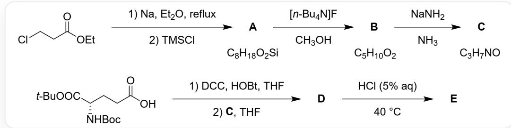
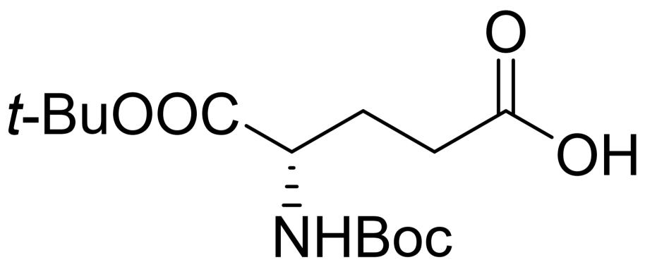
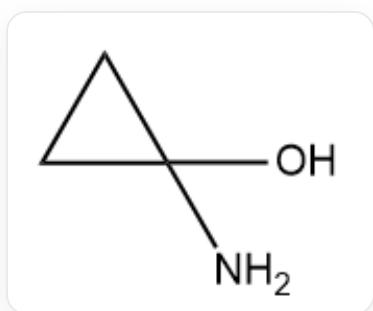
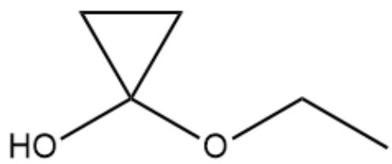
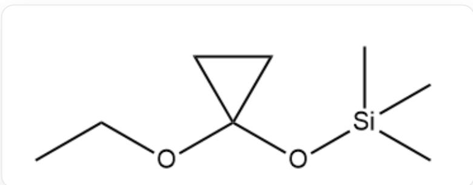
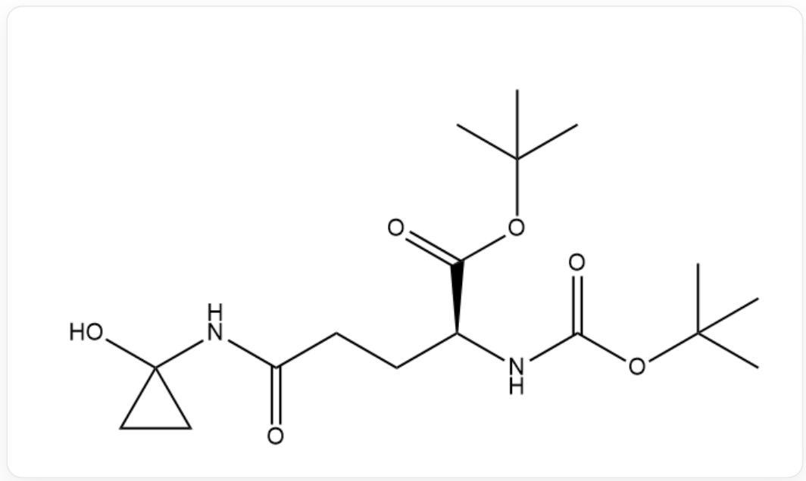
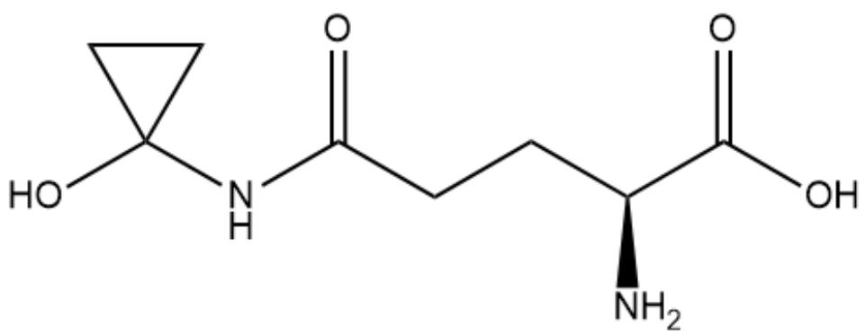

# 题目

化合物E可由3-氯丙酸乙酯为原料合成：

图片描述了一个部分缺失的有机合成路线: CICCC(=O)OCC>[Na].CCOCC>[X], 这一步在"reflux"条件下完成, 试剂为金属钠, 溶剂为乙醚; [X]>C[Si](C)(C)Cl>[A], 这一步的试剂为三甲基氯硅烷, A的分子式为  $\mathrm{C_8H_{18}O_2Si}$ ; [A]>CCCC[N+](CCCC)(CCCC)CCCCCC.[F-].CO>[B], 这一步的试剂为四正丁基氟化铵, 溶剂为甲醇, B的分子式为  $\mathrm{C_5H_{10}O_2}$ ; [B]>[Na]N.N>[C], 这一步的试剂为氨基钠, 溶剂为氨, C的分子式为  $\mathrm{C_3H_7NO}$ ;

$$
\mathrm {C C} (\mathrm {O C} ([ \mathrm {C} @ @ \mathrm {H} ] (\mathrm {N C} (\mathrm {O C} (\mathrm {C}) (\mathrm {C}) \mathrm {C}) = \mathrm {O}) \mathrm {C C C} (\mathrm {O}) = \mathrm {O}) = \mathrm {O})
$$

(C)C>C1CCC(CC1)N=C=NC2CCCCC2.C1CC=C2C(=C1)N=NN2O.O1CCCCC1>[Y], 这一步中四氢呋喃作为溶剂; [Y].[C]>O1CCCCC1>[D], 这一步中四氢呋喃作为溶剂; [D]>Cl>[E], 这一步的条件为"HCl(5% aq), 40°C"

A~E均含有一个三元碳环，C的  ${}^{1}\mathrm{HNMR}$  在8.52,6.42,0.65,0.40处有峰，峰面积之比为2:1:2:2 (预测值,溶剂为氘代二甲亚砜).

逐步分析此路线并核对包括分子式, 核磁共振氢谱等已知信息后, 推断未知的物质, 选出正确的一项.

A. 理论上, 每生成  $1 \mathrm{~mol} \mathrm{A}$ , 需要消耗  $4 \mathrm{~mol} \mathrm{Na}$  
B. E 只有一个手性中心, 为R构型  
C. C和打开三元环的类似物  $\mathrm{C}_{3} \mathrm{H}_{9} \mathrm{NO}$  相比, C更容易自发脱水  
D. A 的  ${ }^{1} \mathrm{H}$  NMR中, 所有峰的化学位移均小于  $2.0$  
E. 从

CC(OC([C@@H](NC(OC(C)(C)C)=O)CCC(O)=O)=O)(C)C

和  $\mathbf{C}$  生成  $\mathbf{D}$  的反应中, 配平的化学方程式的产物中除  $\mathbf{D}$  以外还有  $\mathrm{H}_{2} \mathrm{O}$

F. 从  $\mathbf{D}$  得到  $\mathbf{E}$  的反应中, 没有生成烃类, 则配平的化学方程式涉及4种化合物.  
G. E 的CAS编码的校验码为2  
H. E 的CAS编码的校验码为3

I. B有旋光活性和非对映异构体  
J. 以上选项均不正确

# 答案

正确答案: G

# 详细解析

从结构最简单的 C 入手: C 的分子式为  $\mathrm{C}_{3} \mathrm{H}_{7} \mathrm{NO}$ , 而 C 的结构中含有一个三元碳环, 计算不饱和度为 1 , 没有额外的不饱和度. 因此, C 的结构只可能为 1-氨基环丙醇(NC1(O)CC1)或2-氨基环丙醇(NC1C(O)C1)或N-环丙基羟胺(ONC1CC1)或O-环丙基羟胺(NOC1CC1).

# CHECKPOINT

2 PTS

C的结构只可能为1-氨基环丙醇(NC1(O)CC1)或2-氨基环丙醇(NC1C(O)C1)或N-环丙基羟胺(ONC1CC1)或O-环丙基羟胺(NOC1CC1).

考虑核磁共振氢谱数据, 杂原子氢化学位移较高, 三元环上氢化学位移较低. 结合峰面积之比, 可知 C 是 1-氨基环丙醇(NC1(O)CC1).

  
NC1(O)CC1

# CHECKPOINT

3 PTS

C是1-氨基环丙醇(NC1(O)CC1)

倒推路线, 可以发现 A 至 C 仅发生了官能团转化, B 与氨基钠发生取代反应得到 C. 因此, B 是 1-乙氧基环丙醇(CCOC1(O)CC1).

  
CCOC1(O)CC1

# CHECKPOINT

2 PTS

B是1-乙氧基环丙醇(COC1(O)CC1)

A 经四正丁基氟化铵脱去三甲基硅基保护, 得到 A 是(1-乙氧基环丙氧基)三甲基硅烷(C1C(O[Si](C)(C)C)(OCC)C1).

  
C1C(O[Si](C)(C)C)(OCC)C1

# CHECKPOINT

2 PTS

A是(1-乙氧基环丙氧基)三甲基硅烷(C1C(O[Si](C)(C)C)(OCC)C1)

从C继续路线:首先,氨基和一个羧基被保护的L-谷氨酸被DCC活化,加入C后,亲核性更强的氨基与被保护的谷氨酸形成酰胺D，D的结构是CC(OC([C@@H](NC(OC(C)(C)C)=O)CCC(NC1(O)CC1)=O)=O)(C)C.

  
CC(OC([C@@H](NC(OC(C)(C)C)=O)CCC(NC1(O)CC1)=O)=O)(C)C

# CHECKPOINT

2 PTS

C与被保护的L-谷氨酸在DCC作用下缩合得到酰胺D，结构为CC(OC([C@@H](NC(OC(C)  $(\mathrm{C})\mathrm{C}) = 0)\mathrm{CCC}(\mathrm{NC1}(0)\mathrm{CC1}) = 0) = 0)(\mathrm{C})\mathrm{C}$

D 在盐酸作用下脱去Boc和t-Bu保护基, 得到E, 结构为OC(=O)[C@H](CCC(=O)NC1(CC1)O)N.

OC(=O)[C@H](CCC(=O)NC1(CC1)O)N

# CHECKPOINT

2 PTS

D在盐酸作用下脱去保护基,得到E,结构为OC(=O)[C@H](CCC(=O)NC1(CC1)O)N

E即鬼伞毒素, 又名墨盖蘑菇氨酸, CAS编码为58919-61-2. CAS编码的最后一位是校验码, 在这里是2. 选项G正确, 选项H错误.

# CHECKPOINT

2 PTS

$\mathbf{E}$  的CAS编码为58919-61-2, 校验码是2

选项A: 从分子式判断, 只有起始化合物的  $\mathrm{C}-\mathrm{Cl}$  键被还原, 对应于2倍量的Na.

# CHECKPOINT

1 PTS

得到A理论上需要2倍量的Na

选项B: 从谷氨酸开始, 分子中唯一的手性中心都未改变, 最终是S构型.

# CHECKPOINT

0.5 PTS

E中唯一的手性中心为S构型

选项C: C受限于三元环的环张力, 孤对电子同C-O反键轨道重叠不好, 相比与非环状类似物更难消除脱水.

# CHECKPOINT

1 PTS

C和非环状类似物相比,更难自发脱水

选项D: A 中乙氧基上氧的  $\alpha -\mathrm{H}$  的化学位移大于2.0.

# CHECKPOINT

0.5 PTS

A中氧的  $\alpha -\mathrm{H}$  的化学位移大于2.0

选项E: 缩合产生的1分子水转移至DCC对应的副产物二环己基脲中, 在配平的化学方程式中产物不会有  $\mathrm{H}_{2} \mathrm{O}$ 出现.

# CHECKPOINT

1 PTS

酰胺化反应中, 在配平的化学方程式中产物不会出现  $\mathrm{H}_{2} \mathrm{O}$

选项F: 去保护一步中, 脱去的叔丁基可能的存在形式包括叔丁醇, 2-氯-2-甲基丙烷. 叔丁醇对应的配平的化学方程式中涉及物质有: D, 水, E, 叔丁醇, 二氧化碳, 2-氯-2-甲基丙烷对应的配平的化学方程式中涉及物质有: D, 氯化氢, E, 2-氯-2-甲基丙烷, 二氧化碳, 都不可能是四种.

# CHECKPOINT

1 PTS

脱保护中配平的化学方程式不可能只涉及4种物质

选项I: B的结构中有对称面,没有手性中心,因此没有旋光活性和非对映异构体.

# CHECKPOINT

0.5 PTS

B 的没有旋光活性和非对映异构体.