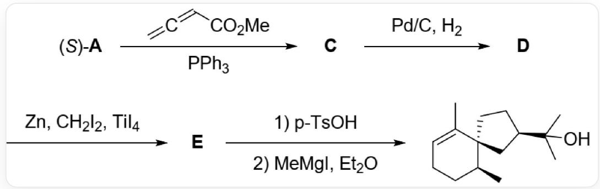
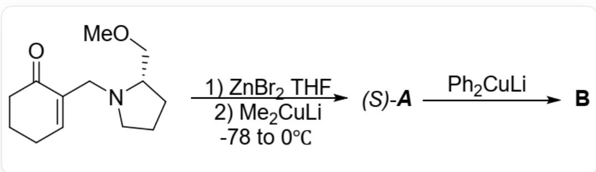
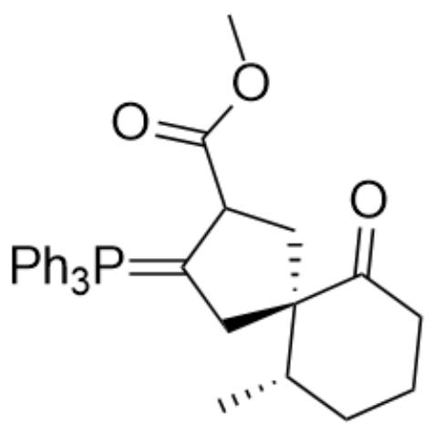
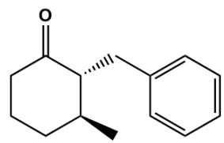
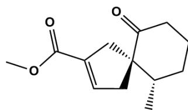
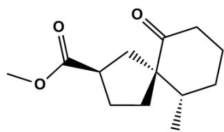
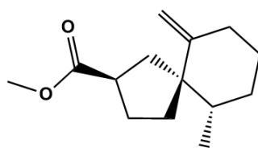

# Question

$(S) - \mathbf{A}$  can utilize the  $[3 + 2]$  reaction to construct the basic skeleton of the compound. Pay attention to the stereochemistry of each substance.

$(S) - \mathbf{A}$  reacts with triphenylphosphine and  $C = C = CC(OC) = O$  to obtain  $\mathbf{C}$ ,  $\mathbf{C}$  is hydrogenated under palladium on carbon catalysis to obtain  $\mathbf{D}$ ,  $\mathbf{D}$  reacts with zinc, diiodomethane and titanium tetraiodide to obtain  $\mathbf{E}$ ,  $\mathbf{E}$  is first reacted with  $p - T sO H$ , and then with methyl Grignard reagent and diethyl ether to obtain  $\mathrm{C}[\mathrm{C}@\mathrm{H}]1\mathrm{CCC} = \mathrm{C}(\mathrm{C})[\mathrm{C}@\mathrm{@}]12\mathrm{C}[\mathrm{C}@\mathrm{H}](\mathrm{C}(\mathrm{O})(\mathrm{C})\mathrm{C})\mathrm{CC}2$

$(S) - \mathbf{A}$  can be prepared by the following reaction and has the following reactions:

O=C1C(CN2CCC[C@H]2COC)=CCCC1 is first reacted with zinc bromide in THF, then reacted with lithium dimethylcuprate, the system temperature is raised from minus 78 degrees Celsius to zero degrees to obtain  $(S) - \mathbf{A}$ , then  $(S) - \mathbf{A}$  reacts with lithium diphenylcuprate to obtain  $\mathbf{B}$

Choose the correct option from the following

A. All other options are incorrect  
B. The newly generated chiral center in  $\mathbf{B}$  has an absolute configuration of S.  
C. The most stable conformation of  $\mathbf{B}$  has an axial bond on the six-membered ring.  
D. Generating  $(S) - \mathbf{A}$  can achieve the goal of controlling chirality in one step without adding zinc bromide.

E.  $(S) - \mathbf{A}$  generating  $\mathbf{C}$  involves an intermediate with the structure

$$
\begin{array}{c} O = C 1 [ C @ @ ] 2 (C C (C (O C) = O) C (C 2) = P (C 3 = C C = C C = C 3) (C 4 = C C = C C = C 4) C 5 = C C = C C = C 5) [ C @ @ H ] \\ (C) C C C 1 \end{array}
$$

F. The chemical formula of  $\mathbf{E}$  is  $C_{14}H_{20}O_3$  
G. E The two-step reaction sequence to obtain the product can be interchanged.

# Answer

Correct Answer: E

# Detailed Explanation

$\mathrm{O = C1C(CN2CCC[C@H]2COC) = CCCC1}$  can form a complex with zinc bromide CO1C[C@@H]2CCC[N@@]23CC4=CCCCC4=O[Zn@]13[R] (R represents other possible ligands), fixing the chiral environment near the nucleophilic site. Subsequently, lithium dimethylcuprate nucleophilically attacks from the less hindered side and the chiral auxiliary leaves to obtain  $(S) - \mathbf{A}$ , with the structure  $\mathrm{C = C1[C@@H]}$  (C)CCCCC1=O.

# CHECKPOINT

1 PTS

The formation of  $(S) - \mathbf{A}$  requires the participation of zinc bromide to form a complex that fixes the chiral environment

After the addition of lithium diphenylcuprate, an enolate anion is generated, followed by workup to produce a new carbonyl group. This process minimizes the repulsion of all substituents on the six-membered ring, so they are all in equatorial positions. The structure of  $\mathbf{B}$  is O=C1[C@H](CC2=CC=CC=C2)[C@@H](C)CCC1

# CHECKPOINT

1 PTS

The structure of  $\mathbf{B}$  is  $O = C1[C@H](CC2 = CC = CC = C2)[C@@H](C)CCC1$ , all in equatorial positions

From the structure of  $\mathbf{B}$ , it can be seen that the absolute configuration of the newly generated chiral center is R

# CHECKPOINT

1 PTS

The absolute configuration of the newly generated chiral center is R

$(S) - \mathbf{A}$  reacts with triphenylphosphine and  $C = C = CC(OC) = O$  to obtain C. First, triphenylphosphine adds to  $C = C = CC(OC) = O$  to form a zwitterion  $C = C([CH-]C(OC) = O)[P+]$  (C1=CC=CC=C1) (C2=CC=CC=C2)C3=CC=CC=C3, followed by a [3+2] reaction, reacting from the less hindered side to produce another intermediate O=C1[C@@]2(CC(C(OC)=O)C(C2)=P(C3=CC=CC=C3)(C4=CC=CC=C4)C5=CC=CC=C5) [C@@H](C)CCC1. Finally, the negative charge is transferred to the  $\alpha$ -position of the ester group, eliminating triphenylphosphine to obtain C, with the structure C[C@H]([C@]12CC(C(OC)=O)=CC2)CCCC1=O

# CHECKPOINT

1 PTS

The formation of C involves the intermediate  $\mathrm{O = C1[C@@]2(CC(C(OC) = O)C(C2) = P(C3 = CC = CC = C3)}$ $(\mathrm{C4 = CC = CC = C4})\mathrm{C5 = CC = CC = C5})[\mathrm{C}@\mathrm{H}](\mathrm{C})\mathrm{CC}1$

C is hydrogenated over palladium on carbon from the less hindered side to obtain D, with the structure C[C@H] ([C@]12C[C@H](C(OC)=O)CC2)CCCC1=O

The reaction of  $\mathbf{D}$  to obtain  $\mathbf{E}$  is the Lombardo reaction. First, zinc reduces diiodomethane to obtain methylene carbene. The methylene carbene reacts with titanium tetraiodide to obtain  $\mathrm{C} = [\mathrm{Ti}](\mathrm{I})\mathrm{I}$ , which reacts with the carbonyl group to produce  $\mathrm{C}[\mathrm{C@H}]1\mathrm{CCCC2(O[Ti](I)(I)C2)}[\mathrm{C}@\mathrm{@}]13\mathrm{C}[\mathrm{C@H}](\mathrm{C(OC)} = \mathrm{O})\mathrm{CC3}$ , eliminating  $\mathrm{O} = [\mathrm{Ti}](\mathrm{I})\mathrm{I}$  to obtain  $\mathbf{E}$ , with the structure  $\mathrm{C}[\mathrm{C@H}][[\mathrm{C@}]12\mathrm{C}[\mathrm{C@H}](\mathrm{C(OC)} = \mathrm{O})\mathrm{CC2})\mathrm{CCCC1} = \mathrm{C}$ , and the chemical formula  $C_{14}H_{22}O_2$

# CHECKPOINT

1 PTS

The chemical formula of  $\mathbf{E}$  is  $C_{14}H_{22}O_2$

$\mathbf{E}$  reacts with  $p - T s O H$ , and the double bond undergoes isomerization, yielding  $\mathrm{C}[\mathrm{C}@\mathrm{H}]1\mathrm{CC} = \mathrm{C}(\mathrm{C})$  [C@@]12C[C@H](C(OC)=O)CC2. Subsequently, methyl Grignard reagent reacts with the ester group, adding twice to obtain the product. If the Grignard reagent is used to react with  $\mathbf{E}$  first, the ester group can be smoothly converted to a tertiary alcohol, but the hydroxyl group may be difficult to retain after treatment with  $p - T s O H$ , so the order of these two reaction steps cannot be reversed.

# CHECKPOINT

1 PTS

Reversing the order of the two reaction steps to obtain the product from  $\mathbf{E}$  may lead to the tertiary alcohol being difficult to retain

Therefore, choose option E

  
B

  
C  
E

  
D

本题中结构