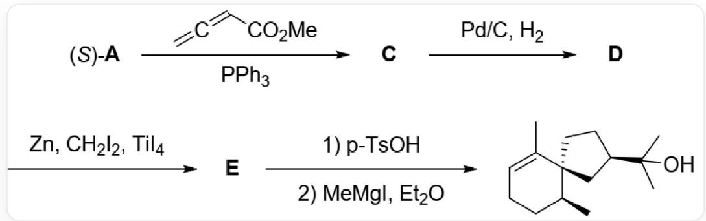
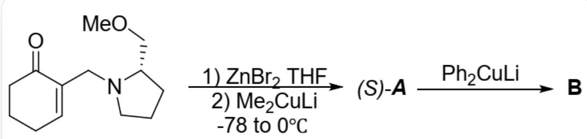
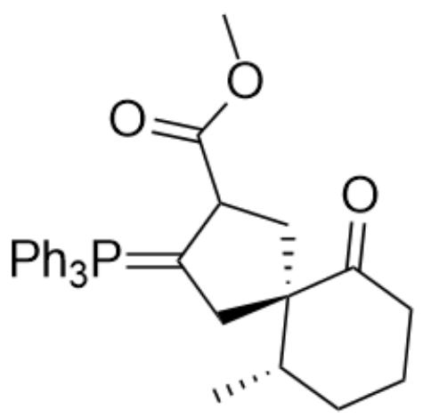
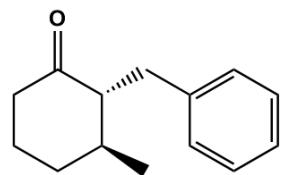
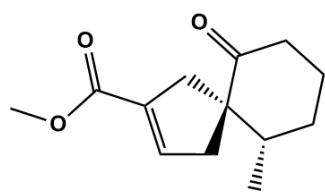
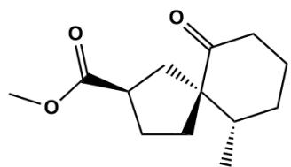
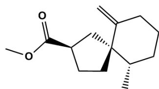

# 题目

$(S) - \mathbf{A}$  可以借助  $[3 + 2]$  反应，构建化合物的基本骨架。注意各物质立体化学。

$(S) - \mathbf{A}$  在三苯基磷和  $C = C = C C (O C) = O$  作用下得到C，C在钯碳催化下加氢得到D，D在锌、二碘甲烷和四碘化钛作用下得到E，E先经过  $p - T s O H$  作用，再在甲基格氏试剂、乙醚作用下得到

C[C@H]1CCC=C(C)[C@@]12C[C@H](C(O)(C)C)CC2

$(S) - \mathbf{A}$  可通过如下反应制备并具有如下反应：

O=C1C(CN2CCC[C@H]2COC)=CCCC1先在THF中与溴化锌作用, 随后与二甲基铜锂反应, 体系温度从零下78摄氏度升至零度得到  $(S)-A$ , 随后  $(S)-A$  与二苯基铜锂反应得到B

选择下列选项中正确的一项是（）

A. 其他选项均不正确  
B. B 中新产生的手性中心绝对构型为S

C. B 的最稳定构象中六元环上存在直立键  
D. 生成  $(S) - \mathbf{A}$  一步不添加溴化锌也可以实现控制手性的目的  
E.  $(S) - \mathbf{A}$  生成  $\mathbf{C}$  的过程中存在结构为

$$
\begin{array}{c} O = C 1 [ C @ @ ] 2 (C C (C (O C) = O) C (C 2) = P (C 3 = C C = C C = C 3) (C 4 = C C = C C = C 4) C 5 = C C = C C = C 5) [ C @ @ H ] \\ (C) C C C 1 \end{array}
$$

的中间体

F. E 的化学式为  $C_{14}H_{20}O_{3}$  
G. E得到产物的两步反应先后顺序可以调换

# 答案

正确答案: E

# 详细解析

$\mathrm{O = C1C(CN2CCC[C@H]2COC) = CCCCl}$  会与溴化锌形成配合物CO1C[C@@H]2CCC[N@@]23CC4=CCCCC4=O[Zn@]13[R]（R代表其他可能的配位基团)，固定亲核位点附近的手性环境，随后二甲基铜锂从位阻小的一侧亲核并离去手性助剂得到  $(S)-A$  ，结构为 $\mathrm{C = C1[C@@H](C)CCC}C1 = O_{\circ}$

CHECKPOINT

1 PTS

生成  $(S) - A$  需要溴化锌参与形成配合物固定手性环境

二苯基铜锂加成后产生烯醇负离子，随后后处理产生新的羰基，这一过程会使六元环上所有取代基排斥最小，因此均处于平伏键，B的结构为O=C1[C@H](CC2=CC=CC=C2)[C@@H](C)CCC1

CHECKPOINT

1 PTS

B 的结构为O=C1[C@H](CC2=CC=CC=C2)[C@@H](C)CCC1, 均处于平伏键

由B的结构可知，新产生的手性中心绝对构型为R

# CHECKPOINT

1 PTS

新产生的手性中心绝对构型为R

$(S) - A$  在三苯基磷和  $C = C = CC(OC) = O$  作用下得到  $\mathbf{C}$  ，首先三苯基膦与  $C = C = CC(OC) = O$  加成形成偶极体 $C = C([CH - ]C(OC) = O)[P + ](C1 = CC = CC = C1)(C2 = CC = CC = C2)C3 = CC = CC = C3$  ，随后发生[3+2]反应，从位阻小的一侧反应产生另一中间体  $O = C1[C@]$  2(CC(C(OC)=O)C(C2)=P(C3=CC=CC=C3) $(C4 = CC = CC = C4)C5 = CC = CC = C5)[C@@H](C)CCC1$  ，最后负电荷转移到酯基α位，消去三苯基膦得到  $\mathbf{C}$  结构为  $C[C@H]([C@]12CC(C(OC) = O) = CC2)CCCC1 = O$

# CHECKPOINT

1 PTS

生成 C 的过程中经历了  $\mathrm{O} = \mathrm{C}1[\mathrm{C}@\mathrm{C}]2(\mathrm{CC}(\mathrm{C}(\mathrm{OC}) = \mathrm{O})\mathrm{C}(\mathrm{C}2) = \mathrm{P}(\mathrm{C}3 = \mathrm{CC} = \mathrm{CC} = \mathrm{C}3)$ $(\mathrm{C}4 = \mathrm{CC} = \mathrm{CC} = \mathrm{C}4)\mathrm{C}5 = \mathrm{CC} = \mathrm{CC} = \mathrm{C}5)[\mathrm{C}@\mathrm{C}]\mathrm{H})(\mathrm{C})\mathrm{CC}1$  中间体

C在钯碳催化下从位阻小的一侧加氢得到D，结构为C[C@H]([C@]12C[C@H](C(OC)=O)CC2)CCCC1=O

D得到  $\mathbf{E}$  的反应为Lombardo反应，首先锌还原二碘甲烷得到亚甲基卡宾，亚甲基卡宾与四碘化钛反应得到 $\mathrm{C = [Ti](I)I}$  ，其与羰基反应产生C[C@H]1CCCC2(O[Ti](I)(I)C2)[C@@]13C[C@H](C(OC)=O)CC3，离去  $0=$  [Ti](I)I得到  $\mathbf{E}$  ，结构为C[C@H]([C@@]12C[C@H](C(OC)=O)CC2)CCCC1=C，化学式为  $C_{14}H_{22}O_2$

# CHECKPOINT

1 PTS

$\mathbf{E}$  的化学式为  $C_{14}H_{22}O_2$

$\mathbf{E}$  与  $p - T s O H$  反应, 双键发生异构化, 得到  $\mathrm{C}[\mathrm{C}@\mathrm{H}] 1 \mathrm{CCC} = \mathrm{C}(\mathrm{C})[\mathrm{C} @ @ ] 12 \mathrm{C}[\mathrm{C} @ \mathrm{H}](\mathrm{C} (\mathrm{OC}) = \mathrm{O}) \mathrm{CC} 2$ , 随后甲基格氏试剂与酯基反应, 加成两次, 得到产物。若先用格氏试剂与  $\mathbf{E}$  反应, 酯基可顺利转化为三级醇,但再经  $p - T s O H$  处理羟基可能难以保留, 因此不能调换这两步的反应顺序。

# CHECKPOINT

1 PTS

调换  $\mathbf{E}$  得到产物的两步反应先后顺序会导致三级醇难以保留

故选选项E

  
B

  
C  
E

  
D

本题中结构