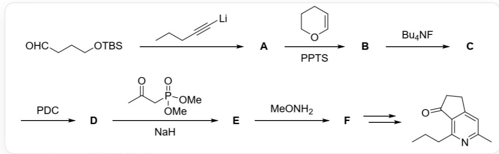
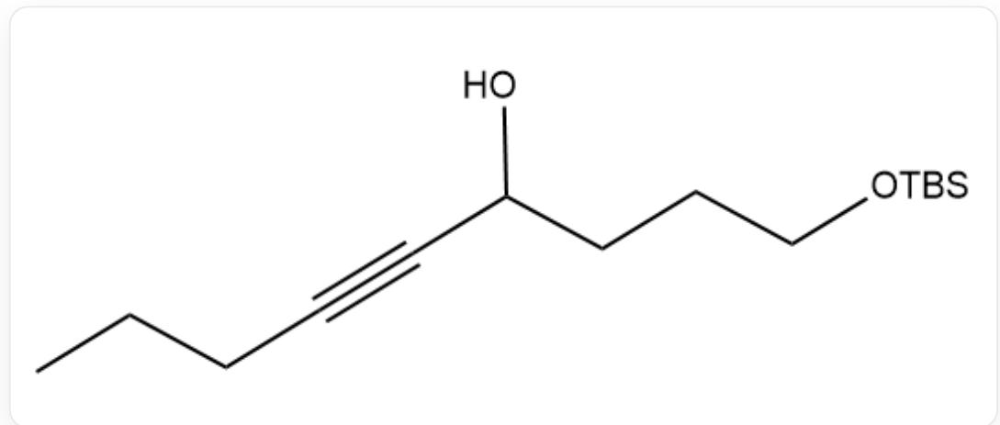
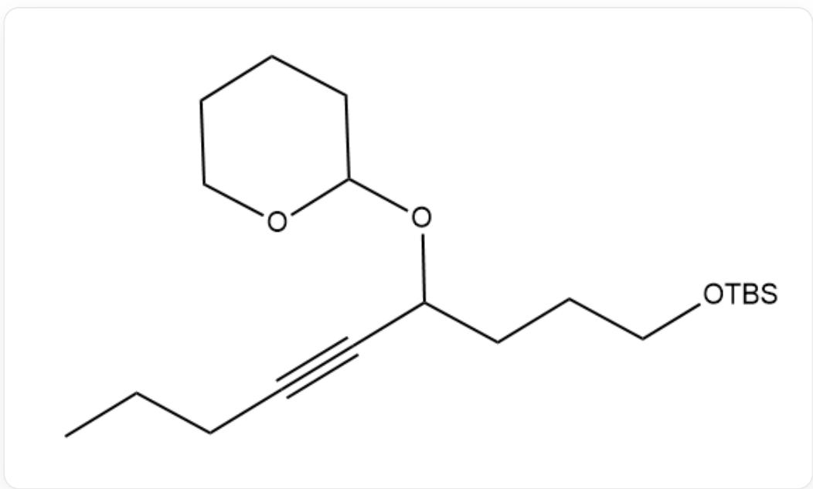
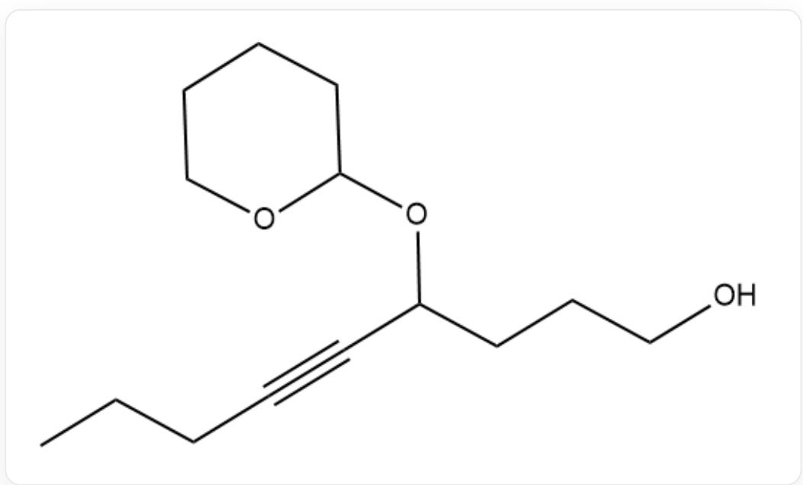
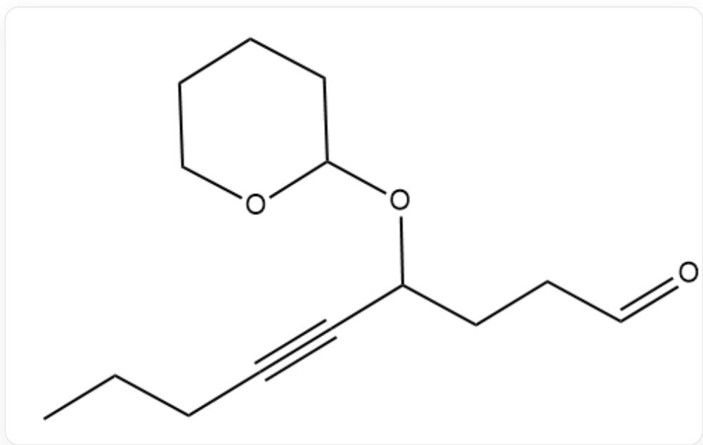
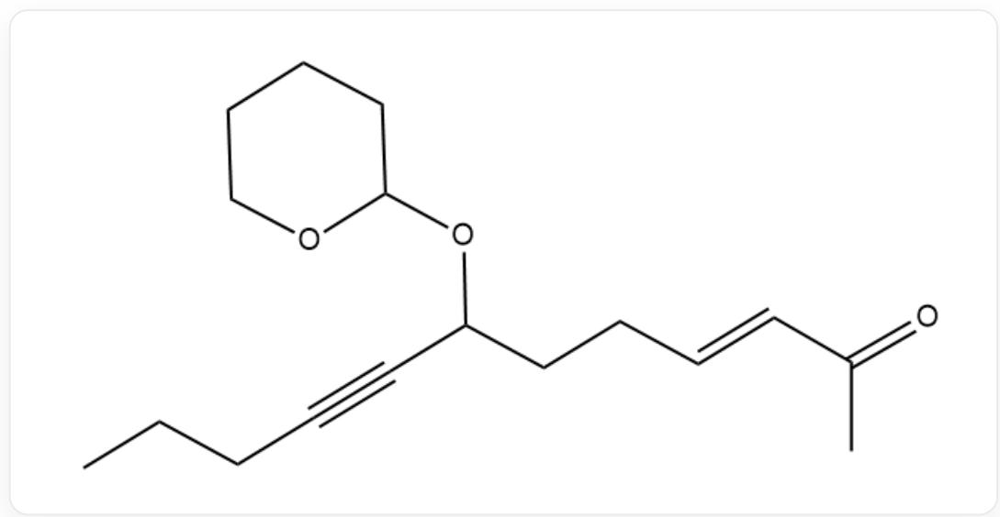
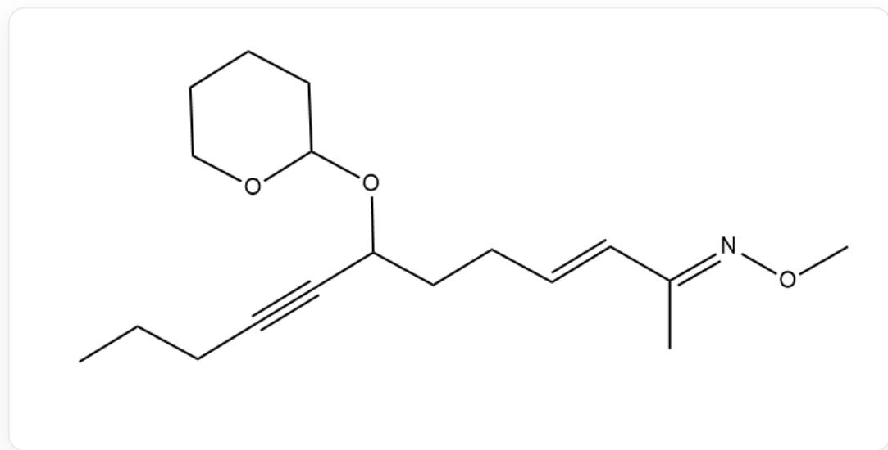
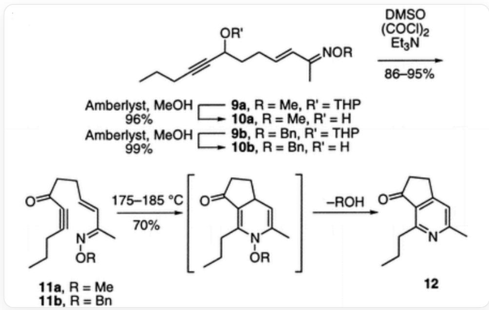

# Question

A certain red protoleaf alkaloid with a pentacyclic structure was synthesized, and the construction of two of its rings can be achieved via the following synthetic route:

This is a flowchart-type image containing multiple organic chemical structures and reaction steps, illustrating a reaction pathway proceeding from left to right and top to bottom. The starting molecule in the top-left corner has the SMILES formula C[Si](OCCC=O)(C)C(C)(C)C. This molecule reacts under arrow-indicated conditions with a substance (SMILES: CCC#C[Li]), yielding product A. A then proceeds to the right under the reaction conditions "PPTS" and a six-membered oxygen-containing ring (SMILES: C1COC=CC1), generating intermediate B. B undergoes another arrow-directed reaction with the condition "Bu4NF" to form C. From C, the flowchart continues from the lower starting point, where C reacts leftward under the condition "PDC," producing D. D further reacts leftward with a new reactant (SMILES: "CC(CP(OC) (OC)=O)=O") under the condition "NaH," yielding E. E then reacts with "MeONH2" to form F, which proceeds via a pair of bidirectional arrows to the final product on the right, with the SMILES structure CC1=NC(CC)=C2C(CCC2=O)=C1. The image contains no title, axes, legend, units, or numerical labels.

According to the above description, select the option that best fits the question.

A. Due to the affinity between silicon and oxygen, the TBS group can be efficiently removed in the second step even in the absence of PPTS.  
B. Although silicon and oxygen have good affinity, the second step reaction must be carried out in the presence of PPTS to efficiently remove the TBS group.

C. In the first step of the reaction, the organometallic reagent abstracts the alpha hydrogen of the aldehyde group, efficiently promoting a bimolecular condensation, making the construction of macrocyclic products highly facile.  
D. In the reaction from C to D, we efficiently oxidize a secondary hydroxyl group to a ketone.  
E. In the reaction from C to D, we efficiently reduce a ketone to a secondary hydroxyl group.  
F. In the reaction from  $\mathbf{E}$  to  $\mathbf{F}$ , which is a complex one-step process, the synthesis innovatively employs a one-pot method to obtain the product in a single step.  
G. The purpose of using  $\mathrm{MeONH}_2$  is to facilitate potential future Beckmann rearrangement.  
H. The purpose of using  $\mathrm{MeONH}_2$  is to mediate the condensation reaction with carbonyl groups in the future to perform cyclization operations.

1. None of the above options is correct.  
J. Exactly three of the above options are correct.  
K. Among the above options, exactly two are correct.

# Answer

Correct Answer: I

# Detailed Explanation

Starting material  $\rightarrow$  A: The starting material is 4-(tert-butyldimethysilyloxy)butanal. The reactant is hex-1-ynyllithium. This is a typical nucleophilic addition reaction, where the ynl anion acts as a nucleophile attacking the carbonyl carbon of the aldehyde group. Product A is a secondary alcohol, and its structure is shown below:

  
SMILES: CCCC#CC(CCCO[Si](C(C)C)(C(C)C)C(C)C)O

# CHECKPOINT

0.5 PTS

The SMILES structure of  $\mathbf{A}$  is CCCC#CC(CCCO[Si](C(C)C)(C(C)C)C(C)C)O

# CHECKPOINT

0.5 PTS

The first step is nucleophilic addition by the ynyl lithium

$\mathbf{A} \rightarrow \mathbf{B}$ : The reactants are  $\mathbf{A}$ , dihydropyran, and the catalyst PPTS (pyridinium p-toluenesulfonate). PPTS is a mild acid catalyst suitable for THP protection in the presence of the acid-sensitive TBS group. Product  $\mathbf{B}$  is a molecule with both hydroxyl groups protected, as shown below:

  
SMILES: CCCCCC#CC(CCCO[Si](C)(C)C(C)(C)C)OC1CCCCO1

# CHECKPOINT

0.5 PTS

The SMILES structure of  $\mathbf{B}$  is CCCC#CC(CCCO[R5])OC1CCCCO1

# CHECKPOINT

0.5 PTS

The second step involves protection using dihydropyran

$\mathbf{B} \rightarrow \mathbf{C}$ : The reactants are  $\mathbf{B}$  and  $\mathrm{Bu}_4\mathrm{NF}$  (tetrabutylammonium fluoride, TBAF). Due to the strong affinity of fluoride ions for silicon atoms, this step selectively removes the TBS protecting group from the primary alcohol, yielding product  $\mathbf{C}$  as shown below:

  
SMILES: CCCC#CC(CCCO)OC1CCCCO1

# CHECKPOINT

0.5 PTS

The SMILES structure of C is CCCC#CC(CCCO)OC1CCCCO1

# CHECKPOINT

0.5 PTS

The third step is TBS deprotection

$\mathbf{C} \rightarrow \mathbf{D}$ : The reactants are  $\mathbf{C}$  and PDC (pyridinium dichromate). PDC is a moderately strong oxidant that converts primary alcohols to aldehydes without further oxidation to carboxylic acids (in aprotic solvents like  $\mathrm{CH}_2\mathrm{Cl}_2$ ). Thus, product  $\mathbf{D}$  is obtained:

  
CCCC#CC(OC1CCCCCC01)CCC=O

# CHECKPOINT

0.5 PTS

The SMILES structure of  $\mathbf{D}$  is: CCC#CC(OC1CCCCO1)CCC=O

# CHECKPOINT

0.5 PTS

The fourth step is oxidation of the primary alcohol to an aldehyde

$\mathbf{D} \rightarrow \mathbf{E}$ : The reactants are  $\mathbf{D}$ , a phosphonate (Horner-Wadsworth-Emmons reagent, specifically dimethyl (1-acetylethyl)phosphonate), and the strong base  $\mathrm{NaH}$  (sodium hydride). This is an HWE olefination reaction.  $\mathrm{NaH}$  deprotonates the  $\alpha$ -position of the phosphonate to form a carbanion, which attacks the aldehyde group in  $\mathbf{D}$ , followed by elimination to yield an  $\alpha,\beta$ -unsaturated ketone. The structure of product  $\mathbf{E}$  is as follows:

  
CCCC#CC(OC1CCCCO1)CC/C=C/C(C)=O

# CHECKPOINT

0.5 PTS

The SMILES structure of  $\mathbf{E}$  is: CCCC#CC(OC1CCCCO1)CC/C=C/C(C)=O

# CHECKPOINT

0.5 PTS

The fifth step is the Horner-Wadsworth-Emmons condensation reaction

$\mathbf{E} \rightarrow \mathbf{F}$ : The reactants are  $\mathbf{E}$  and methoxyamine  $(\mathrm{MeONH}_2)$ . This is a condensation reaction between the aldehyde and methoxyamine, forming an O-methyl oxime. The structure of product  $\mathbf{F}$  is as follows:

  
CCCC#CC(OC1CCCCO1)CC/C=C/C(C)=N/OC

# CHECKPOINT

0.5 PTS

The SMILES structure of  $\mathbf{F}$  is: CCCC#CC(OC1CCCCO1)CC/C=C/C(C)=N/OC

# CHECKPOINT

0.5 PTS

The sixth step is the condensation reaction between the aldehyde and methoxyamine

$\mathbf{F} \rightarrow$  Final product: After deprotection, the intermediate strong group is oxidized to a ketone, followed by a DA reaction + elimination to construct the bicyclic structure in one step.

  
$\mathbf{F}$  is first deprotected under Amberlyst, MeOH conditions to give the intermediate secondary hydroxyl group (SMILES: CCCC#CC(O)CC/C=C/C(C)=N/OC), then oxidized to a ketone using DMSO, oxalyl chloride, and triethylamine (SMILES: CCCC#CC(CC/C=C/C(C)=N/OC)=O), and finally reacted at 170-200 °C (triisopropylbenzene solvent, boiling point 233-236 °C). The cycloaddition product intermediate eliminates methanol and is oxidized to the corresponding pyridine, yielding a 70% final product.

# CHECKPOINT

1 PTS

The purpose of introducing methoxyamine  $\mathrm{MeONH_2}$  is to facilitate methanol elimination after the DA reaction